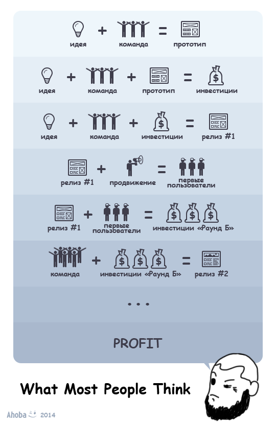
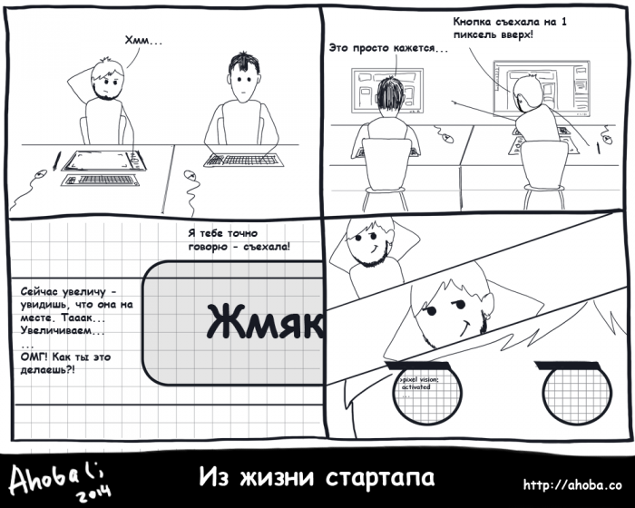
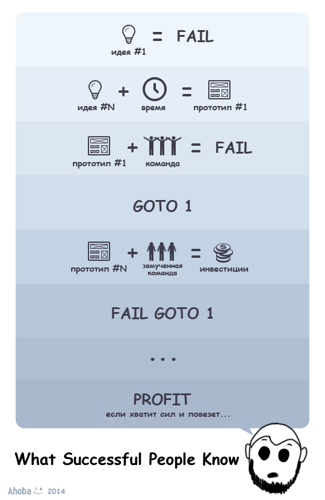

# Стартап: «Идея», «Реализация», «Продажи»…

Дата создания: 2014-10-28

Автор: 407th

Теги: стартап,управление командой,ahoba

   
Тема стартапинга IT-продуктов была весьма популярна пару лет назад… Сегодня стартап не делал только ленивый. Сколько их — проваленных проектов? Тысячи, десятки тысяч?..  
Стартаперы забывают о простой истине: "_Идея ничего не стоит без реализации. Реализация ничего не стоит без продаж_". Что нужно для успешной реализации? Хорошая команда? Правильная методология управления проектом? А что нужно для продаж?..  
  
Об этом и о многом другом рассказано в данной публикации, причем не голословно, а на примере конкретного стартапа. Внимание! Статья **ОЧЕНЬ** длинная…  
  

#### Стартап — «Идея»

##### … или рассказ о том, какие бывают изыскания в поисках идеи
Каждое выпущенное программное решение проходит долгий путь до продукта. Через проектирование, через разработку, через десяток прототипов и сотни версий, через фокус группы и тестирование…  
  
…Но начинается всё с идеи, мысли, мало чем отличающейся от множества прочих. Мысли-предположения называют гипотезами. Любая гипотеза должна соответствовать критерию научности Поппера (проверяться на фальсифицируемость), иначе это не гипотеза, а бред.  
  
Идея для бизнеса, для продукта, для стартапа должна не просто проверяться на предмет «не бред ли это», но и на то, насколько у неё высокий потенциал финансовой успешности. Бизнес идеи-гипотезы возникают постоянно, за каждую из них не возьмешься. Поэтому и был выведен критерий принадлежности к идеям с высоким потенциалом финансовой успешности — базовый принцип, на соответствие которому проверяется любая новая идея. Этот тезис хоть и банален, но многие почему-то о нём забывают, звучит он следующим образом:  

> Любую Идею нельзя считать успешной без Реализации. Любую Реализацию успешной делают только Продажи. Успех у Идеи будет только тогда, когда можешь Реализовать и Продать её.

Вопрос о том, стоит ли вообще браться за идеи, отличные от понятия успешные (just for fun, например), оставим за рамками этой статьи. Подразумевая, что раз это бизнес-идея, она обязана быть успешной.  
  
Чтобы не быть голословными, рассказ поведем о нашем текущем проекте — сервисе [Ahoba.co](http://ahoba.co), о котором будет кратко рассказано ниже. Также будем ссылаться ещё на несколько уже закрытых продуктов, в разработке которых мы участвовали.  
  

##### «Предок» проекта Ahoba (; сервис XYZ\*
\*в первой версии статьи вместо XYZ было реальное название нашего старого проекта, но по некоторым маркетинговым причинам пришлось заменить его условным XYZ, пожалуйста, не обессудьте.  
  
Сервис XYZ задумывался как специализированный конструктор сайтов, узкой тематики: промо-сайты для Х. Как ни странно это прозвучит, но идея достаточно жизнеспособная. Введя в поисковую систему Y, увидим примеры таких промо-сайтов, т.е. спрос на них есть. Мы думали, что будет спрос и на инструмент для их создания. Есть и конкурентное преимущество — специализированность решения, есть и действенная бизнес-модель, основанная на активных продажах.   
  
Но… Рынок конструкторов сайтов перегружен, что доказывают многочисленные публикации. Уже только из названия одной из статей — «40 мощных бесплатных онлайн конструкторов сайтов» — понятно:  

- на рынке как минимум 40 конкурентов;
- в статье рассказывается о мощных конструкторах, значит, есть ещё категория немощных, куда вполне может попасть новый продукт;
- в статье рассматриваются только бесплатные конструкторы, т.е. бывают и платные, что будет дополнительной конкуренцией.

  
В другой статье — "[Обзор рынка конструкторов сайтов и интернет-магазинов, Россия и СНГ, 2014](http://www.setup.ru/about/market-review)" — можно ознакомиться с конкретными цифрами, посмотреть распределение долей, сколько лет тому или иному проекту…  
  
Рынок конструкторов сайтов занят крупными игроками, и пробиться на нём небольшой команде практически невозможно. Тем не менее, сервис XYZ имеет свою нишу и свой ограниченный круг пользователей, однако его общее развитие и поддержка являются как финансово, так и пользовательски (слишком небольшая и узкая ЦА) нерациональными действиями.  
  
Условно функциональные возможности всех конструкторов сайтов можно разделить на хостингово-служебные и контентные функции. Первые отвечают за публикацию сайта, за SEO-инструменты и подобное, вторые позволяют из текстового, графического и прочего контента собрать сайт. В свою очередь, по принципам работы с контентом, все конструкторы сайтов делятся на шаблонные и свободные решения, различные их комбинации.  
  
Шаблонные решения более распространены. Шаблон — готовое оформление для сайта целиком, или для отдельной веб-страницы, в которое пользователь вставляет свой контент. Изменение шаблонов, а соответственно и оформления, доступно с ограничениями.  
Типичный пример подобного подхода — ucoz.ru   
  
Свободное решение позволяет собирать веб-страницы с оформлением не привязанным к шаблону. Может основываться на визуальном конструкторе, на текстовом редакторе html\css кода, или на их сочетании.  
Пример такого подхода — roxer.com  
  
Ранние альфа версии сервиса XYZ были спроектированы и созданы по принципу «Шаблонное решение». Менторы, с которыми мы сотрудничаем, усомнились, что наших сил хватит, чтобы удовлетворить пользовательскую потребность в разнообразии шаблонов. Поэтому было решено дать пользователям возможность создавать своё оформление. Так, сервис XYZ кардинально сменил концепцию и пошел по пути конструкторов сайтов со свободным решением в оформлении.  
  
Нам нужно было сделать простой визуальный конструктор, чтобы им могли пользоваться сотрудники отдела маркетинга и рекламы или те, кто этим занимается в отделе продаж. Т.е. люди, навыки работы с ПК у которых не выше, чем у обычного секретаря. При этом, мы — команда разработчиков, за плечами у которой несколько немаленьких веб-проектов. Программист и тестер знакомы с навороченными IDE, дизайнер с Photoshop, проектировщик с множеством различных специализированных редакторов, и т.д. У нас есть своё представление о сложности и удобстве интерфейсов. Так родились концепции средней простоты: смесь требования «для чайников» и отношения «приятны профессионалам».  
  
Первым пользователем нашего сервиса был наш же дизайнер. Он делал примеры сайтов, которые можно собрать на конструкторе. От него и прозвучала фраза: «Хм, да на нашем конструкторе макеты проще и быстрее делать, чем в Photoshop'е...»  
  

##### Предпосылки к созданию проекта Ahoba (;
Есть общая потребность — «Сделать сайт».  
  
Чтобы реализовать эту потребность, нужно решить поставленные задачи:  

1. Спроектировать структуру и функциональность сайта;
2. Подготовить контент;
3. Разработать дизайн;
4. Сверстать фронтенд;
5. Если нужно, настроить\запрограммировать бэкенд;
6. Разместить сайт в интернете.

  
Какие инструменты используются для решения этих задач?  
Задачи 1. и 2., как правило, решают силами человеческого ума, для них можно предложить лишь вспомогательные инструменты — текстовые и графические редакторы, электронные таблицы и подобное. Для остальных задач профессионалы используют узкоспециализированные инструменты:  

- Работа над дизайном производится средствами каких-либо готовых шаблонов, или разработкой оформления с нуля, т.е. с макета. Макеты принято делать в различных графических редакторах, таких как Photoshop.
- Если стоит задача программирования фронтенда или бэкенда, её можно решить, используя обычный текстовый редактор, но намного удобнее работать, используя IDE.
- Публикация сайта производиться на виртуальном хостинге, VDS\VPS или dedicated сервере.

Для непрофессионалов и частных случаев предлагают упрощенные, обобщенные, универсальные инструменты. Например, задачи 3-6 решаются средствами конструкторов сайтов, а 3-5 сможет решить любая CMS.  
  
Соответственно, рынок инструментов для удовлетворения потребности «сделать сайт» делится между: конструкторами сайтов, CMS-системами и различными специализированными редакторами.  
  
Многие технические решения в целом, и программные продукты в частности, развивались от частного к общему. Инженеры решали проблему здесь и сейчас, маркетологи или пользователи решения, увидев в нём потенциал, расширяли сферу использования. Часто переход от частного к общему через функциональное развитие или просто ребрендинг коммерчески оправдан, не реже — приятен и полезен для пользователя.   
  
Сервис XYZ выходил за рамки специализированного решения для создания промо-сайтов X. Наш же программист, не сведущий в дизайне, собрал на нём сносный сайт своей любимой хоккейной команды. Дизайнер всерьез задумывался, может брать калымы на разработку не только макетов, но и их верстку — средствами нашего конструктора из макета в редакторе получалась сверстанная страница, стоило только нажать «Сохранить как...» в браузере.   
  
   
  
Наш продукт упрощал разработку макетов и полностью автоматизировал верстку, но изначально он был сделан не для этого… Все понимали, что нужно переходить от частного к общему, и вариантов такого перехода было три:   

- универсальный конструктор сайтов;
- CMS-система;
- специализированный редактор.

  
О конкуренции на рынке конструкторов сайтов говорилось в первой части статьи, про конкуренцию на рынке CMS не стоит и объяснять. Оставался третий путь — специализированный редактор.  
  

##### От абстрактного «специализированный редактор» к «Ahoba.co Онлайн-инструмент для счастливого дизайна и магической верстки»
В этом повествовании мысли более-менее имеют четкое изложение, а последовательность рассуждений связная и логичная. Когда команда сервиса-предка XYZ первый раз коснулась этих вопросов, все чувствовали вышесказанное, знали это где-то на подсознательном уровне, но сформулировать не могли.  
  
Есть два вида очень близких, родственных продуктов: конструкторы сайтов и редакторы сайтов. Под «близкими» подразумеваем инструменты, созданные по принципам [WYSIWYG](https://ru.wikipedia.org/wiki/WYSIWYG). Условно, конструктор сайтов — урезанный редактор, но с возможностями хостинга и прочих смежных инструментов. Наш сервис был именно конструктором сайтов, мы хорошо изучили данный вид продуктов, а вот о редакторах сайтов не знали почти ничего.  
  
Спасибо случаю за статью, на которую натолкнулись совершенно случайно: "[14 инструментов для веб-дизайна и веб-разработки на 2014 год](http://habrahabr.ru/post/209362/)", а именно за это предложение:  

> ...Macaw обещает ту же гибкость, что и редактор изображений, но при этом будет происходить написание семантического HTML и лаконичного CSS.

Эта фраза в какой-то степени описывала ощущения от пользования нашим конструктором.  
  
«Что же это за птица Macaw?», — спросили мы у Гугла, и Гугл ответил нам: нашумевшей компанией на Кикстартере, затем парой маркетинговых описаний, а потом и сравнительной статьей Macaw'а с 2 (ДВУМЯ) конкурентами — WebFlow и Adobe Edge Reflow CC. И, конечно, сайтом самого проекта, где можно скачать бесплатную 30-дневную версию — macaw.co.  
  
Вот так мы узнали о разновидности программного обеспечения визуальный редактор сайтов. Простыми словами его функции можно описать так:  

> Рисуем макет, как в Photoshop'е, при этом сразу получаем готовую веб-страничку из html, css, JS и графических файлов, как будто фронтенд-разработчик сверстал её.

Востребованы ли подобные продукты на рынке? По более чем успешной компании Macaw'а на Кикстартере, по популярности его основных конкурентов, можно сказать, что да.  
  
Итак, переходим от частного к общему — из специализированного конструктора промо-сайтов делаем редактор для приятного и быстрого дизайна и автоматизированной верстки. К тому же мы не будем ограничиваться дизайном веб-страниц, удобный инструмент и автоматизированная верстка будут полезны для создания е-майл писем с html-оформлением, PDF-документов, презентаций и…  
  
В том же «Фотошопе» рисуют как интерфейсы ПО, так и обрабатывают фото, создают графический контент и т.д. Зачем ограничивать область применения будущего онлайн-редактора для дизайна? Надо лишь расширить набор форматов конечных файлов под различные сферы использования.  
  
Эта идея сама диктует целевую аудиторию — как профессиональные дизайнеры, так и новички-любители. Работу и тех и других мы хотим сделать приятной, а автоматизированную верстку в качественный код преподнести на грани чуда. Так родился девиз-описание: «Онлайн-инструмент для счастливого дизайна и магической верстки». Позже, поработав над занятной частью брендинга — неймингом, родилось ничего не значащее, но задорно звучащее название Ahoba с подчеркивающим настроение проекта смайлом (;   
  
В таких изысканиях-рассуждениях и родилась идея проекта. Разобравшись с вопросом «идеи», переходим к рассказу о том, как воплотить «идею» в «реализацию».  
  

#### Стартап — «Реализация»

##### "… а был ли мальчик?.."
Нет, ну, правда? А что такое стартап? Инкубаторы, тусовка, поиск инвесторов? Выстрелит или не выстрелит? «Не работать на дядю»? Свобода? Кстати, да. Свобода, это — свободный график, отсутствие обязательств или что?  
  
Я, как и многие, не люблю слово стартап. Как-то так получилось, что совсем не те ассоциации возникают с ним. Намного приятнее говорить начинающая продуктовая компания. И на уточняющий вопрос иронически отвечать: «Ага, булочки продаем…»   
  
Всю коммерческую разработку программного обеспечения можно разделить на два лагеря: заказная и продуктовая. Есть компании (или отделы внутри компаний), которые зарабатывают на разработке заказного ПО — у них есть заказчик, у заказчика есть задачи, которые и решаются средствами написанного ПО. Другие компании разрабатывают программные продукты — ПО, у которого нет заказчиков, а есть покупатели, чьи задачи оно и призвано решить.  
  
И те, и другие делают одно и то же — софт. У всех похожие команды одинаковых специалистов, почти одни и те же инструменты и методологии, но разное финансовое и маркетинговое позиционирование конечного результата труда.  
  
Называя софтовую компанию продуктовой, мы как раз подразумеваем, что ПО, которое она выпускает, будет иметь покупателей, а не заказчиков. От такой «мелочи» полностью меняется стратегия финансового планирования, перечень работ отдела маркетинга, бизнес-аналитика и т.д. И изменения эти происходят, разумеется, относительно производства компаний заказной разработки. Это не сложнее, не проще, но и пресловутой свободы (в данном контексте, очевидно, подразумевается свобода от заказчика) вы здесь не найдете, это просто по-другому.  
  
О слове «начинающая». Как сказал бы один меметичный «политик»:  
Для любой компании никаких сакральных смыслов у слова «начинающая» нет. Но можно, сакрально выражаясь, обозначить стадию: «вчера нас не было, а сегодня мы есть». Соответственно, как и у всего, чего вчера не было, у нас типовые задачи: нам нужно решить и организовать все необходимое, чтобы сегодня быть. Поэтому нам больше чем уже начавшей компании необходимо заниматься организацией условий, вместо того чтобы эти условия использовать и просто быть.  
  
И самое главное: Что есть компания? Это финансовый актив\*, все остальное вторично.   
\_\_\_\_\_\_\_\_\_\_\_\_\_\_\_\_\_\_\_\_\_\_  
\*здесь и далее под активом будем подразумевать мероприятие, приносящее доход, условно не учитывая вопросов увеличения рыночной стоимости этого мероприятия.  
  
Например, когда стартап берет деньги у инвестора и начинает расходовать их — это пассив, т.е. то, на что тратятся деньги. Пока у стартапа не будет своего дохода, его никак не назовешь активом, соответственно, не назовешь компанией. Да, фаундеры получают свою ЗП из денег инвестора и имеют личный доход, но это не делает их затею активом.   
  
Заметим, я умышленно не рассмотрел стадию «стартап еще не получил сторонних вливаний», когда у него из всех финансовых потоков — только денежные и временные вложения участников. Можете сами охарактеризовать её по аналогии.  
  
Как же управлять начинающЕЙ, продуктовОЙ, не компанией, а стартапом? Так же как любым коммерческим мероприятием: минимизировать расходы, максимизировать доходы.  
  
Какие расходы у продуктовой софтовой компании (не столь важно начинающей ли):  

- Аренда рабочего помещения;
- Покупка/аренда рабочих станций и серверов;
- Покупка лицензий;
- Юридическое, банковское, бухгалтерское и т.д. обслуживание;

  
Все это — не больше 10-20% трат, оставшиеся 80% распределяются между двумя другими статьями расходов:  

- Реклама и продвижение;
- ЗП сотрудников.

  
О минимизации расходов по каждому из этих пунктов и влиянию этого на общее дело, говорить можно много. У каждого есть своё так или иначе обоснованное понимание минимизаций. Если понимания нет, то браться за дело создания и управления компанией не стоит, хотя некоторые исключения учатся в процессе, но на то они и исключения.  
  
Вторая часть тезиса — максимизировать доходы.  
Доходы в продуктовой компании — это, как ни странно, продажи продукта. Продажи повышают, не только улучшениями самого продукта, но также маркетингом и рекламой. Инструменты эти нужно уметь использовать. Все и так это знают. Проблема стартапа: «у нас ещё нет продукта, и продавать нам пока нечего».  
  
Тут-то и возникает ситуация, когда необходим стартовый капитал, чтобы сделать первую продажеспособную версию продукта. Источников, где его взять, не так много: инвестиции, краудфандинг, кредит или займ и личные сбережения (как финансовые, так и вложения человеко-часами). Что из этого выбрать, каждый решает сам, но культура стартапинга пропагандирует первые два источника, как-то забывая о последних, более близких к понятию предпринимательства…  
  
Как ни назови свою деятельность — хоть стартапингом, хоть предпринимательством — она остается коммерческим мероприятием. А у любого коммерческого мероприятия есть три первых стадии: первоначальные вложения, выход на самоокупаемость, окупаемость первоначальных вложений.  
  
На стадии «первоначальные вложения» скрепя сердце назовем нашу затею стартапом. Но как только перейдем в стадию «выход на самоокупаемость», забудем это слово, как страшный сон, став наконец-то компанией.  
  

##### Проект или команда, яйцо или курица?
Основа многих теорий правления — работа с ресурсами. Макроэкономические тенденции говорят, что в эпоху пост-индустриального общества главным ресурсом становятся инженеры, способные создавать конкурентоспособную продукцию пригодную к экспорту; не менее ценны и маркетологи, способные управлять продажами этого экспортируемого продукта; сюда же идет менеджмент и аналитика. Высококвалифицированные кадры — главный ресурс любой хайтек компании. В рамках терминологии стартапов их принято называть командой:  
  
Из чего складывается софтовая продуктовая Компания? Из Продукта и Продаж. Все это называется Проектом, а делает его Команда. Первично то, что делает компанию активом (читай, приносит доход). В нашем случае — это Продажи. Что же идет на втором месте? Существует два концептуально разных подхода к ответу на этот вопрос:  
Первый: После дохода важен продукт, т.к. он и создает продажи.  
Второй: После дохода, важна команда, т.к. она делает продукт, который создает продажи.  
В обоих случаях первичен доход, который мы получаем, продавая продукт, который делает команда. В чем же разница?   
  
В первом случае мы делаем ставку на продукт, нам не так важно кто и как его делает — аутсорсеры, штатные сотрудники или вообще «одноразовые» фрилансеры. Код первичен. Ушел сотрудник — не важно, код остался. Заменим его другим программистом, пусть он продолжает. Да, будут издержки на изучение чужого кода, но спецификации и стандарты могут и их минимизировать.  
  
Во втором случае первична команда. Проект оказался неудачным — не важно, главное — сохранить команду. Выкинем весь код, выкинем старые идеи, у нас есть команда, и мы все переделаем. Этот подход рекомендуют и некоторые инвесторы и венчурные фонды. Они следуют правилу: «нужно вкладываться в ресурсы, которые окупят вложения». По макроэкономическим тенденциям главный ресурс — высококвалифицированные кадры. Поэтому, господа инвестирующие утверждают: «мы в первую очередь выкладываемся в команду; даже если сам проект не так удачен, но команда хороша — мы инвестируем».  
  
Нельзя однозначно сказать, какой из этих подходов правильный. Они оба имеют право на жизнь. И, как бы цинично ни прозвучало, в условиях отсутствия недостатка в инженерах, пожалуй, первый подход будет эффективнее. Но если недостаток есть, то лучше придерживаться второго. Приходиться признать: люди, как специалисты — всего лишь ресурс. Особенно тяжело признавать и принимать это, вспоминая историю, и видя бытность своей команды…  
  

##### Команда проекта Ahoba.co
Сколько нужно программистов, чтобы заменить лампочку? А сколько — чтобы запустить стартап? Правильный ответ: «N человеко-часов».  
  
А кто ещё нужен, кроме программистов? И что такое программист? Чем он отличается от кодера? А от разработчика? А вот системный архитектор и тимлид тоже код пишут — они кто? Чем тестер отличается от QA-специалиста, и как юзабилити относится к работе дизайнера? Что вообще делает проект менеджер? А бизнес-аналитик? Технический писатель? Системный администратор?   
  
И это только если обзорно пробежаться по ролям в отделе разработки, не затронув технологии. Кроме разработки есть ещё финансовый, маркетинговый отделы, бухгалтерия… К чему я это?   
  
[Наша команда Ahoba.co](http://blog.ahoba.co/startup/team.html) — четыре человека. Ровно столько, сколько нужно, чтобы разработать продукт и организовать вокруг него компанию за адекватное количество человеко-часов, естественно в рамках масштаба нашего проекта. Четыре человека занимаются всем, но условно мы называем друг друга по нашим основным обязанностям, зонам ответственности: Программист, Тестер, Дизайнер, Проект менеджер (ПМ). Помните, что на самом деле эти названия условны: наш тестер может заниматься и контент-менеджментом, и сбором БД-клиентов и т.п.; ПМ занимается бизнес-аналитикой, маркетингом и пр.; так и все остальные роли условны и введены лишь для облегчения повествования.  
  
Откуда взялась наша команда, история кратко:  
Была одна софтовая компания, выпускала несколько программных продуктов, бизнес-модель продаж которых была основана на пиратском контенте и закрытом формате. Руководство той компании решило вложить свободные финансы в легализацию — разработку и выпуск web-SaaS программного продукта. Для этого была набрана команда, частью которой и были все вышеназванные лица. Что стало с той компанией, с тем софтом и бизнес-моделью, а также с тем самым web-SaaS проектом — история темная, отчасти грустная, не без заморской Фемиды и хитрых арабов, но речь не об этом. Сработавшийся за два года коллектив почти единовременно остался без работы. Как это часто бывает, разбрелись кто-куда: кто во фриланс, кто на оклад-удаленку, кто вообще сменил сферу деятельности. После того, как уже не стало той компании, и все работали в разных местах, мы все равно продолжали собираться и общаться, уже просто как друзья, а не коллеги…  
  
Как-то во время таких посиделок была коллегиально высказана мысль-настроение:  
Мы были слаженной профессиональной командой, способной решить любую задачу из своей сферы деятельности, ограниченные только человеко-часами. Зачем же нам работать непонятно где и на кого за оклад в лучшем случае с бонусами, когда мы можем делать полезные проекты еще и за честный процент от маржи?  
  

##### Соучредители и супруги
Что есть брак? Если отбросить эмоциональные и социально-этические аспекты этого понятия, то что же мы получаем в сухом остатке? Зарегистрированный акт гражданских взаимоотношений, регламентирующий только финансовую сторону взаимодействия двух взрослых людей. Семью, детей можно завести с соблюдением всех прав и ответственности без регистрации брака, как, впрочем, решить и прочие юридические вопросы.  
  
Штамп в паспорте дает лишь то, что так метко охарактеризовал Эдди Мерфи в своём вневременном шоу «Без купюр» всего одним словом — «Половину». Да, сколько бы вы ни заработали, какое имущество бы ни приобрели, если вы состоите в браке, половина того, что вы имеете, принадлежит вашему супругу (или супруге). Т.е. брак лишь регламентирует права и доли на владение и распоряжение совместным имуществом и доходом.  
  
Если подбирать будущую(-его) жену (мужа), руководствуясь лишь логикой, то главным критерием как раз станет способность вашего избранника управляться с финансами. Да-да, брак — это своего рода ООО «Семья» с двумя соучредителями с равными долями, где в качестве имущества этого ООО выступает своё совместное домохозяйство, а в качестве дохода — зарплаты.  
  
Однако, человеческая натура никогда не позволит отбросить эмоциональные и социально-этические аспекты брака, и это — хорошо. Семья — ячейка общества, социальная группа как минимум из двух регулярно взаимодействующих друг с другом человек. И это взаимодействие не ограничивается финансами: вы спите, едите, разговариваете, духовно и душевно поддерживаете друг-друга. Обобщенно это можно охарактеризовать фразой: проводите вместе время.  
  
Итак, брак — это регламентированное финансовое взаимодействие и разноплановое совместное времяпровождение. Аналогия брака и ООО в плане финансового взаимодействия уже была проведена выше. Что же касается совместного времяпровождения… Вы когда-нибудь задавились вопросом: сколько времени вы проводите на работе в вашем коллективе?  
  
Если брак так похож на «своё дело», то уровень доверия и взаимодействия между фаундерами должен быть не меньше, чем в браке между супругами. Только представьте, что вы доверяете своему совладельцу-программисту и знаете его также хорошо, как свою жену. Всегда ли полезно это для общего дела? В жизни встречаются как крепкие и счастливые браки, так и успешные совместные предприятия. А в противовес им есть разведенные пары и обанкротившиеся компании. В любом случае, есть повод относиться к соучредителю своего дела, как к самому близкому родственнику.  
Наемных же сотрудников можно сравнить с дальними родственниками. С ними положено уживаться, желательно жить в дружбе и согласии и помнить, что и они могут претендовать на часть твоих финансов и помощи.  
  
Не принимайте всерьез и близко к сердцу вышенаписанное, особенно если ваше мировоззрение ближе к «это только бизнес, ничего личного». Подобные выводы сделаны, скорее, о нашей команде, и я не утверждаю, что они будут подходить всем и во всех ситуациях.  
  

##### «Как управлять котами» © в версии Евангелия руководства командой проекта Ahoba.co
Кто такой профессионал, высококвалифицированный кадр? Допустим, это человек, имеющий природные таланты к делу, которым он занимается, с отлично усвоенной теоретической базой, подкрепленной годами решений практических задач. Говоря о инженерах, добавим — необходим высокий уровень интеллекта, аналитических навыков, развитое системное мышление. Что ещё требовать от профессионала?   
  
А есть что… У сотрудника должно быть хорошее здоровье: какой прок от всех этих качеств, если не можешь их использовать в связи с болезнью. Также эмоции — они влияют как на физическую, так и на интеллектуальную производительность труда. Отличительная черта истинных профессионалов — работать одинаково хорошо в любом эмоциональном фоне. Сюда же следует добавить умение находить общий язык с людьми — почти все профессии требуют хотя бы минимум коммуникабельности. И т.д. и т.п.  
  
Настоящий профессионал — это робот, забывающий в рабочем кабинете про личную жизнь, выключающий все эмоции и использующий свой разум и тело по максимуму. Мечта любого работодателя… Мне пришлось «отсобеседовать» около 200 человек — это не много, и не мало, но среди них не было ни одного Настоящего Профессионала; как, впрочем, нет таких и среди всех моих знакомых. Все мы люди, а инженеры часто даже больше люди, чем представители других специальностей.  
  
Теперь представьте нашу команду и ситуацию в отношениях, когда мы начали совместный проект:  
Мы больше 2-х лет проводим в одном помещении по 8-10 часов 5-6 дней в неделю, делая общее дело. Умудрились не возненавидеть друг друга и регулярно собираться вместе для общения и отдыха во внерабочее время. Мы все знаем друг о друге: о личной жизни, о финансовом положение, о мечтах и планах друг друга. И самое главное — мы знаем все друг о друге в профессиональном плане: кто что знает, кто что умеет, кто чему учиться, кто как работает…  
  
Что это значит на практике? Доверие, 100% уверенность в результате, умение максимально точно прогнозировать сроки. Примером абсолютной уверенности друг в друге может быть проблема мотивации. При работе в других командах с наемными сотрудниками постоянно приходилось рассматривать вопросы повышения производительности и качества работ. Мотивация в данном случае была и остается одной из ключевых составляющих.   
  
Работая над совместным проектом, я забыл о словосочетании повышение мотивации сотрудников, осталось только врачебное «не навреди». Когда мы нашли финансирование и вышли работать над нашими проектами на фулл-тайм, первых 3 месяца работали по 6-7 дней в неделю с 8.00 до 20.00-21.00 без праздников и с одним выходным на две недели. На четвертый месяц жизненные силы закончились у всех, производительность упала. Хоть мы и были готовы (мотивированы) работать дальше в том же графике, это не давало прежних результатов. Пришлось усилием воли ограничить себя и перейти к обычной пятидневке и 9-10 часовому рабочему дню.  
  
Не было у нас классического мучительного выбора/поиска инструментов и технологий для разработки, менеджмента и прочего. Мы не метались, как прочие новые команды, перебирая все подряд. Все было выбрано и обкатано ещё при работе над прошлым проектом. Оставалось взять лучшее и, убрав лишнюю, ненужную нам мотивационно-контролирующую бюрократию, начать работать.  
  
Как отдельной статьей рассказали о процессе брендинга и нейминга, пообещаем написать отдельную статью о наших инструментах и методологиях, о том как, что и почему было выбрано. Сейчас не будем останавливаться на этом…  
  

##### Шкурный вопрос
Хорошо запускать стартап, когда ты студент: живешь с мамой-папой, которые тебя накормят, дадут крышу над головой, ещё и обуют-оденут, выдадут карманных денег на отдых-развлечение. Почему бы в таких условиях фанатично не окунуться в реализацию своих проектов?  
  
Хорошо быть наемным специалистом: за тебя выберут методологию, напишут должностные инструкции, распишут твою роль в проекте, ограничат зону ответственности. Придумают прозрачную мотивационную систему оплаты твоего труда, где понятно, как работать, чтобы получить свой бонус. От специалиста требуется только работать, соблюдая все правила. Существует одно «но» — найти бы эту компанию, где все вышеперечисленное есть и организовано не через одно место… Хотя для хорошего специалиста это «но» условно.  
  
Еще неплохо быть фрилансером: отвечать только за самого себя и никому кроме себя не отчитываться. Работать, пока работается, в тех условиях, что сам создал. Дружить с постоянными клиентами, выбирая заказ пожирнее… Конечно, не без своих «но»…  
  
IT-сфера, как и прочие сферы современной жизни, дают множество путей профессиональной и финансовой самореализации, и многие из них хороши. Но вот вы — уже не студент, и волею гормонов провели свою студенческую жизнь, наслаждаясь разгульной молодостью, упустив возможность беззаботно трудиться над своими проектами под крылышком у родителей. Поработали наемным специалистом, в том числе и в «правильных» компаниях. Захотели больше управлять своей деятельностью, а не просто быть хорошим исполнителем, подались в менеджмент или фриланс. Может у вас был такой путь, может какой-то другой, не важно. Важно лишь то, в каких обстоятельствах вы сейчас.   
  
У вас есть семья или как минимум вы сами. Вам нужно где-то жить, что-то есть, во что-то одеваться… Это в идеальном случае. В не идеальном — человек еще и не умеет контролировать свои потребительские решения: приобретает десятки бесполезных гаджетов, престижную машину в кредит, большое жильё в ипотеку, новую мебель в рассрочку… Живёт по тенденциям современного общества потребления — необходимо увеличивать темпы экономического роста ценой жизни в долг. Человек имеет множество нужных и не очень вещей, за которые ещё много лет будет расплачиваться…  
  
Когда вы создаете семью, вы совместно со своей избранницей (избранником), выбираете модель вашего финансового поведения, цель которой — улучшение качества жизни. Условно всех людей можно поделить на три категории: одни будут довольствоваться старым бабушкиным диваном, доставшимся «за спасибо», пока не заработают/накопят на новый; другие сразу возьмут в рассрочку/кредит новый диван; а третьих — желающих жить вообще без дивана — оставим за рамками этой статьи.  
  
Создание нашей компании началось 31 декабря 2013 года с анализа текущего финансово-трудоустройственного положения и диванно-кредитного отношения к жизни у всех соучередителей-участников будущего проекта. Мы собрались в ипотечной квартире нашего программиста, сначала стали считать/обсуждать, кто сколько тратит на жизнь, у кого сколько долгов. Затем постарались коллегиально минимизировать траты друг друга, вплоть до фраз из серии «Аня (наш тестер), ты же все равно в офисе с нами тремя сидеть будешь, и никто тебя кроме нас не видит, давай уменьшим траты на косметику до 500 рублей...». Так, мы получили число N — сумму, сколько минимум нужно в месяц нам четверым, чтобы “не протянуть ноги". Число N — это и одна из двух больших статей расхода любой софтовой компании: ЗП сотрудников.  
  
Определившись с расчетом и минимизацией суммы — первой большой статьи наших будущих расходов, во второй части разговора мы составили план работ на ближайшие 10 дней, и, договорившись на следующий день с 9 утра приступить к его выполнению, разошлись праздновать Новый год.  
  
В нашей стране с 1 по 10 января — оплачиваемые выходные, и это время мы получаем в подарок от работодателей. Этот «подарок» было решено использовать не, как принято, на отдых. Мы начали реализацию первого этапа любого стартапа: создания прототипа; подсчета средств, необходимых на продвижение и рекламу нашего будущего продукта (что вместе с числом N, умноженным на планируемое время разработки, составило бюджет проекта); подготовку документации для привлечения инвестиций.  
  
Мы не знали, сколько времени потребуется для поиска и привлечение инвесторов, поэтому разработали стратегию развития и становления нашей компании, исходя из текущей ситуации. Решено было разработать несложный B2B-сервис, решающий одну востребованную задачу, и организовать его продвижение средствами аутсорсинга продаж. В итоге планировалось получить актив, не требующий нашего постоянного внимания, и приносящий небольшой доход, сравнимый с рассчитанным числом N. Это дало бы нам возможность, не беспокоясь о хлебе насущном, работать над более крупным проектом.  
  
Был подсчитан бюджет и более крупного проекта, подготовлена документация для его презентации инвесторам, началась е-майл переписка и скайп-разговоры… Всего я перебрал около 30 различных фондов и частных инвесторов. Заинтересовали мы 7 из них, 4 предложили конкретные условия. Условия по нашим меркам очень странные: нам предлагали в 2-3 раза больше денег, чем мы просили, но и долю, которую мы установили в 30-49%, увеличивали до 60-75%. По понятным причинам нас это не устраивало. Было решено делать наш первый проект в свободное от «кормящей» работы время, а когда он запуститься, уже переходить на фулл-тайм для работы над большим проектом.  
  
Моей «кормящей» работой тогда был фриланс, и я утопал в заказах — деньги зарабатывал неплохие, а вот свободного времени не было. Сократить число заказов — потерять постоянных клиентов, лишить себя стабильного дохода. Дилемма: времени на работу над своим проектом не оставалось, а если его выделить, не будет средств к существованию, и будет не до своего проекта. Поэтому я решил опять найти работу в офисе, чтобы быть занятым от звонка до звонка, а после положенных 5-ти вечера 100% иметь свободное время для своих проектов…  
  
На первом же собеседовании вместо наемного трудоустройства я неожиданно нашел инвесторов. Отвечая на стандартный вопрос в духе: «Кем вы видите себя через 5 лет», — честно сказал: «Руководителем своей продуктовой компании». А в ответ на резонное замечание: «Как так? Вы же менеджером проектов устраиваетесь», — рассказал о вечернем труде в своей команде над общими проектами… Разговор пошел в другом русле.  
  
Компания — мой несостоявшийся работодатель — профессионально не занималась инвестициями, да и свободных средств имела немного, тем не менее, мы смогли найти обоюдовыгодное соглашение. Не жадничая, мы отдали 40%, за что получили офисное помещение со всей необходимой инфраструктурой, менторское сопровождение и ежемесячную выплату в течение года, составляющую как раз ту самую рассчитанную сумму N. Итого (12\*N + стоимость офиса с инфраструктурой) выплаты составят примерно 50% от той суммы, что мы искали первоначально. Не то, что планировали, но намного лучше чем ничего, и главное — это позволило сохранить контрольную долю и быстро начать, получив приятную хронологию:  
  
1 января — в свободное время начали работу над прототипом, проектной и финансово-маркетинговой документацией;  
1 апреля — на найденные инвестиции вышли работать в офис на фулл-тайм;  
1 августа — начали продажи нашего первого продукта — сервиса XYZ. В это же время решаем, что из трактора нужно делать танк, и танк в сегодняшних условиях более востребован, начинаем переделку.  
1 октября — запустили первую публичную версию сервиса Ahoba.co  
  
Это история нашей реализации, не совсем обычная, слегка абстрактная, но такая она у нас получилась. Перейдем к заключительной части — продажам.  
  

#### Стартап — «Продажи»

##### … создание маркетинговой стратегии продвижения проекта
Наконец, поговорим о главном для любого коммерческого начинания — о продажах… Поработав в геймдеве, и изучив процесс создания игр, можно перенести некоторые инструменты геймдева в процесс разработки софта. По одной из методологий работа над новым игровым проектом начинается с создания концепт-документа — небольшого текста, описывающего ключевые моменты: как функциональные фичи, так и маркетинговую, художественную составляющую проекта. Хорошие концепт-документы для игр на вес золота. Многие гейм-дизайнеры собирают и хранят их, используя в качестве примеров в своей работе…  
  
Проработку идей по продвижению нашего проекта было решено начать с создания маркетингового концепт-документа чем-то схожего с концепт-документом для игрового проекта. По аналогии с полезными для многих примерами игровых концептов, надеемся, кому-нибудь будет полезен пример нашего маркетингового концепта.  
  

##### Концепт-документ: «Маркетинговая стратегия продвижения проекта Ahoba.co»
Маркетинговый концепт — это внутренний документ компании. Согласно него планируются все работы, организовываются продажи. Говоря о последних, нельзя не упомянуть, что многие компании хитрят, используя “черные” и “серые” стратегии и способы продвижения своих товаров и услуг…  
Дабы не загромождать и без того объемную статью, предлагаю ознакомиться с нашим маркетинговым концепт-документом в статье "[Мы ничего не скрываем от наших пользователей: план-концепция по развитию и продвижению сервиса Ahoba (;](http://blog.ahoba.co/startup/ahoba_concept.html)".  
  

##### Комментарии к маркетинговому концепту
Формат концепт-документа подразумевает краткое, лаконичное описание ключевых моментов. Не стоит раздувать его излишними подробностями, но не стоит и упускать важные аспекты. Последовательность пунктов не принципиальна, главное — передать картину в целом, четко разграничив описание: передали суть проекта, теперь опишем ЦА, её потребности, затем переходим к работам по продвижению и т.д. Схема понятна, рассмотрим её на примере нашей последовательности:  
  

###### Продукт и задача
Начали с описания проекта в формате лифтовой презентации, т.е. пары предложений, позволяющих кому угодно сразу понять о чем речь. После пояснения «о чем это мы», стоит рассказать зачем это нужно, для этого и присутствуют разделы «предпосылки» и «решаемая задача».  
  

###### Аудитория
Далее идет раздел «целевая аудитория». Вообще, его стоит делать побольше. Описать конкретных людей, фокус-группы, их реакцию на лифтовую презентацию, прототип.   
  
Почему мы этого не сделали? Первое — у команды уже есть опыт продаж подобных сервисов, мы знакомы с общими принципами распространения программных продуктов для B2B и массовой аудитории. Второе — этот проект для нас самих. Мы свои собственные повседневные и профессиональные задачи можем решать средствами нашего продукта. И третье — аудитория будет слишком разношерстной. Проект понравился многим нашим знакомым: были среди них и пафосные дизайнеры, живущие на модной волне, были и архаичные инженеры, любящие минимализм, серость и аккуратность. У нас просто нет ресурсов, чтобы масштабно изучить аудиторию, сделать полезные выводы.  
  
Поэтому решено было идти по принципу разведка боем — дать всем желающим информацию и прототип продукта, постфактум изучив потребности, которые на этом этапе легко превратить в пожелания и реализацию.  
  

###### Конкуренты
Разобравшись с аудиторией, переходим к конкурентам. Можно по-разному к ним относится, по-разному о них говорить. Тут три стороны: свое решение, решение конкурентов и пользователи, причем последние должны выбрать одно из первых двух. У многих программных продуктов вся маркетинговая политика крутится вокруг этого выбора.  
  
Подходы есть разные: кто-то ругает схожие решения, субъективно или объективно выделяя преимущества своего продукта. Кто-то вообще пытается умолчать о конкурентах, чтобы свои пользователи не дай бог не прознали, и не ушли к другим.   
  
Наше отношение к продуктам-конкурентам продиктовано нашими же потенциальными пользователями. Одна часть аудитории состоит из профессионалов, которые выберут удобный и надежный инструмент — он их кормит. Здесь имеет место выбор чистой логики, а на неё PR с рекламой действуют слабо. Вторая часть пользователей — новички-любители, у них, напротив, логический выбор обоснован слабо, а выбирают они эмоциями, на эмоции же в данном случае проще повлиять ощущениями от использования продукта, чем рассказами о нём.  
  
Выходит, ни от профессионалов, ни от любителей, нет никакого смысла скрывать или очернять конкурентов. Каждый сам попробует, логически или эмоционально выберет то, что ему по вкусу. И если выберут нас — это заслуга удачных инженерных решений и откровенности с комьюнити, а не продуманного отношения к конкурентам. Наша аудитория все-таки принадлежит к миру IT, а не от мира гламура, и подобная оценка-выбор намного ценнее прочих… Поэтому, что на этом блоге, что на нашем сайте, мы публикуем подробный объективный обзор схожих решений.  
  
По поводу содержания столбцов в таблице с обзором конкурентов. Их немного, можно собрать больше сведений, но в концепте нужно лишь ключевое:   

- Объективное функциональное описание «что умеет продукт конкурентов»;
- За сколько это продается (на уровне порядка цен);
- Относительное и непоказательное, примерное значение популярности решений относительно друг друга (по числу запросов в Яндекс);
- Общая сравнительная оценка, выраженная в комментарии.

  
Такой небольшой набор сведений, собранный за 4-х часовое исследование, позволил сделать полезные выводы:  

- По общему числу актуальных конкурентов — данная ниша на рынке, хоть и не новая, но ещё достаточно свободная;
- Несколько крупных компаний (Google, Microsoft, Adobe) имеют схожие решения, вкладываясь в них на перспективу;
- Существуют или удобные узкоспециализированные решения (редакторы только web-страниц или только полиграфических макетов), или громоздкие универсальные. «Средних» решений пока нет. Наше будет первым, конкуренты в этой поднише отсутствуют;
- Стоимость прочих продуктов завышена, можно будет конкурировать с помощью ценовой политики;
- Сегодняшний тренд — облачные онлайн решения, при этом большинство конкурентов ему не соответствуют, являясь нативными приложениями.

  
На основе этих тезисов делаем общий вывод:   
Потребность в подобном продукте существует, так как существуют продукты, частично её удовлетворяющие, и их пользователи. Общая идея перспективна, так же считают в крупных компаниях, которые наверняка провели более подробные исследования. У нашего проекта есть несколько объективных конкурентных преимуществ: уникальный функционал, направленность на свободную поднишу, не переполненная общая ниша, возможность ценовой конкуренции. Помимо этого, субъективно — наше решение самое простое в освоение и удобное в использовании.  
  
Так, на уровне концепта можно выявлять насколько будет проект успешным (естественно, если реализация также успешна). Когда данные о конкурентах и выводы другие, возможно, не стоит и браться за проект.  
  

###### О планировании
Остается прокомментировать две последних темы, описанных в концепте: как будет продаваться-продвигаться проект, и что он будет уметь. Важно отметить: для нашего стартапа этот план-концепция всего на 2-5 месяцев, не больше. Нужно быть гибким, следить за реакцией аудитории, менять функционал и методы продвижения, если первоначальные оказались неэффективны. Поэтому не стоит планировать на годы вперед, пока не будет хотя бы первых результатов. Но и допускать ситуации «плана нет вообще, на месте разберемся» нельзя. Всегда нужно знать, что делать в следующие несколько месяцев. Да, возможно ваши планы будут ошибочны, но, по крайней мере, можно осознать, что вы ошибаетесь, в отличии от ситуации, когда действуешь наобум.  
  

###### Продвижение
Продвижение и продажи… Кто-то сказал:   

> «Cтартап должен начинать продаваться как можно раньше».

Во второй части публикации, рассуждая о том, что пока у нас нет дохода, нет самоокупаемости, мы и не компания, а так — убыточный пассив в лучшем случае с потенциалом, пришли к аналогичному выводу. Впрочем, когда нет средств на развитие, только на хлеб насущный — о хлебе насущном и думаешь, а не о развитии.   
  
Финансирование развития можно и нужно организовывать с продаж, но как продавать раннюю альфу? Даже если она кому-то понравится, кто-то будет готов её купить, совесть разработчиков все равно будет страдать. В ранней альфе ещё столько всего фиксить, столько всего реализовывать, столько ошибок, о которых мы еще и не подозреваем…   
  
Идти в разрыв со своей совестью совсем не хочется. Хорошо, что решение пришло само собой — краудфандинг. Если другие команды не стесняются брать деньги за идею, не имея ещё ничего, то почему мы не можем попросить поддержку, имея хоть и раннюю, но все же готовую версию продукта? Так родилась стратегия краудфандинговых продаж. Возможно, она себя не оправдает, но это, по крайней мере, честно по отношению к тем, ради кого всё это и затевалось — к нашим пользователям.  
  
С желания справедливости и честности появилась вторая концепция-стратегия продвижения: откровенный диалог с комьюнити. Во-первых, раз мы просим поддержки, а не покупки, то необходимо пояснить, кому это поддержка будет оказана, без утайки рассказав, кто мы, откуда взялись, что делаем, что хотим дать аудитории, что мечтаем получить взамен. Во-вторых, хоть тематика стартапинга и теряет свою популярность, многим представителям нашей аудитории интересно читать истории о молодых компаниях, такие публикации могут мотивировать учиться на чужих ошибках.   
  
Вообще-то, маркетинговые концепт-документы совсем не стоит разглашать за пределами команды и инвесторов. Если подумать, в них белым по черному описано, как собирается «дурить» производитель пользователя ради финансовой выгоды. Какому потребителю это понравится? Сработает ли «дурилово», если о нём рассказать? Мы не хотим задаваться такими вопросами, нам приятнее сделать ставку на положительном — логике, аналитическом мышлении, интересе, востребованности… В мире коммерции не всегда такое возможно, но если формат мероприятия позволяет выбрать именно эту маркетинговую модель, для нас выбор очевиден.  
  

###### Реализация
Последнее в концепте, хоть он и маркетинговый, реализация. Продумать, как что-то будет продвигаться без уточнения того, что подразумевается под этим что-то, невозможно. В типовом концепте, с которого начинают, не имея ещё ни строчки кода, в разделе реализации нужно ответить на два вопроса: Что будет уметь продукт? и Как он это будет уметь?   
  
Нам было проще: у нас был сервис предок, благодаря которому мы уже получили ответ на вопрос «Как..?». Поэтому наш концепт не является типовым, и ответить нам нужно было только на вопрос «Что..?». Это хорошо вписывалось в стратегию краунфандинговых продаж и откровенного диалога с комьюнити: все могут прочесть что получится; а желающие могут зарегистрироваться, посмотреть как оно будет и, если понравится, поддержать проект. Это позволило ограничиться списком фич и описанием общего вектора развития проекта без детальной проработки интерфейсов и юзабилити на уровне концепта. Хотя в любой другой ситуации, когда на руках нет прототипа, эти изыскания проводить необходимо!  
  
   
Всем ещё раз спасибо за внимание и за то, что выдержали такой громоздкий текст.  
  
Кирилл,  
руководитель проекта Ahoba.co  
C аккаунта нашего тестера Ани ([407th](http://lambda-calculus.ru/profile/407th/) )  
  
[Оригинал статьи на Хабрахабре](http://habrahabr.ru/company/ahoba/blog/240337/)