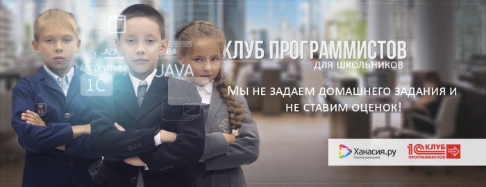

# Кем быть? Где учиться? Где работать?

Дата создания: 2014-09-04

Автор: KEA

Теги: школьники,программирование,клуб для школьников

   
  
**Кем быть?**  
  
Наиболее популярная на сегодняшний день профессия – это программист.  
  
Это одна из самых востребованных и высокооплачиваемых профессий в России. Выбор карьеры программиста – это короткий путь в Европу и Америку. Ведь наши специалисты пользуются большим спросом на мировом рынке.  
Сегодня и в Абакане на программистов высокий спрос и, соответственно, они получают высокую зарплату. Чтобы претендовать на вакансию программиста в Абакане, необязательно высшее образование. Можно начать обучение на специальных курсах по программированию.  
  
**Где учиться?**  
  
В нашем городе такие курсы проводит Учебный центр «Хакасия.ру».   
  
Здесь обучение программированию построено по принципу «клуба по интересам». Это действительно КЛУБ, в котором ребята не только знакомятся с устройством персонального компьютера, самостоятельно собирают его и конфигурируют, устанавливают операционные системы, подключают локальную сеть, создают программы и работают с графическими объектами, но и общаются в неформальной обстановке, ходят в походы, на выставки и в музей, отмечают праздники и дни рождения!  
  
Клуб программистов для школьников от УЦ «Хакасия.ру» предлагает 5 направлений для развития детей в области программирования:  
• Основы программирования в системе «1С: Предприятие8».  
• Основы программирования на языке Java.  
• Системное администрирование.  
• Алгоритмы. Олимпиадное программирование.  
• Подготовка к ЕГЭ по информатике.  
  
Здесь не задают домашних заданий и не ставят оценок. Но при этом учат современным, полноценным языкам промышленного программирования.  
  
**Где работать?**  
  
Только при наличии знаний языков программирования высокого уровня, сразу по окончании школы можно получить должность программиста-стажера и начать строить карьеру программиста.  
  
Важно знать, что условно программисты делятся на три категории:   
• прикладные, занимающиеся разработкой программного обеспечения;   
• системные, занимающиеся разработкой операционных систем;   
• Web-программисты, в их обязанности входит написание web-интерфейсов к базам данных, создание динамических web-страниц и т.п.  
  
Пройдя все модули программирования будучи школьником, даже у вчерашнего выпускника есть все шансы найти хорошую работу.  
  
Наиболее популярная область работы — разработка и создание программного обеспечения, используемого в текстовых редакторах, бухгалтерских программах, играх, базах данных и даже системах видеонаблюдения. Востребованы сегодня и специалисты, адаптирующие уже готовые программы (в частности 1С: Бухгалтерия) под особенности конкретного предприятия. Не останутся без работы и web-разработчики…  
  
А где работать – это уже выбор за вами: Яндекс, Google, Mail.ru, Лаборатория Касперского, ABBYY, Студия Артемия Лебедева, Администрация Президента России, Сбербанк и т.д.   
  
Главное получить нужные знания! И при этом обладать терпением, усидчивостью и выдержкой. Ведь постоянная работа на компьютере не очень полезна для здоровья. Однако творчество и любовь к делу превыше всего!  
  
**P.S.**  
Средняя зарплата программиста по России на 2014 год:  
Стажер, помощник программиста: 30-40 000 р.  
Специалист: 80-90 000 р.  
Ведущий программист: 110 000 р.  
  
**Подробнее о клубе:** [e.khakasia.ru/clubprogrammistov/](http://e.khakasia.ru/clubprogrammistov/)  
**Адрес:** г.Абакан, ул. Вяткина, 9  
**Телефон для связи:** +7 (3902) 26-44-11