# Мастер класс по системному администрированию от "Хакасия.ру"

Дата создания: 2014-09-05

Автор: KEA

Теги: день города,школьники,программирование,мастер-класс

 

 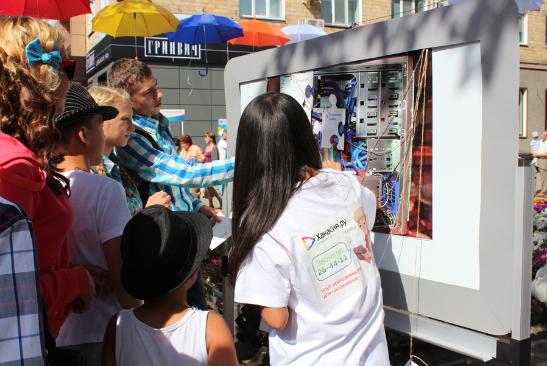

 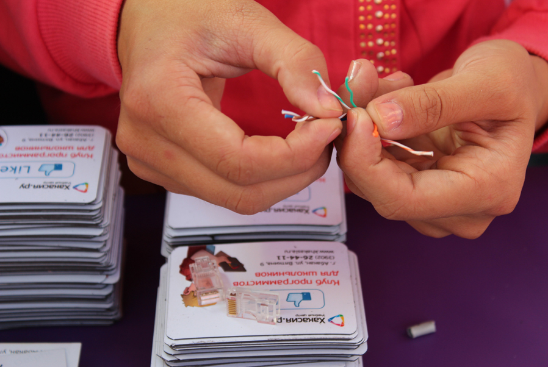

 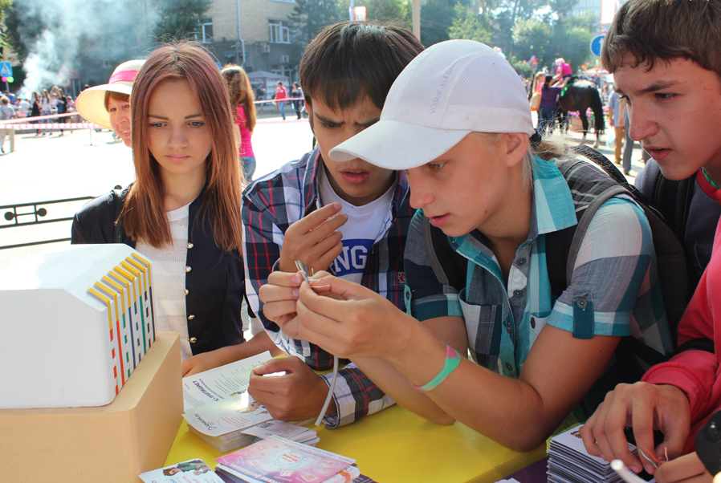

 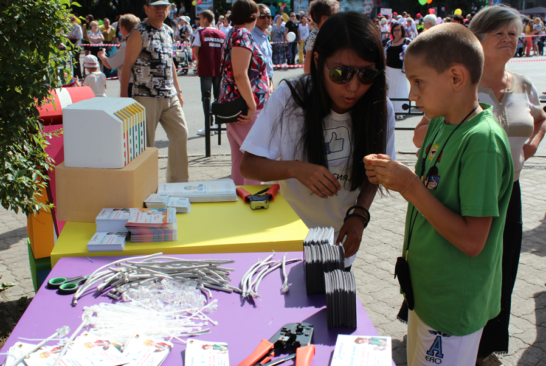

 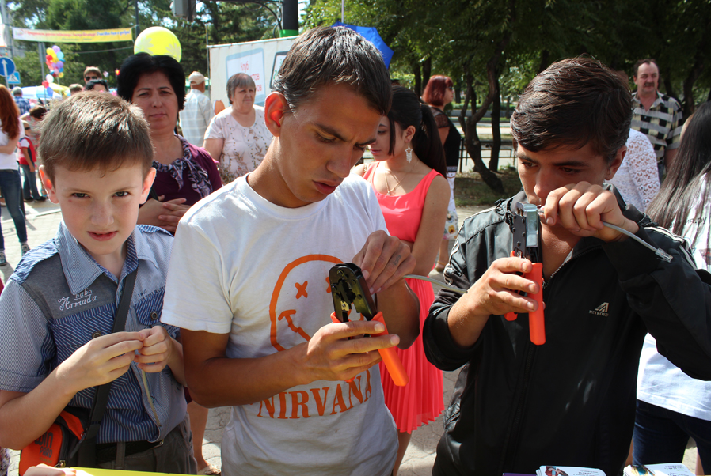

 

 

 

 

 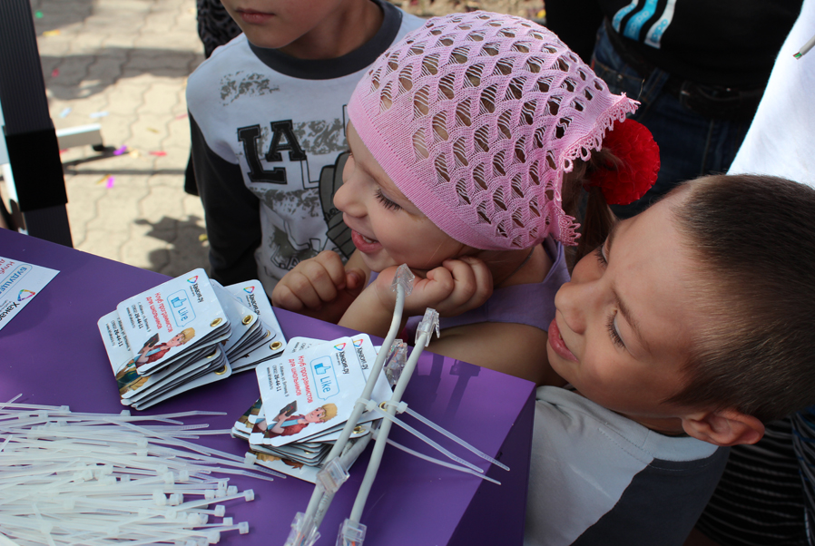

 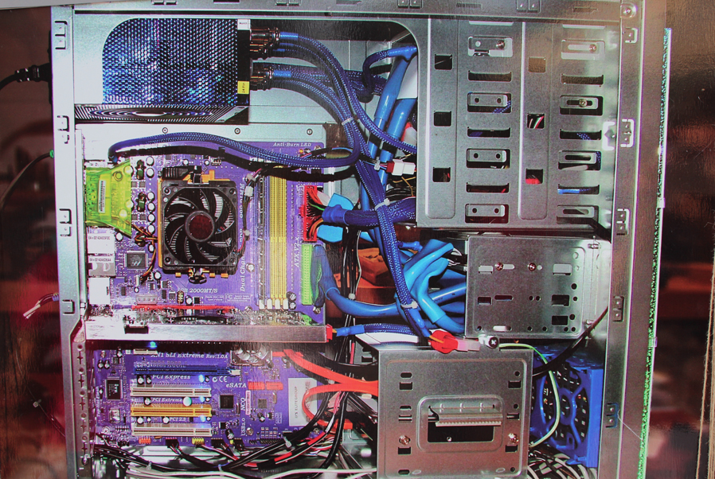

 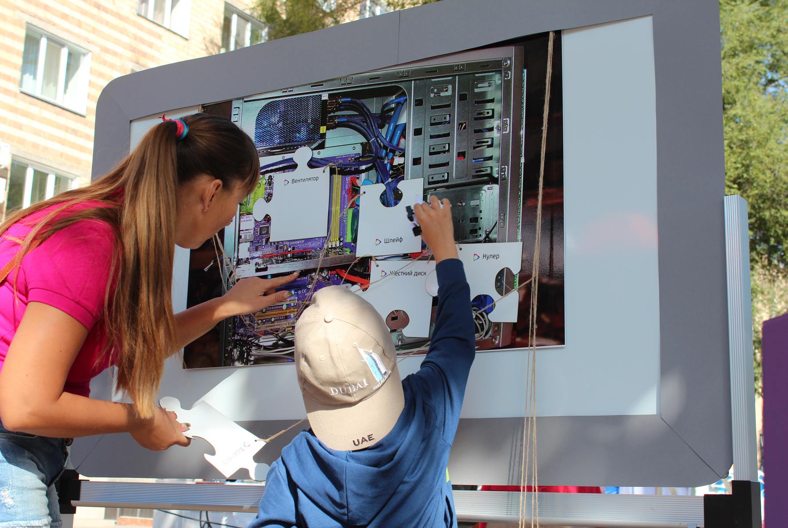

 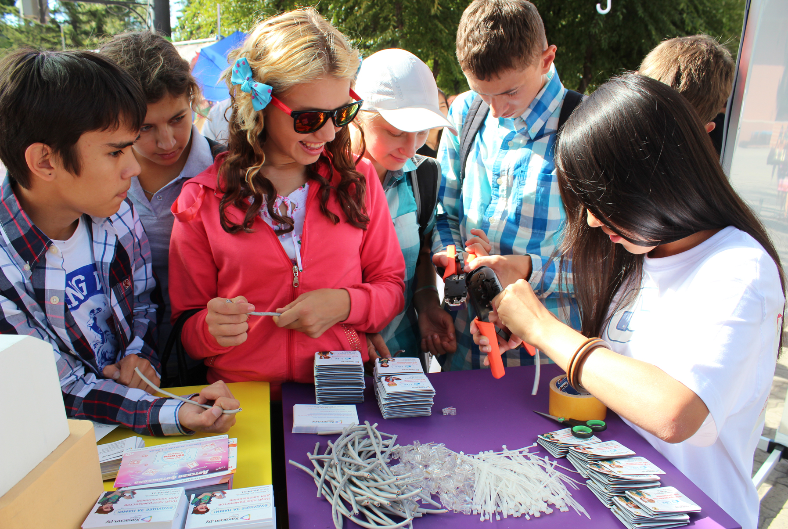

 

 

 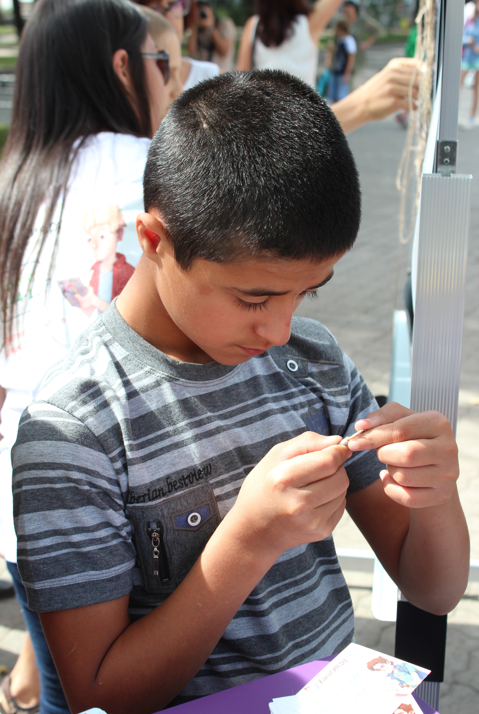

 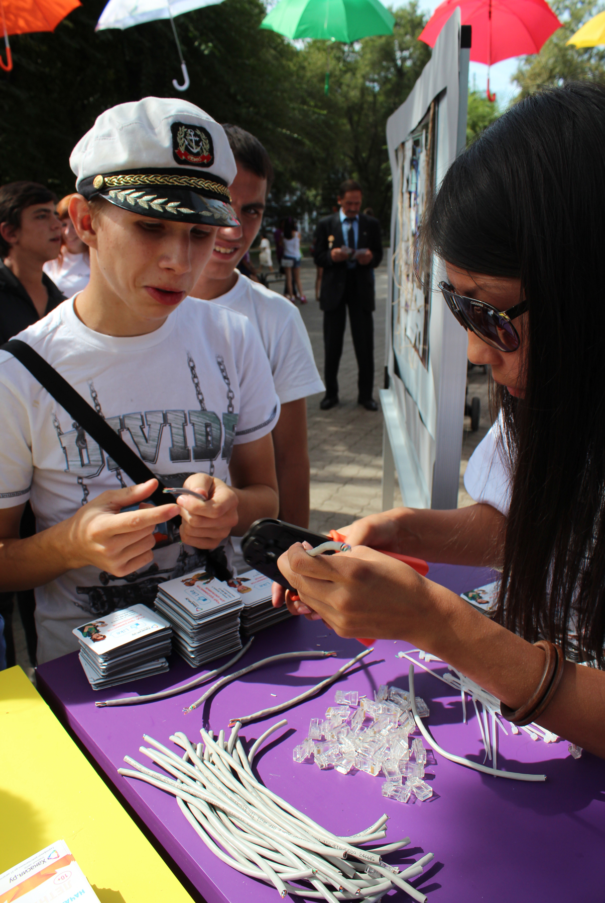

 

 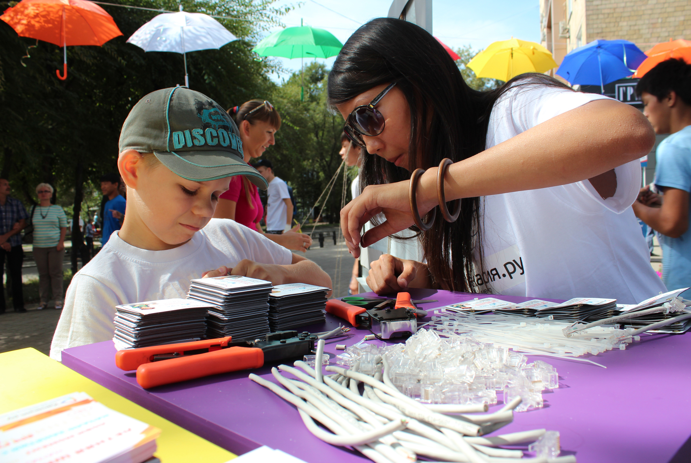

 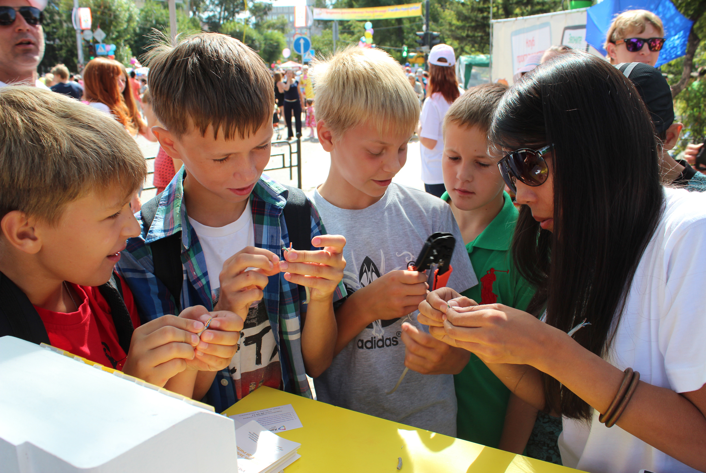

 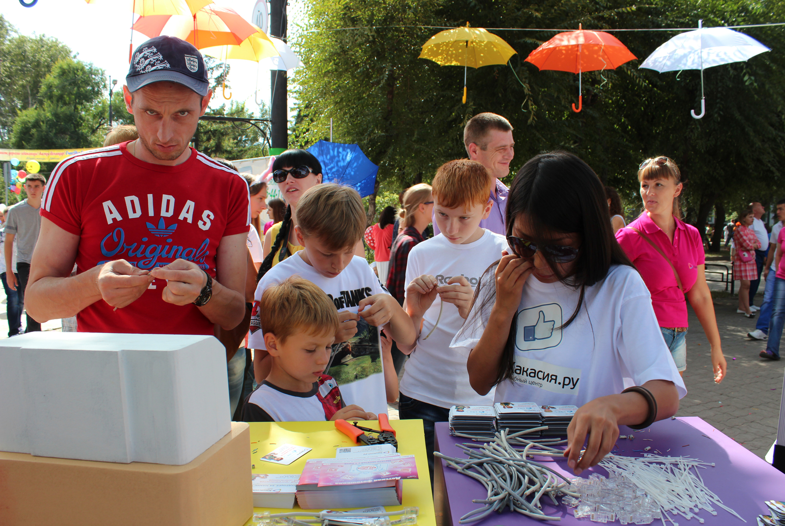

 Компания «Хакасия.ру» в день города Абакана 23 августа 2014 г. предлагала жителям и гостям города попробовать себя в роли системного администратора. Все желающие: и взрослые, и школьники, и малыши на площадке АРТ-город обжимали провода для локальной сети и собирали системный блок. Представляем вам фотоотчет с этого увлекательного мероприятия.

