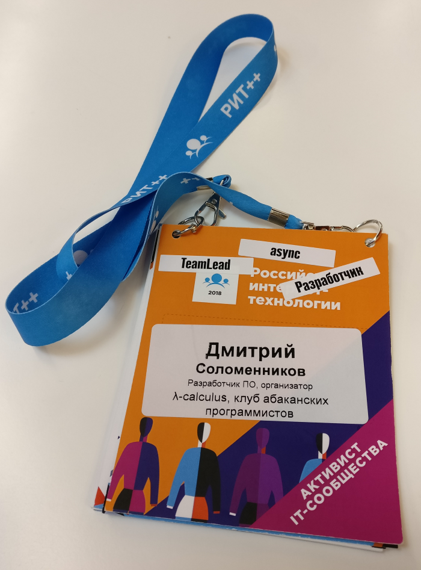
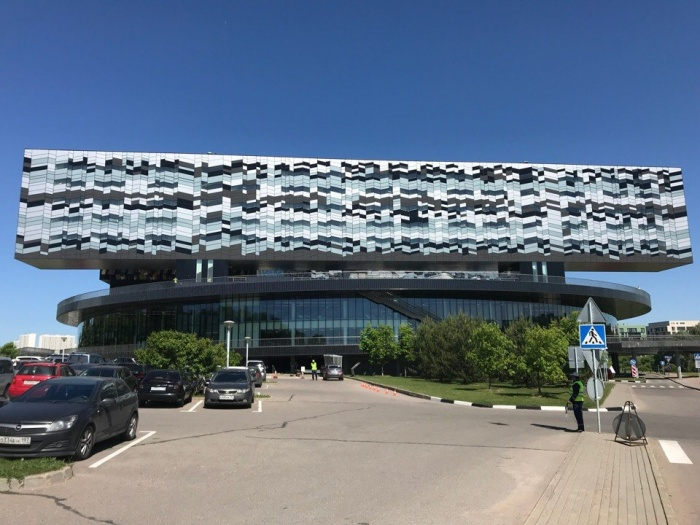
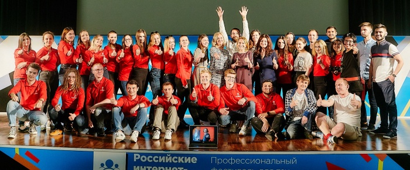
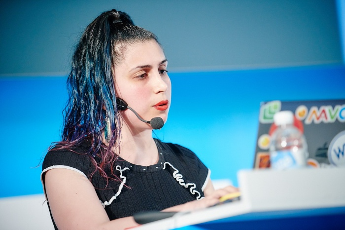
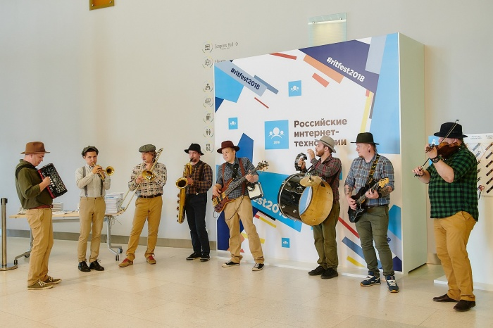
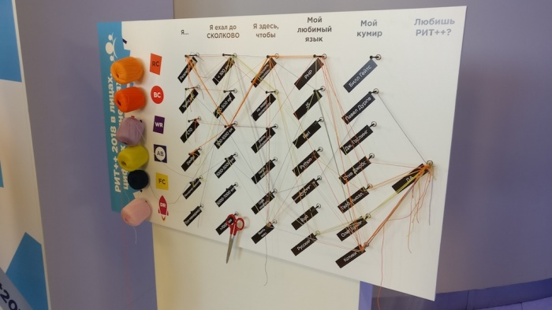
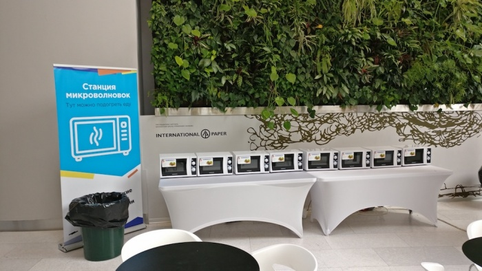

# Поездка на РИТ++ 2018

Дата создания: 2018-06-17

Автор: dmitrys99

Теги: IT-конференция,Мероприятия

В&nbsp;конце мая 2018 года довелось побывать на&nbsp;«Профессиональном фестивале для тех, кто делает Интернет»&nbsp;— РИТ++ 2018.  
   
Хочу поделиться впечатлениями.  
  
РИТ++&nbsp;— это большое мероприятие, включающее в&nbsp;себя сразу несколько конференций.  
  
Это конференция по&nbsp;[управлению и&nbsp;предпринимательству](http://whalerider.ru/2018), конференция [по&nbsp;применению психологии в&nbsp;управлении и&nbsp;бизнесе](http://conf.aletheia.business/2018), профессиональная конференция [фронтенд-разработчиков](http://frontendconf.ru/moscow-rit/2018), конференция по&nbsp;[серверному программированию](http://backendconf.ru/2018), профессиональная конференция по&nbsp;[эксплуатации и&nbsp;devops](http://rootconf.ru/moscow-rit/2018).  
  
Кроме этого, в&nbsp;рамках фестиваля в&nbsp;этом году проводился [съезд активистов русскоязычных IT-сообществ](https://ritfest.ru/moscow/2018/reunion).  
  
Я&nbsp;на&nbsp;фестиваль попал как предствитель клуба абаканских программистов «λ-calculus».  
  
Фестиваль проходил в&nbsp;28&nbsp;и&nbsp;29&nbsp;мая в&nbsp;Сколково.  
  
   
  
Давно хотелось побывать в&nbsp;этом месте. Здание конференц-зала (а&nbsp;центральное здание, по&nbsp;сути, представляет собой большой конференц-зал с&nbsp;несколькими аудиториями) круглой формы, в&nbsp;котором легко потеряться, т.к. углов в&nbsp;нем нет.  
  
Конференции проходили одновременно в&nbsp;пять потоков, всего на&nbsp;конференции было больше 140 докладов и&nbsp;более 2000&nbsp;слушателей.  
  
Первое, что бросается в&nbsp;глаза, когда попадаешь на&nbsp;фестиваль&nbsp;— отличная и&nbsp;слаженная организационная работа.  
На&nbsp;каждом этапе было понятно что делать или у&nbsp;кого спрашивать.  
  
   
  
Я, в&nbsp;основном, посещал доклады организационной тематики, всего, что связано с&nbsp;сообществами и&nbsp;их&nbsp;развитием.  
Но&nbsp;также послушал и&nbsp;несколько профессиональных докладов.  
  
Мне больше всего понравился рассказ Андрея Аксенова [«Что мы&nbsp;знаем про хэши»](https://backendconf.ru/2018/abstracts/3445.html).  
  
На&nbsp;конференции было очень много интересных людей и&nbsp;компаний. Был и&nbsp;достаточно эпатажные докладчики:  
  
   
  
Это Мадам CSS Lea Verou, читавшая доклад [Even More CSS Secrets](https://frontendconf.ru/moscow-rit/2018/abstracts/3640.html).  
  
В&nbsp;первый день на&nbsp;входе участников встречал оркестр  
  
   
  
Для участников было организованы нескончаемые печеньки, кофе и&nbsp;прочие развлечения, вроде такого  
  
   
  
И обед :)  
  
   
  
Безусловно, самое ценное на&nbsp;таких мероприятиях&nbsp;— это общение. Пообщался с&nbsp;коллегами из&nbsp;PVS-Studio, Data Egret, Avito, Додо пицца, 7bit.  
  
У&nbsp;всех какие-то достижения, у&nbsp;всех какие-то трудности. В&nbsp;кулуарах мероприятия было даже интереснее, чем на&nbsp;докладах, хотя понятно, что многие доклады были мирового уровня.  
  
Что касается съезда активистов, то&nbsp;можно сказать, что у&nbsp;всех сообществ по&nbsp;стране примерно одинаковая ситуация.  
Развитием сообщества (т.е. чем-то для других, не&nbsp;только для себя) занимаются единицы. И&nbsp;таким людям нужна помощь. Далеко не&nbsp;всегда материальная. Иногда и&nbsp;просто моральная поддержка очень много значит.  
  
В&nbsp;целом, и&nbsp;фестиваль, и&nbsp;съезд активистов получились очень позитивными, поучительными. Осталась масса впечатлений&nbsp;и, что называется «информации к&nbsp;размышлению».

