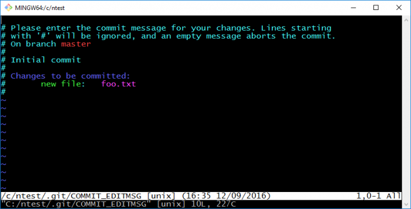

# Об оформлении коммитов Git

Дата создания: 2018-09-11

Автор: dmitrys99

Теги: Git,commit,удобство

   
  
Хочу кратко остановиться на&nbsp;том, что представляет собой хороший комментарий коммита.   
Коммиты и&nbsp;работа с&nbsp;ними&nbsp;— вот что делает Git великолепным.  
  
Примерная структура хорошего комментария к&nbsp;коммиту:  
  

```
Краткая сводка (summary) (до 50 знаков), с заглавной буквы

Если нужно, более детальный пояснительный текст. Следует выравнивать
текст комментария примерно до 72 символов. В некоторых ситуациях, первая
строка используется как тема электронного письма, остальные - как тело.
Пустая строка, отделяющая сводку от тела, важна (если тело письма
присутствует, разумеется). Утилиты вроде rebase могут запутаться, если
части комментария не разделить.

Пишите комментарий к коммиту в повелительном наклонении: "Исправление 
ошибки", но не "Исправлена ошибка" или "Исправляет ошибки". Это 
согласуется с комментариями, генерируемыми утилитами вроде git merge
или git revert.

Абзацы отделяются пустыми строками.

- Можно использовать маркеры

- Обычно в качестве маркеров используется дефис или звездочка с пробелом
  и пустой строкой в промежутках, но могут быть и другие варианты.
  
- Выступы также вполне применимы
```
  
  
Позвольте пояснить, почему стоит переносить строки на&nbsp;72&nbsp;символах.  
  

- **git log** специально не&nbsp;переносит комментарии коммита. Это значит, что при использовании пейджера по-умолчанию ( **less -S** ) абзацы будут утекать далеко за&nbsp;пределы экрана, затрудняя чтение. На&nbsp;80-символьных терминалах, если мы&nbsp;вычтем 4&nbsp;символа на&nbsp;отбивку и&nbsp;справа 4&nbsp;символа для симметрии, как раз и&nbsp;получится 72&nbsp;позиции.
- **git format-patch —stdout** преобразует серию коммитов в&nbsp;набор электронных сообщений, используя комментарий как тело письма. Сетевой этикет предписывает нам переносить строки в&nbsp;письмах таким образом, чтобы оставалось место для нескольких индикаторов уровней вложения без превышения 80&nbsp;символов. Возможно сейчас в&nbsp;проекте не&nbsp;используется электронная почта вместе с&nbsp;Git, но&nbsp;кто знает, как ситуация повернется в&nbsp;будущем?

  
Однако, наличие сводки комментария гораздо более важно, нежели форматирование тела комментария. Как показано в&nbsp;примере, следует пытаться вписаться в&nbsp;50&nbsp;символов (что, впрочем, не&nbsp;жесткий максимум) и&nbsp;всегда, обязательно, ставить пустую строку после сводки. Первая строка должна содержать краткое резюме изменений, выполняемых коммитом; если&nbsp;же есть технические детали, которые не&nbsp;укладываются в&nbsp;столь небольшой объем, помещайте их&nbsp;в&nbsp;тело комментария. Сводка повсеместно используется Git и&nbsp;часто используется именно усеченная форма комментария. Вот несколько примеров:  
  

- **git log —pretty=oneline** показывает краткую историю, содержащую идентификатор коммита и&nbsp;сводку;
- **git rebase —interactive** предоставляет сводку каждого коммита в&nbsp;вызванном редакторе;
- Если установлена опция merge.summary, то&nbsp;при слиянии заголовки всех коммитов собираются в&nbsp;комментарий к&nbsp;общему коммиту;
- **git shortlog** использует сводку при создании changelog-подобного вывода;
- **git format-patch** , **git send-email** и&nbsp;похожие инструменты подставляют сводку в&nbsp;тему письма;
- Рефлоги, локальная история, доступная по&nbsp;команде **git reflog** , предназначенная для восстановления при глупых ошибках, берет копию сводки
- в&nbsp; **gitk** есть колонка для сводки;
- **GitHub** использует сводку во&nbsp;множестве мест в&nbsp;интерфейсе.

  
Различие между сводкой/телом может показаться малозначительным, но&nbsp;это один из&nbsp;факторов, делающих историю Git удобной.  
  
Вольный пересказ заметки [A&nbsp;Note About Git Commit Messages](https://tbaggery.com/2008/04/19/a-note-about-git-commit-messages.html).  
  
Картинка [взята отсюда](http://readorskip.com/2016/09/12/Using-Notepad-to-Write-Git-Commit-Messages/).