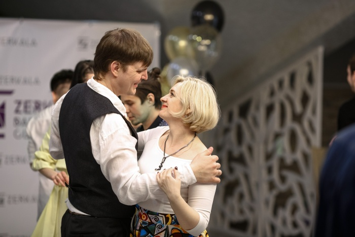
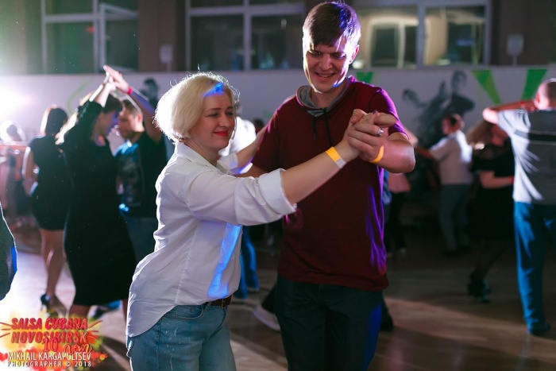
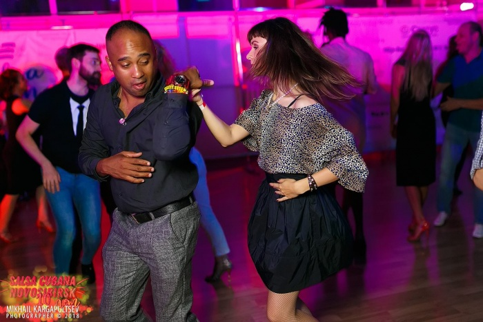
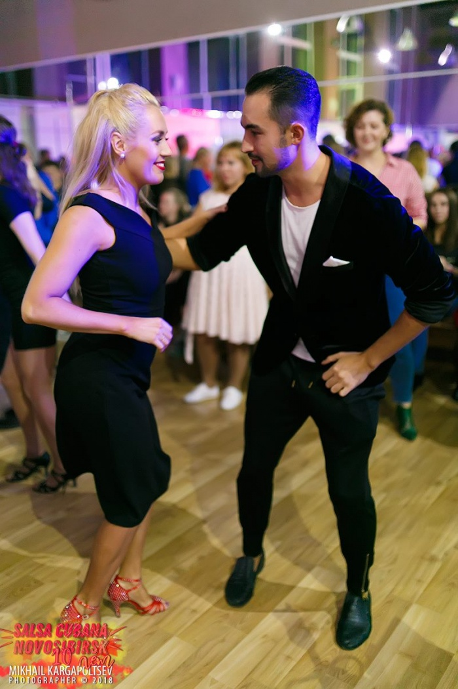
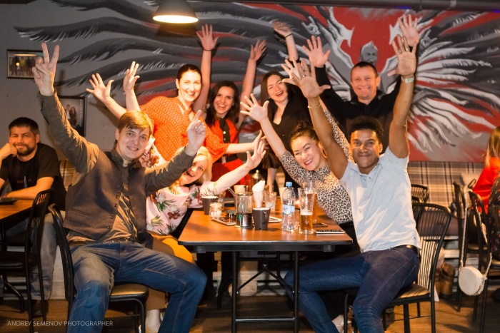

# Социальные танцы

Дата создания: 2018-11-19

Автор: dmitrys99

Теги: Хобби,танцы,развлечения

Жизнь состоит не&nbsp;только из&nbsp;работы.  
У&nbsp;многих из&nbsp;нас есть хобби, будь&nbsp;то собирательство журналов со&nbsp;Смешариками, вышивка или авиамоделизм.  
  
В&nbsp;моем случае хобби&nbsp;— это танцы.  
  
   
  
Так или иначе к&nbsp;танцам я&nbsp;имею отношение с&nbsp;самого детства. Когда-то занимался даже балетом, правда недолго.  
Танцы никогда не&nbsp;были профессиональным занятием, но&nbsp;мне нравилось чувствовать музыку, двигаться,  
общаться. В&nbsp;конце концов это весело.  
  
Некоторое время назад, когда стало понятно, что дети подросли и&nbsp;у&nbsp;нас с&nbsp;женой появилось немного свободного времени, мы&nbsp;пошли на&nbsp;танцы уже вдвоем.  
  
Мы&nbsp;стали заниматься тем, что называется [«социальными танцами»](https://ru.wikipedia.org/wiki/Социальные_танцы)&nbsp;— сальса, бачата.  
  
   
  
Это очень приятное времяпрепровождение. Тут тебе и&nbsp;хорошая музыка, настроение, немаленькая физическая нагрузка. Мы&nbsp;открыли для себя целый мир! По&nbsp;всей стране проводятся фестивали, есть очень хорошие преподаватели, причем как местные, так и&nbsp;носители культуры, кубинцы и&nbsp;доминиканцы (а&nbsp;социальные танцы родом как раз из&nbsp;упомянутых стран).   
  
   
  
Некоторые из&nbsp;преподавателей и&nbsp;вовсе чемпионы мира.  
  
   
  
Так, в&nbsp;Красноярске ежегодно в&nbsp;начале января проводится фестиваль, давно ставший международным, Hot Winter in&nbsp;Siberia. В&nbsp;Новосибирске есть танцевальная школа, организованная кубинцем. У&nbsp;нас в&nbsp;городе тоже есть несколько клубов, где преподают и&nbsp;сальсу, и&nbsp;бачату. В&nbsp;[нашем клубе](https://vk.com/zerkala19) даже есть свой кубинец :)  
  
   
  
В&nbsp;Абакане регулярно проводятся танцевальные мероприятия&nbsp;— вечеринки, open air (нет устоявшегося перевода этого термина), выступления.  
  
Вчера мы&nbsp;как раз на&nbsp;такой вечеринке и&nbsp;побывали. Было весело ;)  
  
Многие из&nbsp;читателей могут сказать, что это, мол, не&nbsp;мужское занятие.  
  
На&nbsp;самом деле это не&nbsp;так. Танец учит мужчину быть мужчиной, вести, решать что пара будет делать и&nbsp;как. Женщина&nbsp;же в&nbsp;танце может показать себя, украсить собой пару. В&nbsp;танце выстраиваются правильные взаимоотношения с&nbsp;уважением к&nbsp;роли каждого. Коротко это выражается фразой «Мужчина ведет, женщина красивая».  
  
В&nbsp;танце отношения мужчина-женщина выстраиваются очень органично и&nbsp;совершенно естественным образом.

