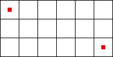
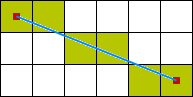

# Алгоритм Брезенхема

Дата создания: 2013-12-25

Автор: mSTShambler

Теги: Программирование,Алгоритмы,Геймдев

Общеизвестно, что изучение различных алгоритмов, связанных с геймдевом — мое хобби. Посему, сегодня будем посмотреть на один из базовых алгоритмов для построения отрезков — алгоритм Брезенхема. Крайне замечательно, что этот алгоритм можно использовать не только в приложении к компьютерной графике, что я и постараюсь показать.  
  
Но, ближе к делу. Есть две точки. Задача: найти пиксели, которые лежат на пути отрезка, заданными этими двумя точками.   
  
**Внимание, матан!**  
   
Вспомним формулы прямых из школьного курса:  
1. (x — x0) / (x1 — x0) = (y — y0) / (y1 — y0), где x0,y0 и x1,y1 — точки на прямой  
2. y = K \* x + C, где K — угол наклона прямой, а C — смещение прямой от центра координат.  
3. A \* x + B \* y + C = 0. Формула аналогична (2), по сути  
  
Теперь посмотрим на то, как изменяются X и Y. Вычислим dX = x1 — x0 и dY = y1 — y0. То значение, которое изменяется больше, будем считать «базовым». Иными словами, base = max( abs(dX), abs(dY) ).   
  
Преобразуем формулу (1) таким образом, чтобы «не базовое» значение оказалось за знаком равенства. Для простоты, будем считать, что dX \> dY. Тогда формула (1) примет вид: y = (y1 — y0) / (x1 — x0) \* (x — x0) + y0.  
  
Легко заметить, что при изменении X, значение Y изменится на (y1 — y0) / (x1 — x0). Эту величину можно обозначить как «коэффициент наклона», он же «slope». slope = dY / dX.  
  
Введем еще одно значение — «ошибка» или «error». Оное значение будем увеличивать на slope каждый раз, когда «базовое» значение увеличится на 1. И, когда error превысит 0.5, изменим на 1 «не базовое» значение, а error уменьшим на 1.  
  
Собственно, алгоритм Брезенхема и состоит в том, чтобы пробежать «базовой» переменной от начального значения до конечного, изменяя error на каждом шаге и проверяя его на превышение на 0.5.  
  
Возникает вопрос — почему именно 0.5? Дяденька Брезенхем посчитал, что достаточно знать насколько сильно точка в новой «базовой» координате тяготеет к какому-либо целому значению координатной сетки по «не базовой» координате. Таким образом, как только ошибка превысит 0.5, значит середина пиксельной решетки пройдена и можно смело изменять значения «не базовой» координаты.  
  
В псевдокоде на C для случая, когда dX \> dY, x0 \< x1 и y0 \< y1, сие выглядит так:

```
int dx, dy;
int px, py;
double error;
double slope;

dx = x1 - x0;
dy = y1 - y0;

добавляем точку x0, y0
px = x0;
py = y0;
slope = dy / dx;
error = 0;
while(px != x1 || py != y1) {
    px++;
    error += slope;
    if (error >= 0.5) {
        error -= 1;
        py++;
    }
    добавляем точку px, py
}
```
  
К сожалению, у данной реализации есть следующие проблемы:  
1. Используется деление  
2. Используются числа с плавающей запятой  
  
Чтобы избавиться от обоих-двух недостатков, надо вспомнить об остальных двух формулах.  
Смотрим на формулу (2) и замечаем, что y = K \* x + C — это, на самом деле, y = slope \* x + c. Преобразуем дальше: y = dY / dX \* x + c -\> dX \* y = dY \* x + dX \* c.  
Теперь посмотрим на формулу (3), и преобразуем полученную из (2) формулу в следующий вид: dY \* x — dX \* y + dX \* c = 0. Таким образом: A = dY, B = -dX, C = dX \* c.  
Запишем эту формулу как f(x, y) = A \* x + B \* y + C  
  
Также изменим и идею о «тяготении». Пусть все точки находятся ровно по середине пиксельной решетки. Тогда, ошибка для второй точки будет выглядеть следующим образом: error = f(x0 + 1, y0 + 1/2) — f(x0, y0). Раскрываем формулы: error = A + 1/2 \* B =\> dY — 1/2 \* dX  
Как только error станет равным или больше 0, сразу же увеличим «не базовую» координату.  
Картинка для пояснения:   
  
Таким образом, для третьей точки error может быть вычислен 2-мя способами:  
1. Если Y не изменялся, то error = f(x0 + 2, y0 + 1/2) — f(x0 + 1, y0 + 1/2)  
2. Если Y изменялся, то error = f(x0 + 2, y0 + 3/2) — f(x0 + 1, y0 + 1/2)  
  
Преобразуем обе-две формулы, и увидим, что:  
1. Если Y не изменялся, то error изменился на dY  
2. Если Y изменился, то error изменился на dY — dX  
  
Следовательно, мы практически избавились от чисел с плавающей запятой и деления (используется только для определения начальной «ошибки»).  
  
Чтобы избавиться от них совсем, преобразуем формулу error = dY — 1/2 \* dX в вид: 2 \* error = 2 \* dY — dX. Легко заметить, что оное умножение на 2 не повлияет на остальные формулы. И, хотя умножение работает и быстрее чем деление, его можно заменить на операцию побитового сдвига, что, собственно, равнозначно.  
  
И псевдокод на C для того же самого случая будет выглядеть так:  

```
int dx, dy;
int px, py;
int error;

dx = (x1 - x0) << 1;
dy = (y1 - y0) << 1;

добавляем точку x0, y0
px = x0;
py = y0;
error = dy - (dx >> 1);
while(px != x1 || py != y1) {
    if (error >= 0) {
        py++;
        error -= dx;
    }
    px++;
    error += dy;
    добавляем точку px, py
}
```
  
Для случая, когда x1 \< x0, проверка на error изменяется на if (error \> 0).  
Аналогично с оставшимися 2-мя случаями, где dx и px меняются на dy и py.  
  
По просьбам трудящихся, ссылки на видео с теорией и реализацией: [теория](http://www.youtube.com/watch?v=SAT0eq9w1Yg), [реализация на C++](http://www.youtube.com/watch?v=p0PCdO9IWms)