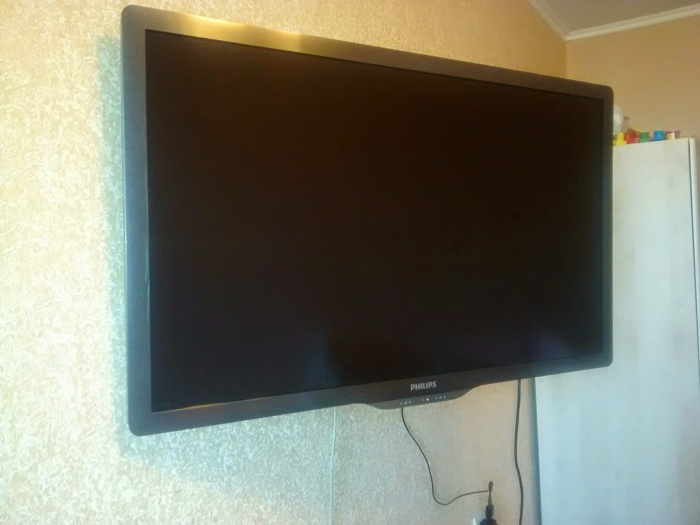
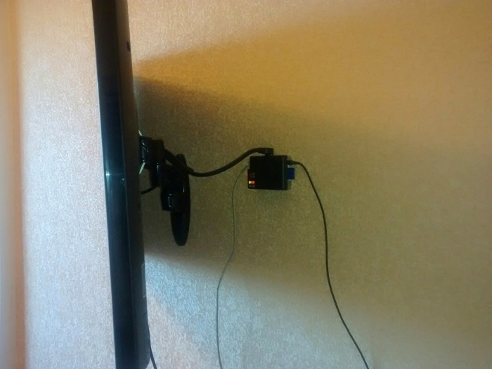
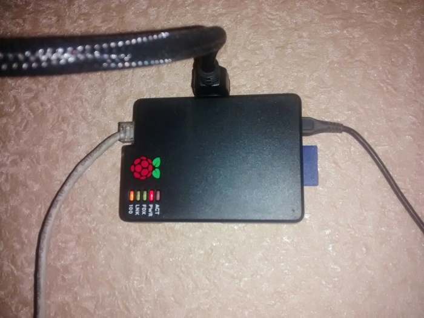

# Raspberry Pi в качестве домашнего медиацентра

Дата создания: 2014-08-22

Автор: quarck

Теги: xbmc,openelec,raspberry pi

В моём представлении домашний медиацентр всегда ассоциировался с [XBMC](http://xbmc.org/). Не буду останавливаться на перечислении возможностей этого ПО, скажу лишь одно, когда я впервые установил XBMC на свой десктоп, то сразу же захотел иметь большой телевизор. Когда телевизор появился, то первое время он был непосредственно подключен к домашнему компьютеру в мультимониторной конфигурации. Но такая связка оказалась малопригодной для удобного использования. О [Raspberry Pi](http://www.raspberrypi.org/) я уже знал к тому времени, но как-то боялся, что мощностей машинки не хватит, чтобы крутить FullHD видео. Тут на сцену выходит [openELEC](http://openelec.tv/). Это такой особый дистрибутив линукса, в котором из системного ПО оставили только то, что необходимо для запуска XBMC, при этом достигается максимальное быстродействие на железе малинки. Следует сказать об одной киллер-фиче этого одноплатного компьютера, упоминание которой я не встречал у конкурентов. Это [HDMI-CEC](https://ru.wikipedia.org/wiki/CEC_%28%D1%88%D0%B8%D0%BD%D0%B0_%D0%BE%D0%B1%D0%BC%D0%B5%D0%BD%D0%B0_%D0%B4%D0%B0%D0%BD%D0%BD%D1%8B%D0%BC%D0%B8%29). С помощью этой технологии можно управлять интерфейсом XBMC пультом от телевизора. Для меня остаётся загадкой почему ни у видеокарт, ни у конкурентов Raspberry Pi это расширение HDMI не реализовано. Ну что ж вот наконец долгожданная посылка у меня. Накатить openELEC оказалось не просто, а очень просто. Ниже приведена инструкция для линуксовых дистрибутивов.

1. Скачиваем архив openELEC [отсюда](http://openelec.tv/get-openelec/download/viewcategory/10-raspberry-pi-builds).
2. Вставляем sd-карту в кардридер.
3. Открываем эмулятор терминала, распаковываем архив 
```
$ tar xvf OpenELEC-RPi.arm-4.0.7.tar
```
4. Переходим в распакованную директорию 
```
$ cd OpenELEC-RPi.arm-4.0.7
```
5. Вводим команду установки 
```
$ sudo ./create_sdcard /dev/sdX
```
, где X буква вашего устройства, куда примонтировалась карта.

Всё. После этого вставляем карту в малину, соединяемся с телеком по HDMI и наслаждаемся нашим медиацентром. Однако, медиацентр мало интересен без этого самого медиа. В случае с openELEC вы можете файлы помещать на sd-карту, подключать какие-либо носители по usb, но это всё неудобно. Гораздо практичней объединить домашний ПК и малину в сеть, благо что у неё есть порт RJ-45. openELEC позволяет подключать шары по множеству известных протоколов в том числе smb, ftp, nfs, sftp, afp. Поскольку на моём компьютере установлен openSUSE, то я выбрал nfs и создал шару через YaST. После этого мне достаточно держать медиафайлы в расшаренных каталогах, и в XBMC они появятся автоматически. Конечно в моей конфигурации приходится держать включенным компьютер, но это можно исправить, докупив простенький [NAS](https://ru.wikipedia.org/wiki/NAS) типа D-Link DNS320. В следующем посте я расскажу, как с помощью XBMC просматривать iptv от ростелекома. Несколько фотографий моего скромного сетапа:  
  
   
  
   
  
 