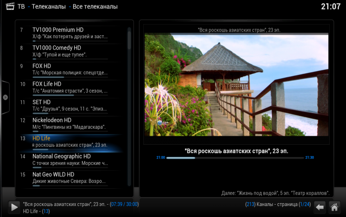

# IPTV на XBMC

Дата создания: 2014-08-25

Автор: quarck

Теги: xbmc,iptv,python

[В предыдущем посте](http://lambda-calculus.ru/blog/49.html) я рассказал как из ~~буханки хлеба сделать троллейбус~~ одноплатного компьютера Raspberry Pi сделать медиацентр. В этой заметке я хотел бы поделиться с вами как смотреть iptv с программой телепередач на XBMC. Собственно для этого нам нужен плагин [IPTVSimple PVR-addon](http://wiki.xbmc.org/index.php?title=Add-on:IPTV_Simple_Client), плейлист с каналами в формате m3u, а также программа телепередач в формате xmltv. С плагином проблем быть не должно, достаточно включить его в настройках XBMC. Плейлист с каналами придётся поискать. Тут стоить отметить, что многие интернет-провайдеры предоставляют услугу iptv в своих сетях. Например, Ростелеком, абонентом которого я являюсь, стримит через мультикаст более двухсот каналов. Так что если вы тоже подключены к Ростелекому, пишите в личку, плейлистом я с вами поделюсь.  
Следующий этап — программа телепередач. Единственный более-менее вменяемый список я нашёл на сайте [www.teleguide.info.](http://www.teleguide.info.) Если вы неприхотливый пользователь, то можно использовать xmltv файл с teleguide.info, но меня он не устроил двум причинам. Во-первых, всё-таки не все каналы охвачены из моего плейлиста. Во-вторых, программа передач расписана там на неделю. Слабое железо малинки парсит 30-мибибайтный xml файл несколько минут. Поэтому я пошёл другим путём и написал скрипт на питоне, который граббит программу передач за сутки с сайта vsetv.com. Файл получается размером около мибибайта, который с лёгкостью проглатывается XBMC. Листинг скрипта (работает на python 2.7):  

```
#!/usr/bin/env python
#Из внешних зависимостей нам необходимы модули xmltv для формирования xml и библиотека Grab для граббинга сайта
import xmltv
from grab import Grab
from datetime import datetime, date, time, timedelta
 
class VsetvGrabber:
    """Grabber for vsetv.com"""
    def __init__ (self):      
        self.g = Grab()
        #На сайте vsetv.com можно выбрать интересующие вас каналы, но это доступно только для зарегистрированных 
        #пользователей. Поэтому, чтобы наши настройки сохранялись, мы будем логиниться с помощью кукисов. 
        self.g.setup(cookies={"cll": "your_cookie", "cp": "your_cookie"})
        self.g.go('http://www.vsetv.com/schedule_package_personal_day_' +
                  str(date.today()) + '_nsc_1.html')
        self.amount_channels = range(len(self.g.doc.select(
            '//div[@id="schedule_container"]')))
        self.main_selector = self.g.doc.select(
            '//div[@id="schedule_container"]')
        
    def get_channels_titles_dict(self):
        return [{'display-name': [(elem, u'ru')], 'id': str(i)}
                for i, elem in enumerate(
                self.g.doc.select('//td[@class="channeltitle"]').text_list(), 1)]

    def get_starttime(self):
        return [self.main_selector[i].select(
                './div[@class="time" or @class="onair" or @class="pasttime"]')
                .text_list() for i in self.amount_channels]

    def convert_date(self, start_time):
        dt = str(date.today()) + " " + str(start_time)
        dt = datetime.strptime(dt, "%Y-%m-%d %H:%M")
        return dt

    def make_date(self):
        return [map(self.convert_date, p) for p in self.get_starttime()]

    def correct_starttime(self):
        starttime_lists = self.make_date()
        for starttime in starttime_lists:
            for i, this_date in enumerate(starttime, 1):
                try:
                    next_date = starttime[i]
                    if this_date > next_date:
                        starttime[i] += timedelta(days=1)
                except IndexError:
                    continue
        return starttime_lists

    def get_stoptime(self):
        new_time = []
        t = time(5, 0)
        d = date.today() + timedelta(days=1)
        dt = datetime.combine(d, t)
        for i in self.correct_starttime():
            del i[0]
            i.append(dt)
            new_time.append(i)
        return new_time

    def get_programmes_titles(self):
        return [self.main_selector[i]
                .select('./div[@class="prname2" or @class="pastprname2"]')
                .text_list() for i in self.amount_channels]

    def time_to_string(self, datetime_object):
        return datetime_object.strftime("%Y%m%d%H%M%S")

    def make_dict(self):
        final_dict = []
        m = 1
        for i, j, k in zip(self.get_programmes_titles(),
                           self.correct_starttime(),
                           self.get_stoptime()):
            for a, b, c in zip(i, j, k):
                final_dict.append({'channel': str(m),
                                   'start': self.time_to_string(b),
                                   'stop': self.time_to_string©,
                                   'title': [(a, u'ru')]})
            m += 1
        return final_dict

    def write(self, file):
        w = xmltv.Writer()
        for i in self.get_channels_titles_dict():
            w.addChannel(i)
        for i in self.make_dict():
            w.addProgramme(i)
        w.write(file)

if __name__ == ' __main__':
    x = VsetvGrabber()
    x.write('tv_guide.xml')
```
  
Прошу не ругать за корявость, я не настоящий сварщик. В общем этот скрипт запускается на моём домашнем компьютере раз в сутки и формирует программу передач в файл tv\_guide.xml, который в свою очередь скармливается плагину IPTVSimple PVR-addon.  
 