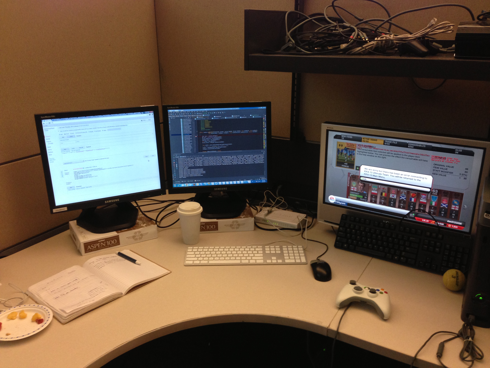
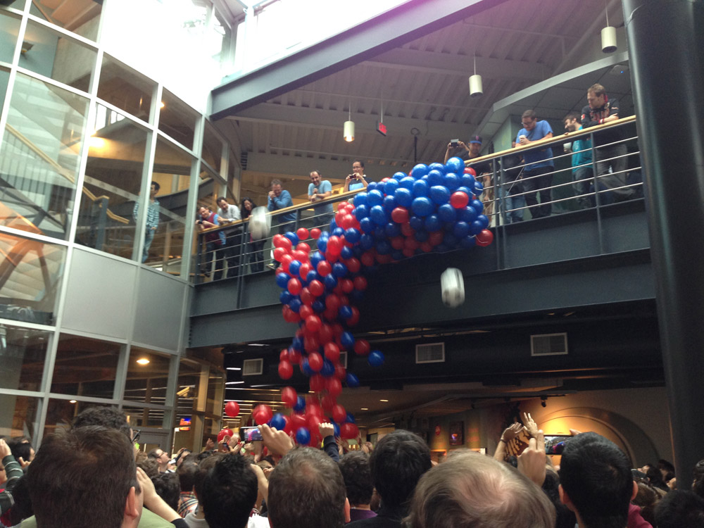
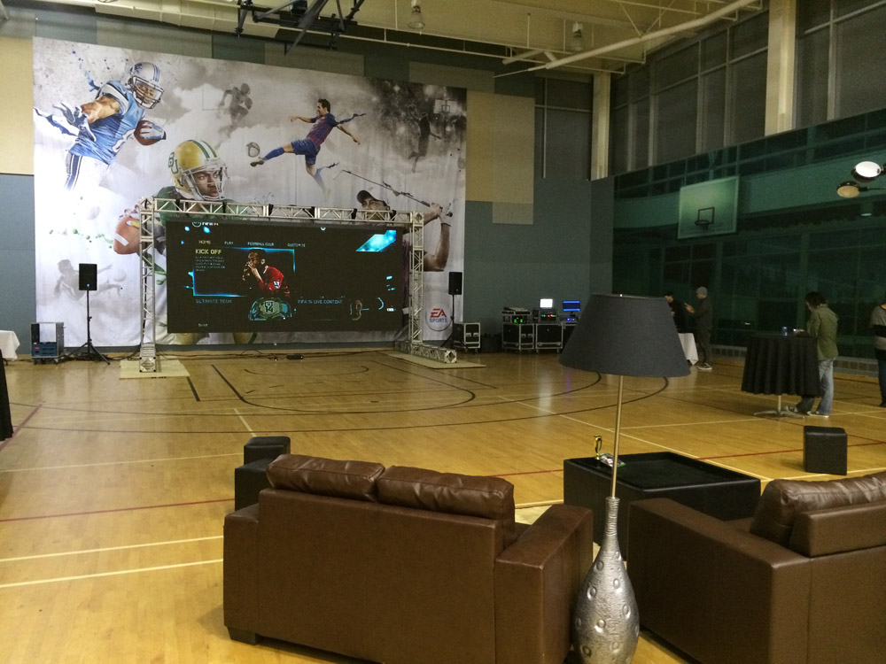
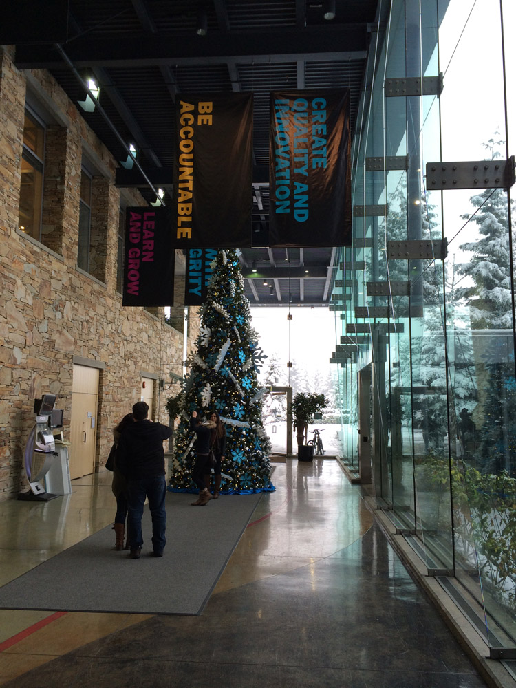
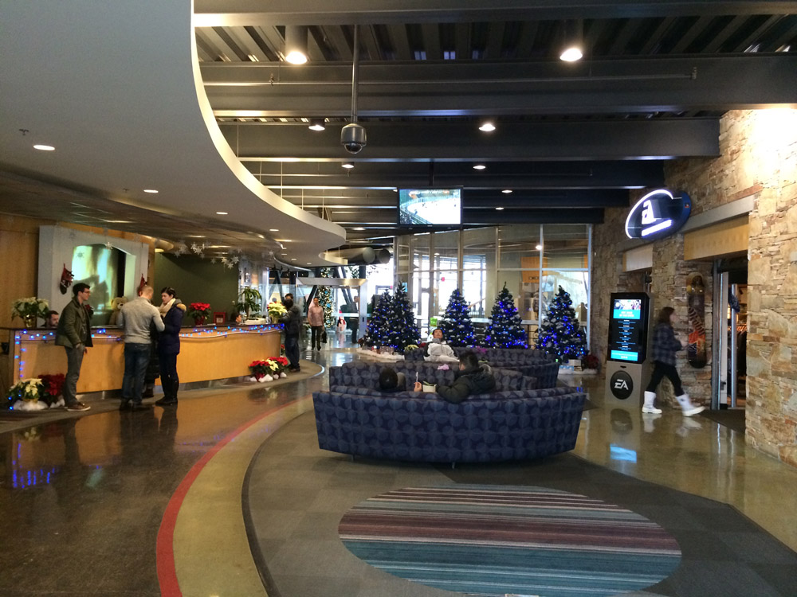
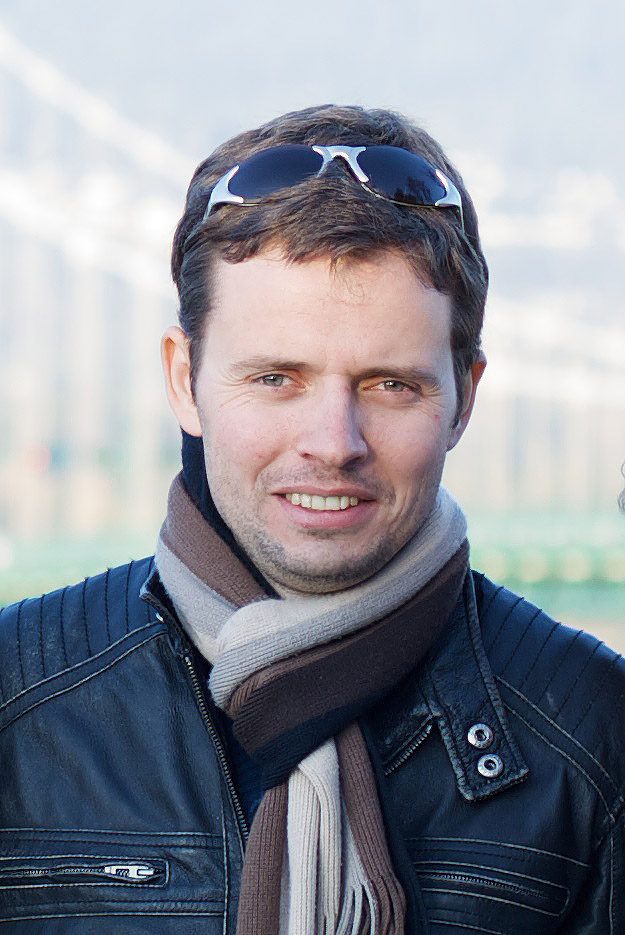

# Данил Глиненко: наши люди в Electronic Arts

Дата создания: 2013-12-23

Автор: ngrebenshikov

Теги: Личности,Эмигранты,Выпускники ИИТ,Программирование

 

 

 

 

 

 Этим топиком я хотел бы открыть, надеюсь, цикл с наиболее заметными (на мой взгляд) абаканскими программистами.   
  
Сегодня я хотел бы представить Данила Глиненко. Я знаю Данила с детства. Мы жили в одном дворе, учились в одном классе в школе и в одной группе в университете. Еще без него Ланит-Терком не появился бы в Абакане.  
  
Я задал ему несколько вопросов о программировании и не только.

#### Рождение интереса к программированию
  
**— Данил, расскажи, где ты родился.**  
— Родился я в Абакане. Прожил там 22 года и уехал в Петербург, потом Канаду.  
  
**—Как ты пришел к программированию? Какой был у тебя первый компьютер? О чем была первая программа?**  
— Наверное, так получилось. Были конечно же предпосылки в виде [ЭВМ БК 0011](http://ru.wikipedia.org/wiki/%D0%91%D0%9A_(%D1%81%D0%B5%D0%BC%D0%B5%D0%B9%D1%81%D1%82%D0%B2%D0%BE_%D0%BA%D0%BE%D0%BC%D0%BF%D1%8C%D1%8E%D1%82%D0%B5%D1%80%D0%BE%D0%B2)), которую купил мой старший брат в начале 90х. Или IBM PC 8086, которую я использовал время от времени, имея связи с компанией Комлинк. Думаю, повлиял и кружок программирования, на который мы записались с друзьями, чтобы не ходить на УПК по электротехнике. С началом 90х в Россию стали попадать компьютеры из-за рубежа и нас, как молодое поколение, это не могло не интересовать. Наверное оттуда и пошел интерес к программированию.  
  
По началу компьютер использовался для игр конечно же! Что еще интересует подростка в 10-12 лет? Потом была написана первая программа:  

```
10 PRINT "Hello"
20 GOTO 10
```
  
  
**— А когда она была написана?**  
— Ой! С датами у меня всегда было не очень.  
  

#### Образование
  
**— Расскажи, пожалуйста, где ты учился, и почему именно там?**  
Учился в Абакане в ХГУ (ИИиТ). Как-то не очень в то время было с деньгами, и вопрос поехать куда-то учиться не рассматривался. Кроме этого, очень много моих друзей одноклассников поступали в ХГУ. Так что это решилось само собой.  
  
**— Это был осознанный выбор?**  
— Да.  
  
**— Как проходила учеба? Что было самым запоминающимся?**  
— Учеба проходила легко. Сейчас вспоминая, мне кажется, мы особенно ничего не делали после 3го курса. Т.е. мы конечно же ходили на пары, но нас особо не напрягали. Я с 3го курса начал подрабатывать, и времени хватало на то и другое.  
Самым запоминающимся был, наверное, 1ый курс матанализа. Ну и, конечно же, курс «архитектура 8086» или что-то подобное, который мы успешно всем потоком провалили. Раздолбаи.  
  
**— В чем были плюсы полученного образования? Какие были минусы?**  
— Плюс в том, что оно дало неплохой толчок и запас знаний для того, чтобы двигаться дальше и поступить в аспирантуру СПбГУ. Хоть это было и не легко. А минус — научная база могла бы быть и получше. Нехватка студенческих проектов и студ. практики. Нехватка специалистов, которые могли бы делиться опытом и примерами из реальной жизни.  
  
**— Как повлияло полученное образование на дальнейшую карьеру?**  
— Стал зарабатывать деньги программированием.  
  

#### Санкт-Петербург
  
**— Как и почему ты уехал из Абакана?**  
— Закончился выпускной, я получил диплом, и стало как-то пусто. Передо мной встал вопрос «Что дальше?». Знаешь, вот учишься ты 11 лет в школе, потом 5 лет в универе, и как-то даже вопроса не возникает что дальше. Ты точно знаешь, что тебе надо получить образование. Потому что родители на протяжении всей твой жизни тебе об этом напоминают. Потому что так положено. И вот тут все это закончилось с получением диплома. Дальше что?  
Я уже работал на протяжении лет трех, и я понимал, что если куда-то не двинуться, то все так и останется. А хотелось чего-то нового. Пара моих родственников учились в СПбГУ и рассказывали огромное количество историй из жизни. А тут еще встал вопрос с армией, и мои родители всячески пытались меня уговорить пойти отслужить 1 год в военной прокуратуре. Эта перспектива меня как-то совсем не радовала. Мне казалось, это будет пустой тратой времени. В общем, в этот момент цель была поставлена — поступить в аспирантуру СПбГУ.  
  
**— Чем отличается учеба в СпбГУ от ХГУ?**  
— Мне показалось — многим. Это мир возможностей. Это связи с зарубежными университетами и международными компаниями. Если в Абакане мне казалось, что Гугл или Майкрософт — это что-то недостижимое. То в СПбГУ приходили и те и другие рассказывать о себе и приглашать на работу. Это другой уровень преподавания. Это более углубленная программа. Это отношение профессоров к учебе. Это научная база в целом. Я смотрел вокруг и думал какие все умные. А некоторые девушки на мат-мехе могли дать фору молодым людям в программировании.  
  
**— Над чем ты работал в аспирантуре?**  
— Ой. Странная тема у меня была и не особо научная. Я как-то быстро понял, что вряд-ли у меня что-то с кандидатской выйдет. Я думаю, это случилось сразу после устройства на работу. Работа была куда как более интересна и сразу захватила все мое внимание. А про науку мне в свое время очень понравилась фраза из Бесов у Достоевского  
  

> «А между тем это был ведь человек умнейший и даровитейший, человек так-сказать даже науки, хотя впрочем в науке… ну, одним словом, в науке он сделал не так много и, кажется, совсем ничего.»

  
Вот это про меня. Первый год я ходил на все пары, на которые была возможность. Не только аспирантские, но и к четырех- пятикурсникам. Писал отчеты по моей диссертации, хотя, надо сказать, не очень она продвигалась. Научник особо тоже не возражал. А потом сразу я устроился работать и про диссер фактически забыл.  
  
**— Что дало тебе обучение в Питере? Где и кем ты работал в Петербурге?**  
— Я работал в компании [Ланит-Терком](http://www.lanit-tercom.ru), организованной профессором кафедры системного программирования [Тереховым](http://ru.wikipedia.org/wiki/%D0%A2%D0%B5%D1%80%D0%B5%D1%85%D0%BE%D0%B2,_%D0%90%D0%BD%D0%B4%D1%80%D0%B5%D0%B9_%D0%9D%D0%B8%D0%BA%D0%BE%D0%BB%D0%B0%D0%B5%D0%B2%D0%B8%D1%87). Спасибо, вам Андрей Николаевич, это были замечательные 5 лет учебы и работы. Он же являлся моим научным руководителем. Впрочем, он был научником у доброй половины всех аспирантов кафедры, а то и больше.  
Начал с программиста. Потом руководителем проекта. Потом руководителем отдела. На пике в нашем проекте было порядка 20 человек.  
  
**— Какие были самы интересные и запоминающиеся задачи?**  
— Один из проектов, над которым мы работали, был для стартап компании в кремниевой долине. Вот это проект был самым запоминающимся. А относительно задач, да много их было. Было интересно использовать новейшие, на тот момент, технологии.  
  
**— Какая была атмосфера в компании?**  
— В Ланит-Терком было просто волшебно. Видимо сказывалась близость к Универу. Очень дружный и сплоченный коллектив. К обеду народ приносил тортики. Вечером играли в пинг-понг. Да и так постоянно собирались на кухне пообсуждать что-нибудь. Начальство всегда поддерживало и позволяло экспериментировать. Самые положительные воспоминания у меня остались от работы там.  
  
**— От чего испытывал удовольствие?**  
— От возможности делать что-то такое, что может быть замечено большой аудиторией.  
  

#### Миграция vs удаленная работа
  
**— Как и почему уехал из России?**  
— Стало скучно. У меня был неоднократный опыт заграничных командировок, но мне хотелось пожить и поработать за рубежом. Особенно поработать. Мне хотелось окунуться в ту среду целиком. Наш проект в Ланит-Терком был аутсорсинговый, и мне казалось, будь я там — я смог бы большего достичь. Любопытство влекло меня.  
  
**— Нужно ли быть готовым переехать в другое место для хорошей работы или жизни?**  
— Не очень понимаю вопрос. Может, имеется ввиду: «Необходимо ли переезжать для хорошей работы и жизни?» Нет. Такой необходимости нет. Каждый сам решает, что такое хорошая жизнь и хорошая работа. Жизнь ровно такая, какой мы сами для себя ее делаем. Кому-то нравится двор мести по утрам, гоняя голубей и встречая рассвет. И это замечательно. Эмиграция сама по себе не гарантирует лучшей жизни.  
  
**— Как ты относишься к удаленной работе?**  
— Положительно. Хоть с этим и связаны определенные трудности.  
  
**— Решает ли Интернет часть проблем с миграцией? Ведь можно работать удаленно?**  
— Для кого как. Если цель — поработать на зарубежный проект, то да, можно удаленно. Проблем миграции это не решает. Так же как Интернет не решает проблему медицины, образования и всего остального.  
  
**— А что он решает?**  
— Интернет помогает решить проблему коммуникации.  
  

#### Канада
  
**— Почему Канада?**  
— Бывший начальник пригласил поработать в команде, которую он возглавлял.  
  
**— Чем отличаются условия жизни и работы в Канаде от российских?**  
— Люди дружелюбнее. Толерантнее. Мне кажется, это очень важно. Работа, как оказалось, мало чем отличается. Ну, может, разнообразнее. Больше возможностей поучаствовать в чем-то интересном.  
  
**— Перечисли, пожалуйста, самых важных, интересных для тебя работодателей и по паре слов о них.**  
— Стартапы — всегда интересно. Ну или мне просто везло.  
  
**— Какие были самы интересные и запоминающиеся задачи?**  
— Очень интересно было писать [MMO Glitch](http://www.glitchthegame.com).  
  
**— Какая была атмосфера в компании?**  
— В стартапе все работают не покладая рук. В любое время, помногу. В EA было интересно посмотреть на процесс разработки и выпуска одной из известнейших игр на рынке.  
  
**— С кем приходилось работать.**  
— Было интересно поработать с людьми, которые написали очень популярный и широко известный сервис.  
  
**— От чего испытывал удовольствие?**  
— От нового опыта в основном. Будь-то это в повседневной жизни или по работе. Были и трудности, конечно. Куда без них.  
  

#### Electronic Arts
  
   
  
**— Я знаю, сейчас ты работаешь в EA. Расскажи, пожалуйста, об этом.**  
— Большая компания со своим кампусом. Не таким большим как Гугл, Майкрософт или Эппл, но тем не менее со своим спортзалом, футбольным полем, кафетерием и прочим. Интересно оформлен офис. Проходя по зданию, сразу можно заметить, какую игру разрабатывают на данном этаже. Очень много постеров и атрибутики, связанной с тем или иным продуктом. В целом офис оставляет очень положительные впечатления.  
  
**— Чем приходится заниматься?**  
— Разработкой серверной части для FIFA14.  
  

#### Собственные проекты
  
**— Есть ли у тебя какие-то собственные проекты?**  
— На данный момент собственных нет. Есть пара активных контрактов с заказчиком.  
  
**— Почему ты делал собственное ПО?**  
— Обычно от скуки. Если на работе ты не достаточно загружен, хочется чего-то еще. Остается энергия, которую хочется потратить на какой-нибудь pet project.  
  
**— Что тебе дало написание собственных программ?**  
— Новые знания.  
  

#### Программирование
  
   
  
**— Какая твоя любимая область в программировании?**  
— Нет таковой. Задачи интересные везде есть, особенно если это что-то новое что раньше не приходилось делать.  
  
**— Что любишь программировать?**  
— Если попрограммировать для души, то я бы взялся за что-нибудь для мобильных платформ.  
  
**— Какой твой любимый язык программирования?**  
— У меня наверное нет любимого. Каждый язык хорош для определенной цели. Долгое время я программировал на Java. Да и до сих пор я в основном программирую на нем. Я знаю его слабые и сильные стороны. Я программирую на Objective-C и не чувствую какого-либо дискомфорта. Мне нравится Python, но у меня не было возможности написать что-то большое и коммерческое с его использованием. Мне кажется, после определенного времени с накоплением опыта уже не важно, на каком языке программировать. Если ты владеешь концепциями, то новый язык программирования осваивается за пару дней. Другое дело — фреймворки и SDK. Для того чтобы чувствовать себя комфортно программируя под определенную платформу, требуется гораздо больше времени.  
  
**— Каким должен быть современный программист?**  
— Должен уметь подать себя. Не только быть компетентным, но и уметь донести свою мысль, точку зрения.  
  
**— Что должен знать/уметь?**  
— Неплохо бы знать математику. Алгебру, геометрию. Для меня это было совсем не очевидно, когда я учился в универе. А теперь сожалею, что бОльшую часть всего этого я забыл. Не скажу, что это требуется часто, но если задача интересная и хочется сделать что-то нетривиальное, то это становится необходимо. Должен уметь общаться с людьми. Это одно из самых важных умений для программиста.  
  
**— В какую сторону движется программирование по твоему мнению? Как изменится работа программистов?**  
— Я не думаю, что она сильно изменится. Могут поменяться средства, а суть останется. Готовиться к тому, что те знания и навыки, которые есть сегодня могут потерять актуальность через 7-10 лет. Следовательно, надо постоянно совершенствоваться.  
  
**— Как нужно учиться программированию?**  
— Надо брать и что-то делать.  
  
**— Можно ли на программировании заработать много денег?**  
— Гейтс, Пейдж и Брин, Цукербкрг и др. Разве не пример?  
  
**— Как получать удовольствие от программирования?**  
— Никак! Ты либо получаешь, либо нет  
  
**— Что по-твоему значит быть настоящим программистом?**  
— Надо отрастить бороду. Написать собственную ОС ну или, на крайний случай, язык программирования.  
  
Спасибо, Данил, за беседу, за то что выделил время, чтобы ответить на мои вопросы!