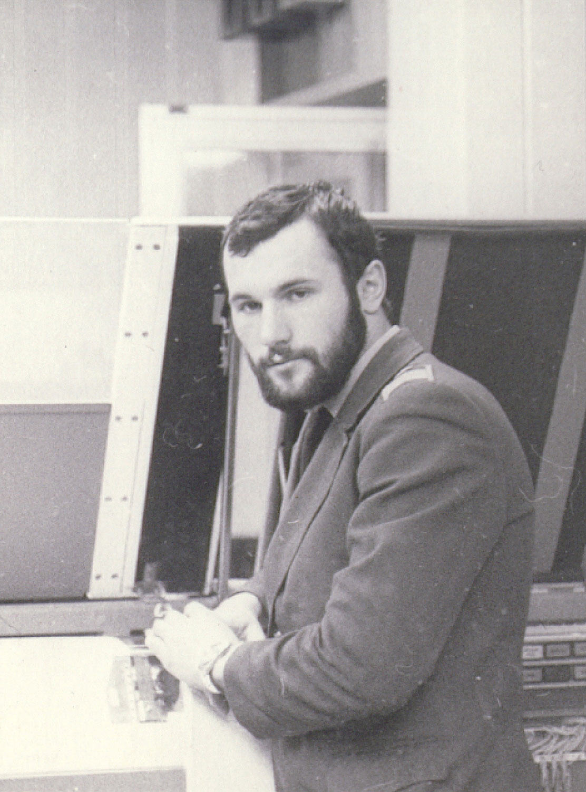

# Андрей Владимирович Андреев: от Вагонмаша до Инфоцентра

Дата создания: 2014-01-11

Автор: ngrebenshikov

Теги: Личности,Инфоцентр

 

 

 

 Сегодня, я хочу, представить вашему вниманию интервью с моим бывшим боссом — Андреем Владимировичем Андреевым, директором ЗАО «Инфоцентр Плюс».

#### Становление
  
**По традиции хотелось бы начать с самого начала. Андрей Владимирович, расскажите, пожалуйста, где вы родились, в каких условиях проходило ваше детство. Как вы пришли к программированию? Что послужило толчком?**  
  
Родился я на крайнем севере, за полярным кругом. Место моего рождения называется фактория Новая, Хатангского района. Это на Таймыре. В паспорте место рождения записано: «фак. Новая». Программистскую братию такое сокращение очень забавляет. Фактория – это несколько домов(меньше десяти), один из которых школа-интернат для детей оленеводов, родители большую часть года находятся в тундре, пасут оленей. В этой школе-интернате работала моя матушка. Вот там меня и угораздило родиться  
  
К программированию пришел чисто случайно. Когда поступал в институт, я понятия не имел, что существует такая профессия. Ведь это было в 1976-м году. Толчком послужило то, что когда я подавал документы в приёмную комиссию РКИИГА (Рижского Краснознамённого института инженеров гражданской авиации) и написал заявление на механический факультет, то дядька в приёмной комиссии, посмотрев мои документы(дипломы всяческих математических олимпиад и т.п.), посоветовал переписать заявление на другой факультет. Объяснил он это доходчиво и просто: «У нас механиков называют «Слоны» и совсем не потому, что они большие и добрые…». Намёк я понял, а т.к. я собирался в лётчики, но не прошел медкомиссию, то на какой факультет поступать мне было почти без разницы. Я спросил: «На какой посоветуете?», дядька сказал, поступай на ФАВТ (факультет автоматики и вычислительной техники) с него, если захочешь, можешь перевестись на любой. Спасибо этому дядьке за этот совет.  
  
**Когда у вас появился доступ к компьютеру? Для чего он использовался? О чем была первая программа? Когда она была написана?**  
  
В то время, компьютер занимал помещение, размером со спортзал, и для того, чтобы он работал, нужен был штат сотрудников, человек в 15-20. Поэтому первый компьютер я увидел в институтском вычислительном центре.  
  
Тогда, как и сейчас, в институтах компьютеры использовались для того, чтобы студенты учились программировать. Первая программа была традиционная для первой программы. Она спрашивала: «Как тебя зовут ?» и после ввода печатала на консольной пишущей машинке «Привет, Вася!», например. К программированию нас допустили курсе на втором, то и написана она была году в 1977-м.  
  
**Как у вас проходила учеба в Риге? Что было самым запоминающимся? В чем были плюсы полученного образования? Какие были минусы?**  
  
Самым запоминающимся было естественно не программирование. Рига, Юрмала, общага, стройотряды, девчонки, спорт, ну и всё в этом плане.  
  
Плюсы в том, что мне повезло с преподавателями, среди которых, большинство были высокообразованные и интеллигентные люди.  
  
Минусы в том, что среди преподавателей попадались и такие, время на вынужденное общение с которыми можно было бы потратить с большей пользой. Однако, таких было меньшинство.  
  
**Как повлияло полученное образование на дальнейшую карьеру?**  
  
Полученное образование и определило мою дальнейшую карьеру.  
  

#### Карьера
  

##### Институт
  
**Сразу ли после института вы переехали в Абакан?**  
  
Сразу, после окончания института, я был приглашен на работу преподавателем, в институте. Младшая преподавательская должность называется ассистент. Вот после окончания я 3 года работал ассистентом на кафедре и многие из тех преподавателей, встречу с которыми я расцениваю, как основной плюс процесса обучения, стали моими коллегами, а некоторые и друзьями. Одновременно с преподавательской деятельностью, мы вели хоздоговорные НИР (научно исследовательские работы). В процессе этой работы я и приобрёл профессиональные навыки, как программист. Опять же благодаря тому, что рядом работали специалисты, у которых было чему научиться.  
  
**Над чем приходилось работать на кафедре? Какие были условия?**  
  
Задач было много, мы занимались работой совместно с ЦНИИ АСУ ГА в области авиационной безопасности, от задач обработки статистических данных до задач обработки полётной информации, той, которая пишется «черными ящиками». Наверное, самыми запоминающимися были задачи по обработке полётной информации, т.к. от самой что ни на есть простой программы, может зависеть будет ли обнаружена неисправность самолёта, а от этого зависит долетит ли он туда, куда должен.  
  
Атмосфера была замечательная. Все были молодые, весёлые, спортивные. Любили одно и то же – море, пиво, девчонок, спорт и конечно свою работу. Ведь проводить на работе по 18 часов и особо не уставать при этом, можно лишь, когда занимаешься любимым делом.   
  

##### Абакан
  
**Как получилось, что вы все-таки переехали в Абакан?**  
  
В Абакан переехал в 1984-м году. Причина типичная для тех времён – жилищный вопрос. В Риге при всех плюсах, перспектив на жильё никаких, а Абакан мой родной город, я в нём вырос, здесь родители.  
  
**Чем отличались условия жизни и работы в Абакане от общесоветских? Что удивило/удивляет в Абакане как положительно так и отрицательно?**  
  
От общесоветских ничем. Компания единомышленников такая же, режим работы тот же. Только в отличии от Риги, здесь была своя квартира, а в то время это было немаловажно.  
  
У меня на территории бывшего СССР два родных города, это Рига и Абакан. Ни здесь ни там меня ничего не удивляет потому, что я знаю и люблю эти два города. Удивляет тогда, когда происходит что-то неожиданное, а в этих случаях, если происходит что-то хорошее, я радуюсь, если происходит что-то не очень хорошее – огорчаюсь, но как-то удивлением эти чувства я бы не назвал.   
  
Считаю Абакан городом, где лично мне жить очень комфортно. И не только потому, что город этот какой-то супервыдающийся, хотя ответственно могу заявить: «Очень хороший город, наш Абакан», но в большей степени потому, что здесь живут мои родные и близкие мне люди, мои друзья, а это дорогого стоит.  
  

##### АбаканВагонмаш
  
**Расскажите, пожалуйста, о работе на Вагонмаше. Как вы туда попали?**  
  
Попал очень просто, приехал в Абакан, на АбаканВагонмаше, как раз, создавался вычислительный центр, готовилось помещение, размером со спортзал, для компьютера. В то время в Абакане было не так много мест работы для программиста.  
  
**Говорят там был очень сильный отдел автоматизации. Это правда?**  
  
Да, это правда. Только он туда не с луны свалился. Он там родился и вырос. А сильным стал потому, что было много работы по автоматизации, которую этот отдел автоматизации «работал» и в этом процессе набирался сил.  
  
Ведь как из хилых пацанов получаются здоровенные дядьки-качки. Приходят хилые пацаны в подвал-качалку и тягают железо с утра до вечера. Кто этим занимается самоотверженно и увлечённо, становятся сильными и статными, кто продолжает курить в подъездах, сидя на батарее – остаются хилыми.   
  
Так и во всём, чтобы стать сильным, нужно что-то делать для этого, чтобы стать очень сильным – делать нужно значительно больше, чем остальные.  
  
**Какие были самые интересные и запоминающиеся задачи?**  
  
Любая работа может быть интересной, если выполнять её творчески. Я знаю дворника, которому интересно работать дворником. И в том дворе, где он работал, это было видно не вооруженным глазом. Сейчас этот дворник работает на ОАО «Аян», будете мимо проезжать – обратите внимание.  
  
А наиболее значимой работой в то время я считаю переход на работу с СУБД. Тогда это была система [«ADABAS»](http://en.wikipedia.org/wiki/ADABAS).   
  
**Какая была атмосфера в компании?**  
  
Атмосфера была замечательная. Все были молодые, весёлые, спортивные. Любили одно и то же – озёра, тайгу, спорт и конечно свою работу. Ведь проводить на работе по 18 часов и особо не уставать при этом, можно лишь, когда занимаешься любимым делом.  
  

##### Инфоцентр
  
**Каким образом создавался Инфоцентр Плюс? Когда и при каких обстоятельства это происходило?**  
  
Началось всё в 1992 году (в прошлом веке). В стране началась перестройка, а в России традиционно началось «смутное время». Все начали что-то покупать-продавать, забыли о том, что и производить что-то не мешало бы, но производить это долго и хлопотно, а купить-продать, казалось быстро и просто. Вот в то время в КИВЦ «АбаканВагонСтрой» собралась команда ИТ-специалистов, которой хотелось заниматься тем, что они умеют и любят делать. Хотя и покупать-продавать тоже приходилось, иначе не выжить. Так появился «ИнфоЦентр».  
  
**Почему он был организован как ЗАО?**  
  
При создании, учредителями стали все сотрудники, которые на тот момент работали. ЗАО «Инфоцентр» это «народное предприятие», нет какого-то одного хозяина. При создании, акции распределялись по принципу, кто дольше и эффективнее работал, у того больше акций. Поэтому у каждого из самых крупных акционеров акций чуть больше 10%. ЗАО «Инфоцентр Плюс» создан в 1997 году по тому же принципу. «Инфоцентр Плюс» это фактически подразделение компании «ИнфоЦентр» занимающееся разработкой и внедрением программного обеспечения.  
  
**Какие цели и задачи вы ставили перед собой в момент создания? Что собирались разрабатывать?**  
  
Цели и задачи не изменились – работать и получать удовольствие от того, что ты делаешь, ну и желательно, чтобы за это ещё и платили. Получать удовольствие за свои деньги это довольно просто, были бы деньги, а получать удовольствие и ещё за это получать деньги – это более сложная задача. Но в том-то и прелесть нашей профессии, что это возможно. Для этого нужно понимать, какие проблемы возникают у наших потенциальных клиентов, и придумать, как эти проблемы можно решить с нашей помощью.  
  
На тот момент основной проблемой была автоматизация бухгалтерского учёта, поэтому мы начали разработку комплексной системы бухгалтерского учёта «Баланс+». С тех пор прошло уже 20 лет, а система «Баланс+» кое-где ещё работает до сих пор.   
  
**Еще один традиционный вопрос. Какие были/есть самые интересные и запоминающиеся задачи?**  
  
Задач было много и все они запоминающиеся и интересные. Только перечисление их займёт достаточно много времени. Упомяну только некоторые. Система «Фонд+» для фондов социального и медицинского страхования была внедрена и работала более 5 лет в Хакасии, Красноярском крае, Республике Калмыкия, Республике Горный Алтай. Системы управления технологическими процессами печи обжига «зеленых» анодов и «газоочистка» были внедрены на СААЗе и работали 24 часа в сутки.  
  

##### Москва
  
**Я знаю вы уезжали работать в Москву. Расскажите, пожалуйста, по какой причине?**  
  
Работа в Москве была вынужденной. Дело в том, что в то время мы разработали и внедрили автоматизированную систему оперативной отгрузки угля для ОАО «Сибирская угольная энергетическая компания» (ОАО СУЭК). Данные об отгрузках поступали в главный офис СУЭК в Москве с Сахалина, Владивостока, Читы, Иркутска, Красноярска, Хакасии, Инты, Воркуты, Ленинск-Кузнецка. Для СУЭКа от этого зависело качество управления бизнесом. Для координации этого процесса мне предложили поработать в главном офисе СУЭК в Москве.  
  
**В какой должности приходилось работать? Какие задачи выполнять?**  
  
В СУЭК я был руководителем службы ИТ этой компании. Должность административная, поэтому в основном пришлось выполнять административные функции по координации взаимодействия подразделений и филиалов СУЭК в плане автоматизации процессов управления бизнесом. Опыт программиста-разработчика в этой работе крайне необходим, потому что управлять – это значит распределить задачи между исполнителями и координировать и контролировать их работу. Возможно, есть «менеджеры со знанием английского», которые могут управлять чем угодно, но как у них это получается, я не представляю. Ведь для того, чтобы поручить исполнителю что-то сделать, нужно представлять и масштаб работы и возможности исполнителя. Если поручить муравью передвинуть бревно, а слону собирать маковые зёрна, то оба уработаются вдребезги, а работа останется не сделанной.  
  
Такая административная работа нарушила гармонию. Работа перестала приносить удовольствие, хотя начала приносить значительно больше денег.   
  
**Почему вы вернулись в Абакан?**  
  
Вот поэтому и вернулся. Работая в СУЭКе, я вводил в курс дел по работе всех информационных систем своего заместителя и когда понял, что он уже может справиться самостоятельно, предложил руководству его кандидатуру на своё место. Руководство было несколько озадачено, но получив от меня заверения, что всё будет продолжать работать и предлагаемый кандидат справится, согласилось к большой радости предлагаемого кандидата. После этого наша система учёта оперативной отгрузки нормально работала ещё 5 лет, пока на смену ей не пришла одна из подсистем SAP.  
  

##### Баланс
  
**Не могу не спросить про Баланс Плюс, так как это визитная карточка Инфоцентра. Каким образом вам удалось создать приложение, которым стали пользоваться сотни предприятий?**  
  
Как я уже упоминал ранее, «Баланс+» это комплексная система бухгалтерского учёта. Для того, чтобы разрабатывать любую систему, в первую очередь нужно очень хорошо представлять ту предметную область, для которой она разрабатывается. Поэтому я сел за учебники по бухгалтерскому учёту и штудировал их до тех пор, пока не понял смысл и методы бухучёта. После этого я написал книжку «Азбука бухгалтерского учёта» в которой, страницах на 20-ти с картинками, изложил те основные принципы бухучета, которые нужно знать для того, чтобы заниматься разработкой по этой теме. Это избавило моих сотрудников от необходимости штудировать учебники по 500 страниц. Ведь разработчику важно знать не все существующие инструкции и различия, а основные принципы и сходства программируемых процессов. Тогда программы получаются универсальными и делают то, что должно.  
  
**Кстати, скажите, пожалуйста, сколько людей пользовалось Балансом в лучшие времена?**  
  
За всё время «Баланс+» был внедрён более чем на 1000 предприятий, значит людей, которые пользовались этой системой несколько тысяч, что-нибудь около десяти.   
  
**Раскажите, пожалуйста, как проходила разработка? Сколько людей участвовало в этом?**  
  
В системах семейства «Баланс+» есть две составляющие это платформа и прикладная часть. Основным разработчиком платформы был Игорь Шиндер – программист уникальных, выдающихся способностей. Таких программистов – один на 10000, я думаю. Прикладные системы разрабатывали многие, некоторые из разработчиков уже живут в других городах и государствах, а то, что они сделали, продолжает работать.  
  
**Каково текущее состояние Баланса? Можно ли говорить, что как платформы его уже нет?**  
  
Пока ещё есть. Т.к. системы продолжают эксплуатироваться, работы по поддержке постоянно ведутся. Платформа «Баланс+» рождённая в эпоху MsDos уже морально устарела, но продолжает жить. Мы разработали платформу под windows и есть ряд приложений на этой платформе, в том числе и «Баланс+», но оказалось, что пользователи настолько привыкли к старому «Баланс+», что не хотят ничего другого. И их можно понять. Система выполняет всё, что от неё требуется. Переход на новую систему неизбежно связан с какими-то трудностями, новым не привычным интерфейсом и т.п. А в результате получится то, что делается сейчас без всех этих проблем.  
  
Разработка и поддержка своей платформы – очень сложная и трудоёмкая задача. Требует больших ресурсов. Поэтому я принял решение использовать в качестве основной платформы разработки прикладных систем платформу 1С 8.2. Уже существует и успешно эксплуатируется конфигурация 1С 8.2. «Баланс+». В ней реализован весь функционал старого «Баланс+», но не просто тупо скопирован, а разработан с учётом 20-летнего опыта эксплуатации. Ведь за эти 20 лет мы уже знаем как не нужно было делать и как нужно.  
  
**Расскажите, пожалуйста, какие возникали/возникают проблемы в работе?**  
  
Малое количество часов в сутках.  
  
**От чего вы испытываете удовольствие?**  
  
От жизни в целом и от того, что всё, что должно получиться – получается.  
  
**Как вы относитесь к конкурентам?**  
  
По-разному. Если конкурент профессионал и высоких моральных качеств, то при встрече искренне жму ему руку и искренне желаю удачи. Но бывают случаи отсутствия этих достоинств. Отсутствие профессионализма – дело наживное, с моральными качествами хуже.  
  
Приведу пример, не буду называть фирму, но думаю, многие поймут, о ком идёт речь. К нашим клиентам стали поступать звонки от конкурента. Звонивший сообщал, что «Инфоцентр» прекращает своё существование, закрывается и что эти сведения из очень проверенных и достоверных источников. Естественно, клиенты запаниковали, ко-то начал звонить нам, кто-то постеснялся, ведь информация «из очень проверенных и достоверных источников».  
  
Может на каких-нибудь курсах современного менеджмента такие методы рекомендуются, как весьма эффективные, но в русском обществе издавна существуют такие понятия, как «рукопожатен» и «не рукопожатен». В 19-м веке на то, чтобы заработать какое-то количество денег, но при этом стать не рукопожатным, решился бы далеко не каждый. Сейчас век 21-й количество готовых заработать любой ценой увеличилось, но для меня эти понятия всё ещё имеют большое значение. Сейчас многие понятия изменяются, на мой взгляд, в худшую сторону. Есть такой смешной анекдот: «Если ты нагадил под дверью, позвонил и убежал, то это инсталляция. Если ты позвонил и сел гадить под дверью – это перформанс». Можно, конечно, процесс гаженья под дверью представить, как вид современного искусства, но для меня, пакость это, да и только.   
  

#### Программирование
  
**В данный момент вы занимаете управляющую должность. Удается ли вам время от времени что-либо программировать?**  
  
Сейчас я «играющий тренер» писать код приходится только в крайних случаях, когда нужно сделать что-то срочно и написать самому получается значительно быстрее, чем сформулировать задание для кого-то.  
  
Основное время у меня сейчас уходит не на программирование, а на проектирование систем. Разница примерно такая же, как разница в работе архитектора и строителя. И зависимость результата от работы причастных примерно такая же. Если архитектор – Растрелли, а строители – косорукие, то шедевр маловероятен. Поэтому программисты у нас не «косорукие».  
  
**Какая ваша любимая область программирования?**  
  
Лично я люблю разрабатывать прикладные системы. Мне нравится, когда люди пользуются тем, что сделано и это облегчает им жизнь. А если благодаря нашей работе, они ещё и начинают получать удовольствие от своей работы, или хотя-бы снижается уровень их отвращения к тому, что приходится делать, то это особенно приятно.  
  
**Какой ваш любимый язык программирования? Почему?**  
  
Любимый язык программирования – русский. Ведь программы создаются в голове, а думаю я на русском языке. А на каком алгоритмическом языке потом всё это записать это уже дело техники и опыта.  
  
**Каким должен быть современный программист?**  
  
Программисты бывают разные, прикладные, системные, WEB-программисты, но всем в первую очередь нужно знать ту предметную область, для которой они разрабатывают программы. Ну а остальные навыки профессионала уже должны быть по определению. Ведь если пловец выходит на соревнование, то умение плавать предполагается.  
  
Программист должен уметь думать. Качество программиста определяется примерно так же, как и качество шахматиста, на сколько ходов вперёд он может думать. Если программист думает только про тот фрагмент кода, который пишет в настоящий момент, то программист так себе – средненький. Если в процессе программирования он думает про то, как функция, которую он пишет, будет работать в системе, то это уже хороший программист. И чем глубже уровень такого анализа – тем круче программист.  
  
**Как вы думаете, в какую сторону движется программирование? Как изменится работа программистов?**  
  
Думаю и вижу, что движется всё к уменьшению рутинной работы. Тупого кодирования всё меньше, больше времени можно и нужно уделять качеству проектирования.  
  
Нужно тренировать голову. Учиться думать на несколько ходов вперёд.  
  
**Как нужно учиться программированию? Как вы учились?**  
  
Способность к программированию это как музыкальный слух. Или он есть или его нет. Ещё очень важен тип личности того, кто собирается стать программистом. Если представить личность человека как геометрическую фигуру, то идеал для потенциального программиста – треугольник, вершиной вверх. Должна быть острая голова и тупая задница. Любые другие комбинации менее подходят. Треугольник вершиной вниз не подходит абсолютно.  
  
В моём случае, наверное, тип личности совпал со случайно выбранной профессией – повезло.  
  
**Можно ли на программировании заработать много денег?**  
  
Богат не тот человек, у кого много денег, а тот – кому хватает. Заработать, чтобы хватало можно. Заработать много на программировании тоже можно, но одни должны программировать, а другие должны заниматься зарабатыванием на этом денег. Если те другие, не возомнят, что деньги зарабатывают именно они, то получится Apple или Microsoft. В компании 1С «небожителями» считаются разработчики платформы. Это там самые уважаемые люди. Думаю поэтому 1С и стала тем, чем является.  
  
**Как получать удовольствие от программирования?**  
  
Всё просто — любить нужно это дело. И ещё, удовольствие доставляет то дело, которое хорошо умеешь делать. У меня есть знакомый, он ремонтирует квартиры — суперпрофессионал. Он мне говорил, что ему нравится ремонтировать квартиры. Думаю, он стал суперпрофессионалом именно потому, что ему нравится ремонтировать квартиры.  
  
**Что, по-вашему, значит быть настоящим программистом?**  
  
Главное в жизни быть настоящим Человеком. Если программист постоянно думает не о том насколько он «крут», а о тех, для кого он пишет программы, то рано или поздно он станет настоящим программистом, при наличии способностей, конечно.  
  
**Спасибо, Андрей Владимирович, за беседу, за то что выделили время, чтобы ответить на мои вопросы!** 