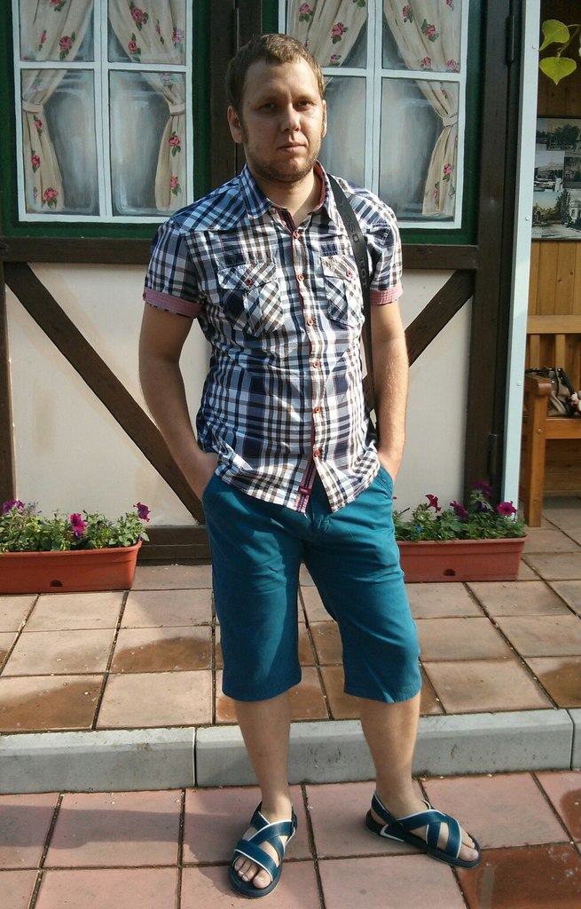

# Валерий Шибанов: фрилансер из Абакана

Дата создания: 2014-01-20

Автор: ngrebenshikov

Теги: Личности,Фриланс

 

 

 В предыдущих двух интервью я беседовал с [наемным программистом](http://lambda-calculus.ru/blog/persons/12.html) и [программистом, который стал учредителем компании](http://lambda-calculus.ru/blog/persons/17.html). Сегодня мне хотелось бы обсудить волнующие меня вопросы с программистом-фрилансером. Из мне известных программистов-фрилансеров Абакана наиболее заметным является [Валерий Шибанов](http://shibanov.com).

#### Становление
  
**Валерий, расскажи, пожалуйста, где ты родился и как прошло твое детство.**  
  
Родился и вырос я в Абакане, к слову, дальше Красноярска я нигде не был по сей день. Вырос в крепкой, благополучной семье. Детство было, наверное, как и у всех: садик, школа.  
  
**Каким образом ты пришел к программированию. Как у тебя появился первый компьютер и для чего он использовался?**  
  
Первый компьютер у меня был ZX Spectrum, появился он у меня лет в 11, хотя на тот момент уже Pentium III был в магазинах. Этот спектрум вместе с книжкой по нему выменял на что-то у одноклассника. Вот тогда я и познакомился с программированием. Писал, помнится, пианино, какую-то рисовалку, простенькие игры. Записывал всё это дело, естественно, на кассеты. Вот это первые мои программы, которые до сего времени не сохранились по понятным причинам :)  
  
Ну а первый более-менее нормальный компьютер у меня появился двумя годами позже. Это был первый пентиум с частотой процессора 200 MHz и оперативой на 32 мегабайта, винчестер на 600 мегабайт. Этот винт у меня до сих пор где-то лежит. У родителей денег было не так много, чтобы купить современную машину, поэтому я довольствовался тем, что было. Монитор, кстати, был адовый: от него жутко болели глаза и он периодически зеленел. Последнюю проблему я устранил сам, разобрав и спаяв отходящий на плате контакт.  
  
Поскольку играть на нём во что-то кроме старкрафта было невозможно, то я развлекался переустановкой винды, установкой различного софта, всякими экспериментами. Потом уже установил Borland C++ Builder 4, купил книжку по C и C++, ну и с тех пор начал активно изучать программирование. Всего, что тогда писал, не могу вспомнить, но помню, что писал арканойд, прогу для шифрования файлов.  
  
Как-то так получилось, что программирование стало моим самым интересным занятием в жизни. Я всё своё свободное время сидел за компьютером в ущерб еде и сну.  
  
**Валерий, расскажи, пожалуйста, где ты учился. Почему именно там и был ли это осознанный выбор?**  
  
Я никогда не любил ни детсад, ни школу. Школу, конечно, особенно. Учёба никогда не доставляла мне удовольствия, не потому, что я не люблю учиться, а потому, что я не люблю когда меня учат. Я сам мог взять учебник физики и изучить всё, что в нём написано за несколько дней, но сидеть учить эту же самую физику на уроках для меня было невыносимо. Я не любил литературу тогда, хотя сейчас довольно много и с интересом читаю именно художественную литературу. Самым ненавистным предметом была химия. Если неорганику я ещё как-то понимал, то органика выносила мне мозг и я чуть было не ушёл из школы с тройкой по химии )  
  
Кроме того, стоит рассказать о том, что я всегда стремился побыстрее стать взрослым, независимым. Поэтому, ещё учась в школе, я успел поработать дизайнером в ООО «Шелкография», любыми способами старался заработать денег. А до этого я чем только не пытался заработать: на каникулах продавал с лотка куриные яйца, семечки, даже на рынке газеты продавал. Когда появился компьютер, зарабатывал набором текстов. Школа очень сильно мешала развиваться именно в плане увеличения заработка, так как требовала много времени, да и тот же набор текстов школьнику как-то не очень хотели доверять, студент — другое дело.  
  
Собственно, в 9 классе, когда у меня появилась возможность уйти получать среднее-специальное образование вместо того, чтобы протирать штаны в 10 и 11 классах, я этой возможность незамедлительно воспользовался. Тем более, что в педколледже тогда как-раз открылся набор на специальность «ПОВТиАС». Тогда я поступил на бесплатное одновременно и в педколледж и в политтехнический колледж, но выбрал педколледж по той простой причине, что он находился всего-лишь в 50 метрах от моего дома.  
  
И вот с этого момента все мои отношения с системой образования контролировались исключительно мной, а не родителями.  
  
**Как проходила учеба? Что было самым запоминающимся?**  
  
Запомнилось так много всего, так много хороших воспоминаний у меня об учёбе в колледже, что я не могу выделить что-то конкретное. Я без сомнения могу назвать время, когда я там учился, самым весёлым и счастливым временем в моей жизни.  
  
Впрочем, я могу назвать одно из самых запомнившихся событий — получение премии мэра за успехи в учёбе.  
  
**В чем были плюсы и минусы полученного образования?**  
  
Учёба в колледже предоставила для меня очень плодотворную почву для становления меня как профессионала. Кроме того, что у меня появилось больше свободного времени для программирования, у меня так же и появилась возможность наконец-то использовать результаты моего труда. Я писал курсовые, делал доклады, участвовал в конкурсах, участвовал в различных научных конференциях. В общем, я занимался тем, что мне нравилось. Отдельно хочется отметить, что в колледже я получил и неслабо прокачал навык выступления перед аудиторией.  
  
Для меня минусов не было никаких, правда. Хотя мои одногруппники, в большинстве, не были довольны полученным образованием.  
  
**Как повлияло полученное образование на дальнейшую карьеру?**  
  
Как я рассказал, во время обучения в колледже я стал, собственно, профессионалом. Причём, уже на 4-м курсе обучения я нашёл хорошую работу, на которой я участвовал в довольно серьёзной коммерческой разработке.  
  
Если же говорить про сам диплом, то у меня до сих пор его никто не требовал :) Более того, спросить меня про образование на собеседовании — это значит оскорбить меня. В таких случаях я собеседование заканчиваю, поскольку искренне считаю, что программирование — это не та специальность, в которой диплом может хоть что-то сказать о профессиональных качествах его владельца. Во всяком случае в России ) И, если работодатель этого не понимает, то нам с ним сразу же не по пути. Более того, когда я сам принимал на работу программистов, я вывел закономерность: если у человека диплом красный, то, с большой долей вероятности, в разработке с этого человека будет толку мало.  
  
**Я знаю, что ты бросил высшее образование. Расскажи, пожалуйста, почему ты это сделал? Не жалеешь?**  
  
После окончания колледжа я поступил сразу на второй курс ИИТа на бесплатное место. Проучился три месяца. Сидя на парах, я не раз себя ловил на мысли, что, поступив на ИИТ, я сделал шаг назад. У меня стало меньше времени на работу, на лекциях мне пришлось слушать то, что я итак уже знаю, либо то, что мне никогда не пригодится. В общем, осознав до конца, что в ХГУ я зря трачу своё драгоценное время, я отчислился.  
  
Не жалею об этом ничуть. Всё, что мне нужно знать по работе, я знаю, а, что не знаю, могу без проблем узнать самостоятельно. Ну а о необходимости диплома я уже сказал.  
  

#### Карьера
  
**Расскажи, пожалуйста, как ты начал работать. Куда ты устроился первый раз.**  
  
Первая моя работа программистом — это Авансет. Нашёл вакансию по объявлению, после нескольких собеседований меня взяли на работу. Мне тогда было 18 лет.  
  

##### Авансет
  
**Расскажи, пожалуйста, о работе в Авансете.**  
  
В первый мой приход в Авансет я участвовал в разработке десктопного решения для проведения экзаменов. Это был очень хороший опыт, который прилично поднял мой профессиональный уровень.  
  
А когда пришёл туда работать во второй раз, занимался разработкой аналогичного решения, но уже для веба.  
  
**Почему однажды уволившись ты вернулся туда еще раз?**  
  
Первое увольнение из Авансета было связано, по-сути, с сокращением штатов. Это был, к слову, первый и последний раз, когда меня вообще откуда-то уволили не по моему желанию :)  
  
А второй раз, спустя 5 лет, я снова устроился в Авансет. Устроился потому, что на тот момент закончил работу в очередном проекте и потому, что знал насколько комфортно работать в этой компании. Ну и получилось так, что у ребят была подходящая для меня вакансия.  
  
Во второй раз я отработал год, до сих пор с теплом вспоминаю это время. Было весело, интересно, была хорошая зарплата. Но под конец я начал чувствовать, что топчусь на месте в профессиональном плане, поэтому и уволился. Я вообще считаю, что программисту, дабы не заплывать жиром и расти, нужно периодически менять места работы. По себе скажу, что новая работа даёт хороший «пинок» в творческом плане — хочется развиваться, узнавать новое.  
  

##### Собственные проекты
  
**На мой взгляд одним из запоминающихся проектов, в разработке которых ты принимал участие был [Хрясь](http://web.archive.org/web/20061004075438/http://khrs.ru/). Расскажи, пожалуйста, про него. Примечание: возможно по ссылке версия сайта, которую не разрабатывал Валерий.**  
  
Когда я присоединился к команде «Медиакухни», которая занималась развитием Хряся, он уже был запущен, так что моя роль в нём не очень большая. Скажу только, что я писал для Хряся новости и статьи и это был хороший журналистский опыт. С тех пор журналистика мне очень приглянулась, если бы в ней можно было зарабатывать хотя бы половину того, что я зарабатываю на разработке, глядишь, стал бы журналистом.  
  
**Каковы были причины создания?**  
  
Думаю, как у большинства проектов в интернете, причиной создания Хряся стал интерес к самому проекту. Конечно, финансовую составляющую нельзя исключать, но главное — это интерес.  
  
**Были ли какие-то интересные истории связанные с Хрясем?**  
  
Навалом, но это такие локальные мемы, что их и рассказывать долго и врядли кому-то они будут особо интересны.  
  
**Почему прекратили работу над ним?**  
  
В силу ряда причин «Медиакухня» развалилась и никому не интересно стало заниматься Хрясем.  
  
**Расскажи, пожалуйста, про Хороший сайт. Для чего он был нужен?**  
  
После развала Медиакухни мы с [Фостером](http://i-foster.com/) решили продолжить дело сайтостроительства в Хакасии, так вот и появилась студия Хороший сайт.  
  
Отвечая на вопрос: для заработка денег.  
  
**Какого плана работы ты делай под вывеской хорошего сайта?**  
  
Да любые, но, правда в том, что мы сделали всего несколько работ. Хороший сайт был создан в разгар кризиса, поэтому заказчиков на сайты было крайне сложно найти. В этом и причина закрытия этого проекта.  
  
**Большая ли у вас была команда?**  
  
«Отец, слышишь, рубит, а я отвожу» — вот такой величины у нас была команда :) Два человека, включая меня :)  
  
**Существует ли он до сих пор?**  
  
Только в виде архива .tar.gz )  
  
**Почему ты стал делать собственное ПО?**  
  
У меня были идеи разработать своё коммерческое ПО и продавать его потом. В Медиакухне, например, я работал над аналогом 2gis, тогда это могло быть актуально. Но, не хватило запала, под конец разработки появилась стойкая уверенность в том, что не будет спроса на продукт, поэтому разработка заглохла.  
  
Так сложилось, что из десктопного ничего именно своего у меня так и не появилось. Во-многом благодаря тому, что, не успев созреть для какого-то большого десктопного проекта, я начал работать с вебом и на десктоп как-то забил.  
  
**Что тебе дало написание собственных программ?**  
  
Под программами будем понимать так же и веб-проекты.  
  
Для меня разработка «для себя» всегда была, в основном, развлечением. Такого драйва и такой скорости разработки как тогда, когда ты пишешь что-то для себя, получить в других условиях сложно ) Иногда мои проекты даже приносят деньги, например приложение для ВК «Бесплатная отправка СМС».  
Был проект «Всем по 10», в котором я пытался окучить рынок смс-рекламы, даже на красноярском стартаппоинте вызвал какой-то интерес этим проектом, некоторое время общался с заинтересованными инвесторами.  
Но, при том, что всё было готово, у меня не хватило терпения для раскрутки. Нужно было ехать в Москву, с инвесторами разговаривать, проводить презентации, а на это не было денег. Тогда я довольно сильно потратился, плюс некоторое время сам ничего не зарабатывал, занимаясь лишь своим проектом. Одному что-то тянуть довольно сложно, нужен компаньон.  
  
Я отношусь к себе критично и понимаю, что мне не хватает часто уверенности в своих силах, чтобы дотянуть проект до конца, заставить его приносить деньги. В этом, к слову, не только моя проблема, но и многих разработчиков. Меня часто спрашивают мои клиенты «ты же сам можешь написать всё, что захочешь, почему не делаешь этого?» Не делаю потому, что не уверен в возникающих у меня идеях.  
  
Этой неуверенности во-многом поспособствовала работа фрилансером. Я участвовал в разработке сотни сайтов, а оставшихся в работе с тех пор наберётся десятка два, не больше. Т.е., фейловость стартапов в интернете, по моей оценке, примерно 80% )  
  

#### Фриланс
  
   
  
**Как ты пришел во фриланс?**  
  
Как раз, когда грянул кризис, а с «Хорошим сайтом» не задалось, тогда я и подался во фрилансеры исключительно с целью заработать на еду себе и жене.  
  
**Каковы особенности программистского фриланса в Абакане?**  
  
Особенностей, пожалуй что и нет. Фриланс — он везде одинаково. Единственное отличие — климат. Можно, например, в солнечном Тайланде программировать на берегу моря, попивая мохито. У нас такое не прокатит: моря нет, да и холодновато за бортом.  
  
**Много ли программистов-фрилансеров в Абакане?**  
  
Знаю только двух кроме себя.  
  
**Какие были самые интересные и запоминающиеся задачи?**  
  
Там был такой вал работы, что вся она довольно быстро превратилась в рутину. Попадалось, конечно, что-то интересное, но, в основном, рутина. А запомнились мне несколько задач по вёрстке от заказчика из Чикаго (который в США, а не который Черногорск), когда я за час работы получал по 100 баксов.  
  
**С кем приходилось работать?**  
  
С совершенно разным народом, разных политических взглядов (с одним клиентом либеральных взглядов всю ночь спорили однажды на тему патриотизма), разных вероисповеданий (однажды делал сайт на арабском языке чуваку из Турции, правоверному мусульманину, он мне жаловался, что его сайт хостеры постоянно закрывают, видя арабскую вязь и подозревая, что сайт экстремистский), разного гражданства, пола, возраста. Считаю, что работа фрилансером интересна, прежде всего, общением с совершенно разными людьми.  
  
**Какие возникали проблемы?**  
  
Однажды возникла проблема с тем, что я больше не могу жить с каким-попало графиком, мне надоело работать круглые сутки, что фриланс мне вообще надоел.  
  
**От чего испытывал удовольствие?**  
  
Первое время — дико тащился от свободы. Никому ничего не должен, просыпайся во сколько хочешь. Потом понял, что свободы то, на самом деле, особой нет.  
  
**Как семья относилась к твоему фрилансерству?**  
  
Жена относилась с пониманием, старалась меня не отвлекать. Когда появился ребёнок, в этом отношении стало сложнее — ребёнку ведь не объяснишь.  
  
**Может ли человек долгое время быть фрилансером?**  
  
Даже самые стойкие и убеждённые фрилансеры (коим я сам долгое время являлся) из моих знакомых нынче фрилансом не занимаются. Поэтому нет. Во фрилансе есть одна проблема: если ты хороший специалист, то у тебя много постоянных клиентов, которые тебе дают много работы. Пусть за эту работу хорошо платят, но рано или поздно постоянная занятость и осознание величины горы работы, которую ты тащишь постоянно у себя на плечах, так надоедают, что человек уходит из фриланса.  
  
Есть и другой пример: один мой знакомый, набрав достаточное количество деловых связей на поприще фриланса, переехал из своего города в Москву и основал там студию. Но, так или иначе, сам фриланс он бросил.  
  
**Собираешься ли ты уходить из фрилансерства? Если да, то куда и зачем?**  
  
Ну, я уже из него ушёл и довольно давно. Сейчас я работаю хоть и удалённо, но на фуллтайме. К слову, сейчас я руководитель отдела разработки в одной московской веб-студии. А с фрилансом покончено, спасибо ему за огромный опыт, но возвращаться я, по крайне мерей, не планирую.  
  

#### Миграция
  
**Я уверен, что у тебя были предложения уехать из Абакана. Почему остался?**  
  
Да, такие предложения были и во множестве. Более того, мне предлагали рабочую визу в США, правда с хреновым вознаграждением в $1000 в месяц. Я всегда отказывался.  
  
Во-первых, я люблю Абакан, Хакасию, Сибирь. Я очень привязан к дому, к моим знакомым, приятелям, друзьям. Мне здесь комфортно жить, здесь всё знакомое. Я не любитель переездов, более того, меня и путешествия как-то не привлекают. Я вот заграницей ни разу не был просто потому, что не хочется. Да и некогда, я лучше поработаю посижу :)  
  
Ну, а, во-вторых, есть возможность те же деньги зарабатывать удалённо, находясь в Абакане. Зачем же тогда переезжать в ту же тесную Москву из родных мест?  
  
Но, я скажу честно: если бы у меня не было возможности, находясь здесь, заниматься и зарабатывать моим любимым делом — программированием, я бы поехал. Потому что, для меня моя работа — это самое главное в жизни.  
  
**Как по-твоему в чем причины миграции вообще?**  
  
Основная причина, думаю, в том, что людям, переезжающим в другой город, хочется больше перспектив, возможностей. Другим же хочется больше возможностей в плане развлечений.  
  
Ну а в редких случаях, человек, будучи узким специалистом, переезжает потому, что в Абакане для него просто нет работы, а та, что есть, не подходит по зарплате.  
  
Но это не про программистов. Конечно, работу удалённой команды сложнее организовать, но это возможно и факт в том, что хороший разработчик вполне может зарабатывать приличные для своей профессии деньги, живя в своей любимой провинции.  
  
Я, работая удалённо, мог бы жить вообще где захочется. Иногда посещают мысли пожить пару месяцев в Тайланде, иной раз хочу съездить пожить в Белоруссии. Но, в итоге, я остаюсь здесь.  
  
**Нужно ли быть готовым переехать в другое место для хорошей работы или жизни?**  
  
Про работу — всё зависит от профессии. Специалистам, занятым в разработке ПО, дизайнерам, копирайтерам однозначно можно никуда не переезжать в поисках хорошей работы. Если говорить про жизнь, то в большом городе, конечно, больше возможностей развлечься. Впрочем, как я всегда говорю, «с деньгами везде хорошо, а без денег везде плохо».  
  
**Что есть лучшая жизнь, по-твоему?**  
  
Ну, долгое время я был уверен, что лучшая жизнь — это лучшая машина, лучшая квартира, наличие большого количества свободных финансов. Теперь у меня стали меняться взгляды на это. Любимая работа, любящие тебя люди рядом, друзья, финансовый достаток, возможность отдыхать как хочется, наличие хобби, здоровье близких — вот составляющие хорошей, счастливой жизни. К этому надо стремиться.  
  
**Как ты относишься к удаленной работе? Решает ли Интернет часть проблем с миграцией? Ведь можно работать удаленно?**  
  
Ну, было бы странно, если бы я относился к удалёнке плохо. Мне есть с чем сравнить, я работал в не таком уж маленьком коллективе разработчиков в офисе, но на удалёнке у меня стаж больше, конечно. В офисе интереснее работать, там больше живого общения. Удалёнка же хороша тем, что даёт больше свободы.  
  
И да, конечно, Интернет решает проблемы с миграцией, лишая необходимости выбирать между нормальной работой и проживанием на любимой земле.  
  
Тем более, сейчас уже есть нормальные инструменты для удалённой работы, так что эту самую работу можно организовать вполне полноценно.  
  
**Можно ли работать программистом в Абакане?**  
  
Можно, но выбор вакансий весьма и весьма невелик. Впрочем, квалифицированных программистов и того меньше.  
  
**К чему нужно буть готовым?**  
  
К тому, что платить будут не так, как в Москве. Ещё нужно быть готовым к тому, что уровень решаемых задач будет не всегда такой, как хотелось бы.  
  
**В каких областях сейчас требуются программисты у нас в городе?**  
  
В основном, web, хотя эта тенденция свойственна в принципе для всего рынка разработки. Для десктопа тоже пишут, но совсем мало. Есть ещё 1C, но мы же не будем называть это программированием? )  
  

#### Программирование
  
**Какая твоя любимая область?**  
  
Раньше был десктоп, потом стал веб. Не знаю, захотел бы я вернуться на десктоп, если бы поступило такое предложение. Наверное уже нет. Если говорить про веб, то мне, конечно, больше всего нравится работать над серверной частью, хотя и верстать люблю и js писать.  
  
**Какой твою любимый язык программирования и почему?**  
  
С++. Потому, что он абсолютно самодостаточен. Ну и красив, я люблю си-синтаксис. Ещё мне нравится C#, элегантный язык, в нём весьма приятное ООП.  
  
**Каким должен быть современный программист? Что должен знать и уметь?**  
  
Он должен уметь программировать. Быть в меру ленивым, чтобы писать эффективные алгоритмы. Должен сдержанно относиться к готовым решениям, соблюдая баланс. Должен уметь и любить учиться. Но, самое главное, он, конечно, должен быть истинным инженером, то есть, любить находить решения поставленных задач.  
  
**В какую сторону движется программирование по твоему мнению?**  
  
Я, наверное, слишком мало пожил, чтобы отвечать на такой вопрос. Пока могу отметить лишь одно — ООП стало не только трендом, но и требованием.  
  
**Как изменится работа программистов?**  
  
Ты про упрощение разработки? Не знаю как там на десктопе дела, впрочем там всегда был нормальный выбор простых, визуальных инструментов для разработки. В вебе не особо что-то изменилось: хорошую вёрстку визуальными средствами всё-равно не сделаешь, приходится писать руками. За счёт развития языков программирования серверную часть писать стало легче, но и требования к ней возрасли. Так что, проще особо не стало, но и сложнее тоже.  
  
С появлением полноценного искусственного интеллекта, а я верю, что он обязательно будет создан, потребность в программистах, думаю, отпадёт. Всё программирование будет сводиться к правильной постановке ТЗ.  
  
**К чему готовиться?**  
  
В любом случае, нам работы на наш век хватит. Я так думаю.  
  
**Как нужно учиться программированию? Как ты учился?**  
  
Не могу дать какой-то гайд по обучению программированию. Но, уверен, для начала нужно понять, интересно ли программирование. Часто видел «программистов», для которых программирование — это нагуглить решение, вставить его в код, чтобы лишь бы как-то работало. Мне сложно представить как можно от этого процесса какое-то хоть минимальное удовольствие получать и что такие люди делают в профессии. Для того, чтобы научиться программированию, нужно любить программирование, а не деньги, которые оно приносит.  
  
**Можно ли на программировании заработать много денег?**  
  
Можно заработать достаточно. Если хочется много денег, лучше каким-нибудь бизнесом заняться. Поставить себе задачу разбогатеть на программировании — это как поставить задачу разбогатеть на ведении блога — возможно, но не слишком вероятно.  
  
**Как получать удовольствие от программирования?**  
  
Нужно любить писать код. Секрет прост :)  
  
**Что по-твоему значит быть настоящим программистом?**  
  
То же, что и быть настоящим врачом, учителем, строителем — нужно любить свою работу, остальное само придёт.  
  
**Валерий, спасибо за уделенное время и содержательные ответы.** 