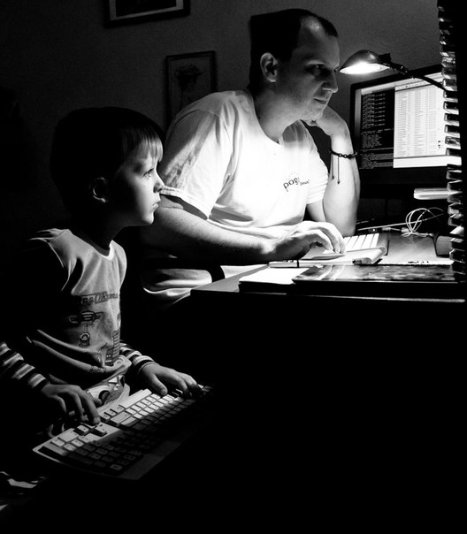
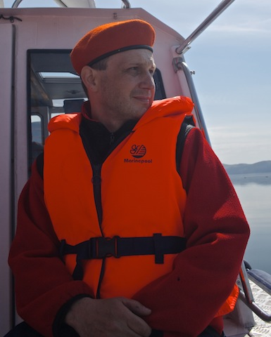

# Степан Курячий: программистский полиглот

Дата создания: 2014-01-27

Автор: ngrebenshikov

Теги: Личности,Степан Курячий

 

 Сегодня я хотел бы предложить вашему вниманию беседу со Степаном Курячим — программистом до мозга костей. Мое знакомство с ним началось, когда на одном из собраний абаканского компьютерного клуба под крышей Комлинка году так в 96-м его пригласили прочитать нам лецию о программировании. Он был моим преподавателем Лиспа в университете. Мы были коллегами в Инфоцентре. На мой взгляд Степана отличает то, что он всегда на переднем крае технологий. Когда я только краем уха узнавал о каком-то новом языке программирования или чем-то подобном, то Степан уже не один месяц на нем писал. 8)

#### Становление
  
**Степан, расскажи, пожалуйста, где ты родился и как прошло твое детство.**  
  
Родился в г. Абакане, 2 ноября 1973 года. Коренной абаканец :-) Детство прошло как у всех, бомбочки, футбол, коньки и пр. :-)  
  
**Как ты пришел к программированию?**  
  
Очень и очень странно, если честно. Поначалу я очень увлекался естественными науками, биологией, зоологией и пр. Как-то совершенно неожиданно увлекся радиоэлектроникой, увлеченно мастерил радиоприемники, разного рода электронные свистелки и прочее. Потом у моего друга, как-то совершенно случайно, появился компьютер ZX Spectrum. Кажется он его на что-то выменял, или недорого у кого-то купил, я уже не помню. В первую очередь нас интересовали конечно же игры, мы даже пытались переписываться (почтой СССР) с другими спектрумистами, пересылали друг-другу кассеты (именно кассеты, обычные магнитофонные кассеты) с играми и программами. Однажды, один из наших корреспондентов прислал нам пару новых игр и вложил в посылку несколько руководств к ZX Spectrum, часть на английском, часть на немецком. Одна из книжек на английском языке была посвящена языку программирования BASIC. И тут-то всё и завертелось. :)  
  
Как и многие мои сверстники, я активно посещал разного рода кружки. Один из кружков был посвящен программированию, два раза в неделю я имел возможность программировать на самом настоящем персональном компьютере! Это был стальной монстр отечественного производства, Искра-1256. Это чудовище позволяло писать программы на двух языках программирования: на Фортране и на русском диалекте языка программирования BASIC. В 1988 году я впервые познакомился с так называемым КУВТ и КУВТ2 «Ямаха» (Yamaha YIS-805/128R и YIS-503IIIR) В то время это был практически передовой край технологий: цифровой звук, цветное изображение, умопомрачительно красивые игры. Ну и конечно же возможность писать программы. По всему Абакану было несколько «точек», где были установлены «ямахи», нетрудно догадаться, что всё свободное время я проводил там :-) Опять таки, наипервейшим моим интересом были игры, коих для «ямах» было величайшее множество. Но программирование, что называется, не отпускало, все равно тянуло сделать что-то свое, интересное. Не могу сказать, что я делал что-то очень выдающееся в те времена. Однако мне довелось познакомиться с ассемблером Z80, с ямаховским диалектом языка BASIC, с языком программирования Си и (глубокий вдох) с языком программирования Лисп, в который я совершенно влюбился и который основательно «прошил» мне мозги и определил те направления и концепции, которых я придерживаюсь и которые использую сейчас.  
  
**Когда у тебя появился первый компьютер? Для чего он использовался? О чем была твоя первая программа?**  
  
Компьютер появился в 1991 году. IBM PC XT Proturbo, белоснежно-белой ирландской сборки, с чистейшим процессором Intel 8086, с флоппи-дисководом 5.25 дюймов и жестким диском на 20 мегабайт. Ах да, с адаптером CGA и цветным дисплеем. И аж с 640 килобайтами памяти.  
  
Его непосредственное назначение — делопроизводство. Я в то время подрабатывал, вводил какие-то данные, а в свободное от работы время пытался освоить новое железо. Опять-таки посредством игр. В это время я сильно увлекся ассемблером 8086, написал несколько трейнеров к играм.  
  
В 1993 году я устроился в фирму «Комлинк», в которой в то время работали такие IT-звезды, как Иван Носов, Евгений Ларионов, Андрей Файнштейн. Моя задача состояла в том, чтобы написать ни много ни мало, а парсер-фильтр лог-файлов, который бы позволял извлекать и накапливать статистику для биллинга в сети передачи данных Relcom. Программа была написана на Си и это было мое первое, серьезное задание, рассчитанное на применение в реальном бизнес-процессе. После этого было много различнейших утилит, программ и прочего, разной степени сложности и ответственности.  
  

#### Образование
  
**Расскажи, пожалуйста, где учился?**  
  
Как тот англичанин, который поднялся на холм, а спустился с горы, я поступил в АГПИ, а закончил ХГУ. По специальности я учитель физики и информатики. В прошлом году я закончил профессиональную переподготовку на специальность «Информационная безопасность». Учусь чему-либо я постоянно, стараюсь по возможности сдавать квалификационные тесты и экзамены.  
  
**Почему именно там?**  
  
В Абакане в то время это был единственный ВУЗ здесь, где в программе обучения была довольно внятная IT-составляющая. Поступить в другой ВУЗ, более отвечающий моим запросам, в другом городе у меня по разным причинам не получилось, поэтому я остался тут.  
  
**Это был осознанный выбор?**  
  
Не совсем так. Я просто пошел учиться туда, где есть компьютеры. Вряд ли я серьезно задумывался тогда о своем будущем. В то время вся страна жила сегодняшним днем и образование воспринималось скорее как нечто крайне желательное, но совсем не как дорога в будущее. Во всяком случае у меня :-)  
  
**Как проходила учеба?**  
  
От сессии до сессии — весело и непринужденно. Я учился и работал одновременно, поэтому скучные и неинтересные лекции я обычно прогуливал, а время проводил за рабочим компьютером. Я вообще в то время просто жил на работе, а на учебу обращал внимания от случая к случаю.  
  
**Что было самым запоминающимся?**  
  
Сам процесс. Студенчество — это такой этап в жизни, который с тобой навсегда.  
  
**В чем были плюсы полученного образования?**  
  
Полученные знания, за которые говорю отдельное спасибо своим преподавателям, которым удавалось увлечь за собой, несмотря на мое нежелание изучать некоторые предметы. Общий уровень образованности, ведь будущие учителя физики изучали не только точные науки (физика, математика, информатика), но и такие тонкие материи как философия, психология, педагогика.  
  
**Какие были минусы?**  
  
Учиться все-таки нужно было, на это подчас уходило много времени, которое я в принципе мог бы потратить на что-то другое. Минус, и самый главный, был в том, что я никак не связывал себя с учительской деятельностью.  
  
**Как повлияло полученное образование на дальнейшую карьеру?**  
  
С чисто практической стороны. Я долгое время вел различные компьютерные курсы и предметы. Умение правильно построить свою речь, написать план занятия, доходчиво донести подчас очень сложную информацию — все это я «унес» из своего ВУЗа и довольно эффективно использовал.  
  
**Работал ли во время учебы?**  
  
Обязательно. Все время, с 1991 по 1996 год. Для меня подработки в то время были единственной возможностью работать на компьютере. Ну и материальная сторона, особенная гордость за себя самого, что живешь не на деньги папы с мамой, а на свои кровные, заработанные.  
  

#### Карьера
  
**Расскажи, пожалуйста, как ты начал работать. Куда ты устроился первый раз.**  
  
АООТ «Комлинк» 1993 год. Инженер-программист  
  

##### Комлинк
  
**Насколько я знаю, ты был причастен к первому появлению Интернета в Абакане. Правда ли это?**  
  
Это так. Как я уже говорил, Комлинк в то время был одной из фирм, что называется, на рубеже технологий. Эта фирма «привела» в Абакан Relcom и Sprint. Эта самая грань между нашим настоящим и будущим четко обрисовывалась огромной спутниковой антенной, установленной рядом с офисом Комлинка. Для Абакана это было просто запредельно круто: двунаправленный спутниковый интернет-канал со скоростью 128 Кбит/с. Только вдумайтесь: 128 килобит двунаправленного спутникового интернета в 1996 году! :-)  
  
**Для чего тогда использовался интернет?**  
  
В общем, для того же что и сейчас — тупить в Сети. Ну а если без шуток, то в первую очередь наверное для электронной почты. В то время это было самое быстрое средство коммуникации. Ну и для серфинга, хотя, я вспоминаю, каким курьёзным был интернет в то время.  
  
**Были ли интересные истории связанные с интернетом?**  
  
Истории были скорее забавные. Оборудование было очень навороченное, специфическое, требующее подчас вовсе не поверхностных теоретических знаний. Я помню один случай, довольно забавный. По непонятной причине модуль слежения потерял спутник. Потерял совсем, напрочь. Как следствие, канал связи сначала начал деградировать, а потом пропал совсем. Дело было уже глубокой ночью, каждый из нас, кто иногда зависал на работе «в ночную смену», был занят каким-то своим делом. Внезапно раздается телефонный звонок, снимаем трубку, оказывается это представитель провайдера. После приветствия на нас обрушился поток такой специфической терминологии и информации, что мы иногда могли понимать только междометия и союзы и знакомые слова типа тангенса или какой-нибудь лямбды. Финал беседы: «Специалиста сейчас нет на месте, но он будет завтра утром и мы ему все передадим» Представитель облегченно вздохнул и голосом, преисполненным надежды, распрощался. Ржали мы долго, потому что передать даже сотую часть того, что нам сообщили было просто нереально.  
  

##### Инфоцентр
  
**Я знаю, что ты несколько лет работал в Инфоцентре. Какие были самы интересные и запоминающиеся задачи?**  
  
Abakan.ru (примечание автора: сейчас тот сайт можно найти по адресу — abakan-rf.ru)  
  
**Какая была атмосфера в компании?**  
  
Очень доброжелательная. Не могу не отметить высокий уровень коллег-специалистов, всегда приятно, когда тебя могут понять с полуслова и ты в состоянии общаться на равных. Удивительно было отметить, что общность взглядов и интересов простирается не только в профессиональной сфере, но и в вещах, далеких от программирования.  
  

##### Вольные хлеба
  
**Расскажи, пожалуйста, чем занимаешься сейчас.**  
  
Сейчас я — профессиональный разработчик ПО.  
  
В основном моя деятельность связана с созданием распределенных сетевых служб (SaaS, Software-as-a-Service) В своей работе я всегда стараюсь быть на передовом крае, поэтому я могу сказать, что каждая задача, которой я занимаюсь, по своему интересна и уж точно незабываема :-)  
  
**С кем приходится работать?**  
  
Российские и зарубежные партнеры.  
  
**Какие возникают проблемы?**  
  
Телематический способ общения очень часто приводит к взаимонепониманию. Бывает крайне трудно объяснить свою точку зрения, предложить свое решение, объяснить его преимущества. В итоге приходится скатываться в оффлайн и производить огромное количество схем, описаний, диаграмм, на что уходит иногда уйма полезного времени.  
  
**От чего испытываешь удовольствие?**  
  
«То самое чувство, когда видишь свой код в работе» :-) Пожалуй так.  
  
**Есть ли какие-то собственные проекты?**  
  
У меня есть несколько собственных проектов, но я никак не соберусь с духом выложить их в публичный доступ. Все время кажется, что это выглядит как-то кривовато, а вот то — вообще лишнее. Однако, в последнее время, я всё чаще встречаю у работодателей требование показать свои проекты, например на github или bitbucket, посмотреть на код вживую, оценить коммуникативность, способность решать проблемы. На мой взгляд, такие социальные сети, как github, очень ценный и полезный ресурс и каждый разработчик обязательно должен иметь там свой собственный проект.  
  
**Почему ты стал делать собственное ПО?**  
  
Во-первых — тренировка. Очень сложно найти такую задачу, которая бы одновременно покрывала «духовные» и материальные потребности. Как правило, мы выбираем материальную сторону, подчас в ущерб «духовной», делаем что-то нудное и неинтересное, но за большие деньги. Собственное ПО конечно может не дать ни копейки, однако оно может подарить нечто более значительное: бесценный опыт. Во-вторых, как я уже упоминал выше, серьезные работодатели очень интересуются активностью разработчика в программистских социальных сетях. Именно тут, собственная разработка может сыграть решающую роль при приеме на работу. Ну и в третьих, программирование — это в первую очередь творчество, а потом уже нудные бессонные ночи и беспросветные серые дни ;-)  
  
**Что тебе дало написание собственных программ?**  
  
Опыт. Возможность попробовать себя в чем-то другом. Я постоянно что-то делаю в нескольких различных экосистемах: Java, Python, Javascript (Node.JS + браузеры), C/C++ и Lisp. Сейчас в эту компанию добавился Erlang. Все вышеперечисленное реализует ту или иную методологию программирования. Например постоянно что-то делая в Java или Python, я постоянно нахожусь в курсе событий, касающихся этих экосистем и методологии объектно-ориентированного анализа или функционального программирования.  
  

#### Миграция
  
**Я уверен, что у тебя были предложения уехать из Абакана. Почему остался?**  
  
Я решил, что вполне могу уехать куда угодно и когда угодно. А рабочее место себе я смогу организовать везде, где есть доступ в Интернет.  
  
**Как по-твоему в чем причины миграции вообще?**  
  
Если честно, то я не задавался этим вопросом, возможно поиски лучшей работы, лучшей жизни, большой зарплаты и пр. Каждому из нас может «не сидеться» по разной причине :-)  
  
**Нужно ли быть готовым переехать в другое место для хорошей работы или жизни?**  
  
Мне кажется, что всегда нужно быть готовым ко всему :-) Быть легким на подъем. Может подвернуться отличная работа, многообещающий и интересный проект, да мало ли что?   
  
**Что есть лучшая жизнь, по-твоему?**  
  
Лично для меня — возможность путешествовать, заниматься любимым делом или даже делами, быть чем-то полезным не только себе и своей семье, но и всему человечеству. Не терять часов, дней, лет в пустоте. Самосовершенствоваться и способствовать совершенствованию окружающих.   
  
**Как ты относишься к удаленной работе?**  
  
Резко положительно. Я думаю, что интернет в данном контексте, решает проблему с работой. Но другие проблемы, увы, интернет решить не в силах.  
  

#### Программирование
  
**Какая твоя любимая область?**  
  
WEB, SaaS, распределенные сетевые службы.  
  
**Какой твою любимый язык программирования?**  
  
Таких языков у меня несколько, как я уже упоминал. Это Java, Python, Javascript, C, C++, Lisp и Erlang.  
  
**Почему?**  
  
Каждый вышеупомянутый язык реализует свою конкретную методологию программирования, либо является мульти-парадигменным. Моя задача: быть в курсе всего нового, знать и уметь применить нужный метод для наиболее эффективного решения задачи.  
  
**Каким должен быть современный программист?**  
  
Свободным от предрассудков. Полностью. Нет никаких превалирующих доктрин или универсальных таблеток знаний. Также не существует никаких табу. Нужно творить.  
  
**Что должен знать?**  
  
На мой взгляд, сейчас в информатику возвращаются очень многие идеи, которые положили на полку в 50-70 гг. Тогда они казались абсурдом, в виду невероятной ограниченности вычислительных мощностей, а сегодня, как говорят — «в тренде». Современному программисту нужно в принципе уметь анализировать и выбирать то решение, которое будет максимально эффективным. А уж языки программирования и среды разработки не подкачают :-)  
  
**В какую сторону движется программирование по твоему мнению?**  
  
На мой взгляд программирование уходит от императивного подхода и приходит к подходу декларативному. Компьютерам, оснащенным суперсовременным матобеспечением, сегодня гораздо проще описать задачу, чем делать ее подробнейший план (программу).  
  
**Как изменится работа программистов?**  
  
Сдвинется от «кодерства» к аналитике. Программисты будут вынуждены больше думать головой. :-)  
  
**К чему готовиться?**  
  
К появлению, точнее к возрождению, таких языков как Пролог. К дальнейшему развитию методологии декларативного, функционального и параллельного программирования. Языки типа Хаскелля и Эрланга станут доминирующими. Данные перестанут быть чем-то обособленным, типа RDBMS или NoSQL, но будут доступны непосредственно в самих языках в виде примитивов этих языков. Необходимость в специфических хранилищах данных отпадет, все будет храниться в облаках.  
  
**Как нужно учиться программированию?**  
  
Писать программы. И общаться с коллегами. Без шуток. Много читать, многому учиться. Забыть слова «да это не по мне», выучить девиз «я этому научусь». Я так и учился.  
  
**Можно ли на программировании заработать много денег?**  
  
Мне кажется, все зависит от того, чем ты занимаешься. Заработать можно ровно столько, сколько будет необходимо, но не более. Если этого достаточно и даже много — цель достигнута. На мой взгляд нужно расти. Вырасти из кодера в ведущего разработчика, затем в руководителя, затем в архитектора и т.д. и т.п. И наконец пожертвовать свой первый миллиард :)  
  
**Как получать удовольствие от программирования?**  
  
Никак. Этот процесс изначально должен доставлять удовольствие. Если нет, то скорее всего это не то, чем вам следует заниматься :-)  
  
**Что по-твоему значит быть настоящим программистом?**  
  
Быть активным творцом. :-)  
  
**Спасибо, Степан, за содержательную беседу.** 