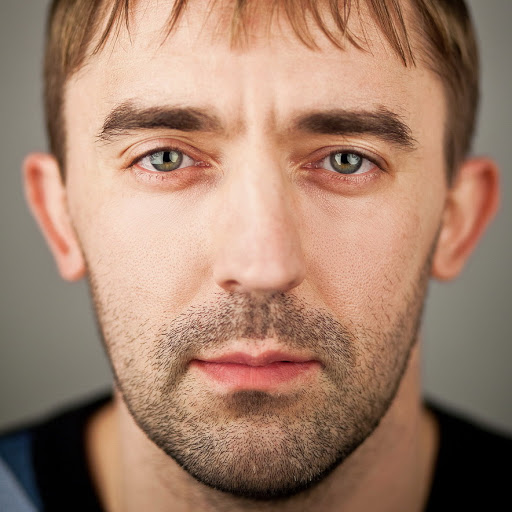
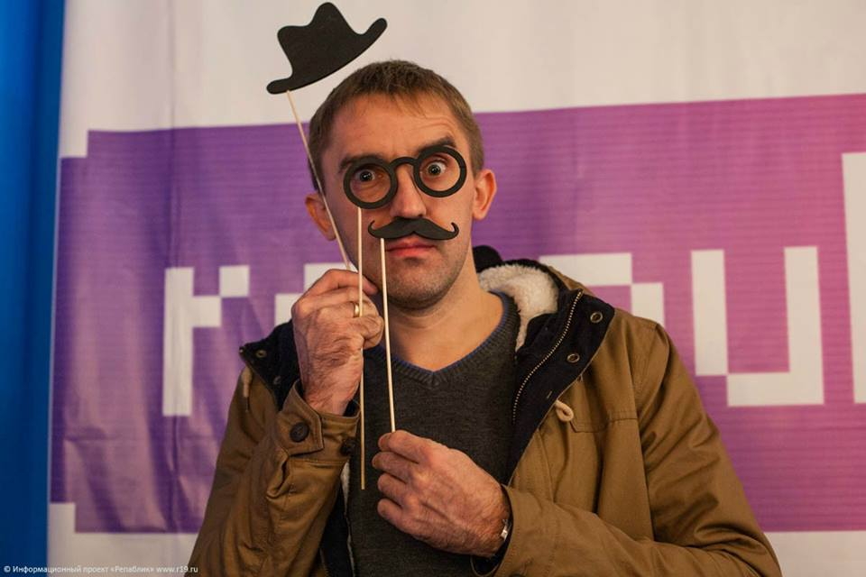
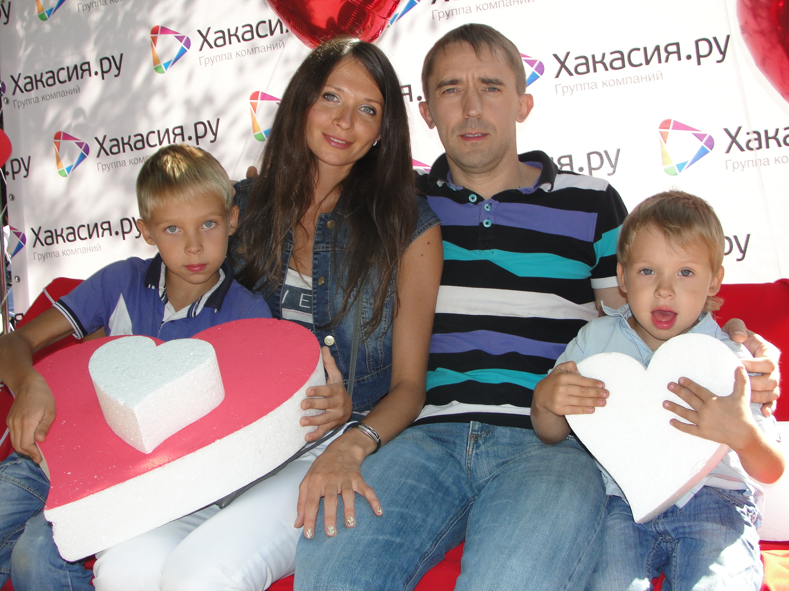

# Павел Сипкин: стержень Хакасии.ру

Дата создания: 2014-02-10

Автор: ngrebenshikov

Теги: Личности,Павел Сипкин,Хакасия.ру

 

 

 Сегодня я хотел бы представить на ваш суд интервью с Павлом Сипкиным — одним из основателей компании Хакасия.ру.   
  
Интересным было моё знакомство с ним. В конце девяностых в Абакане властвующей компьютерной сетью была [сеть FIDO](http://ru.wikipedia.org/wiki/Фидонет). В ХГУ была нода этой сети, и мы пошли получать там поинтов. Админом ноды был Константин Хамцов, но его не было. В кабинете был Паша Сипкин. Мы попросили поинтов у него. Он пообещал помочь, и мы все вместе пошли пить пиво, где он рассказывал кучу интересных историй.  
  
Меня в Паше всегда удивляет целостность его натуры, жизненный стержень. Мне нравится его философия. Мне кажется она очень правильная — «делать то, что нравится». Приступим.

#### Становление
  
**Паша, расскажи, пожалуйста как прошло твое детство, и как ты пришел к программированию.**  
  
Родился в городе Абакане 16 января 1976 года. Детство было достаточно интересным, как и у многих советских детей, которых у нас был полный двор. Мы каждый день находили себе какие-нибудь интересные занятия. Ходили в походы, играли в разные дворовые игры, строили шалаши.  
С компьютерами в моём детстве было очень сложно, может быть поэтому тяга к ним становилась всё сильнее и сильнее. И первым компьютером, за который я сел, был Ямаха КУВТ. Компьютерные классы Ямах появились сразу в нескольких частях нашего города и пользовались огромной популярностью. Не помню, каким образом узнал про кружок программирования в СЮТе (Станция Юных Техников) под руководством Алексея Викторовича Сакерина, но это был самый первый и самый важный для меня шаг. Этот шаг во многом определил моё будущее. В СЮТе я начал писать первые программы. Сначала на языке «Рапира», а потом на языке «BASIC». В основном писал игры, но были и более серьезные программы. Например, за обучающую программу по физике я получил свои первые деньги. Пусть деньги были не большие, но очень для меня важные. Опять же, спасибо Алексею Викторовичу, который всегда был рядом, выступая в роли наставника и руководителя проектов.  
  
**На сколько я знаю, высшее образование ты получал в Абакане. Это был осознанный выбор? Как проходила учеба?**  
  
Образование – это большая и очень интересная история, которую я просто не смогу описать в двух словах. Свой осознанный выбор я сделал в пользу молодого факультета «Экономическая кибернетика» Новосибирского госуниверситета, куда я пытался поступить вместе со своими друзьями по школе. Но поступить туда не получилось. Дисциплину «Экономика» не знал ни один из нас, рассчитывали сдать хотя бы на тройку, а потому вместо чтения умных книг все вечера мы проводили на баскетбольной площадке. Но чуда не произошло. Заслуженная двойка по экономике отправила назад в Абакан, где я поступил в местный Абаканский государственный педагогический институт им. Н.&nbsp;Ф.&nbsp;Катанова на учителя математики и информатики. Студенческие годы – незабываемая пора и каждый день для меня был настоящим праздником. Если быть честным, то учился в полную силу лишь первые полгода. Причиной стали первые экзамены, на которых я понял насколько всё в этом мире относительно. Люди без знаний могли грамотно воспользоваться шпаргалками и получить хорошую оценку, а люди со знаниями могли получить плохую оценку только потому, что чем-то не понравились преподавателю. Конечно, это были исключительные ситуации, но они были и повлияли на моё мировоззрение. Выбор относительно своей профессии я уже сделал и уже на первом курсе института устроился работать программистом в одну из абаканских фирм – Артель Старателей «Сибирь». От института в то время мне нужны были только оценки в зачетке, приближающие меня к диплому. В подобном режиме учился и мой лучший друг – Павел Ларькин. Он тоже работал программистом, но в другой компании – в компании «Инфоцентр». Так и «учились» мы с ним работая и работали учась. Отношение к учёбе было более чем расслабленное, а потому уже на третьем курсе у нас возникли очень серьезные проблемы по нескольким предметам, которые мы даже не знали как решать. Ларькин решил взять академический отпуск, а я решил уехать по приглашению в Новосибирск. Там мне предложили хорошую работу и беззаботное обучение в одном из новосибирских ВУЗов. Но этого не случилось, так как в моей жизни произошла встреча с Сергеем Викторовичем Швецом, отцом-основателем института информатики и телематики. Именно он сделал так, что мне стало интереснее остаться в Абакане. Меня перевели на новый факультет, дали двойную стипендию и работу с хорошей зарплатой. Ну и самое главное – работа была интересной.  
Так в моей жизни появилась первая стабильность. Первая стабильность, первая группа нового ИИТ, мои первые шаги в роли учителя, первые сертификаты и «1С» – программа, с которой пришлось познакомиться по просьбе Сергея Викторовича, чтобы помочь бухгалтерии университета начислить заработную плату.  
  
**Какие возникали проблемы?**  
  
О проблемах даже и не вспомню, я вообще это слово не воспринимаю. Трудности случаются, но к ним мы приходим сами, когда получаем новые знания и новый опыт. Трудности – это круто. Трудности – это то, что позволяет тебе расти, даёт новые эмоции, новый запас энергии и, конечно же, радость и ощущение успеха, когда их преодолеваешь. А успех человек хочет испытывать снова и снова.  
  
**С кем приходилось работать?**  
  
Из самых ярких людей каждый раз вспоминаю своего друга и одногруппника Александра Иванцова. Того самого Александра, который погиб при обрушении Башен-близнецов 11 сентября 2001 года, через 2 года после получения диплома. Когда вспоминаю его, сразу всплывает в памяти один из наших последних разговоров, который произошел за несколько месяцев до его отъезда в США. Разговаривали о чём-то весёлом, но он вдруг замолчал, задумался, а потом сказал: «Паша, у меня такое ощущение, что я скоро умру, только не здесь, а где-то очень далеко». Эти слова были настолько не к месту и настолько серьёзны, что у меня побежали мурашки. В тот день ни о чём весёлом мы уже не говорили. Я так и не смог перестроить разговор на позитивную волну. Прошло больше года, когда случилась эта нелепая трагедия, и только на поминках я вспомнил его слова. Тогда мурашки пробежали второй раз, я очень долго пытался понять Сашу. Что именно он чувствовал? Почему, несмотря на эти яркие чувства опасности, поехал искать своё счастье куда-то далеко от Родины, далеко от своих друзей и близких?  
  
**После такого ответа сложно задавать следующий вопрос, но все же продолжим.**   
  

#### Хакасия.ру
  
**Во время учебы ты не только работал — у тебя была своя [BBS](http://ru.wikipedia.org/wiki/BBS), был abakan.ru, на который нужно было дозваниваться по телефону, потом вы создали [сайт Хакасия.ру](http://web.archive.org/web/20030422151145/http://www.khakasia.ru/). Расскажи об этой стороне жизни.**  
  
Не помню точную дату, когда я открыл «Fly BBS», но примерно на первом курсе университета. Основным моим увлечением в то время была сеть FidoNet. Рассказывать об этих вещах я могу, но не думаю, что кому-то сейчас эта тема будет интересна. Кстати, сеть FidoNet жива до сих пор, несмотря на то, что количество узлов сети сократилось в несколько раз. Ну а что мне это дало? Первый опыт виртуального общения и первые друзья фидошники, о которых я может быть никогда и не узнал бы, если бы не эта сеть. О локальном abakan.ru и всех этих историях с доменом я тоже предпочитаю умолчать, нечего прошлое ворошить. Людей, которые в своё время поступили очень не красиво по отношению к нашей команде, тоже можно понять. Все мы грешны и все мы умеем ошибаться. Надо уметь прощать.  
  
**А можно чуть подробнее остановиться на сайте Хакасии.ру. Для чего он был создан? Я помню у вас была отличная фотогалерея и форум. Почему вы всё закрыли?**  
  
Сайт Хакасия.ру решили сделать не для чего-то, а для кого-то. Просто для людей о своей родине. Потом он стал неплохим вкладом в наше портфолио. В то бы время нашей команде всю эту кучу заказов, которая есть на сегодняшний день! Мы готовы были работать даже по ночам и даже за еду. Готовы были работать просто ради результата, настолько нам сильно нравилась эта работа. Потому и форум с галереей пользовались большой популярностью. Невозможно пройти мимо того, во что кто-то вкладывает всю свою душу. Кстати, были и небольшие проблемы. Помню, один из разделов фотогалереи содержал фотографии различных плакатов, разделенные по тематическим разделам. В одном из таких разделов находились советские плакаты времён второй мировой войны и послевоенного времени. А в соседнем разделе лежали фашистские плакаты того же времени и это не осталось без внимания. Через некоторое время какой-то очень добрый пользователь умудрился обратиться с заявлением в местную прокуратуру и нас «пригласили». Конечно же, никакой пропаганды не было, мы всё объяснили, показали и рассказали, но факт был неприятным. На самом деле коллекция нашей фотогалереи была шикарная, но время сделало свое дело. На чистом энтузиазме долго не протянешь, все хотят кушать. Так мой друг, соавтор первого сайта «Хакасия.ру» и дизайнер Роман Фурман покинул проект. Пошёл по стопам своего отца и стал адвокатом. Ну а мы переключились на другое направление – внедрение и сопровождение продуктов фирмы «1С». Делать сайты мы не прекращали, строим сайты до сих пор, но в те далёкие годы заказов было крайне мало. Интернет только начинал входить в нашу жизнь.  
  
**Давай перейдем уже к компании Хакасия.ру. Как она создавалась? Какие цели перед собой ставили при создании?**  
  
Когда основное место работы стало слишком сильно «отвлекать» от любимого дела, а доход от любимого дела раза в два превысил доход от основного места работы, тогда и решили создать собственную компанию.  
  
**Почему взяли Хакасия.ру в качестве названия компании? Какие были/есть самы интересные и запоминающиеся задачи?**  
  
Сайт «Хакасия.ру» – это наш первый серьезный проект, по нему нас уже узнавали. Новую компанию решили сделать одноименной, а по адресу [www.khakasia.ru](http://www.khakasia.ru) решили разместить собственный корпоративный сайт. Мир информационных технологий настолько бурно развивается, что невозможно вспомнить что-то самое самое. Каждый день мы сталкиваемся с чем-то новым и интересным. Мы знакомимся с новыми людьми, запускаем новые проекты, растем, учимся и просто радуемся жизни.  
  
**От чего испытываешь сейчас удовольствие?**  
  
Больше всего я испытываю удовольствие от поддержки и благодарности со стороны людей, которые меня окружают каждый день. Испытываю удовольствие от того, что мои мечты сбываются. Испытываю удовольствие от того, что у меня замечательная жена, замечательные дети и замечательные друзья. А самое главное, я до сих пор занимаюсь любимым делом – программирую и помогаю людям в решении их проблем.  
  

#### Миграция
  
**Я уверен, что у тебя были предложения уехать из Абакана. Почему остался? Как по-твоему в чем причины миграции вообще?**  
  
Конечно, и не раз. И в самый последний момент я возвращался к любимой поговорке – «Где родился, там и пригодился». Очень мудрые слова. Я считаю, что бежать куда-то – это бежать от самого себя. Особенно сейчас, когда интернет медленно, но верно стирает границы. В основном, люди бегут за какими-то материальными благами. Но если человек не доволен тем, что у него есть здесь и сейчас, то он, скорее всего, будет не доволен и там далеко. Денег вокруг так много, что их может хватить абсолютно для всех, но не каждый их может или хочет забрать. Основная причина этого – страх. Люди просто сидят и боятся идти вперёд. Боятся ошибиться, боятся быть непонятыми. Вместо того, чтобы дарить добро, заниматься любимым делом и держать своё слово, многие из нас замыкаются в себе, ходят на работу, которую ненавидят, лгут и боятся. Каждый день ищут причины своих бед, обсуждая их с другими, копаются в прошлом.   
Есть и другие причины миграции – это поиск новых возможностей, встреча с новыми людьми. Это достаточно серьезная причина и единственная, которая манила меня за собой. Но потерять своих старых друзей и возможности, которые имею сейчас, для меня гораздо неприятнее.  
  
**Нужно ли быть готовым переехать в другое место для хорошей работы или жизни? Что есть лучшая жизнь, по-твоему?**  
  
Готовым надо быть ко всему, но переехать в другое место для того, чтобы жизнь стала лучше – это не для меня. Мне хорошо здесь и сейчас. Место и время для меня не имеют значения.  
  
**Можно ли работать программистом в Абакане?**  
  
Не можно, а нужно. Программисты нужны в любом городе. И программистом может стать каждый, кому это на самом деле интересно. Ну а если программировать отправили родители или программировать, потому что у программистов зарплаты хорошие – это не вариант. А если говорить об областях программирования. Тут я не смогу найти точного ответа. Могу сказать лишь про своё направление – про программирование на базе платформы «1С: Предприятие». Работы настолько много, что можно работать по графику 7/24.  
  

#### Программирование
  
**Какая твоя любимая область в программировании? Какой твой любимый язык программирования?**  
  
Я занимаюсь прикладным программированием на базе платформы «1С: Предприятие», это и есть моя любимая область. Нравится, что очень часто приходится общаться непосредственно с заказчиком. Нравится разнообразие задач и благодарность, которую выражают клиенты, довольные твоей работой.  
  
**Каким должен быть современный программист?**  
  
В первую очередь современный программист должен быть хорошим человеком и любить свою работу. В этом случае все другие вопросы отпадают сами собой. У таких программистов обычно всё получается, а если что-то и пошло не так, то только для того, чтобы дать новый опыт, новые знания, новые заказы и новых клиентов.  
  
**В какую сторону движется программирование по твоему мнению? К чему готовиться?**  
  
В правильном. Как и всё, окружающее нас в этом мире. Готовиться к чему-то особенному я бы не стал советовать. Жизнь сама вас приготовит к нужному моменту. Просто живите, любите и мечтайте.  
  
**Как нужно учиться программированию?**  
  
Не знаю как правильно учиться программированию, но знаю, что если что-то делаешь с удовольствием, то учишься в сотни раз быстрее. Это основной путь к успеху. А дальше всё зависит от самого человека. Есть люди, которые изначально любят программировать, а есть люди, которые выращивают эту любовь искусственно. Оба метода работают, только вырастить любовь искусственно получается далеко не у каждого. Своим детям я люблю говорить фразу «Если надо что-то сделать, делай это с удовольствием или с настроением, а иначе ты просто теряешь своё время». Моешь посуду? Наслаждайся чистотой вымытых тарелок и приятным ощущением от воды. Выносишь мусор? Наслаждайся прогулкой по свежему воздуху и мыслями, которые можно думать, пока никто не отвлекает. Улыбнись от того, что твоя квартира стала чище.  
  
**Можно ли на программировании заработать много денег?**  
  
А что касается денег, то можно заработать мало, много и очень много. Всё, опять же, зависит от самого человека, от тех искусственных препятствий, которые он сам себе напридумывал.  
  
**Что по-твоему значит быть настоящим программистом?**  
  
Гораздо полезнее быть настоящим человеком. И для себя и для окружающих и для программирования.  
  
**Паша, большое спасибо за уделенное время и ответы на мои вопросы!** 