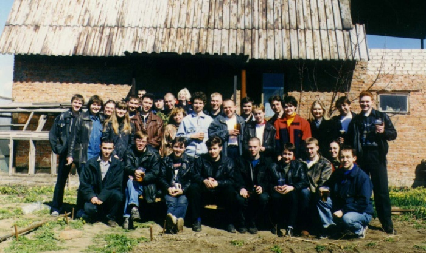
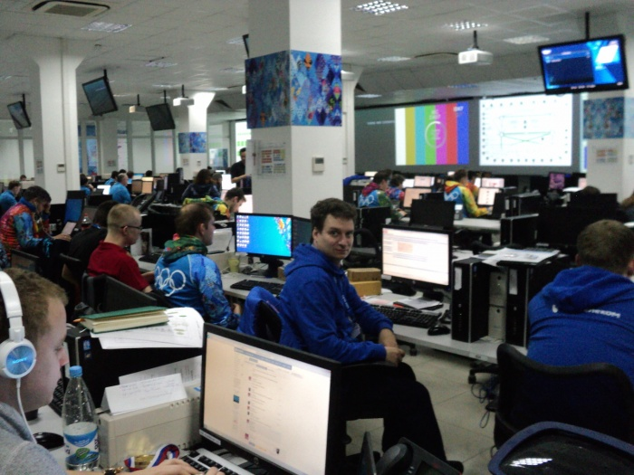

# Евгений Ларионов: программист-легенда

Дата создания: 2014-04-28

Автор: ngrebenshikov

Теги: Личности,Евгений Ларионов

Евгений Ларионов — легенда. Человек, который настраивал первое в Хакасии оборудование для доступа к сети Интернет. Помните на доме 59 по улице Щетинкина была огромная спутниковая антенна. Кроме того он был координатором хакасского сегмента сети FidoNet, вокруг которой в то время объединялись все программисты и не только.    
  
   
  
**Женя, расскажи, пожалуйста, где ты родился. Как пришел к программированию?**  
  
Родился в Абакане, здесь же закочил школу и здесь же и живу. В школе увлекался математикой, физикой, и когда предложили позаниматься в кружке программирования, согласился.  
  
**Когда у тебя появился доступ к первому компьютеру? Для чего он использовался?**  
  
В то время, когда я начал заниматься программированием, домашних компьютеров не было в принципе (может только программируемые калькуляторы типа Б3-34). А первым компьютером была Искра-1256 в кружке программирования в АФКПИ. Он использовался для обучения студентов и расчетных задачи.  
  
**О чём была твоя первая программа и когда она была написана?**  
  
Дело было в 1984-1985 году. О чём она была, я даже и не помню, обычные программки из учебников по программированию.

#### Образование
  
**Женя, расскажи, пожалуйста, какое ты получил образование.**  
  
Учился в НГУ на мех.мате, не окончил. Потом, позже, закончил наш ХГУ. Выбор мой пал на НГУ, так как он – наиболее сильный ВУЗ в Сибири, а ХГУ – потому что ближе (в родном городе). В НГУ были достаточно высокие требования и большой упор на первых курсах в математику, а я в то время больше увлекался программированием. В ХГУ – имея уже опыт было несколько проще.  
  
**Что было самым запоминающимся?**  
  
В НГУ – это конечно сама атмосфера Академгородка.  
  
**В чем были плюсы-минусы полученного образования?**  
  
Любое образование, на мой взгляд, систематизирует те вещи и тот опыт, который имеется, и дает новые знания. В этом разумеется большой плюс. Правда не все знания потом пригодились, но это считаю нормально.  
  
**А как образование повлияло на дальнейюшую карьеру?**  
  
Можно сказать что почти не повлияло, ну как дополнение к тому, что оно(диплом) есть.  
  
**Работал ли ты во время учебы?**  
  
Во время учебы в ХГУ работал в Комлинке.  
  

#### Карьера
  
**Расскажи, пожалуйста, как ты начал работать. Куда ты устроился первый раз?**  
  
Незакочив НГУ поступил работать в отдел АСУ Абаканвагомаш оператором ЭВМ, программистом, там я еще школьником проходил практику.  
  
   
  
**Насколько я знаю, когда ты работал в Комлинке, ты был причастен к первому появлению ФИДО и Интернета в Абакане. Как это проиходило?**  
  
Фидо и Интернет я увидел у своего товарища по группе(по учебе в НГУ) в 1991-92 годах в Новосибирке. Ну и было интерестно это попробывть реализовать и у себя в городе.  
  
Это был интересный вызов — с нуля организовать доступ к Интернет в городе когда этим до этого в регионе никто не занимался.  
  
**Какие возникали проблемы?**  
  
На тот момент мало было информации как всё должно работать, людей у которых можно было спросить тоже было мало.  
  
**От чего ты испытывал испытывал удовольствие?**  
  
От того, что всё заработало, а особенно когда видишь что это необходимо еще кому-то кроме тебя.  
  
**Для чего в то время использовался Интернет?**  
  
Ну как и сейчас: для общения, для обмена файлами.  
  
**Почему в итоге ты ушел из Комлинка?**  
  
Тут несколько причин, каждая из которых сама по себе не очень очень существенны, одна из которых желание получить новый опыт.  
  
   
  
**Сейчас ты работаешь в Ростелекоме. Расскажи каките у тебя сейчас интересные задачи, проблемы?**  
  
Основная задача это поддержка сети передачи данных, а интересное в этой задаче это участие в развитии этой сети. Проблемы конечно тоже бывают: с оборудованием, с линиями т.п., но это всё обычная рутина я отношусь к этому спокойно.  
  

#### Миграция
  
**Я уверен, что у тебя были предложения уехать из Абакана. Почему остался?**  
  
Просто не было по настоящему интересных для меня предложений.   
  
**Как по-твоему, в чем причины миграции вообще?**  
  
Желание лучше реализовать свои возможности(знания, умения, опыт) и потребности (не только бытовые, но потребность в профессиональном росте например).  
  
**Нужно ли быть готовым переехать в другое место для хорошей работы или жизни?**  
  
В смысле всю жизнь сидеть на чемоданах в надежде что кто-то что-то предложат – нет конечно. Но сформулировать для себя цель в профессиональной сфере и двигаться к ней, это пожалуй да.  
  
**Что есть лучшая жизнь, по-твоему?**  
  
Ну исходя из того, что сказал выше, это когда потребности и возможности человека соотносятся (есть люди годами живущие в тайге и их всё устраивает и они считают что живут лучше чем другие).  
  
**Как ты относишься к удаленной работе, Интернету?**  
  
Интернет помогает реализовать возможности человека (как специалиста), которые другим способом реализовать в регионе достаточно сложно (например, нет потребности в таких специалистах).  
  
**Можно ли работать программистом в Абакане?**  
  
Для начала надо разделить программиста и any-кейщика, многие это путают. Сейчас разработка ПО (программного продукта), обычно, коллективная работа многих людей, таких групп в у нас в Абакане мало. В Абакане это либо работа удалённо в таком коллективе, либо локализация какого-то программного продукта (допиливания к потребностям пользователя) как, например, 1С.  
  
**К чему нужно быть готовым?**  
  
Нужно быть готовым, что далеко не всегда придется решать задачи, которые нравятся (например, нравиться писать программы на php для web, а приходится допиливать 1С).  
  

#### Программирование
  
**Какая твоя любимая область в программировании?**  
  
Системное программирование (работа с железом, с операционкой).   
  
**Какой твою любимый язык программирования и почему?**  
  
Мой любимый язык — Си. Он гибкий, а исполняемый код обычно более компактен и близок к логике исходного текста.  
  
**Каким, по-твоему, должен быть современный программист?**  
  
Он должен быть по возможности разносторонне развитым (зачастую решению задачи могут помочь знания и подходы из других областей). Ну и не боятся трудностей, как в одной программисткой шутке: “настоящий программист не будет искать драйвера для нового, только что купленного в магазине, устройства — он напишет их сам”.  
  
**Что он должен знать и уметь?**  
  
Как минимум хоть немного разбираться в области, в которой ставятся задачи (бух.учет — если это 1С, сетевые технологии – если web programming и т.д.). Знания языка(ов) программирования не достаточно. Кроме того нужно уметь работать в коллективе, этому в ВУЗ-ах не учат.  
  
**В какую сторону движется программирование по твоему мнению?**  
  
Я думаю, что мы движемся к уменьшению непосредственного кодинга при решении прикладных задач. Также можно отметить виртуализацию, облегчающую перенос ПО с одной платформы на другую.  
  
**Как изменится работа программистов?**  
  
По мере изменения среды разработки изменится и сама работа, но думаю для программистов на поддержке ПО пока мало что изменится. Думаю, что будут появляться новые технологии в разработки ПО, новое железо, к которому это всё будет применяться (от программируемого утюга до новых гаджетов).  
  
**Как нужно учиться программированию? Как ты учился?**  
  
На мой взгляд лучше учиться при решении конкретных задач. Просто прочитав учебник по программированию и решив все задачи из него, не значит стать программистом.  
  
**Можно ли на программировании заработать много денег?**  
  
На самом программировании скорее всего нет, на продаже программного продукта – да (при этом от качества первого зависит и второе).  
  
**Как получать удовольствие от программирования?**  
  
Успешно решать интересные задачи, чем интереснее задача тем лучше.  
  
**Что по-твоему значит быть настоящим программистом?**  
  
Думаю, что настоящий программист не просто человек, который кодирует какое-то решение задачи, а может успешно сам сделать всё от начала (от оригинальной идеи) и до конца (ее воплощение). Пример — молодой Бил Гейтс с его форточками.  
  
**Женя, спасибо большое, что нашел время, чтобы ответить на мои вопросы.** 