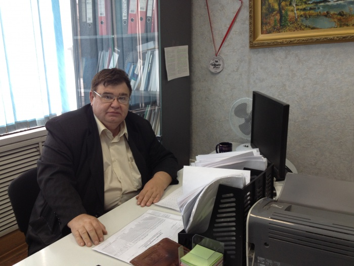
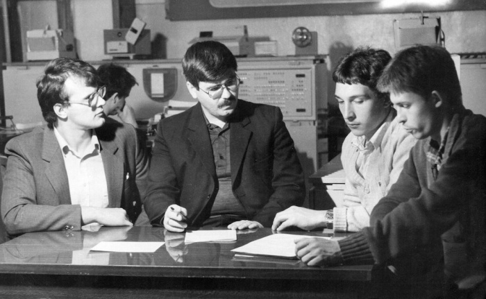
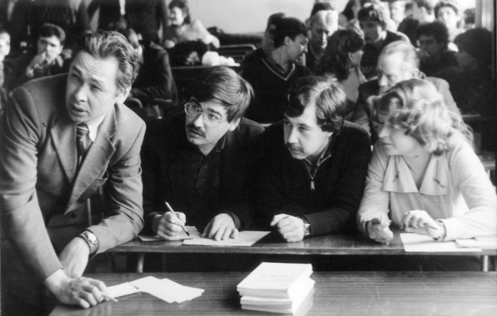
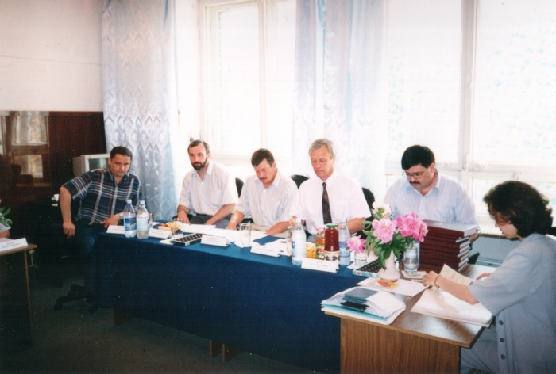

# Сергей Викторович Швец - первый директор Института Информатики и Телематики

Дата создания: 2014-10-08

Автор: ngrebenshikov

Теги: Личности,Швец,ИИТИО,ХГУ

Друзья, сегодня я хотел бы представить интервью с Сергеем Викторовичем Швецом, который на протяжении почти 20-ти лет руководил информационным направлением в Хакасском государственном университете.  
  
Мое знакомство с Сергеем Викторовичем началось во время моей учебы ИИТ в конце 90-х. Он был моим научным руководителем в аспирантуре. Под его началом я работал программистом в центре информационных технологий и преподавателем на кафедре программного обеспечения.  
  
Я знаю, что к нему неоднозначное отношение. Многим близки его манера руководства и проповедуемые идеи, но многие не разделяют их. Я задал интересующие меня вопросы, чтобы понять причины повлиявшие на развитие информационных специальностей в ХГУ.  
  
В комментариях вы можете выразить свое отношение с Сергею Викторовичу или задать вопросы, ответы на которые не прозвучали в интервью. Обращаю ваше внимание, что нужно быть взаимно вежливыми.  
  
 

#### Становление
  
**Сергей Викторович, расскажите, пожалуйста, где вы родились как прошло ваше детство?**  
  
Родился я в городе Хомске Сахалинской области 16-го марта 1954 года. Мне повезло – моё становление происходило в интеллектуальной среде. Моя мама имела 2 высших образования – экономист и режиссер народного театра, а отец закончил Ленинградский госуниверситет.   
  
В пятидесятые годы создавалась сеть академических городков. На Сахалине в поселке Антоново было создано сахалинское отделение Тихоокеанского научно-исследовательского института рыбного хозяйства и океанографии, где отец, кандидат биологических наук работал заведующим лабораторией в этом отделении.   
  
Поскольку отец часто уезжал в длительные экспедиции, а мама училась, то все домашнее хозяйство и младший брат были на мне. Сестры учились в Ленинграде у бабушки (а всего у меня 3 сестры и брат). Эта ситуация ставила меня в ответственное положение и поэтому сформировала во мне очень самостоятельного человека – с 8 лет.  
  
Когда мне было 10 лет, на Сахалине было объявлено в рамках развития сельского хозяйства (даже кукуруза росла в это время на Сахалине) соревнование среди школьников по сбору семян кормовых трав. Победителю доставалась путевка в Артек. Победителем стал я и сентябрь-октябрь 1965 года я провел в Артеке.  
  
У нас дома была очень большая библиотека, и моим любимым занятием было чтение книг. Любимыми предметами была физика и математика. Моя любовь к физике дала свои плоды – после шестого класса я за лето проглотил материал по физике для седьмого и был переведен сразу в восьмой. Кроме того я занимал первые места на районных олимпиадах.  
  
В 67 году мы переехали с Сахалина в Сибирь. На тот момент я учился в восьмом классе и размышлял, что будет после школы. Поэтому принял решение записаться в физмат школу при Новосибирском государственном университете. Следующие два года я ездил каждое воскресенье заниматься в новосибирский Академгородок. Заниматься в основном приходилось самостоятельно, большей частью для меня была важна сама атмосфера университета и университетские мероприятия.  
  
**Какое вы получили высшее образование, в каком ВУЗе?**   
  
После школы, имея в запасе один год, выигранный за счет сдачи экстерном программы 7 класса средней школы, я поступил в Томский государственный университет на физический факультет по специальности “физика твердого тела”. Когда начал учиться нам сказали, что после окончания вы по распределению пойдете работать учителями в школу. Меня такая ситуация не устроила, и я решил уйти из университета.   
  
Я подал документы в Новосибирский электротехнический институт на только что открывшийся факультет автоматизированных систем управления. Был очень большой конкурс и поступили только ребята с золотыми медалями после школы. Мне предложили учиться на энергетическом факультете. Энергетический факультет мне понравился, так как энергетика синтезирует в себе фактически все технические направления.  
  
   
  
Буквально с первых курсов началась дисциплина “Вычислительна техника в инженерно-экономических расчетах”. Как многих, меня потянуло к вычислительной технике. Сначала я работал на машине МИР-1 (Машина для Инженерных Расчетов), потом МИР-2. В итоге моя дипломная работа была посвящена автоматизированным вычислениям.  
  

#### Карьера и переезд в Абакан
  
**Где вы работали до ХГУ? Какие задачи решали?**  
  
После окончания института я был распределен на свою кафедру. Первая моя рабочая должность называлась “инженер ЭВМ МИР-1”. Позже появилась микропроцессорная техника. Для работы над диссертацией я уже использовал микроЭВМ “Электроника-60”. После успешной защиты кандидатской диссертации в 1983 году продолжил работу на кафедре от ассистента до доцента.   
  
   
  
Во время учебы и работы в институте активно занимался общественной работой – был секретарем комсомольской организации факультета, заместителем секретаря комсомольской организации НЭТИ, секретарем партийной организации энергетического факультета. Эта работа оказала большое влияние на формирование меня как лидера.   
  
После окончания института был назначен заместителем заведующего кафедрой и заместителем декана энергетического факультета.   
  
**Как получилось, что вы переехали в Абакан в ХГУ? Кто вам предложил?**  
  
В 1984 году к нам приехал на стажировку, а затем поступил в нашу аспирантуру преподаватель абаканского филиала Красноярского политехнического института Мажула Иван Владимирович. Мы с ним вместе работали в продолжение научных подходов моей диссертации, стали друзьями. По окончании аспирантуры Иван Владимирович уехал обратно, и постоянно звал в Абакан. В тот момент в Абакане был педогагический институт, и меня это не очень устраивало. А в 1994 году образовался университет и по рекомендации И.В. Мажулы ректор В.А. Кузьмин, пригласил меня для разговора о перспективах работы в Абакане. В это время заведующий кафедрой Информатики и вычислительной техники Н.Г. Булакин был избран мэром и была вакансия.   
  
**Сомневались ли перед переездом в Абакан?**  
  
В это время мне было 40 лет, достигнут приличный профессиональный уровень, теперь нужно отдать полученное ранее от жизни, от учителей. А с учителями мне везло всю жизнь – и в школе и в институте. Поэтому решил реализовывать себя в образовании, это был мой приоритет. Хотя предложений было много и по комсомольской линии и по партийной. Я считаю, что образование это одна из тех ниш, где человек может сохранить самого себя, свою свободу.   
  
Поэтому я принял решение переехать в Абакан.  
  
**А что вы думаете о миграции вообще?**  
  
Я по миру поездил и считаю, что лучше России страны в мире нет. И в плане свободы, как не парадоксально. Более того думаю, что в Хакасии очень комфортные условия для проживания. Я всячески поддерживаю офшорное программирование. Главное быть профессионалом – работу всегда можно найти.  
  

#### Становление ИИТ
  
**Сергей Викторович, расскажите, пожалуйста, как происходило становление Института Информатики и Телематики.**  
  
Когда я приехал, был 1995 год. На кафедре было всего 20 компьютеров, но массовое распространение вычислительной техники уже началось. Компьютеры начали появляться повсеместно в офисах, в домах. Вышла операционная система Windows 95. Результаты конкурентной борьбы с операционной системой от IBM OS/2 были неоднозначны. Я все-таки сделал ставку на Microsoft.   
  
Первое, что я предложил ректору, было открытие информационных специальностей. Данные специальности относились к классу элитных, но в то же время они являются массовыми. Стало ясно, что из-за отсутствия распределения после ВУЗов в Хакасию мало кто приедет работать по информационным специальностям, а спрос будет только увеличиваться.  
  
В 1995 году мы открыли курсы для школьников. Я сам в физико-математической школе учился и понимал, насколько важно работать со школьниками.   
  
   
  
Первый набор на информационные специальности высшего профессионального образования был произведен в 1996 г. В 1998 г. в структуре ХГУ создан Институт информатики и телематики (ИИТ), а в 2012 году преобразован в Институт информационных технологий и инженерного образования (ИИТИО). Первый выпуск инженеров по специальности 220400 Программное обеспечение вычислительной техники и автоматизированных систем состоялся в 1999 г. Сегодня в Институте по очной и заочной формам на информационных направлениях и специальностях обучается более 400 студентов и 10 аспирантов. За время существования института более 1000 человек получили дипломы, и основная их часть работает в Республике Хакасия и юге Красноярского края. Кроме того, наши выпускники успешно работают в Канаде, Австралии, Новой Зеландии, Германии, США, а также в Москве, Санкт-Петербурге, Новосибирске, Красноярске и других городах.   
  
Когда я приехал из Новосибирска, я очень удивился насколько грамотными были студенты в Абакане. Впоследствии я понял, в чем было дело. Если вы учитесь в Москве, Новосибирске, Красноярске, то при появлении вопросов вы подходите к преподавателю и спрашиваете. Здесь же не к кому было ходить, поэтому много изучали сами. А самообразование — самое ценное образование. Ребята были настолько грамотными, что когда проходила подготовка к сертификационным экзаменам Microsoft в условиях нехватки литературы, произошел прорыв – Евгений Мамаев и Алексей Вишневский решили сами написать такие книги.  
  
Книги, написанные студентами (Е. Мамаев, Т. Салихов, В. Карпюк), аспирантами 
(А. Вишневский, Д. Гончаров, В. Понамарев, Л. Шкарина) и преподавателями (Е. Санников) Института информационных технологий и инженерного образования, напечатанные ведущими издательствами компьютерной литературы (г.Москва, г.Санкт-Петербург), получили высокую оценку профессионалов в области компьютерных технологий. В течение 2000-2013 г.г. было издано 26 книг.  
  
В ИИТИО используются технологии обучения, позволяющие подготовить профессионалов высокого уровня. В основу программ обучения положены методы и модели, применяемые в Гарвардском университете и Массачусетском институте технологий (США). Среди студентов, сотрудников и выпускников Института информационных технологий и инженерного образования более 100 Сертифицированных специалистов Майкрософт, мирового лидера в области системного и прикладного программного обеспечения. В 1998г. ХГУ получил статус Microsoft Certified Solution Provider – сертифицированного провайдера решений Microsoft, который оперативно получает напрямую от Майкрософт техническую документацию по программному обеспечению.  
  
Команда ХГУ ежегодно успешно участвует в соревнованиях командного чемпионата мира по программированию. В четвертьфинале командного студенческого чемпионата мира по программированию среди Восточно-Сибирской группы вузов Северо-Восточного Европейского региона команда ХГУ в составе Манжугина А.С., Канунникова Н.В., Сундукова Д.Д. заняла второе место опередив команды ведущих вузов Восточной Сибири (Сибирский государственный технологический университет (г. Красноярск), Восточно-Сибирская государственная академия образования, Бурятский государственный университет, Восточно-Сибирский государственный университет технологий и управления, Иркутский государственный технический университет).   
  
Мы доказали, что в Хакасском государственном университете созданы условия, для подготовки профессионалов самого высокого уровня. Я говорю: “Станьте профессионалом (получите сертификаты, напишите книги) и перед вами будут открыты все двери”.  
  
**Трудно ли давались первые выпуски новых специальностей?**  
  
Трудностей было много, но нужно отметить, что руководство университета в лице ректора всегда поддерживало меня и все мои начинания. Для решения поставленных задачи пришлось стать директором Центра Информационных Технологий и проректором по информатизации. Подчеркну, что именно пришлось. Но нужно было решать массу вопросов по лицензированию. Если оставить их на самотек, то можно было ничего не добиться. Бумаги могли ходить месяцами. В роли проректора удавалось решать вопросы очень быстро. Например, мы получили лицензию на “Информационные системы и технологии” за неделю. Я ехал на конференцию в Краснодар, заехав в Москву, отдал документы. На обратном пути забрал документы на открытие специальности.   
Основную тяжесть по формированию материально-технической базы новых специальностей взял на себя Котлов Н.М., главный инженер Центра информационных технологий (ЦИТ).  
  
**Многие отмечают, что на ИИТ самоуправление студентов было поставлено во главу угла. Почему вы сделали такой выбор?**  
  
В Абакан я приехал с многими готовыми и опробованными подходами. Еще в Новосибирске я стал молодым заместителем декана (многие студенты были старше меня). Ситуация на факультете была такова, что мы всегда занимали последние места по успеваемости, было множество отчислений. Энергетический факультет был очень сложный.   
  
С первых дней я относился к ним как к свои детям, как же я их мог отчислять. Я стал придумывать различные меры по их сохранению. 200 человек из 225-ти мне удалось сохранить.   
  
Оглядываясь назад я понимаю, что это было не зря. Сейчас большинство из них состоявшиеся люди. Мой конек был самоуправление. Я один, их 225. В той системе были старосты, комсорги, профорги – молодые амбициозные ребята. Я старался дать им больше прав и возможностей для работы. А с правами и обязанностями идет в паре ответственность. Я старался делать работу эффективно. Благодаря этому энергетический факультет вышел в лидеры. Обычно выпускники имели 1-2 красных дипломов, а у меня 12 человек закончили с красными дипломами.   
  
Я всегда верю в молодежь. Я говорю, что я просеку прорублю, а уж вы складывайте, стройте за мной. Моя задача начать, направить. Доверие и опора на молодежь. Еще мне очень нравится фраза Леонардо Да Винчи — «Ученик, превзойди своего учителя». В ХГУ это получилось очень органично, так как и выбора другого не было.  
  

#### О ситуации в образовании
  
**Как вы относитесь к региональным ВУЗам? Какова их роль?**  
  
Природа распределяет таланты более-менее равномерно. Не все могут поехать в другие ВУЗы. Есть и другие опасности отдаленного обучения. С другой стороны есть примеры, когда студенты начинавшие учится в Красноярске, Новосибирске возвращались в Абакан для продолжения обучения и добивались поразительных успехов в жизни.  
  
Я считаю, что региональные ВУЗы должны быть. Жалко, что иногда бывает проблема с подбором преподавателей. Нужно воспитать новое поколение преподавателей – это наша первоочередная задача. Не скажу, что это всегда уж очень хорошо получается, но мы прилагаем все силы к этому.  
  
**Что вы думаете об уровне образования абитуриентов?**  
  
Ситуация конечно изменилась – уровень абитуриентов падает. Первые наборы были по 20 человек. Все были как на подбор. Сейчас наборы по 100 человек, но высшего уровня всё те же 20. С другой стороны специальность массовая, кому-то нужно и просто данные набирать. Все люди будут при деле.   
  
**Как вы относитесь к ЕГЭ? Какое влияние оказывает ЕГЭ на региональные вузы?**  
  
К ЕГЭ я отношусь спокойно. Я считаю, что по техническим дисциплинам самый лучший способ аттестации – это тестирование плюс собеседование. Как у нас раньше и было. Сейчас же, только ЕГЭ – только тесты.  
  
С другой стороны появление ЕГЭ вызвало дополнительный отток абитуриентов из регионов в центральные ВУЗы. Правда если ВУЗ работает хорошо, то дополнительного оттока практически нет. Мы стали работать с выпускниками школ, которые набирают максимальные баллы по профильным для нас предметам. Я собираю их с родителями и рассказываю об успехах наших студентов и выпускников: об олимпиадах по программированию, о сертификатах, о выпущенных книгах, о трудоустройстве. Я обычно говорю: “Если хотите стать профессионалом, то вам в ХГУ, а если потусоваться с друзьями и подружками, то – в большой город”. В этом году с балом свыше 170 (это хороший для нас балл) было 53 заявления, и 48 поступили к нам.  
  
**Что вы думаете о такой ситуации, когда преподаватели бывают в ситуации вынужденно ставить завышенные оценки, чтобы не быть уволенными? Ведь при отчислении студента прекращаются выплаты государством средств ВУЗу, что в свою очередь может привести к закрытию специальности и сокращению преподавателей.**  
  
Я вообще не сторонник массовых отчислений. У нас был эксперимент на одном курсе в Новосибирске мы отчислили половину курса. По итогам следующей сессии появились снова и двойки и кандидаты на отчисление. Но так и до нуля можно было дойти. В этом плане мне нравятся слова педагога Сухомлинского (https://ru.wikipedia.org/wiki/Сухомлинский,\_Василий\_Александрович) “Образование – это один из лепестков того цветка, который называется воспитанием” и слова французского мыслителя Жана Жака Руссо “Нет плохих учеников – есть плохие учителя”. Ведь на первый курс поступают нормальные дети. Да, возможно они ленивые, не привыкли систематически работать и обладают еще рядом особенностей, но с ними нужно и можно работать, нужно находить подход.  
  
**Как вы относитесь к массовости высшего образования? Необходимо ли оно?**  
  
Что толку, что мы набираем массово на учительские специальности, а в учителя никто не идет. Готовить нужно профессионалов. Профессионал будет всегда и везде востребован. С нашими специальностями легче, у нас они массовые. Сколько компьютеров столько и должно быть людей разбирающихся в них. Поэтому для каждого уровня нужен свой специалист, он все равно найдет работу по своим силам, знаниям и умениям.  
  
**Чувствуется ли конкуренция со стороны Интернет-образования?**  
  
Живого человека, специалиста, высокого профессионала никакой интернет не заменит. Поэтому очное образование должно быть. Должно быть живое общение, студентам нужно видеть, слышать вживую таких людей.   
  
**Каким образом должны сотрудничать ВУЗы и работодатели?**  
  
У меня есть одна фраза. Она ко многому подходит. В том числе и к данному вопросу. “Всё, что мы ни делаем, этого мало.” У нас сложились хорошие отношения с профессиональным сообществом компьютерщиков Хакасии, но хотелось бы большей помощи нам в подготовке студентов. Нужно устраивать совместные семинары, конкурсы, открывать лаборатории. С другой стороны мне бы хотелось, чтобы наши лучшие студенты “звездочки” не гасли у работодателей. Я хочу, чтобы они продолжали развиваться и после университета, становились настоящими корифеями в своей области.  
  

#### О будущем
  
**Какое будущее у информационных специальностей в Хакасии? Что ждет ХГУ, ИИТИО?**  
  
ХГУ ждет хорошее и светлое будущее, потому что это ведущий ВУЗ республики. Естественно, республика его всячески поддерживает.   
  
С другой стороны численность студентов университета за последние три года сократилась почти в два раза. В основном за счет гуманитарных, педагогических и экономических направлений. Единственные, кто не сокращается это мы. В этом году на бюджетные места принято 704 человека. Из них 190 человек, это первокурсники ИИТИО, то есть каждый четвертый первокурсник наш. Причем платных студентов на первом курсе у нас всего один, т.е. разговоры о том что все образование у нас платное это домыслы – хорошо учитесь в школе и будете учиться бесплатно в ВУЗе. К сожалению, нам не всегда удается сохранить студентов, и бывают случаи, что всего 3 человека из группы доходит до выпуска. Но мы стараемся работать в этом направлении на нашей кафедре. Ведь кафедра является главным звеном образовательного, научного и воспитательного процесса в ВУЗе.   
  
На развитие информационных специальностей я смотрю оптимистично. Все наши предложения государством поддерживаются. В этом году мы набрали 20 магистрантов, на следующий год нам уже выделили 40 бюджетных мест. А через год мы планируем заказывать 50 бюджетных мест. Проблема только в том, чтобы найти достойных преподавателей. Мы пытаемся решать такую проблему. Подрастает молодежь в последние годы многие молодые ученые у нас на кафедре, на кафедре у Дулесова А.С. защитили диссертации и стали кандидатами наук.  
  
Университет является носителем культуры. В 1978 году я ездил по программе обмена студентами в Польскую народную республику в Силезский политехнический институт (г. Гливице, Краковское воеводство). На меня большое впечатление произвел Ягеллонский университет г. Кракова, которому в то время было уже более 600 лет. Сколько сменилось правителей, королей, государств – а университет стоит и работает. Университеты будут стоять, пока цивилизация не исчезнет.  
  
**Что, по-вашему, значит быть настоящим программистом?**  
  
Программирование, техника, технологии развиваются очень быстро. Поэтому программист должен быть как белка в колесе – учиться и развиваться без остановки. Очень немногие по своему психологическому складу могут такое выдержать. Но таковы объективные условия, и если человек выдерживает и получает от этого удовольствие, он настоящий программист. Но это не значит, что человек, освоивший хорошо какую-либо область знаний в области программирования, не может быть хорошим программистом. Его удел – глубина, а не широта.