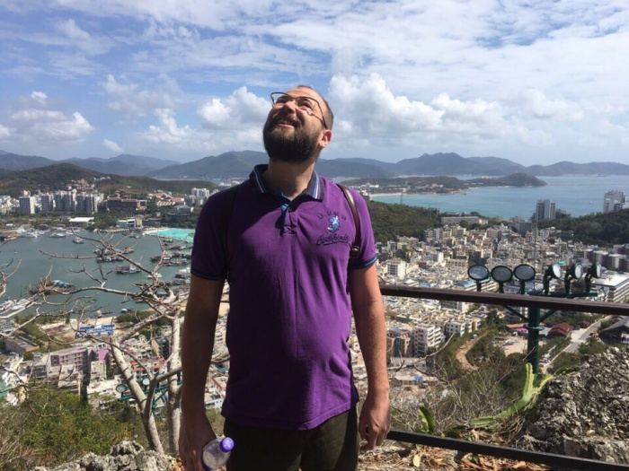
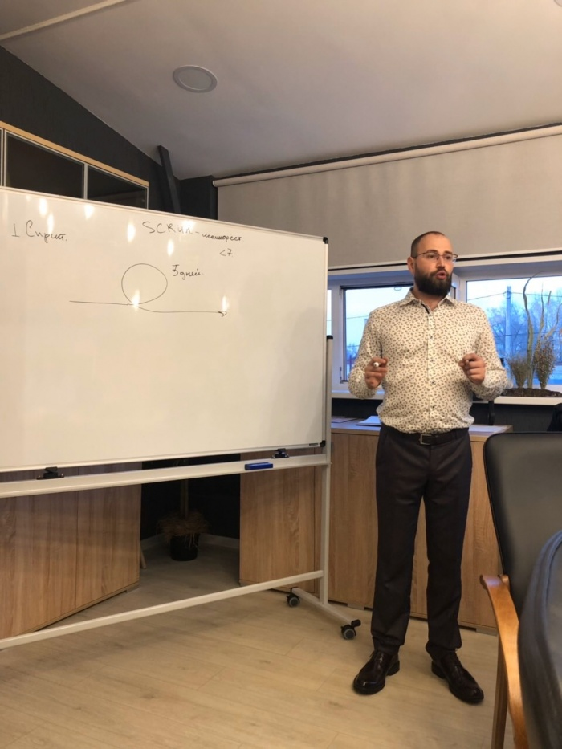
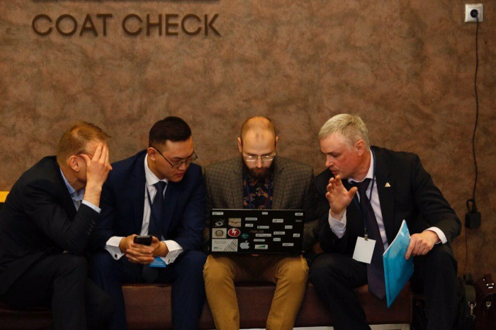
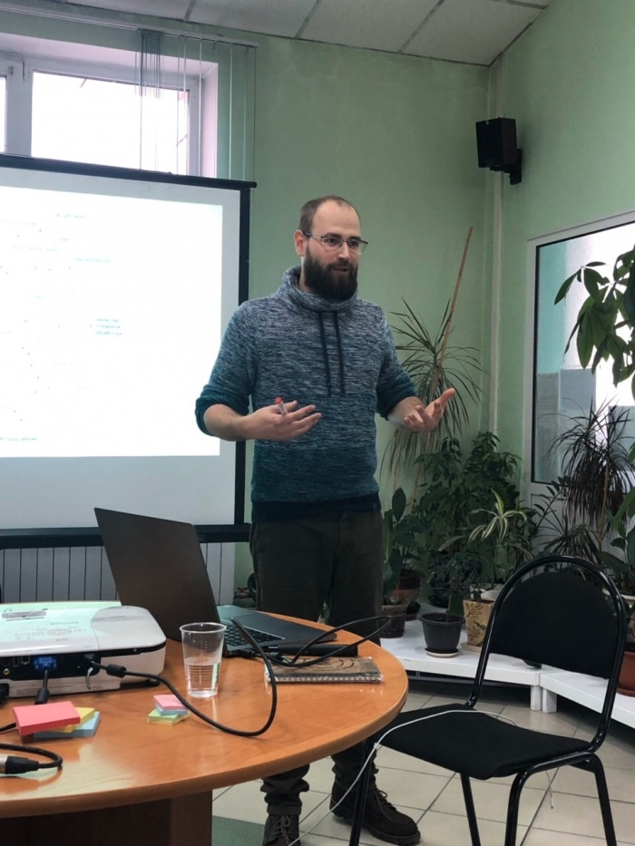
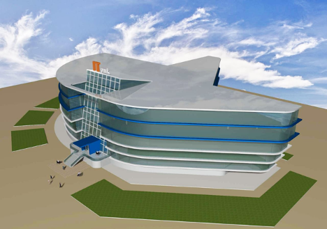

# Александр Авдеев: директор Magneex и двигатель IT-парка

Дата создания: 2020-06-10

Автор: ngrebenshikov

Теги: Личности,Александр Авдеев,Magneex,IT в Хакасии

Друзья, после серьезного перерыва возобновляю серию интервью со знаковыми личностями в сфере информационных технологий в Хакасии и ее окрестностях. Мне бы хотелось показать существование IT-отрасли в республике, поэтому я собираюсь поговорить с директорами компаний специализирующихся на разработке ПО и автоматизации.  
  
Сегодня я рад представить на ваш суд разговор с директором digital-студии Magneex, Александром Авдеевым.  
   
  
 

#### Становление
  
**Александр, расскажи, пожалуйста, где ты родился, как проходило детство и каким образом компьютеры и информационные технологии появились в твоей жизни?**  
  
Родился в с. Белый Яр, Республики Хакасия. Но всё осознанное детство и отрочество прошло в г. Норильске. Детство было как у всех детей того времени. Когда летом прилетал из Норильска к бабушке, катался на велосипеде, купался в речке и лазил по стройкам. Наверное, первое соприкосновение с ИТ произошло все же в Норильске в 1997 году. Тогда я только пошел в школу и у соседей с низу появился первый персональный компьютер Pentium 133 с Windows 95 на борту. Великим откровением стала возможность рисовать в paint, а затем тут же напечатать получившийся рисунок на струйном принтере.  
  
**Для чего в то время ты использовал компьютер?**  
  
Компьютер дома появился немного позже в году 98. Это как сейчас помню был Pentium 166 с 4 Mb оперативной памяти. Раньше не было интернета, поэтому использование компьютера в моем детстве сводилось к использованию того, предустановленного софта с Windows 95. Но был Corel Draw – его я использовал для того, чтобы смотреть на векторные наборы картинок, не более того. Еще было две игрушки авиасимулятор и диск с набором небольших флеш игрушек, сейчас такие игры принято называть «Инди».  
Позднее в школе в классе 7 на уроках информатики, где учили уже тогда древний Pascal, я очень увлекся программированием. Было интересно заставлять компьютер делать, то, что ты хочешь. Позднее появилась локальная сеть. В Норильске я думаю до сих пор интернет дорогой и спутниковый из-за территориальной отдаленности., поэтому сеть была популярной и развитой что-то около 20-30 тыс. человек. В нашей локальной сети были веб-сайты с доменной зоной \*.lan, тогда появились первые MMORPG, мое и всех парней моего класса была Ragnarok Online. Тогда мне пришла идея создать небольшой сайт с прохождением квестами и полезной информацией для игроков, потом к сайту был прикручен форум phpbb. Сайт разрабатывался тогда на табличной верстке, о не каком css, php речи не шло. HTML и JS. Но было дико интересно и хотелось больше и сложнее, в сети у кого-то в DC++ (местная P2P сеть с раздачами) были найдены самоучители и понеслось. Потом был сайт школы и потом была небольшая городская социальная сеть с 2000 пользователей. Социальную сеть мы писали уже вдвоем с одноклассником, сервером был мой домашний компьютер. Помню, как нас хакнули и потерли все записи в БД. О информационной безопасности тогда не думали, казалось, что ты вообще самый крутой.  
  
**Александр, почему выбрал Абакан и поступил местный университет? Не было ли желания уехать?**  
  
На самом деле был выбор без выбора. В моем мире существовало два пути первый это пойти по стопам отца и окончить летное училище, но из-за проблем со зрением я не прошел ВЛЭК (военно-летная комиссия). А так как моя старшая сестра уже училась в ХГУ и была в Абакане, я поступал именно сюда, на ИИТ, потому что в тот период жизни я уже был достаточно увлечен программированием и интернетом, а к моменту моего поступления, в 2008 году, у меня дома был свой настоящий ADSL2 интернет на 64 килобита, для меня тогда это было окошечком в Нарнию.  
  
**Каким образом протекала учеба? Что ценного ты вынес из университета? Как складывалась карьера? Сразу ли ты решил создавать свою собственную компанию?**  
  
Учиться всегда было просто, я всегда посещал занятия в университете и старался не прогуливать, да наверное и не прогуливал по большей степени. Не могу сказать, что я получил набор знаний, которым пользуюсь и сегодня, но за 5 лет обучения я неплохо смог само дисциплинировать себя, а главное на мой взгляд это быстро учиться и поглощать полученные знания, и применять их на лабораторных и.т.д. Не важно, чему учиться в университете, главное это способность быстро разбираться в предметной области, применять знания и на их основе находить пути решения задачи.   
Свою компанию я основал не сразу. Около года я отработал эникейщиком в банке и это была самая грустная работа, в которой я пылесосил банкоматы и менял сломанные купюр приёмники. Самая интересная работа это было конфигурирование банкомата по мануалам.   
  
   
  

#### Magneex
  
**Александр, расскажи, пожалуйста, почему ты решил создать свою компанию и каким образом образовывался Магнекс?**  
  
Тут нет истории героя, который боролся с несправедливостью мира, все просто, я не хотел в армию. Очная аспирантура давала возможность законно туда не идти, но продолжать менять клавиатуры и пылесосить банкоматы я не мог, т.к. аспирантура очная, да и в целом это ад какой-то. Жить на что-то нужно было, поэтому было принято решение открыть свою компанию и получить возможность зарабатывать деньги и иметь ненормированный график. Что я тогда умел делать, закончив кафедру информационной безопасности? Правильно, сверлить дырки перфоратором и чистить компьютеры, поэтому была открыта компания Корпоративные Информационные Технологии. Офис я снял пополам с парнями из компании Magneex, они занимались сайтами… Потом получилось так, что у меня появилось пару заказов на сайты и понеслось, я стал проект-менеджером. С увеличением заказов, стала и расти компания и из проект-менеджера я стал директором компании, как понимаете видеонаблюдением, я уже давно не занимался.   
  
**Что значит магнекс? Это он, она или оно?**  
  
Магникс. Скорее всего он, но это не точно.  
Я думаю, что раньше это что-то значило, ну сейчас уже никто не помнит. Имя собственное с уникальным написанием в сети интернет.  
  
**Были ли у тебя партнеры? Какие возникали трудности и может быть интересные или смешные ситуации во время становления компании?**  
  
Да, когда я пришел в Магникс парни работали в втроем. В процессе развития в управлении остался я и технический директор. Главная трудность, это отсутствие образования в менеджменте, которую я испытываю и по сей день, хотя и работаю над закрытием этих пробелов.  
  
**В какой момент поняли, что получилось сделать что-то серьезное и Магнекс стал играть заметную роль на рынке информационных технологий в Хакасии?**  
  
Я если честно, до сих пор не уверен, что мы прям играем важную роль на нашем локальном рынке. Среди разработчиков региона в области разработки веб-сайтов мы занимаем лидирующую позицию, подтверждается это рейтингом от cmsmagazine.ru, но это довольно узкая ниша и рынок Абакана в вебе я бы оценил в миллионов 25-30.  
  
**Каким проектом ты гордишься больше всего?**   
  
Я думаю, это проект интернет-магазина snpmarket.com. Там очень крутой бэк-офис с автоматизацией склада, логистики, системой постаматов, CRM и многим другим. На этом проекте мы выкладываемся по полной и думаю со стороны именно на этом проекте можно оценить общий уровень компетенций нашей команды.  
  
**Чем сейчас занимается Магнекс и какова твоя роль в ней? Как изменился круг твоих обязанностей за годы развития компании? Какими повседневными делами занимается директор?**  
  
Вот прям сейчас Магникс очень сильно меняется. Я чаще стал задумываться о таких вещах как стратегия развития, а не живем от проекта до проекта. Главное направление движения, которое мы сформировали на ближайшие 5 лет заключается в разработке веб-сервисов. Продающие сайты, лэндинги, контекстная реклама, SEO, SMM никогда не было про нас, мы больше все же технари, которые любят заниматься автоматизацией бизнес-процессов.  
  
Я все меньше уделяю времени в процессе управления проектами, как-то я понял, что в компании есть проекты, к которым я вообще не имею никакого отношения, понятия не имею, кто клиент, и вообще, что там происходит. Поначалу я очень сильно этого испугался, подумал, что выгорел теряю хватку, но потом понял, что это нормально. Проекты были выполнены, клиенты остались на сопровождении значит все было в порядке.   
  
Повседневные дела:  

1. Разобрать почту
2. Провести митап
3. Начисление з/п, оплата счетов
4. Обработка лидов
5. Внутренняя оптимизация, контроль KPI компании

  
**Бывают ли моменты, когда ты непосредственно работаешь над каким-то проектом: что-то разрабатываешь, программируешь, создаешь дизайн?**  
  
Да, но на самых первых этапах. Когда мы строим бизнес-модель будущего проекта. Иногда принимаю участие в формировании агрегации требований. Изучаю проектно-сметную документацию, вношу правки.   
В компании есть очень сильные программисты, дизайнеры, проектные-управленцы — это их работа и залазить в их зону ответственности я не люблю.  
  
   
  

#### Предпринимательство
  
**Сейчас ты больше бизнесмен или программист?**  
  
Я предприниматель, программированием я не занимаюсь более 6 лет.  
  
**Получаешь ли ты удовольствие от работы? Что приносит его больше всего?**  
  
Получаю, конечно, в любом другом противном случае я бы этим не занимался.  
Я думаю, можно даже расставить приоритеты по поводу удовольствия:  

1. Проект, который ты сделал реально полезен людям и им пользуются одновременно тысячи человек.
2. Признание коллег на рынке, рост компании в выручке и в компетенциях.
3. Деньги. Я, как и все живые люди получаю удовольствие от денег.
4. Относительно свободный график работы.

  
**Какие минусы есть у твоей работы?**  
  

1. Магникс существует уже 7 лет, сегодня я не могу с уверенностью сказать, что это бизнес, который в пассивной форме приносит мне деньги. Прекрати я работать и выполнять свои обязательства скорее всего произойдет спад или закрытие компании.
2. Ответственность, которую ты ощущаешь перед сотрудниками, перед клиентами.
3. Ненормированный рабочий график. Работаешь столько сколько можешь и еще немного больше, но 80% всего, что ты делаешь это бессмысленная трата времени, которая никогда не принесет денег или удовлетворения. Выделить из общей массы те самые важные 20% очень сложно.

  

#### Мысли об IT
  
**Как развиваются информационные технологии? Будут ли нужны программисты в будущем? Как изменится их работа?**  
  
Смотря в каком будующем. В ближайшие 10-15 лет, профессия программиста не исчезнет, более того, я думаю произойдет еще большее расщепление как это неизбежно происходит в любой развивающейся отрасли.   
  
На мой взгляд самым перспективным направлением в ИТ станет работа в области дополненной и виртуальной реальности. Будут востребованы 3D дизайнеры, дизайнеры интерфейсов для AR, ну и само собой программисты.   
  
Думаю, с ростом вычислительных мощностей программирование будет переходить на языки более высокого уровня. Разработка на голых языках вымрет как таковая и останутся киты, фрэймоврки, системы визуального программирования, что в свою очередь уменьшит порог вхождения новых людей в отрасль.  
  
**Стоит ли сейчас изучать программирование? Если да, то, как лучше это сделать? Поступать в университет или нет? Если да, то куда.**   
  
А что вы хотите? Если ваша цель и мечта основать ИТ-компанию, то уезжайте в Москву, Новосибирск, Санкт Петербург, обрастайте нужными связями в ИТ-тусовке. Если вы сходите с ума от программирования без разницы, где учиться. Самое важное для программиста умение дисциплинировать себя, быстро находить нужную информацию, обрабатывать ее и применять для решения прикладных задач. Будете делать вы это в Москве или в Абакане разницы сильно большой нет, интернет примерно у всех одинаковый. Единомышленников найти можно и в нашем городе.  
  
В Университет поступать стоит. Это поможет вам приучиться к дисциплине, и научиться учиться т.е. решать пути решения поставленных задач.   
  

#### Состояние сферы информационных технологий в Хакасии
  
**Какие специалисты нужны вашей компании? Что вы цените больше всего? Как вы их ищите или растите?**  
  
Нам нужны разработчики, всегда. В нашей компании крайне вялая текучка кадров, хоть и присутствует, но в среднем сотрудники работают более 4, 5 лет.   
  
PHP, git, Laravel, symfony, docker, БЭМ, SCRUM, все эти аббревиатуры должны быть вам известны, понятны.   
В людях я ценю ответственность, пунктуальность, умение работать в команде, честность.  
С поиском кадров, как и с поиском клиентов есть свои механизмы генерации.  

1. Хантинг
2. Объявления
3. Университет, растим сами.

  
**В свое время ты остался в Абакане. Не жалеешь ли об этом? Что Абакан дал тебе и что он может дать молодым специалистам?**  
  
Жалею, что остался в Абакане. Думаю, в большом городе было бы работать гораздо интереснее, по крайней мере начинать. Со временем пройдя через боль и слезы, выработались навыки к удаленной работе и стало проще. Самым большим плюсом Абакана для нас стала относительно не дорогая жизнь, что позволило демпингом забирать заказы из европейской части и заграницы.   
  
Я думаю, настоящая работа с решением крутых задач возможна только в удаленном режиме, внутренний рынок нашей Республики не имеет большого объема запросов на услуги программистов. А без постоянного спроса сформировать стабильный бизнес невозможно.  
  
**Насколько развита индустрия информационных технологий в Хакасии? Какие на данный момент у нас основные проблемы и есть ли значимые достижения? Есть ли пространство для развития?**  
  
Развитие информационных технологий по моему мнению является неким индикатором развития конкуренции на рынках региона. Наши клиенты начинают задумываться о внутренней оптимизации бизнес-процессов в том случае, если на их рынках присутствуют конкуренты, которые способны предоставить аналогичный товар за меньшую стоимость либо предоставить более качественный уровень сервиса. Рынок Республики Хакасия во многих сферах низко конкурентный, от сюда низкого уровня сервиса, и слабое применение компаниями информационных технологий в целом. Я не утверждаю, что эта тенденция прослеживается абсолютно везде, но мне кажется по-настоящему технологичных компаний в нашей Республике единицы. Есть над чем работать.  
  
   
  
**Известно, что Магнекс и ты лично принимаете активное участие в создании IT-парка в Абакане. Скажи, пожалуйста, что это будет и как он будет устроен. Зачем он нужен Абакану и Хакасии — в чем выгода? Кто в нем будет находиться? Хватить ли программистов, чтобы его наполнить?**  
  
Да, занимаюсь. На мой взгляд в нашем регионе существует ряд позитивных факторов и возможностей с помощью которых мы можем заниматься развитием информационных технологий, а именно:  

- Высокоскоростной доступ интернета. У нас замечательный и дешевый интернет. А также существует техническая возможность подключения к федеральным оптоволоконным каналам связи.
- География. Наше соседство с Китаем и наличие веток связи через территорию Монголии позволяет обеспечить высокое качество связи со всеми северными провинциями Китая
- Стоимость электроэнергии. При благоприятных условиях может составить 2,85 рубля/Киловатт

   
  
Все эти плюсы позволяют на мой взгляд разместить на территории нашей Республики ЦОД, для этого есть все факторы, и рынок сбыта и относительно дешевая себестоимость. Сейчас идут переговоры в WeChat, как партнера реализации проекта.   
  
По поводу программистов. Ничего просто так не происходит, на сегодняшний день в нашей Республике не существует отлаженного процесса формирования кадров, и их дальнейшего трудоустройства. Многие талантливые программисты уезжают в другие регионы по причине невозможности трудоустройства или за более высоким качеством жизни в целом.  
  
Помимо ЦОДа в ИТ-центре планируется наличие следующего наполнения:  

- Конференц-зал
- Пространство холла для проведения выставок
- Удобные переговорные для видеоконференций
- Наличие Open Space для арендаторов
- Тренажерный зал
- Хороший общепит по принципу шведского стола
- Гостиница
- Кафедры университетов и возможность введения дуального образования
- Центр 3D печати
- VR-арена

  
Говорить сегодня о 100% занятости программистами города Абакана Ит-центра сейчас не приходится, но я верю, что в течении времени мы сможем вырасти своих специалистов, привлечь крупные ИТ-компании России и не только, для организации своих филиалов в Абакане.  
Разместиться ИТ-парк на улице Авиаторов, сейчас происходит процесс оформления документов на землю для строительства.  
  
А это предлагаемый проект ИТ-парка, который разрабатываем совместно с архитектурно-проектной организацией.  
  
   
  
**Есть ли у вас конкуренты, и как ты к ним относишься?**  
  
Конечно, и много, т.к. мы работаем на достаточно широком рынке. Мы смотрим на наших конкурентов, смотрим на каких машинах они ездят, где отдыхают и понимаем, что в нашей рыночной нише есть деньги и спрос, значит мы делаем все правильно. Конкуренция – это лучший механизм, который только могла предложить рыночная экономика. Продукты становятся лучше, люди оптимизируют производство для сокращения себестоимости, сильные и предприимчивые выживают, слабые и ленивые умирают.  
  
**Как в области информационных технологий заработать много денег?**  
  
Успешный стартап.  
  
**Нужно ли для этого создавать свою компанию и каждому ли это дано?**  
  
Если очень много, то да, и нести всю вытекающую ответственность и быть к ней готовым. От ваших решений будет зависеть, как будут жить и какую зарплату получать ваши сотрудники, как они будут кормить свои семьи. Как сделать так, чтобы защитить стартап, как сделать так что бы вас не оштрафовали/посадили и.т.д. Большие деньги – это всегда игра по-крупному с колоссальными рисками.  
  

#### Советы начинающим
  
**Дай, пожалуйста, несколько советов как стать успешным в информационных технологиях.**  
  

- Учитесь постоянно, самостоятельно;
- Напишите график дня и повесьте его везде, соблюдайте режим;
- Ведите чеклисты задач на день, неделю;
- Стройте далекие планы на 5-10 лет. Кем вы себя видите, что для этого нужно сделать.
- Откладывайте 10% от зарплаты на путешествия с семьей;
- Заведите кошку.

  

#### Кто такой настоящий программист?
  
Интроверт, троль, социопат. Который получает удовольствие от решения сложных задач и от возможности управления компьютером. Человек, который действительно хочет принести пользу этому обществу и оставить после себя значимый след, и не только на свежем бетоне.