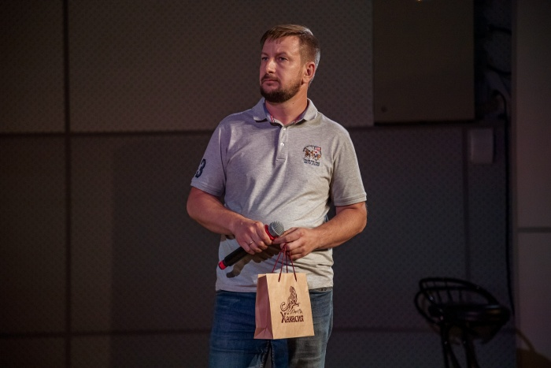

# Антон Сысуев: руководитель компании Sintechno

Дата создания: 2020-06-23

Автор: ngrebenshikov

Теги: Личности,Антон Сысуев,Хакасия,IT в Хакасии

С удивлением обнаружил, что у нас, в Хакасии, есть еще одна компания веб-разработчик с богатым послужным списком. Ее руководителем является Антон Сысуев. НИже приводу нашу беседу с ним о его пути в информационных технологиях.    
  
   
  
**Антон, расскажи, пожалуйста, каким образом компьютеры и информационные технологии появились в твоей жизни? С чего начинал? Что послужило толчком связать свою жизнь с IT?**  
  
В пятом классе перешёл из 8-ой школы в 12-ую, в математический класс. В 12-ой школе к тому моменту уже был компьютерный класс. Это была весьма продвинутая школа в 1991 году. В 5 классе информатики не было, но я часто был в кабинете информатики, самостоятельно изучал как запускаются программы, как писать программы на Бейсике и т.д. Позже компьютер появился в семье. Это был Пентиум 166 MMX, 32 Mb RAM. Размер жесткого диска уже не помню. Вот тогда и началось серьезное увлечение, переросшее в профессию. Самое забавное, что интерес к изучению IT подогревали проблемы. То программа не установится, то игру надо хитрым способом запустить, то ещё что-то. Интересно было в этом разобраться и понять “а как ещё можно”.   
  
**Почему остался в городе Абакане и поступил в Хакасский гос. университет? Что происходило интересного за время учебы? Что дало тебе высшее образование вообще и ХГУ в частности?**  
  
У меня всегда есть активный интерес к нескольким направлениям. В тот момент это были экономика и информатика. ХГУ был как раз местом, где можно было это изучать не выезжая из Абакана. И еще, учась в школе, посещал подготовительные курсы в ХГУ, где, кстати, познакомился со многими моими одногруппниками, с которыми дружим и работаем до сих пор.  
  
В итоге интересные люди, интересные курсы, перспективы обучиться интересной профессии и оставили меня в Абакане. Весьма убедительным был Сергей Викторович Швец, который не просто рекомендовал остаться для учёбы в ХГУ, но настоял на том, чтобы я пошёл по новому направлению — бакалавриат техники и технологии. Хотя изначально я стремился пойти по направлению “информационные системы в экономике”.  
  
Моя учёба это отдельный рассказ. Как любой студент, я хотел быть финансово независимым и работал уже на первом курсе. В итоге учёба начала мешать работе. Но всё же закончил бакалавриат и поступил в магистратуру, а затем аспирантуру. К сожалению, в какой-то момент осознал, что учёная степень не нужна никому. Даже мне. Закончил аспирантуру, но не стал писать диссертацию. Возможно, всё ещё впереди.   
  
Откровенно могу сказать, что ХГУ в большей части дал знакомства, связи и возможность самостоятельно заниматься тем, что нравится больше. Большую часть знаний мы получали сами. Это и хорошо, и плохо одновременно.   
  
После ХГУ были ещё Сибирская Академия государственной службы и МГУ им. М.Ю.Ломоносова. Два года обучения в этих ВУЗах дали больше, чем 9 лет в ХГУ. Это грустно, но это так.   
  
**Не пожалел, что остался в Абакане? Что Абакан дал тебе и что он может дать молодым специалистам?**  
  
Поучившись в других ВУЗах я пожалел, что изначально не был на них мотивирован. Это другой уровень.  
  
Абакан своеобразный и интересный город. Благодаря своей компактности активные люди друг-друга часто знают. Во всяком случае в той сфере, где я работаю сейчас. Это формирует весьма интересные коллаборации.  
Абакан может дать молодым специалистам старт. А где они потом его будут развивать — это их выбор. Текущая ситуация показала, что обучаться можно где угодно, работать можно из Абакана и зарабатывать как в крупных городах.  
Объективно, мы с вами до конца не понимаем уникальность места, в котором живём. Это касается природного разнообразия, человеческой доброты и простоты установки контактов. Для Абакана это большой плюс. Если приложить немного сил, то Хакасия может стать крупным IT-регионом, как, Татарстан, например.   
  
**Посоветуешь ли ты сейчас получать высшее образование в области информационных технологий? И где? В ХГУ?**  
  
Уникальность образования в IT такова, что образование можно получить где угодно. Зависит от продвинутости ВУЗА и самого студента. И совершенно не обязательно быть крутым айтишником с профильным образованием. Часто бывает наоборот. И даже без высшего образования. Думаю, самое перспективное место в плане обучения IT-специальности в России сегодня это Иннополис. Уникальное место. Надеюсь, у нас в Хакасии когда-то будет нечто подобное. Но для этого надо значительное количество желания и средств. И для начала именно желания.   
  
**Чем занимался после университета? Сразу ли попал на работу в государственную организацию?**  
  
В Министерство устроился учась в Магистратуре ХГУ. И 13 лет работал на государственной гражданской службе. Попал в результате конкурсного отбора.   
  
**Какие особенности работы в государственной организации ты можешь выделить? Что положительного и отрицательного? В чем была твоя роль?**  
  
Государственная организация это всегда бюрократия. И это не минус в данном контексте. Ваши действия регламентированы, бюджеты и правила устанавливают рамки. Благодаря этому целеполагание яснее.  
Сложность в том, что для новых проектов надо написать массу бумаг, пройти множество согласований и т.д. И, откровенно говоря, в части развития технологий государственные органы всегда будут догонять.   
  
**На каком уровне тогда было применение информационных технологий в работе государственных органов? Если возможно, дай, пожалуйста, оценку произошедшим с того времени изменениям. Как ты видишь перспективы?**  
  
До 2009 на региональном уровне с IT было не всё хорошо. Но случилось так, что стали переводить государственные услуги в электронный вид и это дало значительный толчок для развития IT в государственных органах. Это и разработка специализированного ПО и смена железа и в целом пересмотр той ситуации, в которой находились органы власти. Так появились Госуслуги.ру. И развитие одного, но глобального проекта повлекло за собой массу структурных изменений. И они ещё продолжаются. Перспективы самые радужные.   
  
Хотя я и не на госслужбе, но так или иначе продолжаю работать вокруг процессов цифровизации. В логике начальных процессов была такая схема: Создание МФЦ как переходного проекта к полной цифровизации. И Ковид показал, что ещё недоработано. Думаю, в ближайшее время нас ждёт дальнейшее развитие госуслуг в электронном виде с меньшим прямым физическим контактом гражданина и государства.   
  
**В какой-то момент произошло твое расставание с государственной службой. Почему это произошло? Каким был твой профессиональный путь до того момента, когда ты вернулся в сферу информационных технологий, а именно веб-разработку? Чему за это время тебе удалось научиться?**  
  
Учёба в МГУ открыла для меня обширное понимание того, что у меня есть проблемы с целеполаганием. Рефлексия на эту тему, масса литературы и общение с людьми, чьё мнение для меня важно, открыло окно возможностей. Я понял, что моё мироощущение, видение развития ситуации и желание достичь определенных результатов было уже не в области госслужбы.  
  
На тот момент были параллельные проекты, связанные с различными видами деятельности. Это и Фестиваль шашлыка в Абакане, который мы организовали с другом, это создание небольшого хоббийного цеха по производству кедрового масла и иван-чая и, конечно, IT. К моменту ухода с госслужбы были значительные наработки в web-разработке. Был хороший опыт внедрения серьезных проектов и их развития.   
  
После ухода с госслужбы из IT я никуда не уходил. Принимал участие в разных проектах, в том числе и государственных. Как разработчик, организатор и внедренец. После ухода с госслужбы эта деятельность стала разнообразнее и интереснее.   
  
Госслужба и бизнес — суть два разных и часто противоречивых мира. Прежде всего, пришлось перестраивать “мозги чиновника”. Это сложно. И я не уверен, что перестроился до конца.   
  
   
  
**Для меня твоя компания стала откровением. На слуху находились несколько местных разработчиков веб-сайтов и приложений, а оказывается есть команда, которая создавала и продолжает работать над множеством веб-ресурсов. Расскажи, пожалуйста, подробнее о компании. Как вы называетесь? Как долго на рынке? Сколько уже создано сайтов? Приведи, пожалуйста, несколько наиболее значимых для тебя. Как вам удалось незаметно, но достаточно глубоко проникнуть на рынок веб-разработки в Хакасии?**  
  
Мы себя не рекламируем. Даже на сайтах, которые создаём, не ставим свой логотип. А надо бы. Более того, даже наш собственный сайт уже несколько лет находится в стадии разработки. Как те сапожники без сапог. Оформленного портфолио нет :(  
  
ООО “Системы информационных технологий”. Sintechno. Официально компания создана в 2011 году. Основной профиль — web-разработка. Это и простые сайты и сложные системы, CRM, связка разных технологий. Количество успешных проектов не могу сказать точно. Причина простая — не считал. Всегда параллельно в работе от 5 до 10 проектов. Один заканчивается, начинается другой. Поэтому какую-то хронологию и подсчёт не ведем.   
  
Наверное, значимые проекты это всегда новые, когда сталкиваешься с принципиально новыми задачами. Это запоминается лучше всего.  
  
Одним из первых крупных сайтов, который мы сделали — сайт Министерства строительства РХ. Он работает до сих пор и с Министерством мы продолжаем работу. За это время несколько раз переписывали код сайта с целью оптимизации и ускорения.   
  
В настоящее время продолжаем работу над сайтом компании “Юг Сибири”. Мы его разрабатывали не с нуля. Был существующий сайт, разработанный другой компанией, который не удовлетворял заказчика по различным вопросам. Полностью перенесли на другую платформу, поменяли верстку. Добавили функционал, увеличили быстродействие и продолжаем работу согласно плану, который был определен изначально.   
Интересным проектом стала разработка системы контроля и аналитики для Общественной приемной в Новосибирской области. Суть решения, обеспечить распределение обращений, поступающих в Общественную приемную по разным уровням депутатов (муниципальный, региональный, федеральный уровень), проконтролировать сроки ответа и решения вопросов, провести аналитику по обращениям с целью принятия дальнейших мероприятий по типовым и ключевым вопросам.   
  
Были и другие проекты, о которых можно долго рассказывать. Сейчас интересных всё больше.   
  
Как удалось проникнуть… Мы мотивированы на результат. Стараемся вкладываться в те сроки, которые оговариваем. Если у клиента есть вопросы — разъясняем что и как. Оговариваем шаги и предлагаем варианты решений. С нами многие работают почти 10 лет. И рекомендуют нас своим коллегам. Быть честными, открытыми и стараться произвести wow-эффект. К этому мы стремимся.   
  
**Антон, правильно ли я понимаю, что твоей зоной ответственности в большей части является руководство командой? Расскажи, подробнее, чем ты занимаешься? Как у вас построена работа? Как удается конкурировать с другими разработчиками? Правда ли, что у вас распределенная команда? Расскажи подробнее.**  
  
В большей части у меня проектное управление. При появлении нового проекта я детально знакомлюсь с ним, определяю ключевые моменты и назначаю на работы программистов, верстальщиков и дизайнеров.   
Есть несколько типов поведения в зависимости от проекта. Если большие проекты, то стремимся к SCRUM и Agile. Смысл прост — в ТЗ не всегда можно и имеет смысл всё описывать. Бывает, что понимание проекта приходит клиенту в процессе реализации. Технологии гибкой разработки позволяют это реализовывать.   
Если проекты небольшие, то согласовывается ТЗ, ставится задача исполнителям. В процессе согласуются промежуточные результаты. Но без спринтов.   
  
В сложных проектах локальная конкуренция не высокая. И потому, что проектов тут не много и потому, что исполнителей с необходимым уровнем компетенций также не много.   
  
На сегодняшний день команда гибкая и собирается под проект. Это люди, которые могут находиться в разных частях мира и не быть привязанными к одному городу или стране. Конечно, сейчас коронавирус приостановил процесс передвижений по миру и люди чаще работают из дому. Страны, где есть наши разработчики это Россия, Белоруссия, Молдова, Украина, Канада, Австралия. Есть специалисты из Абакана. Им отдается предпочтение.  
  
**Требуются ли вам программисты и другие специалисты? Как вы находите себе новых сотрудников?**  
  
Мы рады новым людям. Если они привносят в нашу работу новое и упрощают нашу жизнь, это прекрасно. Поэтому, мой ответ — да, требуются.  
Чаще всего находим по рекомендации.   
  
**Расскажи, пожалуйста, кто вам требуется? Что вы цените больше всего? Дай, пожалуйста, несколько советов как стать успешным в информационных технологиях и быть востребованным на рынке.**  
  
Сейчас основной инструмент разработки в нашей команде это Laravel и его компоненты. Но периодически возникают и иные задачи. Разработка мобильных приложений, python, и т.д. Соответственно, требуются специалисты в этих технологиях.   
  
Больше всего я ценю умение человека оценивать стоимость и время работы. Понятно, что работа должна быть исполнена качественно. Но важно соблюсти сроки. Это часто отличает профессионала и новичка. Профессионал может оценить объем работы и срок её исполнения, новичок — чаще нет.  
Информационные технологии это постоянное освоение чего-то нового. И успех связан с постоянным развитием себя и команды. Надо воспитать в себе умение быть постоянным учеником — осваивать новые горизонты. Был такой учёный Фрэнсис Бэкон. Он много трудов посвятил познанию и знанию как таковому. Он выделял три типа познания: “путь муравья”, “путь паука” и “путь пчелы”. Подробнее с этими понятиями можно ознакомиться в его трудах в открытом доступе. Для успеха в IT я бы выделил “путь пчелы”. Процитирую выдержку из справочника: «Путь пчелы» – по Бэкону идеальный способ познания. Философ-исследователь берет все достоинства «пути паука» и «пути муравья» и в то же время освобождается от их недостатков. Следуя по «пути пчелы», необходимо собрать всю совокупность фактов, обобщить их (взглянуть на проблему «снаружи») и, используя возможности разума, заглянуть внутрь проблемы, понять ее сущность.  
  
То, что Бэкон назвал “путём пчелы”, на мой взгляд, похоже на путь айтишника. И следование этому пути при должных целях может привести к успеху.  
  
**Как развиваются информационные технологии? Будут ли нужны программисты в будущем? Как изменится их работа?**  
  
Как и раньше, информационные технологии развиваются очень стремительно. И без программистов в будущем никак. Сейчас их уже не хватает. Дальше будет также.   
  
Важно отметить, что всегда происходит смешение технологий. Как я отмечал выше, мой интерес был всегда в сферах экономики и IT. Связь этих сфер позволила выйти на рынок финтеха. Разрабатываем проекты связанные с финансовой деятельностью. Мне видятся в этом значительные перспективы.   
  
Из перспективных направлений в IT есть искусственный интеллект и один из самых перспективных — агросектор. Вот тут для Хакасии, как говорится, поле не паханное. Это и умные теплицы, и роботизированные поля и автоматизированный уход за садом. Рекомендую обратить внимание на этот сектор. Потенциал огромный и есть господдержка.   
  
**Стоит ли сейчас, в 2020 году, изучать программирование? Если да, то как лучше это сделать?**  
  
Да, безусловно стоит. Тут надо определиться с тем, что интересно. И тут вариантов — масса.   
Если мы говорим о web-разработке, то существует огромное количество курсов. Берите первый попавшийся и вперед. Пройдите несколько разных курсов и сложится общая картина. От неё идите в частности. К тому, что больше по душе.   
  
**Как и можно ли в области информационных технологий заработать много денег?**  
  
Можно. Например мобильные приложения и игры. Если взлетит, то вы заработаете много денег. Как? Важна идея. Если её оценят другие, то это будет интересно многим.  
  
**Нужно ли для этого создавать свою компанию и каждому ли это дано?**  
  
Нужно стремиться к своей мечте. Не всегда для этого надо создавать компании.   
  
**Получаешь ли ты сейчас удовольствие от работы? Что приносит его больше всего?**  
  
Да, с каких-то пор я стал получать удовольствие. Когда понимаешь что делаешь, для кого и с какой целью, то всё встает на свои места. Обретаешь баланс. Удовольствие приносит проект, который сдан вовремя, и все довольны.   
  
**Кто такой настоящий программист?**  
  
Человек способный меняться и развиваться.

