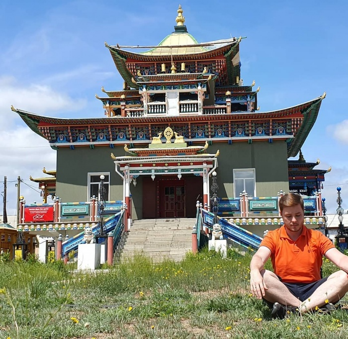
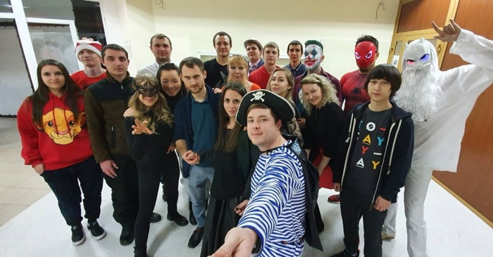
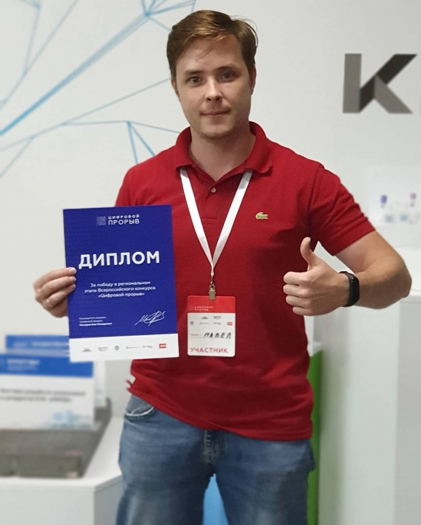
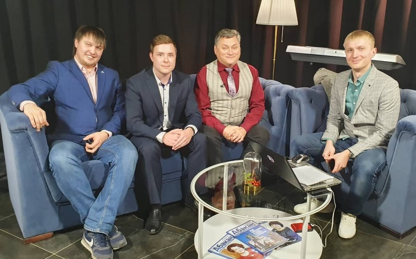
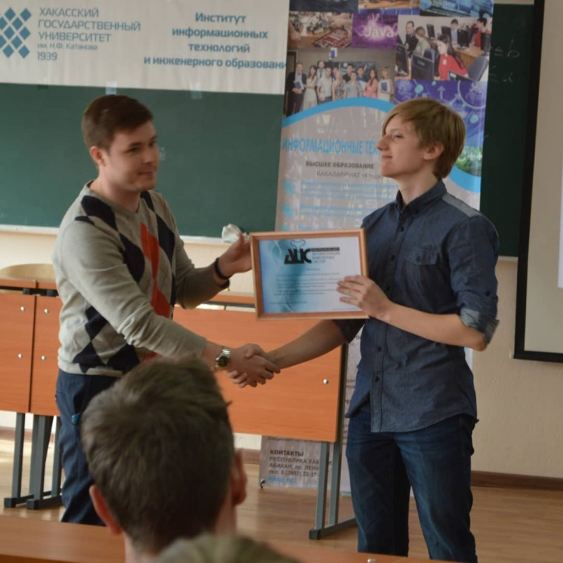

# Павел Усольцев - директор компании СибТехноСтрой

Дата создания: 2020-06-30

Автор: ngrebenshikov

Теги: Личности,Хакасия,IT в Хакасии,Павел Усольцев

С [Павлом Усольцевым](https://www.instagram.com/lflagmanl/), директором компании [СибТехноСтрой](http://sibtechnostroy.ru), мы с завидной регулярностью пересекались на различных конкурсах для программистов, где он и его компания выступали спонсорами. Многие победители этих соревнований становились сотрудниками в его фирме. Мне всегда было интересно узнать, как он построил свой IT бизнес в Хакасии, как удается привлекать к себе талантливых программистов. Я рад, что, наконец, удалось это сделать! Ниже представлен наш с ним разговор.    
  
 

#### Образование
  
**Павел, расскажи, пожалуйста, каким образом компьютеры и информационные технологии появились в твоей жизни? С чего начинал? Что послужило толчком связать свою жизнь с IT?**  
  
В школе я учился по экспериментальной программе. Информатика у нас появилась в 5 классе (до этого она начиналась с 7 класса). Мне повезло, что первым учителем у меня был человек, который очень любил программировать, что очень передалось мне. На уроке информатике пока большинство одноклассников просило поиграть в какие-нибудь игры (на тот момент мало у кого дома были компьютеры), я постоянно мешал всему классу и просил давать задания именно на программирование. В тот момент я понял, что для меня это очень интересно и решил стать программистом. Так с 5 класса я целенаправленно готовился к поступлению на информационные технологии.  
  
**Почему остался в городе Абакане и поступил в Хакасский гос. университет? Что происходило интересного за время учебы? Что дало тебе высшее образование вообще и ХГУ в частности?**  
  
После окончания школы у меня были неплохие данные по ЕГЭ, но документы я подавал только в один ВУЗ (ХГУ, ИИТ). Была полная уверенность, что я поступлю и что именно в этот ВУЗ. Я знал очень много выпускников данного ВУЗа, и я видел, что они действительно очень хорошие специалисты в ИТ.   
  
**Не пожалел, что остался в Абакане? Что Абакан дал тебе и что он может дать молодым специалистам?**  
  
С самого начала обучения я приходил с горящими глазами на занятия и хотел стать крутым программистом, но начиная с первых же дней что-то пошло не так… Я смотрел на дисциплины, которые висели в расписании, и думал как я поскорее хочу прийти на занятие и научиться. По приходу же я видел или некомпетентных преподавателей или вообще их не видел (очень часто преподаватели просто не приходили на занятия). Все это очень угнетало меня, и я начал подумывать о переводе в другой ВУЗ. Но потом я наткнулся на одну статью в интернете, она называлась «Армия программистов». В статье рассказывалось, как молодой человек поступил в Харьковский ВУЗ, и как он был счастливым, что теперь его будут обучать программированию, но столкнулся с такими же проблемами что и я. В итоге он перевелся или поступил в Московский ВУЗ с надеждой на изменения, но там его ожидал, точно такой же сценарий что и в Харькове, после чего он сделал вывод, что, если хочешь научиться, учись сам. И тут мне очень сильно вспомнились слова С.В. Швеца, который на встрече с первокурсниками сказал: «30% даёт вам институт 70 % вы должны получать сами, если вы хотя бы полгода не вникаете в то, что происходит в ИТ сфере, вы уже теряете свою квалификацию». На тот момент не было онлайн школ программирования и других обучений, поэтому я решил подстроиться под реалии рынка Абакана и переквалифицироваться на сетевые технологии.  
  
**Посоветуешь ли ты сейчас получать высшее образование в области информационных технологий? И где? В ХГУ?**  
  
Сейчас я понимаю, что институт нужен для формирования мышления и развития общего кругозора, но если ты хочешь стать именно хорошим специалистом, то должен в этот период максимально прокачивать себя, не так важно где ты учишься, важно насколько ты прокачаешь себя. Возможно, в нескольких ВУЗах Москвы и Питера это не так и там действительно ты получишь качественные знания, но что касается Абакана, Красноярска, Новосибирска, думаю примерно одинаково, все зависит только от тебя самого.  
  
   
  

#### Предпринимательство
  
**Каким образом ты стал предпринимателем? Что на это повлияло?**  
  
После окончания первого курса я понял, что нужно что-то менять и пошел работать, набираться опыта. Работал менеджером по продажам, сетевым администратором, даже какое-то время на лесопилке. При прохождении практики в компании СибирьТелеком (ныне Ростелеком) хорошо себя зарекомендовав, мне было предложено остаться на постоянной основе. Так прошли 4 года. В это время происходил «Бум интернета» в Хакасии, и я получил огромные знания в построении сетей и их администрировании. После чего мне поступило предложение от компании «Интеллект-центр» возглавить их отдел информатизации (на тот момент это было одна из самых крупных компаний в области строительства связи в Хакасии). Все чаще у меня стали появляться мысли о том, что я хочу попробовать заниматься своим бизнесом. И спустя два года я ушел из «Интеллект-центр», организовав свою компанию.   
  
**Какая была твоя первая компания? Как происходило ее становление?**  
  
У меня было очень мало знаний в области ведения бизнеса, поэтому за хорошим началом последовали большие проблемы. Я начал пробовал делать объединения с другими компаниями и искать свою нишу, но все заканчивалось не очень хорошо. И в 2013 году я решил вернуться к тому, с чего начал, а именно в строительство объектов связи (СКС, ЛВС, прокладка магистральных линий связи). Так как я хорошо себя зарекомендовал в этой области по работе в «Интеллект-центр», я очень быстро начал находить контракты, а их успешное и качественное выполнение приносило нам новые контракты. Так мы начали работать с СУЭК, Ростелеком, Мегафон, МТС, КБ Искра. Однажды нам предложили сделать интеграцию программных продуктов для компании СУЭК, на тот момент у нас не было программистов, но данная сфера всегда очень манила меня и воспользовавшись моментом, мы взялись за этот заказ и успешного его выполнили, так появилась компания КБ «АИС».  
  
**Расскажи, подробнее, как сейчас построена у вас работа. Чем именно ты занимаешься? Как проходит твой день?**  
  
На данный момент мы занимаемся разработкой и поддержкой ERP систем. Вся работа у нас построена на принципах Agile, где я занимаюсь наблюдательно-корректирующими функциями, в технологический процесс я, практически, не вхожу, это дело Project Manager. Моя задача сейчас в основном курирование работы подрядчиков (коих у нас собралось не мало: Москва, Казань, Новосибирск, Челябинск) и согласование новых проектов с заказчиками.  
  
**Когда ты понял, что получилось создать что-то значительное?**  
  
Сложно самому оценить значительность своей работы. Но в какой-то момент мы перешли из разряда подрядчиков для угольщиков в разряд партнеров. Мы стали запускать совместные проекты, и это очень сильно изменило отношение к нашей компании.  
  
**Как произошел переход от региональной компании к бизнесу, ориентированному на федеральный уровень? Как получается работать в таком формате из Хакасии?**  
  
В Республике Хакасия, мало кому нужна разработка ПО, поэтому мы фактически и не работали на местном уровне, наш первый же контракт на разработку был для 6-ти предприятий (Мурманск, Бурятия, Кузбасс, Красноярск, Хабаровск, Чита). Хотя на самом деле очень хочется что-то создавать для РХ, для улучшения жизни населения именно у нас, мы даже предлагали это администрации г. Абакан (на безвозмездной основе), но не нашли заинтересованности. Весь штат наших программистов находится в РХ, это упрощает внутреннее взаимодействие. А вот с нашими подрядчиками, конечно, есть проблемы, но в эру быстрого интернета и такого количества средств связи, все это благополучно решаемые проблемы.  
  
**Получаешь ли ты сейчас удовольствие от работы? Что приносит его больше всего?**  
  
Мне кажется, для технарей лучшая похвала, это когда ты понимаешь, что твоим продуктом пользуются и ты видишь в нем необходимость. Сейчас мы очень много работаем над проектами с безопасностью жизнедеятельности, мы понимаем, что наши решения могут спасти чью-то жизнь или уберечь от порчи дорогое имущество. Это очень мотивирует создавать что-то новое.   
  

#### Проекты
  
**В мартовском интервью ты упоминал, что вы создаете интересные «фишечки», которые поставляете по все России. Расскажи, пожалуйста, подробнее. У нас можно рассказать больше технической информации, чем на ТВ.**  
  
До недавнего времени нашей самой поставляемой «фишечкой» была система учета наработки узлов и агрегатов карьерной техники. Мы продали её на несколько предприятий. На данный момент она собирает статистику, которая в последующем будет обрабатываться. Но сейчас наши основные силы направленны на разработку контроллера для карьерной техники. Он будет включать в себя такие системы как предотвращение наезда на человека, опрокидывание самосвала с отвала, учет перевезённой массы, пройденного расстояния, учет топлива, фиксирование поломок и простоев техники. На данный контроллер есть большой интерес в добывающей промышленности. В июне мы проводили финальные тестирования, где наш контроллер очень хорошо себя показал.  
Совместно с нашими подрядчиками разрабатываем систему усталости водителей во Владивостоке, которая будет по лицу определять устал ли водитель, отвлекается ли он на посторонние вещи, такие, например, как телефон. Так же ведем разработку детектирования возгорания в самосвалах.   
  
**Во что вы инвестируете свою прибыль? Есть ли у вас собственные продукты, проекты, которые вы делаете не на заказ?**  
  
Мы делим прибыль на 3 части: поддержание оборотных средств, резервные накопления и закупку недвижимости и оборудования.  
  
Программно-аппаратные продукты у нас есть. Их я описал ранее, но есть у нас еще один продукт, который очень упростил нам жизнь. Он называется [Подотчетник (2Cash)](https://tocash.su), данный сервис нам помог разобраться с движениями денежных средств внутри компании, а так же мы очень четко стали отслеживать рентабельность по всем проектам.  
  
   
  
   
  

#### Конкурсы
  
**Для чего вы с единомышленниками поехали на цифровой прорыв? Расскажи, пожалуйста, о результатах. Что это дало вам?**  
  
Мне очень нравится формат состязаний хакатон, считаю его очень продуктивным и полезным, когда ты очень короткий срок заставляешь свой мозг активизироваться и выдать готовый продукт. Когда мне пришло приглашение, я захотел принять в нем участие, очень впечатлил его масштаб (самый большой хакатон в мире). Если быть честным, то я не очень верил, что мы сможем пробиться в финал и там очень достойно выступить. Но наша команда очень сплочённо работала на всех этапах и в итоге мы заняли второе место. От хакатона мы получили очень много приятных эмоций и огромный опыт. На этом в принципе и все, на местном уровне в Хакасии, данная тема не очень кого-то интересовала.   
  
**Почему тебя коллеги сравнивают с Илоном Маском и как ты к нему относишься?**  
  
Кто со мной часто общается знают, что я очень негативно отношусь к бизнесу и технологиям, которые предлагает Илон, но в тот же момент всегда удивляюсь его таланту маркетолога, что он может все что угодно преподнести как нечто прорывное и великое. Поэтому люди, с кем я часто общаюсь, не сравнивают меня с ним. Так обычно говорят люди, которые узнают про нас и про нашу деятельность в РХ. Но был забавный случай, когда таксист в Челябинске мне сказал: «Извините, не могу не отметить, вы очень похоже на Илона Маска».   
  
**В 2017 годы ты победил в конкурсе “Лучший молодой предприниматель города Абакана”. Почему ты участвовал в этом конкурсе?**  
  
В 2014 году администрация г. Абакан меня пригласила на конкурс дебатов предпринимателей, в первом же раунде я проиграл (в будущем моя соперница победила в финале), как мне показалось абсолютно не заслуженно. В 2017 мне снова предложили принять участие, но уже в номинации «Лучший молодой предприниматель». Мне очень хотелось реваншироваться за то поражение, поэтому я принял участие. И мне удалось победить, хотя я очень сильно сомневался.  
  

#### Влияние на общество
  
**Не так давно ты стал организатором бизнес-клуба в Хакасии. Что это, зачем он нужен? Что ты хочешь добиться его созданием?**  
  
В БКХ, мы помогаем себе и помогаем другим предпринимателям. Мы создаем цели для развития человека и делаем все, чтобы он выполнил их. Также помогаем с разрушением «туннельного зрения». Кто-то выносит проблему на общее обсуждение, и другие участники предлагают варианты решения. Мне очень помогает этот клуб не бросать спорт, так же мотивация на выполнение скучных и муторных задач. С помощь «геймификации» работать с такими задачами намного проще.  
  
   
  
**Как это связано с тем, что ты поддерживаешь школу самбо и школьников-программистов? Для чего ты это делаешь?**  
  
Потому что я живу в этом городе/стране. Мне хочется, чтобы молодежь не слонялась и не занималась чем попало. В моем детстве ничего подобного не было, хочется, чтобы нынешние дети жили в более благоприятных условиях. Поэтому и продолжаю сотрудничать.  
  

#### Настоящее и будущее информационных технологий
  
**Требуются ли твоим компаниям программисты и другие специалисты? Как вы находите себе новых сотрудников? Расскажи, пожалуйста, кто вам требуется? Что вы цените больше всего?**  
  
Да, конечно. Ведем постоянный набор по очень многим позициям: программисты, инженер АСУ ТП, инженер связи, кабельщики-спайщики, монтажники… В основном ищем через сервисы hh.ru, avito.ru. Иногда приходят на практику, и мы предлагаем остаться. Если мы берем человека из института или выпускника, то в первую очередь я обращаю внимание на его желание развиваться, становиться лучше. Я никогда не прошу любить мою компанию и восхвалять меня. Я прошу делать такой продукт, за который он сам будет испытывать гордость.  
  
**Дай, пожалуйста, несколько советов как стать успешным в информационных технологиях и быть востребованным на рынке**.  
  
Если мы говорим о начинающих специалистах, то я бы советовал им не зацикливаться на одной какой-то области, прощупывать, смотреть кто требуется, какие задачи решаются. Спустя 3-4 года начинать целенаправленно уходить в одно направление. Тогда на ранних этапах тебя будут ценить как программиста способного заткнуть все «дырки», а потом, когда ты заточишься в определенную область, то сможешь просить и хорошую ЗП и условия работы.  
  
**Как развиваются информационные технологии в мире и в Абакане? Будут ли нужны программисты в будущем? Как изменится их работа?**  
  
Если брать Хакасию, то в целом здесь очень слабо развиты IT технологии, по большей части у нас прикладное IT. В связи с этим большинство IT предприятий Хакасии ориентируются на внутренний уровень обслуживания (1С, консультант и т.д.). Немногие начинают работать на внешний федеральный уровень. Из-за очень слабой подготовки IT специалистов, здесь очень тяжело конкурировать несмотря на относительно низкие ЗП. Было бы очень хорошо, если у нашего руководства РХ было бы желание менять этот момент. Необходимо делать более глубокую автоматизацию с привлечением местных компаний, это повысило бы уровень IT сферы в Хакасии, и также повысило качество жизни населения.  
  
Если же в целом, то программисты будут очень нужны, так как автоматизация все больше проникает в наш мир. Может быть меньше станет программистов в офисах, а больше на удаленной работе дома. Думаю, под это очень скоро появятся изменения в методологии Agile.  
  
**Нужно ли для того, чтобы быть успешным в IT, создавать свою компанию? Каждому ли это дано?**  
  
Как говорится — «Было бы желание». Многие боятся. Хотя я не вижу ничего критичного в том, чтобы заняться бизнесом. Если ничего не получится, можно пойти работать по найму. Если ты хороший специалист, то место работы тебе точно найдется.   
  

#### **Финальный вопрос: Кто такой настоящий программист?**
  
Вот здесь все очень спорно. Но скажу только свое мнение и никому его не хочу навязывать. Настоящий программист – это специалист умеющий понять проблематику пользователя и разрешить её, использую технические средства и инструменты.