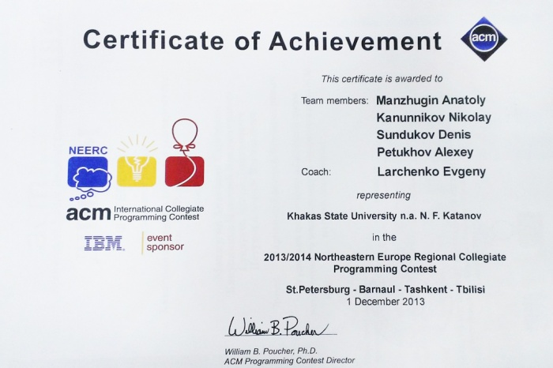
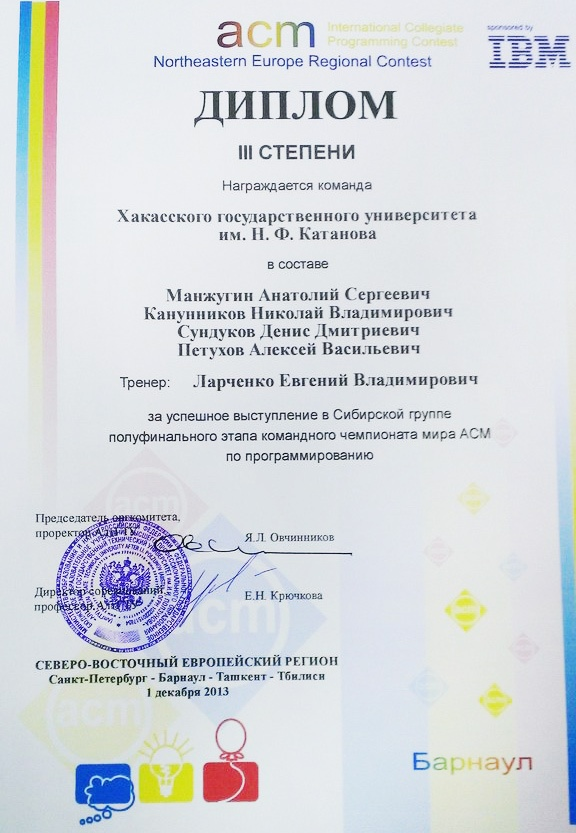

# Результаты полуфинала чемпионата мира по программированию в Барнауле, 2013

Дата создания: 2013-12-06

Автор: ngrebenshikov

Теги: ACM ICPC,NEERC,Турниры

   
  
1-го декабря проходил полуфинал чемпионата мира по программированию в северо-восточном европейском регионе (ACM ICPC 2013-2014, Northeastern European Regional Contest). Он проходил сразу в четырех городах: Санкт-Петербурге, Барнауле, Ташкенте и Тбилиси. Наши ребята (команда Хакасского государственного университета) принимали участие в полуфинале в Барнауле.  
  
Начало выступления было хорошим. Через 18 минут после старта была решена первая задача. Только вот второй пришлось ждать больше четырех часов. Так с двумя задачами команда ХГУ и закончила выступление. Заняв при этом 131-е место из 250 команд. Интересно, что статус-кво Восточно-сибирской зоны остался таким же как и в четверть финале. Абаканская команда оказалась второй вслед за командой математиков из Красноярска, которые решили 5 задач и им не хватило лишь 15 штрафных минут, чтобы отобраться в финал.  
  
**[Финальная таблица результатов!](http://neerc.ifmo.ru/information/standings.html)**  
  
 