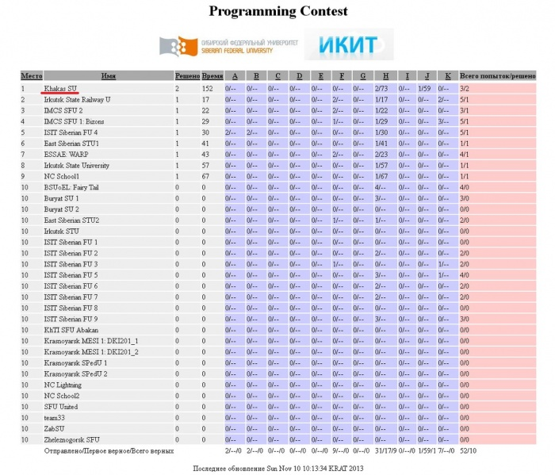
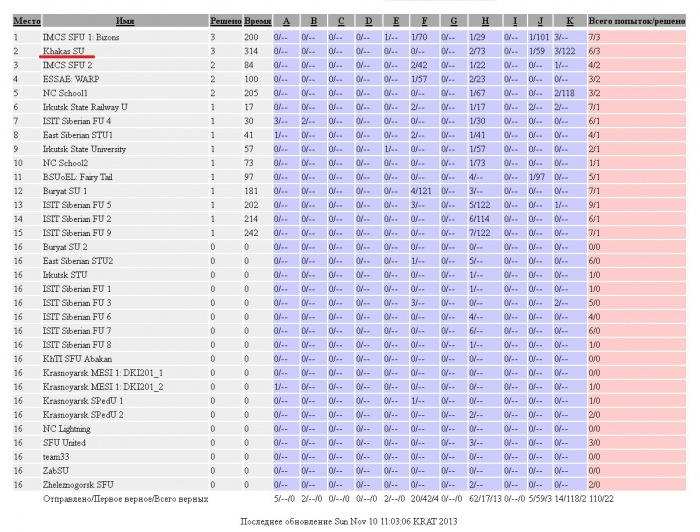
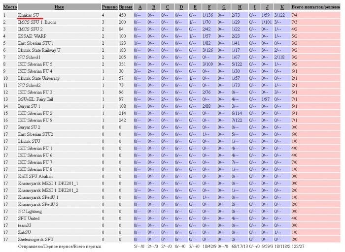
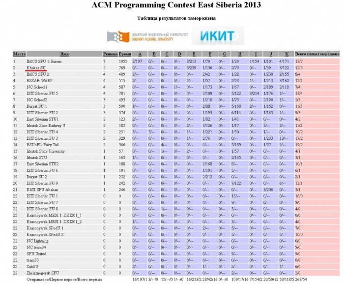

# Ход  и результаты восточно-сибирского четверть финала чемпионата мира по программированию в Красноярске, 2013

Дата создания: 2013-12-06

Автор: ngrebenshikov

Теги: ACM ICPC,NEERC,Турниры

10-го ноября состоялся четверть-финал по результатам, которого команда ХГУ им. Н.Ф. Катанова заняла второе место. Наивысшее за всю историю участия команд хакассго гос. университета в олимпиадах.  
  
Благодаря усилиям [Дениса Сундукова](https://vk.com/this_is_deenchik) (одного из участников абаканской команды) мы можем проследить ход турнира.  
  
   
  
С первых минут команда ХГУ борется на победу. После решения двух задач ХГУ на первом месте.  
  
   
  
На рубеже трех задач Бизоны из института математики СФУ обходят абаканцев.  
  
   
  
Но с решением четвертой задачи ХГУ вновь в лидерах.  
  
   
  
До заморозки Бизоны успевают решить 7 задач, а Абакан только 5.  
  
   
  
За оставшийся час Бизоны решили еще две задачи. Наши ничего не решили, но второго места уже никому не отдали. Поздравим нашу доблестную команду с потрясающим результатом! Состав команды ХГУ: Анатолий Манжугин, Николай Канунников и Денис Сундуков.

#### [Финальные результаты!](http://webcache.googleusercontent.com/search?q=cache:D6CzKEVJfaMJ:ikit.sfu-kras.ru/files/ikit/summary_2013.html)
Странно, но сайт СФУ в данный момент лежит, поэтому ссылка на кэш гугла.