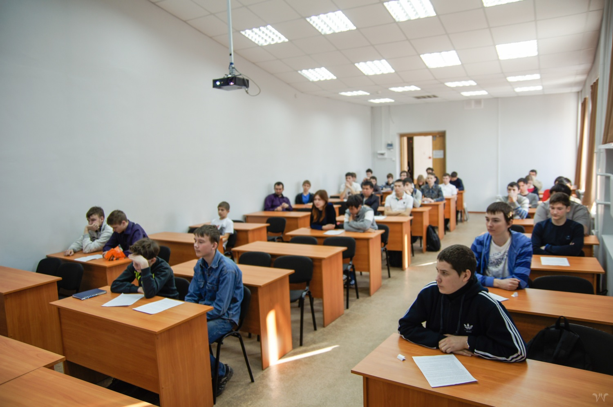

# Фотоотчет с олимпиады школьников по программированию в ХГУ, весна 2014

Дата создания: 2014-04-04

Автор: ngrebenshikov

Теги: Открытый турнир по программированию,Школьники,Олимпиады,Катановские чтения

 

 

 

 

 

 

 

 

 

 

 

 

 

 

 В довесок к фотографиям выкладываем [видеопоздравление несостоявшегося участника](https://docs.google.com/file/d/0B1bfMO4jKxnIZ3BzZU45czlKZGM/preview).

