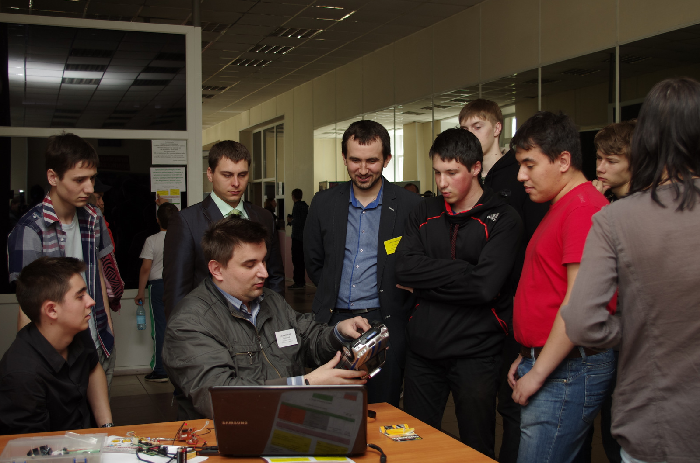
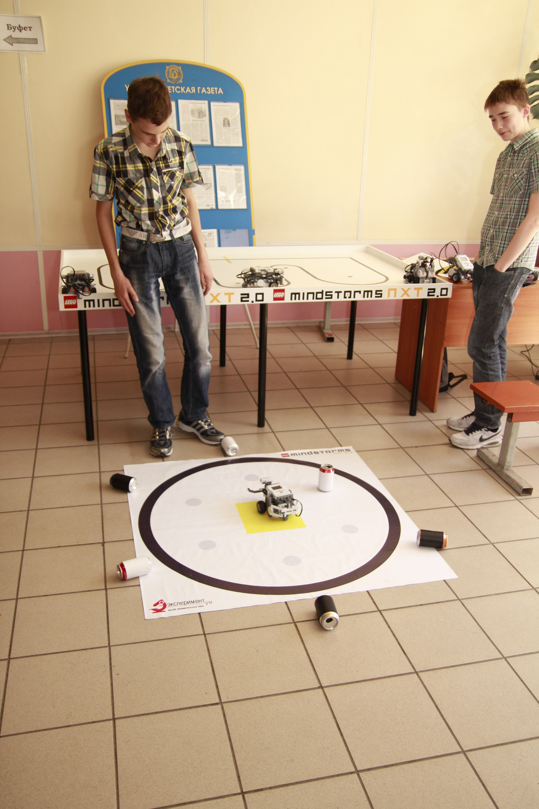
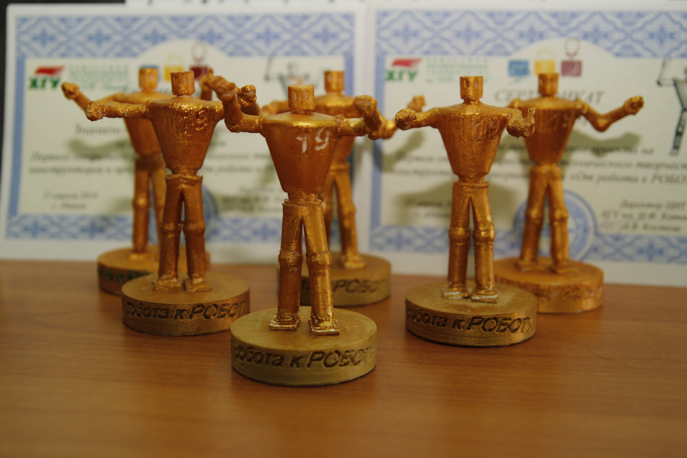
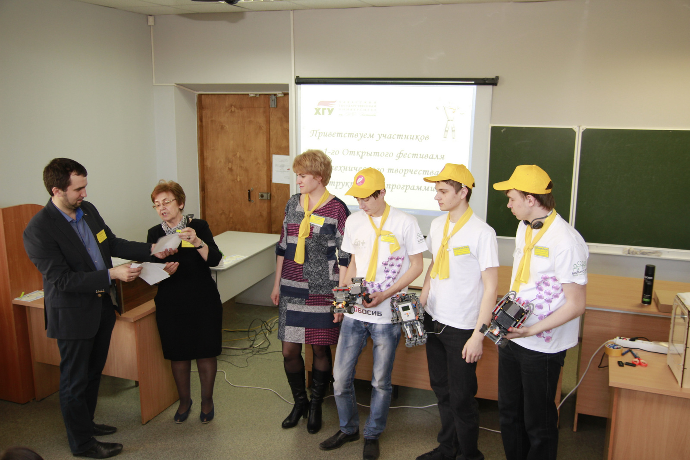

# Итоги фестиваля "От робота к РОБОТУ"

Дата создания: 2014-04-29

Автор: kostyush_av

Теги: фестиваль,техническое творчество,конструкторы и программисты,От робота к РОБОТУ,Робототехника

 

 

 

 

 

 

 

 

 

 

 

 

 

 

 

 

 

 

 

 

 

 

 

 

 

 

 

 

 

 

 

 

 

 

 

 

 

 

 

 

 

 

 

 #### Первый открытый фестиваль технического творчества конструкторов и программистов « От робота к РОБОТУ» в Хакасском государственном университете состоялся 27 апреля.
На этом ярком, красивом празднике увлеченных интересным делом людей демонстрировали результаты технического творчества школьники из 4 школ (СОШ №3 Сорска, Лицей и СОШ №10 из Абакана, Гимназия из Черногорска), школьники из Абаканского ЦДТ и Музея занимательных наук ЭкспериментУМ из Абакана, учащиеся Школы программистов ХГУ им. Н.Ф. Катанова, студенты Хакасского политехнического колледжа и Хакасского государственного университета, сотрудники Центра информационных технологий и Ресурсного Центра ХГУ, лаборатории 3Д INVI. В процессе соревнований, показательных выступлений и мастер-классов были представлены результаты работы команд по 22 проектам. Все команды–участники удостоены сертификатов Первого фестиваля и специального кубка в виде фигурки робота, с указанием названия Фестиваля «От робота к РОБОТУ», места и года его проведения «ХГУ-2014». Название точно отражает содержание. Представлены устройства и роботы разных категорий, разного назначения: от игровых, с использованием Lego до служебных, которые активно используются на предприятиях и очень востребованы. Это и подтвердил гость Фестиваля, представитель министерства регионального развития Республики Хакасия Максим Никитович Усанов.   
 В этот воскресный день учебный корпус №1 университета отличался от рабочих дней не тишиной, а активной бурлящей жизнью в аудиториях и коридорах без перерыва от начала размещения команд по площадкам с 9ч. утра до 15ч. Завершилась презентация проектов показательным полетом многофункционального летающего робота – квадрокоптера. Это достаточно символично. Широкий возрастной диапазон участников и гостей Фестиваля, изменение формы представления результатов от веселого футбола, сумо и управления машинками до полета квадрокоптера как символ стремления участников вперед и вверх. Основная проблема, которая возникала у многочисленных участников, членов команд и гостей (более 150 человек) — везде успеть и все увидеть. Пропустить что-то важное и интересное при такой массе совершено разных проектов было неудивительно.  
Первый фестиваль задумывался как определенный смотр проектов, команд участников и команды руководителей, которые приняли активное участие в подготовке Фестиваля. За это им огромное спасибо.   
Организация таких Фестивалей — наше общее дело, общий большой, нужный и интересный проект. Пусть станет доброй традицией проведение в апреле каждого года Открытого фестиваля технического творчества конструкторов и программистов «От робота к РОБОТУ».  
Пусть окончание 1-го Фестиваля станет началом подготовки следующего. Главная задача организаторов Фестиваля, руководителей команд, педагогов – повышение уровня подготовки школьников и студентов по программированию arduino устройств и роботов. Решение этой задачи необходимо и для обеспечения условий соревнований по определенным номинациям. Фестиваль показал, что есть команда педагогов–энтузиастов, которая готова согласовывать формы и содержание работы, делиться опытом. А главное — есть школьники и студенты, которые хотят и могут выполнять такие интересные проекты.   
Пусть ожидаемое всеми лето и очередной учебный год будут содержательными и результативными.  
Пусть найдутся люди, компании, желающие принять активное участие в подготовке условий, учебно-материальной базы для обучения конструкторов и программистов робототехники. Такая инициатива по поддержке кружков робототехники уже действует в Екатеринбурге.  
Пусть всегда на Фестивале конструкторы и программисты удивляют новыми идеями, решениями и способностью представлять свои проекты.  
Просим направлять свои отзывы об организации и содержании 1-го Фестиваля и пожелания, предложения, которые помогут подготовить и провести очередной Фестиваль еще более массово, более содержательно, более интересно и обеспечить условия для настоящих соревнований в орг. комитет по адресу: erna19mail.ru или kostyush\_av@khsu.ru  
  
Координаторы Фестиваля Александр Костюш, директор ЦИТ, Эрна Горбачева, руководитель Школы программистов.