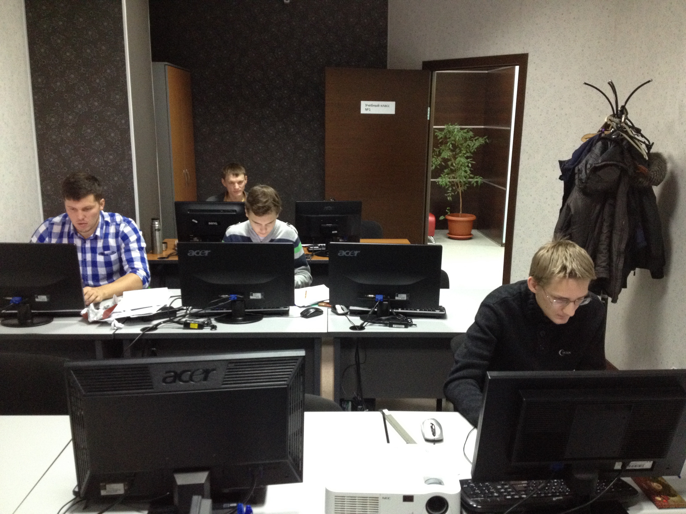
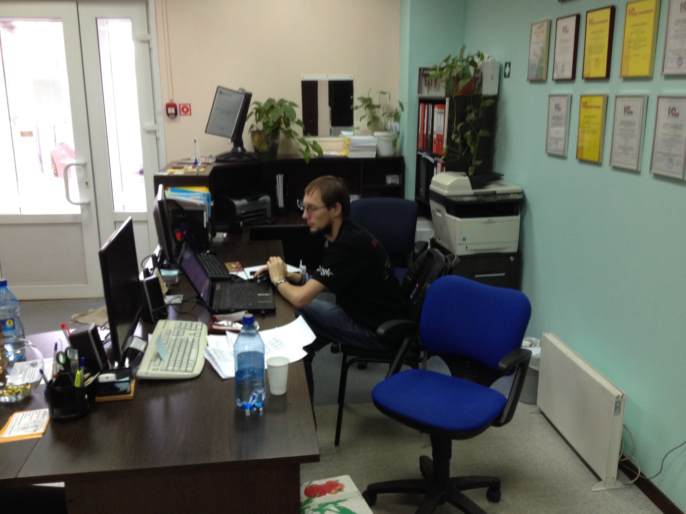

# Результаты 6-го турнира по программированию в Абакане

Дата создания: 2014-11-22

Автор: ngrebenshikov

Теги: Открытый турнир по программированию,Турниры

 

 

 

 

 

 

 

 

 - [Таблица результатов](https://docs.google.com/spreadsheets/d/1b56Gc4vlDwTArulcFfz1CcHPn3WQrflwRhwb67LJ8xg/pubhtml?gid=0&single=true)
- [Условия задач, тесты и решения жюри](http://contest.lambda-calculus.ru/abakan-contest-2014-11-22.zip)
- [Дорешивание](http://contest.lambda-calculus.ru/cgi-bin/new-client?contest_id=2)

