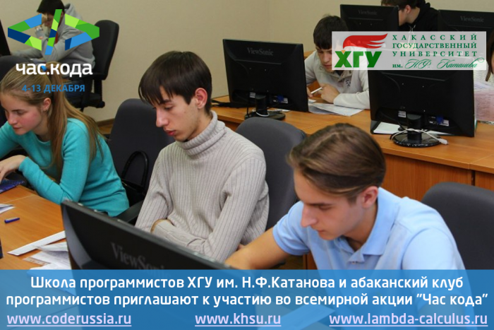

# Час Кода - 2015

Дата создания: 2015-12-03

Автор: ngrebenshikov

Теги: Час кода,Программирование,Школьники

   
  
4 декабря в День информатики в рамках всемирной акции стартует акция « Час Кода России».  
  
Школа программистов ХГУ им. Н, Ф. Катанова и абаканский клуб программистов второй год приглашают к участию в акции «Час Кода» образовательные учреждения региона, школьников, студентов, родителей, IT-специалистов и обеспечивают информационную и методическую помощь организаторам мероприятий.    
  
Акция направлена на повышение интереса молодежи к информационным технологиям, на инициирование и поддержку интереса к изучению информатики и программирования, повышению престижности IT- специальностей и направлений подготовки для молодых людей.  
  
Участие в проведении мероприятий этих мероприятий, анализ результатов, интереса и активности школьников и их родителей позволит найти новые интересные формы работы для выявления и развития интересов, склонностей и способностей ребят к программированию кроме Школ программистов в течение учебного года и летних Школ, Олимпиад и Турниров по программированию, Фестивалей конструкторов и программистов «От робота к РОБОТУ», которые традиционно проводятся в ХГУ им. Н.Ф.Катанова.   
Мы вместе сможем найти новые формы соревнований, общения ребят, объединенных интересом к программированию, в нашем регионе.  
  
Начиная 4.12.2015 на сайтах [www.khsu.ru](http://www.khsu.ru) и [www.lambda-calculus.ru](http://www.lambda-calculus.ru) будут размещаться материалы в помощь преподавателям, организаторам мероприятий акции. С 7.12.2015 будет размещаться информация о количестве участников, местах проведения и содержании мероприятий акции «Час Кода» в образовательных учреждениях, участвующих в акции по приглашению Школы программистов ХГУ им. Н.Ф. Катанова и абаканского Клуба программистов, направивших информацию по адресам erna19@mail.ru и grebenshikov.n@gmail.com  
  
Интересных, увлекательных и познавательных мероприятий организаторам и участникам! Новых успехов настоящим и будущим программистам и всем специалистам в сфере IT-технологий.  
  

#### Расписание мероприятий в рамках Всероссийской образовательной акции «Час кода 2015» с 4 декабря по 13 декабря
   
  

##### Абакан
  

###### Школа программистов ХГУ им. Н.Ф.Катанова
  
**5 декабря** с 14.50, пр. Ленина, 92 (блок Б)   
Программа ДО «Программирование на языке PASСAL ABC»  
Мастер-классы Работа с циклами  
ауд.603, преподаватель: Романюк В.В.  
ауд.607, преподаватель: Семенов А.И.   
Конструирование электронных устройств и программирование микроконтроллеров  
Мастер –класс Создание световых и звуковых эффектов при помощи мультивибраторов, таймеров и микроконтроллеров.  
ауд.605, преподаватель: Вишняков Т.Н.  
  
**8 декабря** с 14.50, Щетинкина, 13   
Колледж педагогического образования, информатики и права  
Мастер-класс Работа с массивами  
ауд. 48, преподаватель: Табаргина Г. В.  
  
**10 декабря** с 14.50, Щетинкина, 13   
Колледж педагогического образования, информатики и права  
Мастер-класс Работа с массивами  
ауд. 48, преподаватель: Табаргина Г. В.  
  
**12 декабря** с 14.50, пр. Ленина, 92 (блок Б).   
–Лекция Массивы  
Ауд. 603, преподаватель: Романюк В.В.  
Конструирование электронных устройств и программирование микроконтроллеров  
Управление электродвигателями при помощи микроконтроллера  
  

##### Черногорск
  

###### МБОУ «Гимназия»
   
  
**7 -9 декабря  
5 -9 классы** Игра — презентация «Умной вещи»-  
Девятова Л.С., Калагина М.В., Файзулина Р.Х.   
  
**8-9 декабря   
1-4 классы** Графический диктант «Рисуем роботов и героев»-  
Бессонова Е.В., учителя начальных классов.  
  
**8-11 декабря   
8-10 классы** Викторина «IT –специальности» — учителя информатики, классные руководители  
  
**11 декабря**  
Надточий А.В, Гусак А.С., Киселев А.А.  
1-4 класс Урок-игра — 5-7 класс Классный час «IT –праздники»   
8-11 класс Классный час «Имидж ИТ, как молодой и инновационной индустрии».  
  
Организация в ходе акции работы учащихся на тренажерах на сайте [www.часкода.рф](http://www.часкода.рф) и [studio.code.org/](https://studio.code.org/) в формате одного занятия