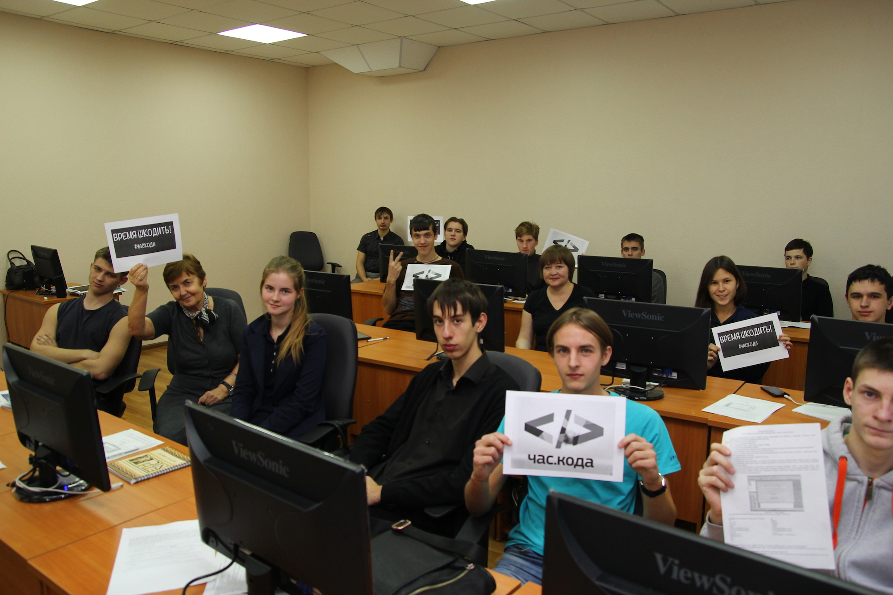
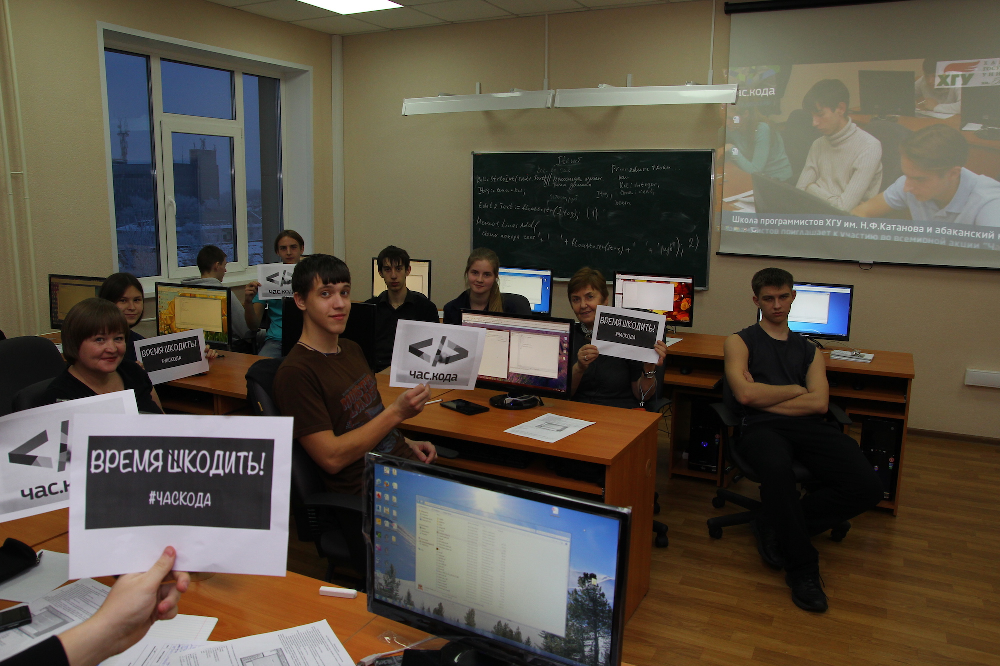
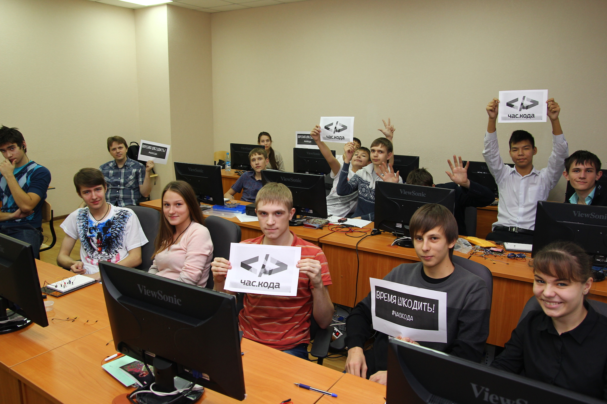
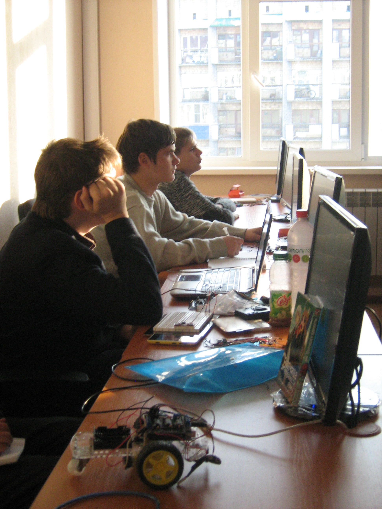
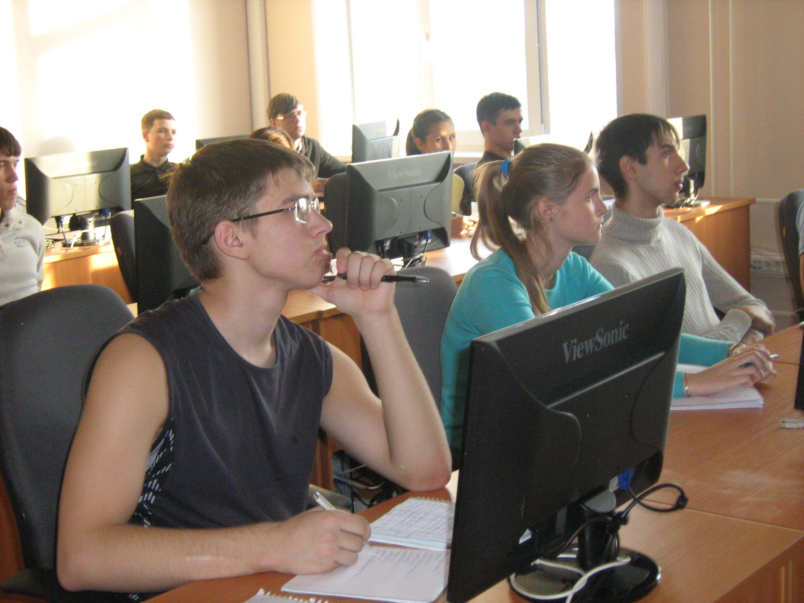
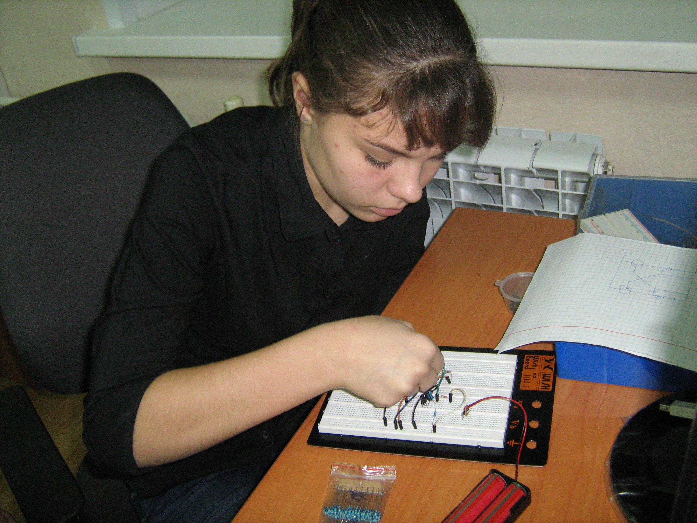
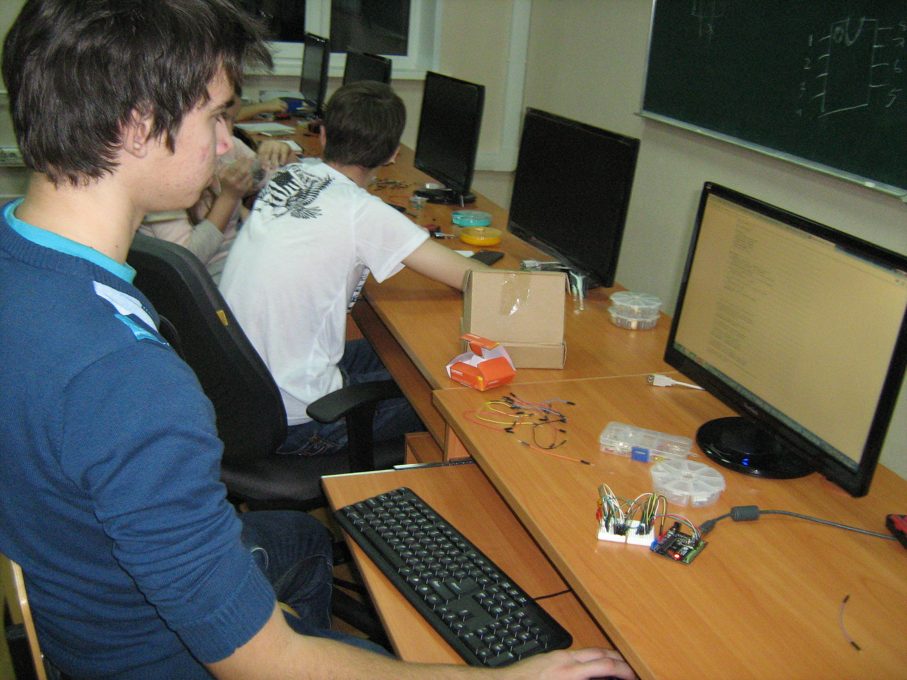
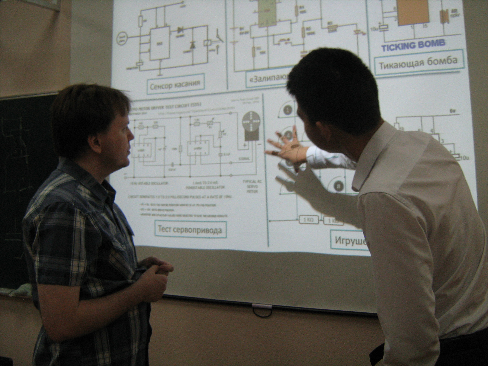

# Вести с часа кода - 2015

Дата создания: 2015-12-07

Автор: ngrebenshikov

Теги: Час кода,Программирование,Школьники

 

 

 

 

 

 

 

 5 декабря в Школе программистов ХГУ им.Н.Ф.Катанова, еще до начала занятий школьники почувствовали особую атмосферу акции «Час Кода». В привычных для слушателей Школы студенческих аудиториях плакаты с приглашением на Час Кода, поздравления с Днем информатики в России и другие сюрпризы.  
  
Занятия начались с просмотра яркой, содержательной видео лекции, виртуальной встречи с представителями ведущих ИТ-компаний, известными людьми — ведущими специалистами в разных отраслях производства. Гости виртуальной встречи в своем обращении к молодежи поделились своим взглядом на перспективу развития, рассказали о том, о роли информационных технологий в жизни, в производстве, чем могут привлечь молодых людей, мечтающих добиться успеха в будущем.  
  
48 школьников из разных школ Абакана, Черногорска, Сорска, Белого Яра и с. Подсинее стали участниками мастер-классов специалистов в сфере IT-технологий, ведущих преподавателей информационных дисциплин: «Работа с циклами на языке Pascal ABC», «Создание световых и звуковых эффектов при помощи мультивибраторов, таймеров и микроконтроллеров», «Работа с циклами в Delphi».   
Кроме обычных заданий для работы, учащиеся получили ссылки на интересные и информативные материалы, которые позволят желающим чувствовать себя активными участниками акции « Час Кода» до 13 декабря и в любое время, пригласить к этому важному мероприятию своих друзей.  
  
Пусть мероприятия в рамках акции «Час Кода» станут для школьников началом или продолжением серьезного увлечения программированием, осознания необходимости информационного образования для современных специалистов.

#### Пригласите друзей на Час Кода
Уважаемые ребята, приглашаем вас, ваших друзей и родителей на Час кода с 4 декабря до 13 декабря.   
Пройдя по ссылкам, приведённым ниже, вы можете узнать много нужного и интересного о роли программирования в жизни и производственной деятельности.   
  
Одинаково увлекательными могут быть и мотивационные видеосюжеты, и видео лекции и игра на тренажере. Для вас помещена ссылка на занятия в Школе программистов в 2013 году.  
  
Вы можете увидеть выпускников школы — сегодняшних студентов информационных направлений подготовки и задать любые вопросы при встрече с ними.  
Советы специалистов тоже помогут вам в освоении программирования. Интересных просмотров.   
Успехов в освоении программирования   
  
[www.coderussia.ru/](http://www.coderussia.ru/)  
− Официальный сайт Часа Кода.  
Советуем начать просмотр с мотивационного ролика   
[www.xn--80aalxuq4b.xn--p1ai/teachers.html](http://www.xn--80aalxuq4b.xn--p1ai/teachers.html) Видеолекции «Час кода»   
Яркая лекция-обращение представителей ведущих ИТ-компаний к молодежи, в которой они делятся своим взглядом на перспективу развития информационных технологий, на то, как изменится мир в самом ближайшем будущем, и рассказывают о том, чем ИТ может привлечь молодых людей, мечтающих добиться успеха в будущем.   
  
[www.xn--80aalxuq4b.xn--p1ai/treasurehunter.html](http://www.xn--80aalxuq4b.xn--p1ai/treasurehunter.html) Онлайн-тренажер. Приглашаем поиграть с пользой для развития своих способностей по программированию. Это интересно, легко, и полезно  
[tubethe.com/watch/z6-cpR-\_N5M/film-shkola-progra-](http://tubethe.com/watch/z6-cpR-_N5M/film-shkola-progra-) Начало занятий в Школе программистов ХГУ 2013 год, Сегодняшние школьники могут узнать своих знакомых, выпускников школ, которые сейчас являются успешными студентами информационных направлений подготовки.   
Советы будущим программистам от ведущего программиста компании Ланит Терком Паршикова А.А.  
[khsu.ru/main/structure/institutes/iit/postup-iitio/abiturientam-i-studentam.-sovetyi-vyipusknikov.html](http://khsu.ru/main/structure/institutes/iit/postup-iitio/abiturientam-i-studentam.-sovetyi-vyipusknikov.html)   
-Советы студентам и абитуриентам от выпускников информационных направлений подготовки ХГУ им. Н.Ф. Катанова.  
Мы просим поделиться этими ссылками с учителями информатики и одноклассниками.