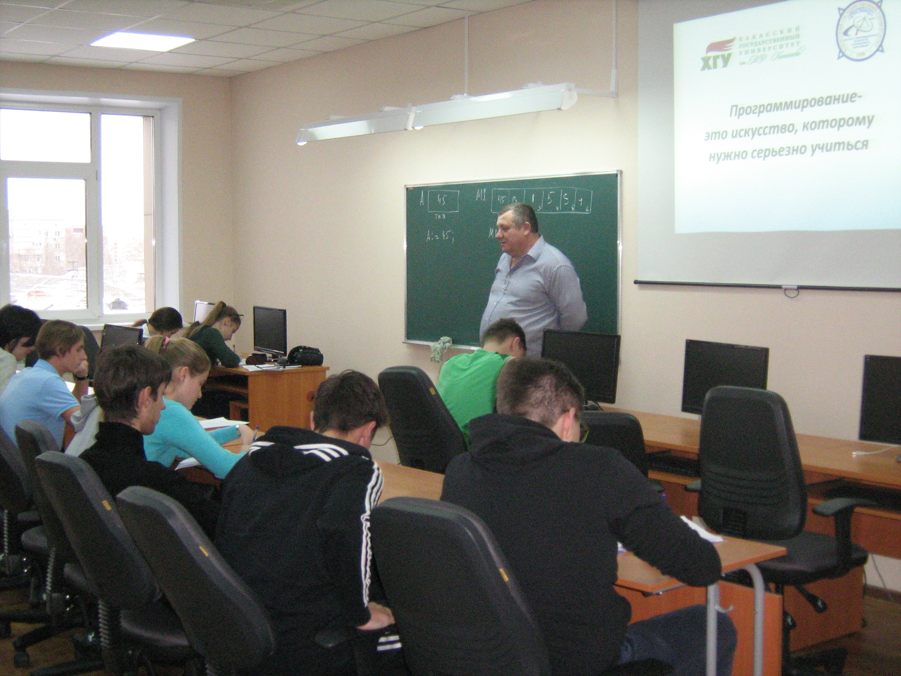
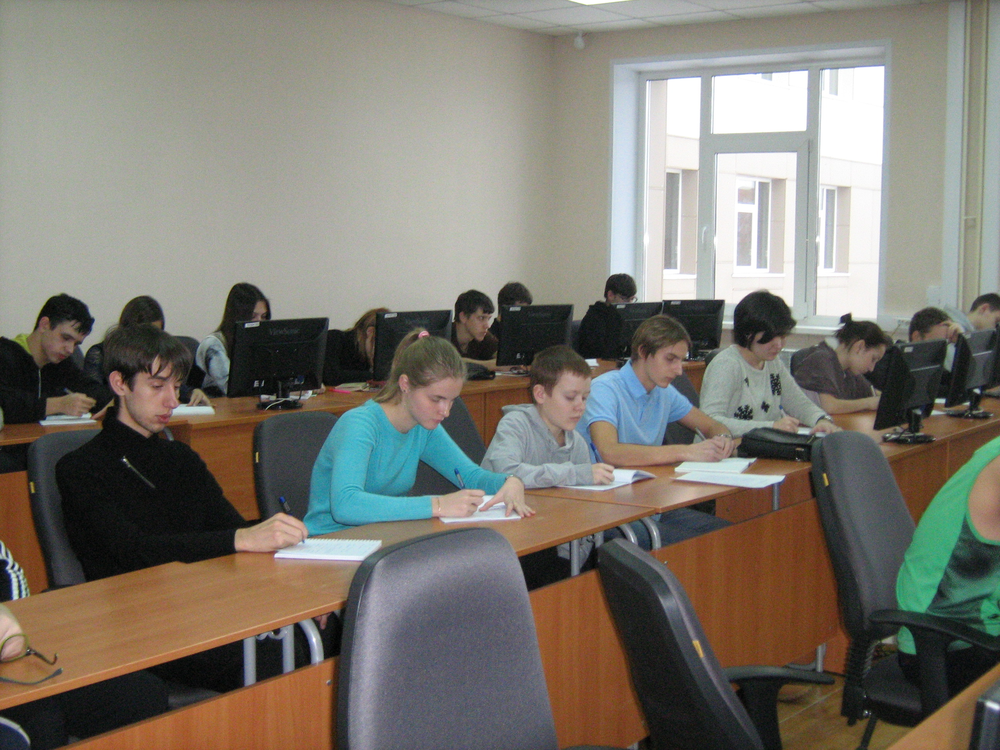
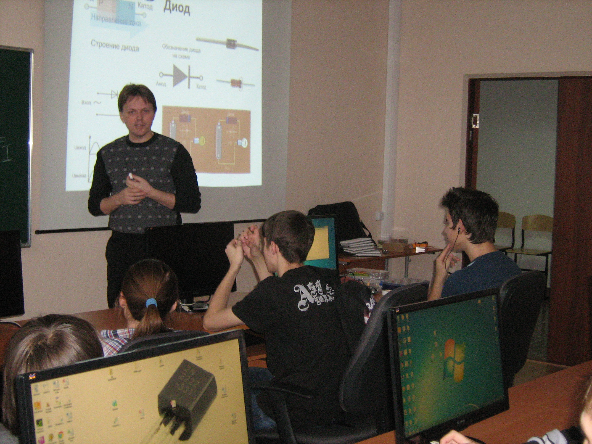
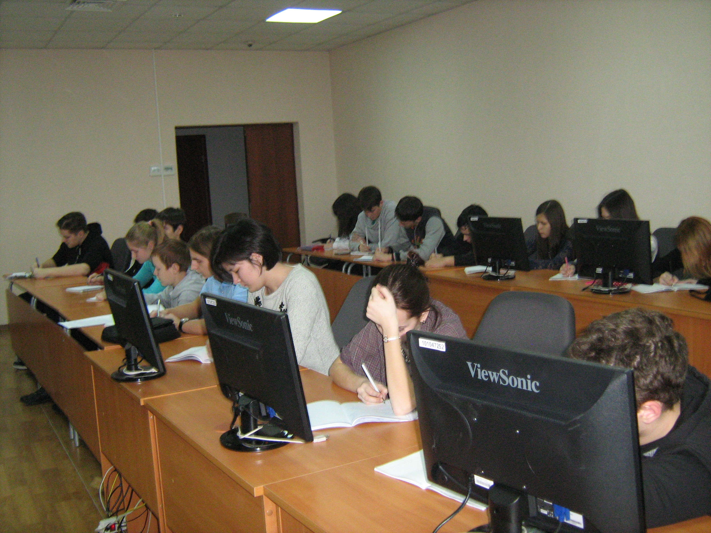
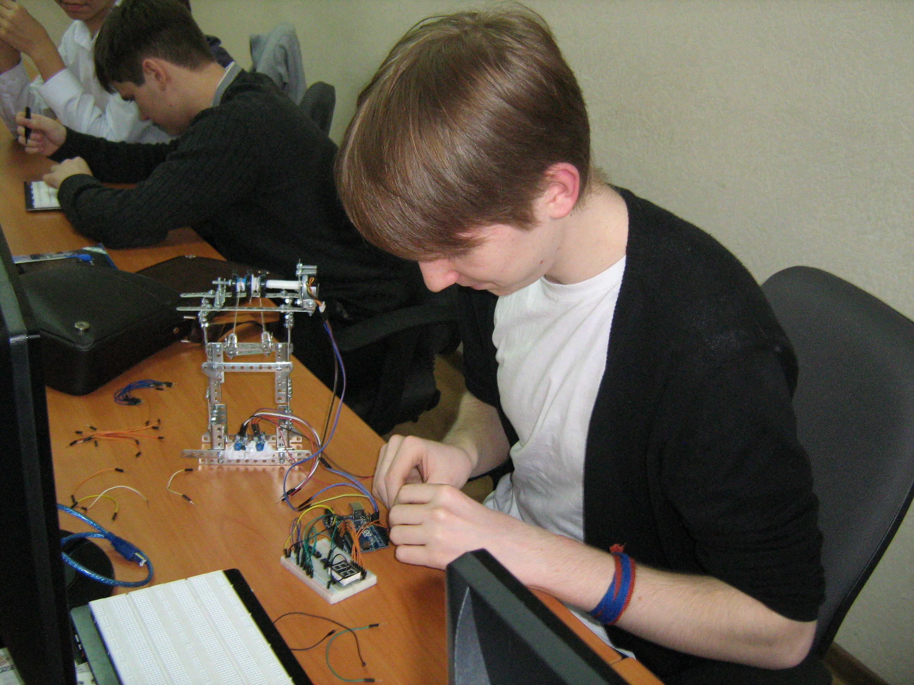
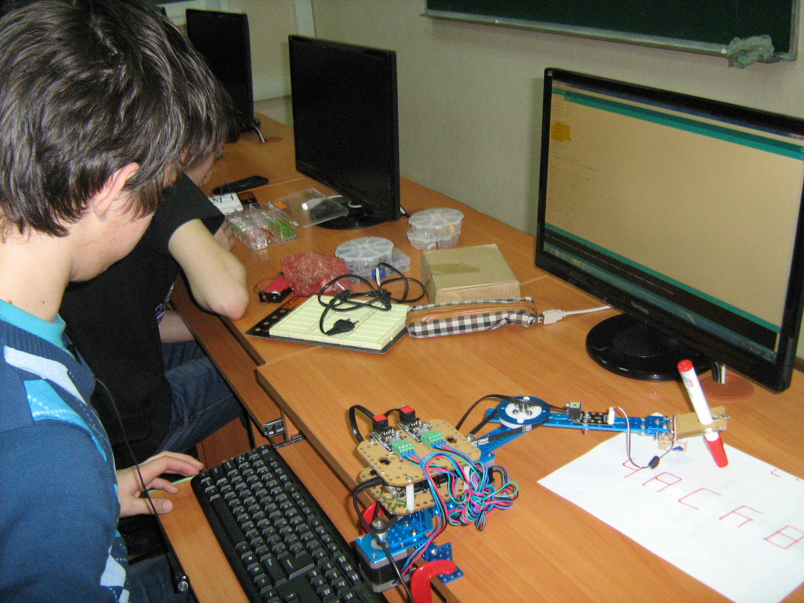

# Завершение акции "Час Кода" в Школе программистов ХГУ

Дата создания: 2015-12-14

Автор: ngrebenshikov

Теги: Час кода,Школа Программистов,ХГУ

 

 

 

 

 

 Завершается акция «Час Кода» в Школе программистов ХГУ, но обучение школьников программированию и содействие в их продвижении к успешной карьере при сотрудничестве с ведущими IT- компаниями Хакасии продолжается.    
  
12 декабря в Школе программистов прошли заключительные мероприятия в рамках акции «Час Кода»:

- Открытая лекция «Массивы »старшего преподавателя кафедры ПОВТиАС Романюка В.В по программе ДО «Программирование на языке Pascal ABC»;
- Мастер-класс «Управление электродвигателями при помощи микроконтроллера» преподавателя Вишнякова Т.Н. по программе ДО «Конструирование электронных устройств и программирование микроконтроллеров».

  
В цикле мероприятий в рамках акции «Час Кода» более 120 школьников Хакасии – учащихся Школы программистов… Все занятия в этот период, 7 мастер-классов, открытая лекция, проводились согласно расписания занятий и соответствующих программ дополнительного образования, выбранных учащимися для изучения в начале учебного года. Тем не менее, ребята почувствовали особую атмосферу акции.   
  
Ребята получили не только новые знания, выполнили и получили новые задания по программе, но и убедительные доказательства того, что увлеченных и ответственных молодых людей уже ждут в современных перспективных IТ-компаниях и, прежде всего, в ведущих IT-компаниях Хакасии. Эти компании созданы выпускниками ХГУ, большинство специалистов этих компаний выпускники университета.  
  
Своими впечатлениями, интересными информационными материалами участники мероприятий делятся с друзьями в своих школах, увеличивая аудиторию проявляющих интерес к информационным технологиям.  
  
Завершается акция «Час Кода», но продолжается учебный год для тех, кто воспринимает программирование как одну большую логическую, достаточно сложную, но увлекательную игру, которая никогда не надоедает.