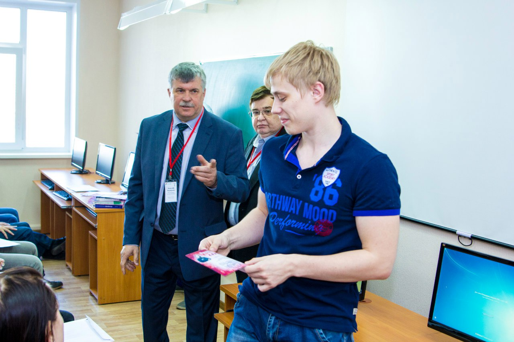
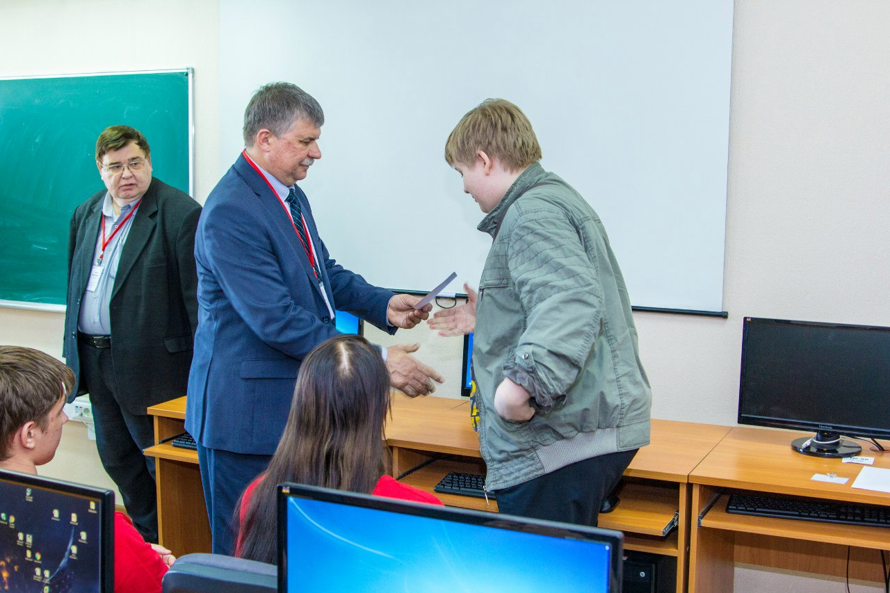
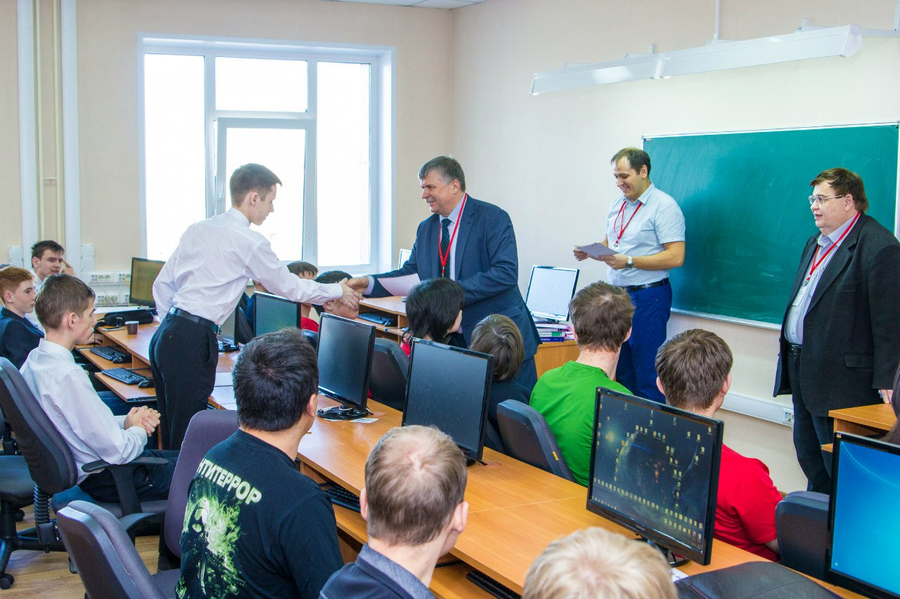
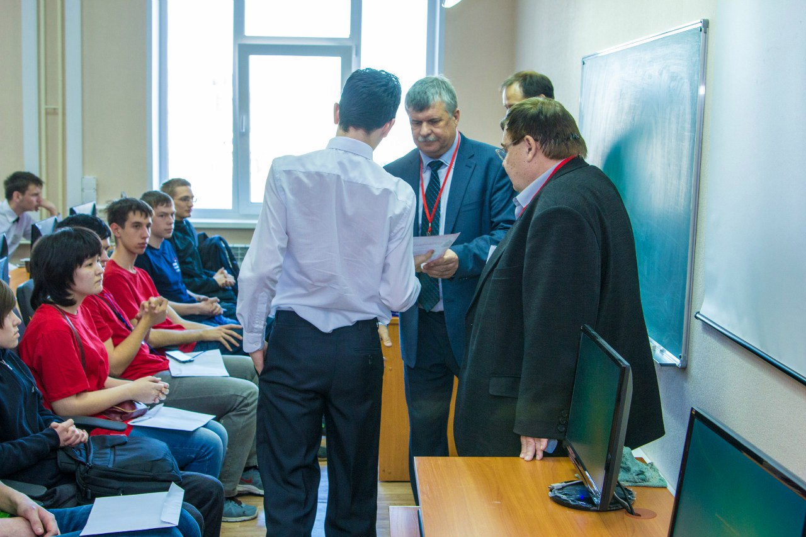
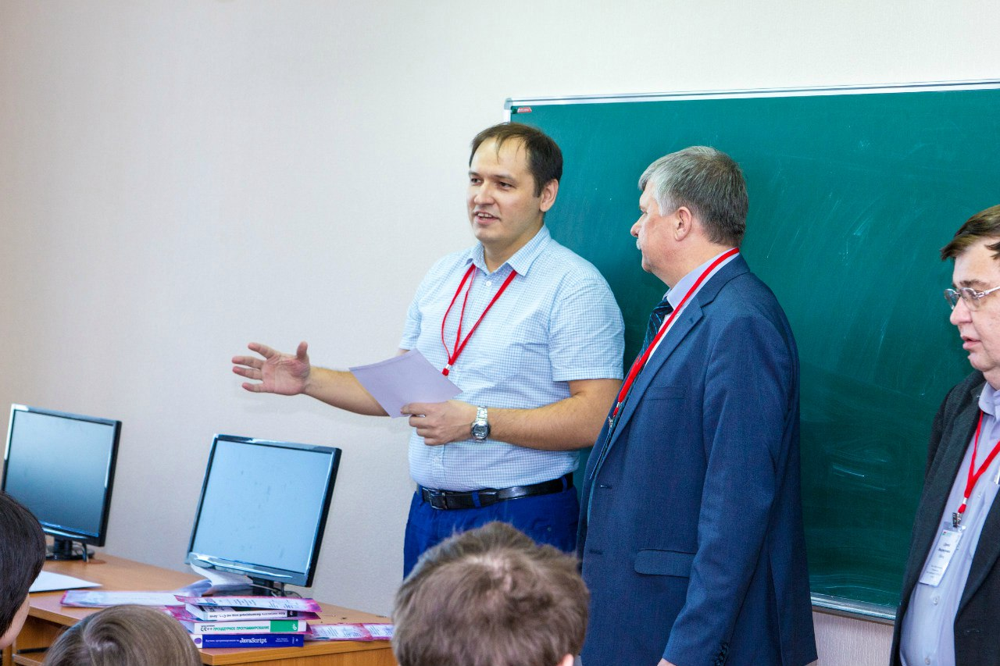
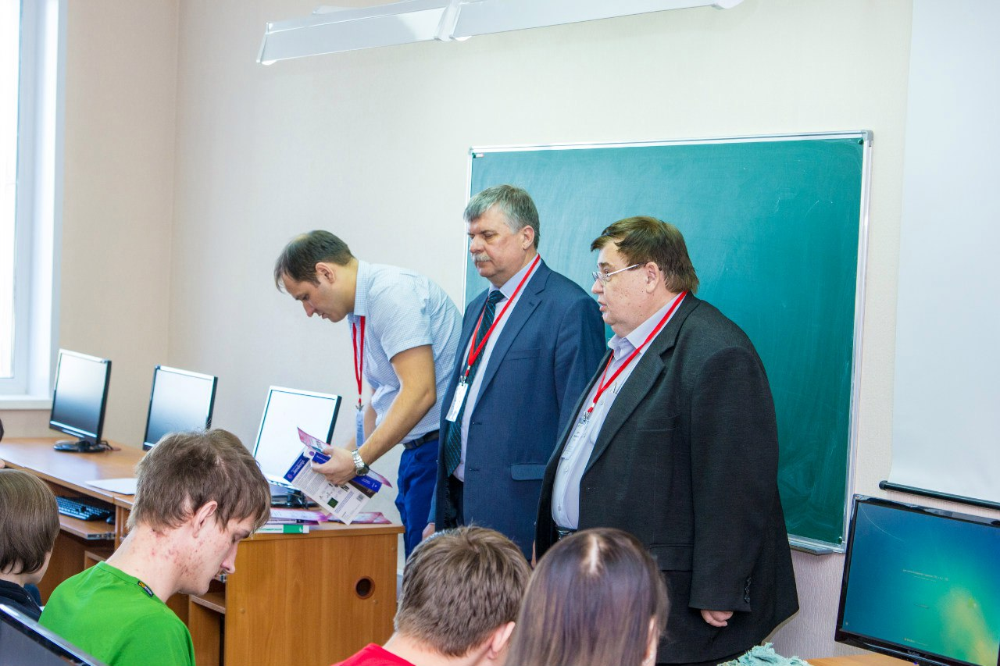
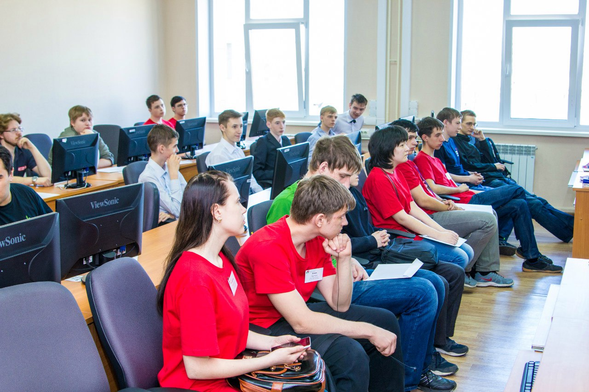
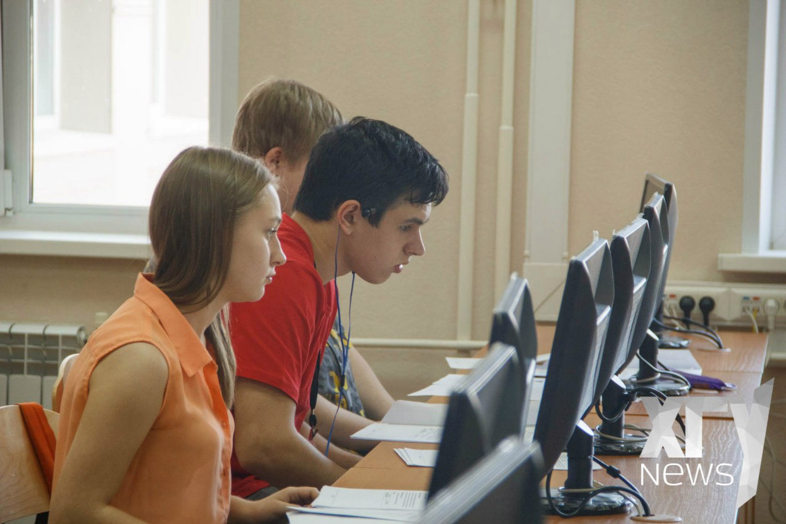
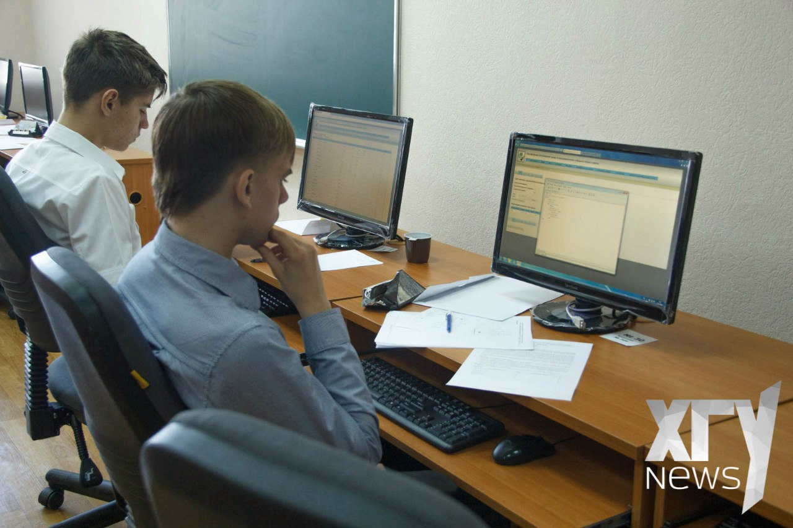

# Результаты 9-го открытого турнира по программированию в Абакане

Дата создания: 2016-04-26

Автор: ngrebenshikov

Теги: Открытый турнир по программированию,Турниры,ХГУ

 

 

 

 

 

 

 

 

 Друзья,  
  
турнир состоялся! В новый корпус ХГУ в субботу 23 апреля пришли 65 участников, из них 50 школьников 13 студентов и 2 выпускника. Кроме того в турнире участвовали несколько человек заочно из Красноярска и Абакана. Четыре часа упорной борьбы выявили победителей.  
  
Среди школьников:  
1 место — Кононов Арсений, г. Абакан, Лицей  
2 место — Петров Алексей, г. Абакан. Школа №1  
3 место — Ермаков Никита, п. Усть-Абакан, Средняя школа, корпус 2  
  
Среди студентов:  
1 место — Демиденко Виталий, г. Красноярск, СФУ  
2 место — Налётов Дмитрий, г. Абакан, ХПК  
3 место — Тумояков Леонид, г. Абакан, ХГУ  
  
В общем зачете:  
1 место — Демиденко Виталий, г. Красноярск, СФУ  
2 место — Манжугин Анатолий, г Абакан, Ланит-Терком  
3 место — Кононов Арсений, г. Абакан, Лицей  
  
Кроме того, в каждой номинации сертификатами были отмечены участники занявшие места с 4 по 10.  
  
А школьники в зависимости от своих успехов в решении задач получили дополнительные баллы к ЕГЭ для поступления в Хакасский государственный университет. Подробности можно узнать в деканате ИИТИО в главном корпусе (Ленина 90) или по электронной почте artyshkin@khsu.ru.

#### [Вход в тестирующую систему](http://contest.lambda-calculus.ru/cgi-bin/new-client?contest_id=8)
  

#### [Окончательная таблица результатов](http://contest.lambda-calculus.ru/ejudge/000008/standings.html)  

  

##### [Условия задач](http://contest.lambda-calculus.ru/b7ac8359-86d7-494e-a6f1-9c233f5c079d/statements.pdf)
  

##### [Тесты и решения жюри](http://contest.lambda-calculus.ru/ejudge/000008/abakan-contest-2016.04.23.zip)
  
И мы рады сообщить, что **10-й юбилейный турнир пройдет в начале октября также в ХГУ**. Поэтому мы сможем принять большее количество участников, чем обычно осенью. Кроме того, в этот раз мы проведем его в формате **командного соревнования**. Предположительно в июне мы объявим о начале регистрации и пришлем приглашения.  
  
За фотографии спасибо их авторам: Андрею Семенову и ХГУ News.  
  
У уважением,  
команда организаторов  
  

#### Информация о турнире
  

##### Краткая информация
Турнир проводится в два тура отборочный и основной с очным и заочным участием. При нехватке мест приоритет будет отдан участникам прошедшим через отборочный тур.    
  
Максимальное количество участников в очном туре еще не известно, но примерно составит **30-50 человек**. Для заочного способа участия **ограничений по количеству участников нет.**  
  

- Турнир состоится 23 апреля 2016 года в 09-00.
- Место проведения — Хакасский государственный университет, г. Абакан, ул. Ленина, д. 92а (новый корпус) Аудитории: 502, 506, 602.
- Организаторы: [ХГУ](http://www.khsu.ru/), [Ланит-Терком](http://www.lanit-tercom.com/), [клуб абаканских программистов “Лямба-Калькулус”](http://www.lambda-calculus.ru).
- [Примеры задач](http://acm.timus.ru/problemset.aspx?space=1&tag=beginners), подобные тем, что будут на турнире.
- Вопросы по турниру можно присылать по адресу — [grebenshikov.n@gmail.com](mailto:grebenshikov.n@gmail.com) или обращаться по телефону +7-905-997-44-74

  

#### Расписание на 23 апреля 2016 года
  

- 9-00 Сбор и регистрация участников, жеребьевка посадочных мест.
- 9-45 Пробный тур.
- 10-30 Основной тур.
- 14-40 Разбор задач в аудитории 602.
- 15-30 Оглашение результатов, награждение.

  

#### [Правила](https://docs.google.com/document/d/1ERbY3f7fJL6Ledt3DsfbFPQlVN_DU483_nXBhyL5RAQ/pub)  

  

#### [Электронная регистрация на турнир завершена](https://docs.google.com/forms/d/10BFdLMwwkgkYeFrEZB9ioA6Jcq87xDkBLgPMD1YZQSw/viewform#start=openform). Отправляйте запросы на решистрацию по электронной почте по адресу grebenshikov.n@gmail.com
  

##### Отборочный тур

###### [Регистрация и вход в отборочный тур](http://contest.lambda-calculus.ru/cgi-bin/new-client?locale_id=1&contest_id=7)
  
Вопросы по турниру можно присылать по адресу — [grebenshikov.n@gmail.com](mailto:grebenshikov.n@gmail.com)