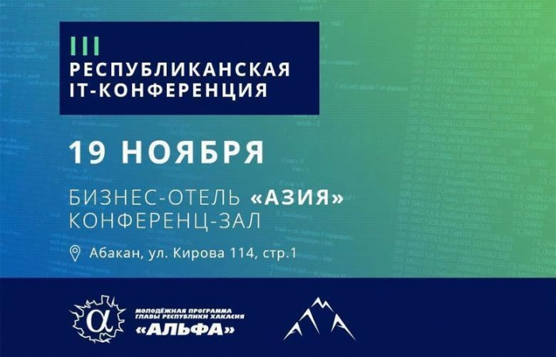

# III Республиканская IT-конференция, 19 ноября

Дата создания: 2016-11-09

Автор: ngrebenshikov

Теги: Конференции,IT-конференция,Ланит-Терком

   
  
**19 ноября 2016 г. в г. Абакане в конференц-зале бизес-отеля «Азия»** , в рамках молодежной программы Главы Республики Хакасия «АЛЬФА» состоится третья республиканская IT-конференция.    
  
Спонсоры и партнеры конференции — ООО «АЛМА», компания «Ланит-Терком», клуб абаканских программистов "λ-calculus".  
  
IT-конференция – это уникальное событие, на котором ведущие специалисты и компании в сфере информационных технологий нашей республики и из других регионов, делятся опытом и своими наработками, приоткрывают профессиональные секреты, а иногда и анонсируют выход новых программных продуктов.  
  
В рамках третьей конференции планируется выступление ведущих разработчиков и топ-менеджеров из Новосибирска, Красноярска и Хакасии. В данный момент идет работа по формированию программы. Организаторы мероприятия будут знакомить участников с темами докладов и спикерами в течение всего периода подготовки конференции на [странице конференции во ВКонтакте](https://vk.com/event132439945).   
  

> Первая и вторая IT-конференция прошли в 2010 и 2011 годах. Ее участниками стали более 180 специалистов it-сферы. Еще тогда мы поняли, что подобные мероприятия просто необходимы для наших «коллег по цеху». В программе были самые разнообразные темы — от общегуманитарных докладов о том, как стать хорошим фрилансером, до узкоспециализированных мастер-классов — “Разработка приложений на iOS” или «Программирование трёхмерной графики на основе OpenGL» и т.д. — рассказывает директор IT-конференции Александр Шестаков. — Данная конференция задумывалась как ежегодная, однако в связи с высокой загруженностью на проектах, мне не удавалось полноценно заняться ее огранизацией. В этом году свою помощь мне предложили два мега-крутых программиста и просто два человека знакомством с которыми я понастоящему горд — Николай Гребенщиков и Дмитрий Соломенников. За что спасибо им огромное! Формат it-конференции 2016 как в прошлые годы будет включать не только презентации и доклады, но и неформальное общение с людьми (собственно ради чего всё это и задумывалось), создающими сферу информационных технологий и программного обеспечения в нашей любимой республике. Кроме того, мы планируем, представить на конференции интересные предложения для «вольнонаёмных» IT-специалистов.

  

##### [Зарегистрироваться для участия](https://docs.google.com/forms/d/e/1FAIpQLSeX3d5McTmKWmzhCnD_DFKVFdV7Yq5e02pjzOZGEv_gNh7sYA/viewform?c=0&w=1)
  
Подробнее о докладчиках можно узнать на [странице конференции во ВКонтакте](https://vk.com/event132439945).