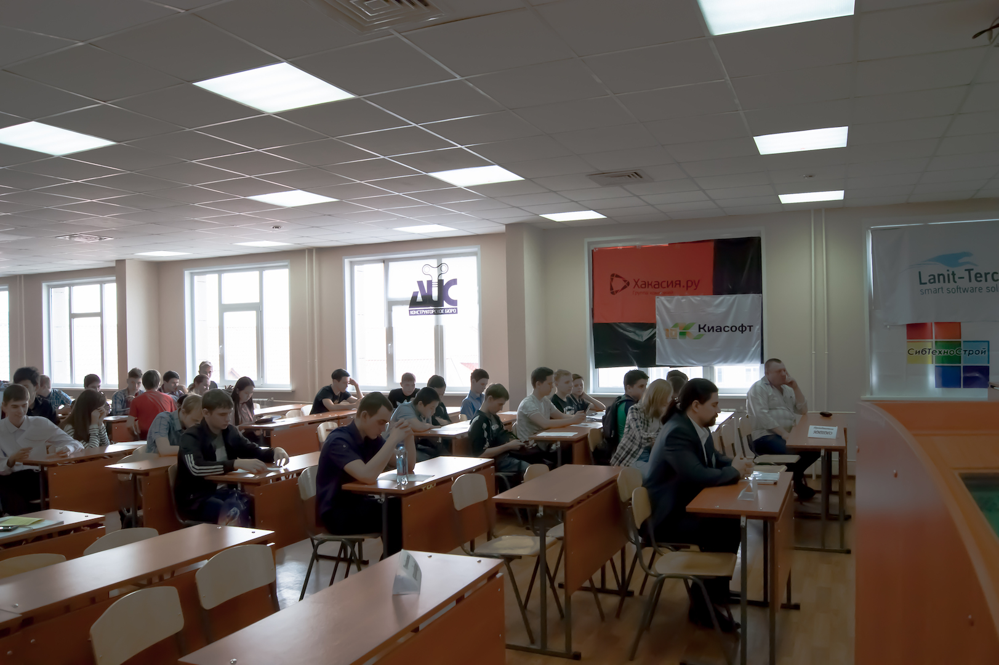
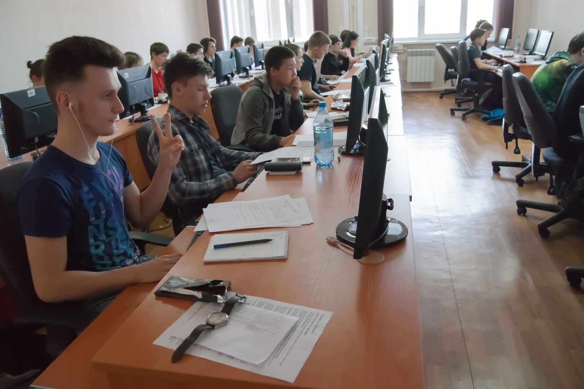

# Открытая региональная олимпиада по программированию среди школьников, студентов колледжей и техникумов, 2017

Дата создания: 2017-04-03

Автор: ngrebenshikov

Теги: Программирование,Турниры,Школьники,Школа Программистов,ХГУ,Открытый турнир по программированию

 

 

 

 

 

 

 

 

 Основной тур Открытой региональной олимпиады школьников, студентов колледжей и техникумов по программированию 1 апреля завершил Неделю информатики в ИИТИО.  
  
120 школьников и студентов в день шуток и розыгрышей решали серьезные нестандартные задачи по программированию.

- [Вход для участников для дорешивания](http://contest.lambda-calculus.ru/cgi-bin/new-client?contest_id=16&locale_id=1)
- [Таблица результатов](http://contest.lambda-calculus.ru/ejudge/000016/standings.html)
- [Условия задач](http://contest.lambda-calculus.ru/9a0a82fd361f4dd18750c5f5a8f592fd/statements-2017-school.pdf)
- [Правила проведения олимпиады школьников и инструкция по использованию системы проверки решений.](http://contest.lambda-calculus.ru/files/school-contest-rules-17.doc)

  
Участников Олимпиады встретили преподаватели и студенты кафедры информационных технологий и систем. Особую торжественную обстановку открытия олимпиады создает звучание гимна ХГУ им. Н.Ф.Катанова.   
  
Непосредственные организаторы Олимпиады: кафедра программного обеспечения вычислительной техники и автоматизированных систем, Школа программистов совместно с Абаканским клубом программистов.  
Участников приветствуют и передают пожелания успехов и приглашение в дружную семью ХГУ и ИИТИо Эрна Горбачева, руководитель Школы программистов и Максим Ламанский, и.о. зав кафедрой ПОВТиАС Особое внимание участников наблюдается во время инструктажа, который проводит председатель жюри Николай Гребещиков, инициатор и организатор Турниров по программированию в Абакане, руководитель Абаканского клуба программистов, к.т.н., руководитель представительства ЗАО Ланит-Терком в Абакане, доцент кафедры ПОВТиАС, руководитель сборной команды ХГУ по программированию, выпускник ИИТ ХГУ.  
  
В составе жюри выполнили очень ответственную работу члены сборной по программированию, достойно представляющие университет и Хакасию на региональных и Российских олимпиадах студенты направления подготовки Павел Земляникин (3 курс) и Артем Багаев (2 курс).  
  
В современных компьютерных аудиториях университета созданы условия для программирования на любом языке. Автоматизация проверки решений обеспечивает возможность участникам видеть свои результаты и результаты товарищей. А это требует и особой тщательной регистрации и бойцовского характера участников в процессе работы.  
  
Подведены итоги основного тура Олимпиады. 20 школьников и студентов, продемонстрировавшие наиболее высокие результаты, вышли в финал. Победители в номинациях «Школьники», и «Студенты колледжей и техникумов» определятся в финале, который пройдет 29 апреля в рамках 10го Турнира по программированию.   
  

##### Поздравляем участников олимпиады, вышедших в финал!
  

- Бардин Константин Олегович
- Беляев Семён Андреевич
- Бирюков Михаил Алексеевич
- Гилёв Андрей Васильевич
- Доброва Татьяна Вячеславовна
- Дорошенко Александр Юрьевич
- Караков Андрей Александрович
- Килин Дмитрий Алексеевич
- Кононов Арсений Алексеевич
- Кожанов Вадим Сергеевич
- Лебедева Анастасия Дмитриевна
- Лялин Артём Александрович
- Майнагашев Данил Альбертович
- Мальцев Кирилл Сергеевич
- Морозов Андрей Борисович
- Переберин Артём Юрьевич
- Рогов Иван Андреевич
- Степанов Артём Алексеевич
- Черных Лука Юрьевич
- Шумакова Анна Константиновна
- Юденко Дмитрий Олегович

  
Все вышедшие в финал, удостоены дипломов за высокие результаты в основном туре. После разбора задач членами жюри финалистам вручил дипломы председатель жюри Николай Гребенщиков. Жаль, что многие финалисты из районов не могли присутствовать, уже находились в дороге. Они получат свои дипломы уже на Турнире.  
Все участники Олимпиады получат сертификат участника, обеспечивающий 2 дополнительных балла к ЕГЭ пи поступлении в ХГУ. Победители Олимпиады, занявшие 1,2 и 3 места, будут определены в финале 29 апреля и станут обладателями 5 дополнительных баллов. До встречи на Турнире и в аудиториях университета.  
  
Новых успехов будущим — IT специалистам во всем.   
Будущее IT — сферы региона за ВАМИ.  
  

###### Расписание мероприятий
  

- Тренировочный тур с 28 февраля до 30 марта
- Основной тур 1 апреля 2017 года
- Место проведения – Хакасский государственный университет им. Н.Ф. Катанова, по адресу: Абакан. пр. Ленина, 92/1.

  

- **12-45** Встреча участников — 1 этаж.
- **13-00** Сбор и регистрация участников — ауд. 523
- **13-30** Приветствие участников. Жеребьевка рабочих мест — ауд. 523
- **14-00** Пробный тур на рабочих местах участников (аудитория и номер рабочего места в аудитории определяется в процессе жеребьевки)
- **14-30 — 17.45** Основной тур — компьютерные аудитории
- **17-45** Оглашение предварительных результатов. Разбор задач по желанию участников — ауд. 523

