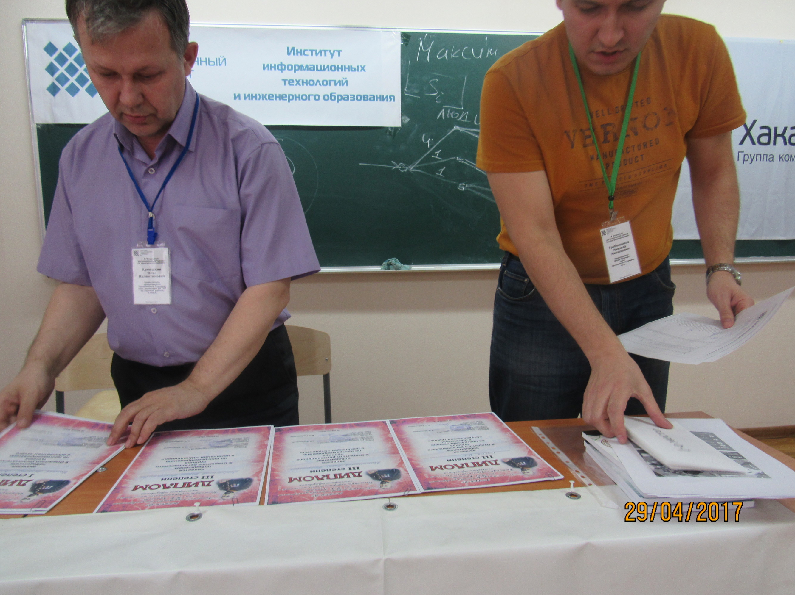

# Фотоотчет о 10-м открытом турнире по программированию в Абакане

Дата создания: 2017-05-03

Автор: ngrebenshikov

Теги: Открытый турнир по программированию,Студенты,Школьники,ХГУ,Школа Программистов,Хакасия.ру,Ланит-Терком,Программирование

 

 

 

 

 

 

 

 Здесь представлены фотографии. Результаты на [странице турнира](http://lambda-calculus.ru/blog/events/119.html).

