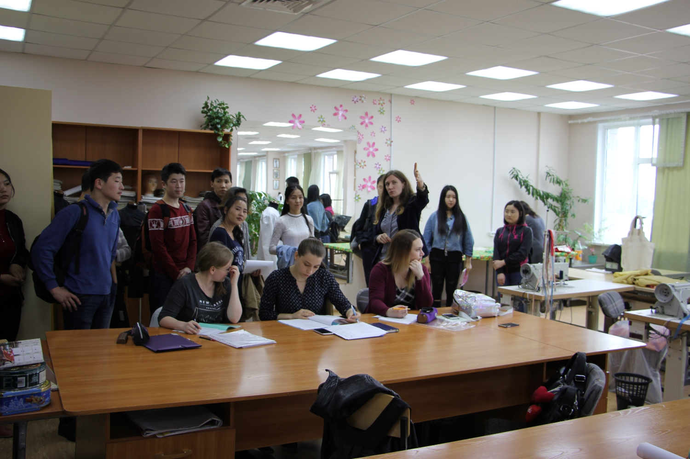
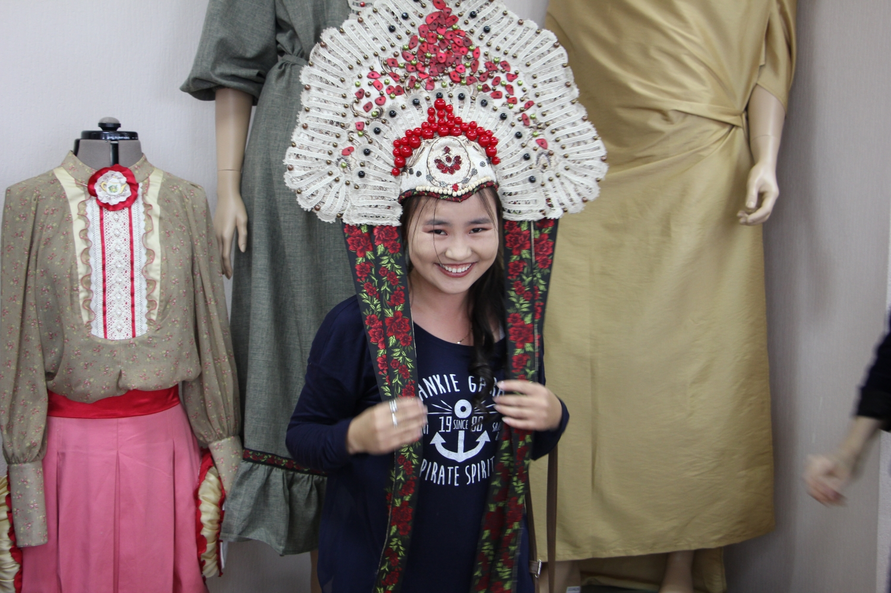
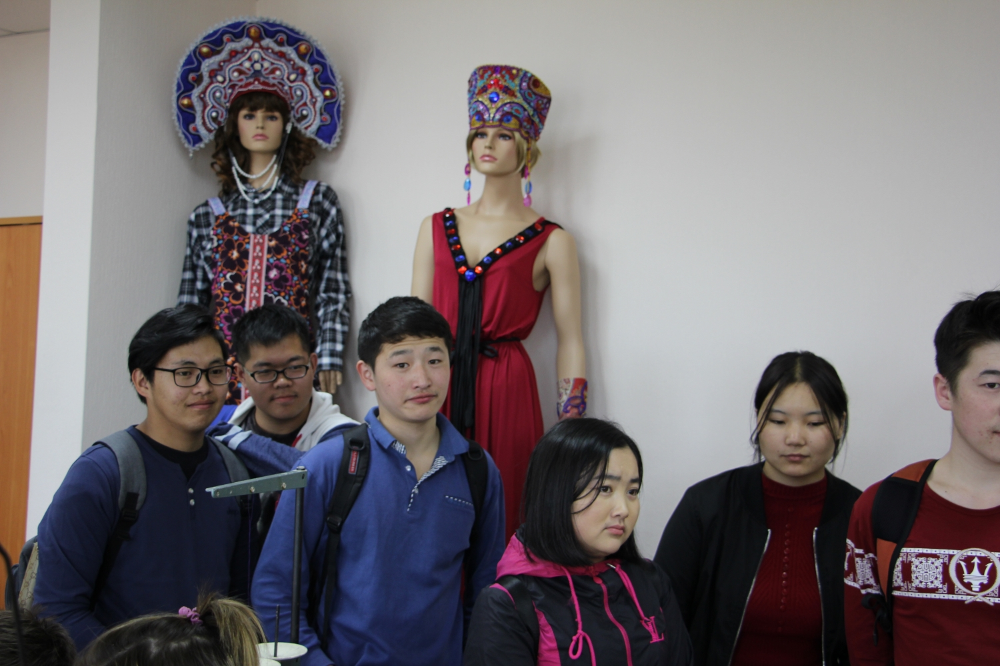
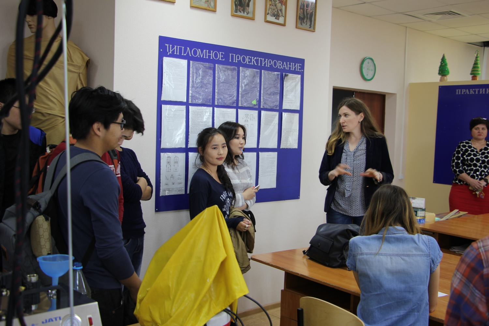
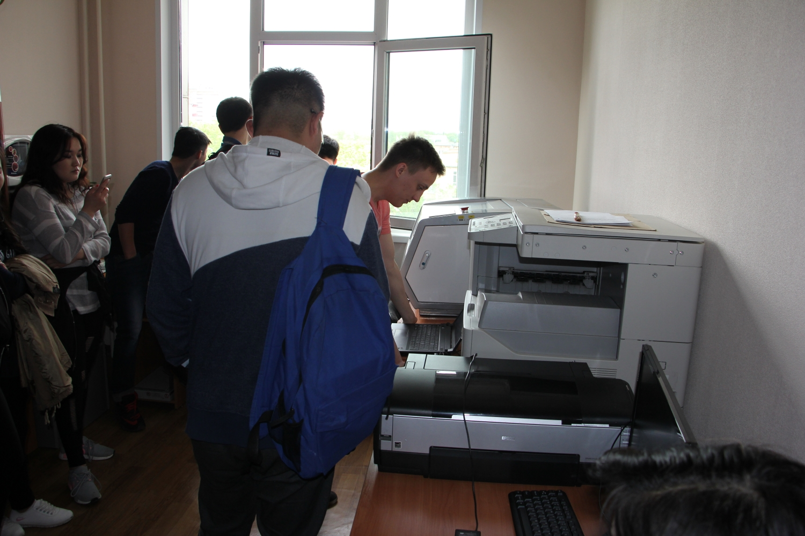
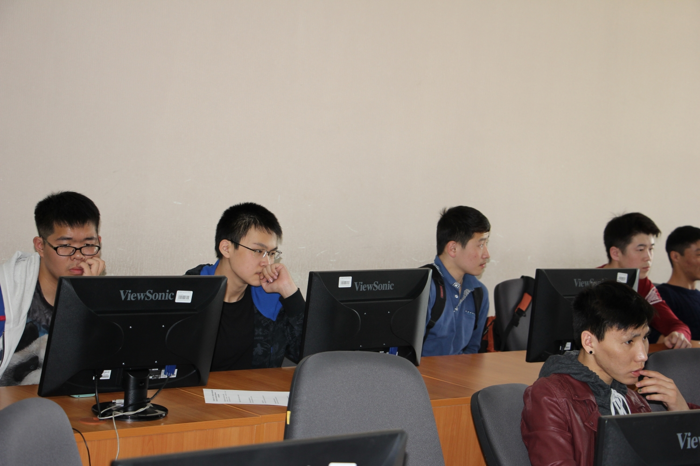
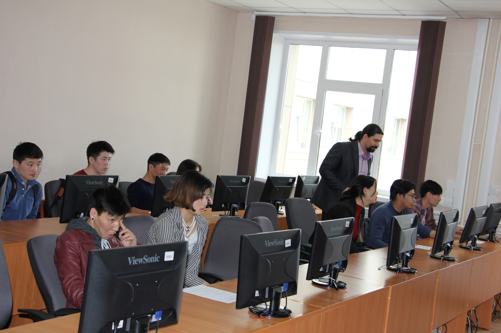
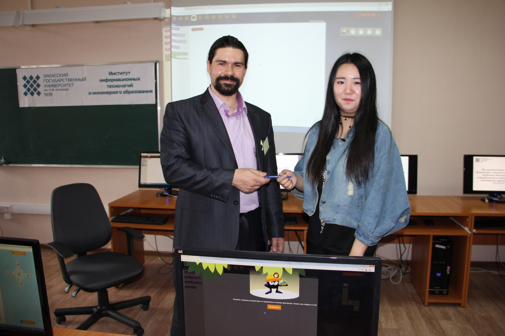
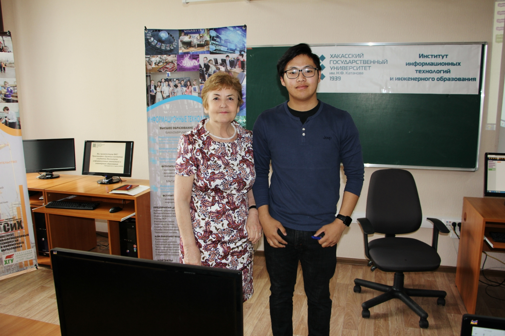

# Институт информационных технологий и инженерного образования открывает двери для абитуриентов – иностранцев

Дата создания: 2017-06-01

Автор: veronikaAL

Теги: Образование,ХГУ,ИИТИО

 

 

 

 

 

 

 

 

 Участников «Дня открытых дверей» для иностранных граждан, обучающихся в ХГУ им. Н.Ф. Катанова по программе дополнительного образования «Русский как иностранный» радушно встретили в институте информационных технологий и инженерного образования. Директор института Александр Валинецкий представил заведующих кафедрами и пригласил гостей на экскурсию по лабораториям и специализированным аудиториям института. Самой многочисленной группе гостей, студентам из Монголии, вручен сувенир-диск с фильмом, снятым А. Валинецким и его друзьями в Монголии. ИИТИО уже стал вузом для обучения семейных династий из Монголии. Нара Батбаяр с дипломом основала компанию и создает современные модели национальной одежды. Ее сестра Одонцэцэг Батбаяр завершает обучение по направлению «Строительство». Она сопровождала гостей на экскурсии и искренне, приглашала обучаться именно в ее уже родном институте.  
  
Во время экскурсии будущие студенты узнали от преподавателей и студентов не только об основных программах обучения, но и о возможности освоения в ИИТИО интересных, востребованных программ дополнительного образования параллельно с основной.

