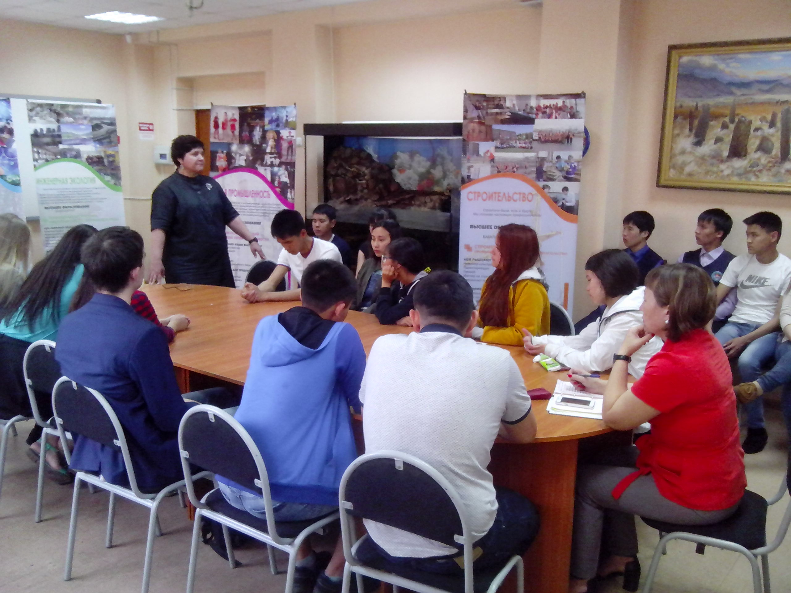
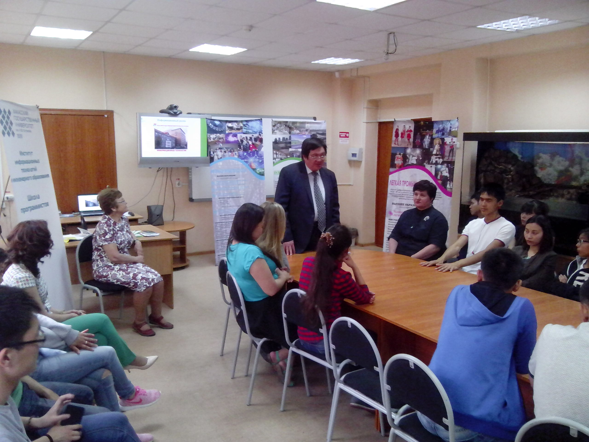
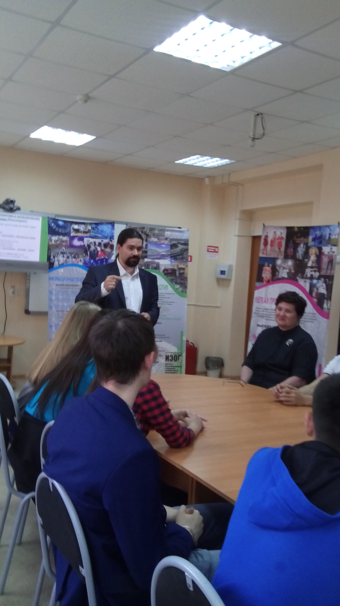
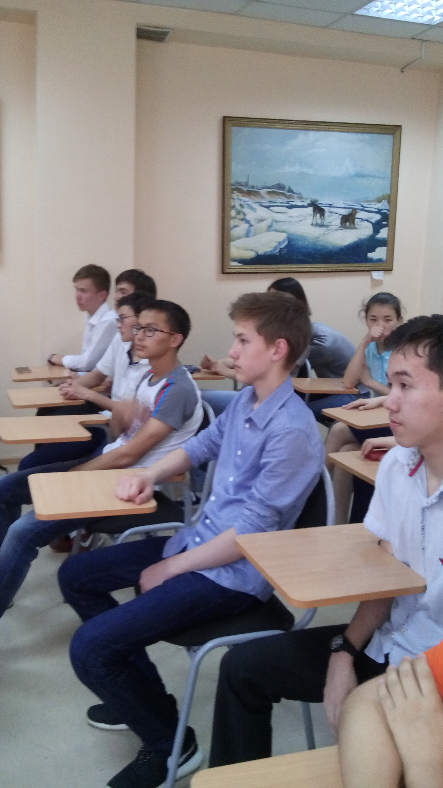
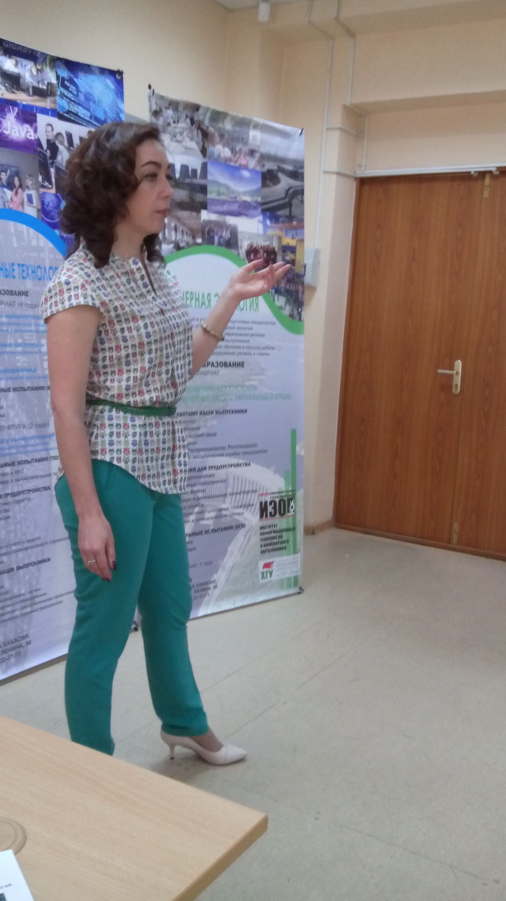

# Университетские встречи ИИТИО в ГБОУ РХ «Хакасская национальная гимназия-интернат им. Н.Ф. Катанова»

Дата создания: 2017-06-01

Автор: veronikaAL

Теги: Образование,Школьники,ИИТИО,ХГУ

 

 

 

 

 Выездные «Дни открытых дверей» ИИТИО в образовательных учреждениях прочно входят в систему мероприятий института по профориентации. Первые «университетские встречи» в школах прошли в Аскизском лицее-интернате им. М.И. Чебодаева и Черногорской гимназии. Презентация ИИТИО, наличия условий для обучения, отдыха и возможностей для подготовки специалистов, соответствующих требованиям современных предприятий, работодателей состоялась в ХНГИ им. Н.Ф. Катанова. На встречу с преподавателями института информационных технологий и инженерного образования пригласили учащихся 11 классов, проявляющих интерес к инженерной подготовке и всех учащихся 10 классов.  
  
Заведующие выпускающих кафедр представили направления подготовки и условия поступления на них. Рассказали об успехах студентов и выпускников, профессиональные достижения которых – лучшее доказательство конкурентоспособности выпускников ХГУ на современном рынке труда в регионе и за его пределами. Учащихся, родителей и учителей пригласили на виртуальные встречи с выпускниками. Их советы могут быть очень полезны в процессе выбора профессии, учебного заведения. Могут помочь избежать многих проблем в студенческой жизни и в первые годы после профессиональной деятельности.  
  
Не случайно первые такие мероприятия прошли именно в этих школах. Многие выпускники 2017 года школ являются участниками мастер-классов, открытых лекций, конкурсов, олимпиад, учащимися Школы программистов. Они уже комфортно чувствуют себя среди студентов и преподавателей института. Мы надеемся продолжить с ними освоение выбранного направления уже в студенческих аудиториях.  
  
Учащихся 9-10 классов ждем на наших многочисленных мероприятиях, которые помогают определиться в выборе профессии, интересного и важного дела.

