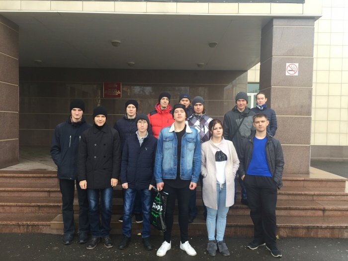

# Результаты ХГУ в четвертьфинале командного чемпионата мира по программированию, Красноярск 2017

Дата создания: 2017-10-31

Автор: ngrebenshikov

Теги: Команда по программированию,Четверть-финал,ACM ICPC,ICPC,Олимпиады,Соревнования

   
  
В этом году много изменений произошло в соревнованиях по программированию:    

- ICPC теперь отдельная от ACM организация.
- IBM не является спонсором соревнований.
- JetBrains подхватили спонсорство.
- Python и Kotlin стали официальными языками соревнований.
- Восточно-сибирский четвертьфинал стал распределенным. Соревнования проводились на двух площадках: красноярской и иркутской.
- **Четыре команды Хакасского государственного университета им. Н.Ф. Катанова приняли участие в четвертьфинале, две из которых вышли в полуфинал с 8-го и 10-го места.** Отдельная благодарность ХГУ, компании Ланит-Терком и бывшему олимпиаднику, пожелавшему остаться неизвестным, за финансовую помощь. Без нее участие 4-х команд было бы невозможным. 

  
Несколько ссылок:  

- [Страница соревнований и итоговая таблица](http://ikit.sfu-kras.ru/olimp/acm/2017)
- [Фотоотчет красноярской площадки](http://photo.sfu-kras.ru/node/2237)
- [Фотоотчет иркутской площадки](http://isu.ru/ru/news/newsitem.html?action=show&id=5168)

