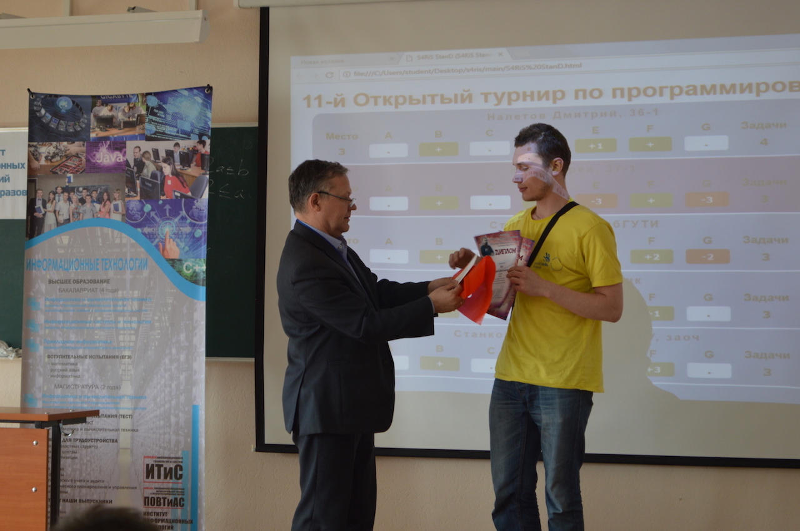
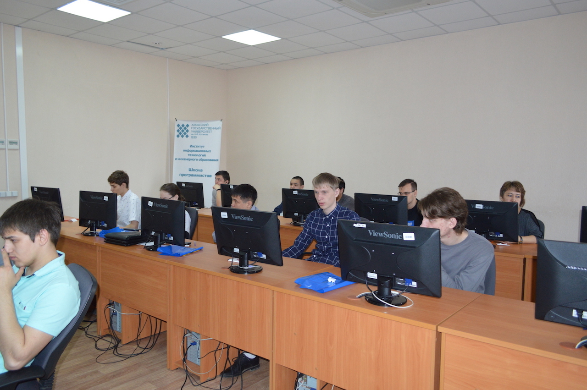
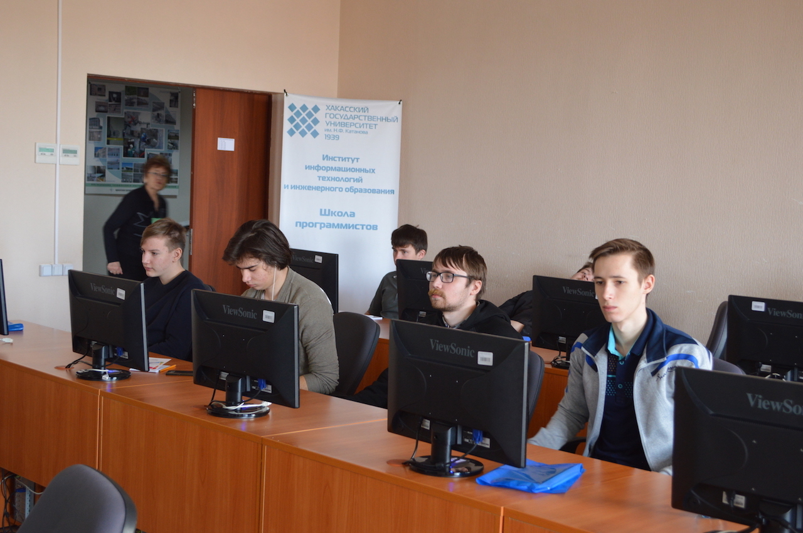
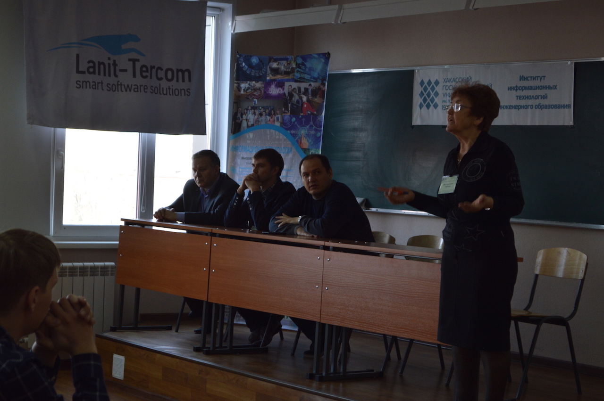

# Результаты 11-го открытого турнира по программированию в Абакане

Дата создания: 2018-04-23

Автор: ngrebenshikov

Теги: Открытый турнир по программированию,Турниры,Программирование,ХГУ,Студенты,Школьники,Учителя

 

 

 

 

 

 

 

 

 

 

 

 

 

 

 

 

 

 

 

 

 

 

 

 

 

 

 

 

 

 

 

 

 

 

 

 

 

 

 

 

 

 

 

 

 

 

 

 

 

 

 

 

 

 

 

 

 

 21 апреля 2018 года состоялся 11 открытый турнир по программированию в Абакане, в котором приняло участие 78 человек (студенты, школьники и уже работающие специалисты).

- [Результаты турнира](http://contest.lambda-calculus.ru/ejudge/000023/standings.html)
- [Тесты и решения жюри](http://contest.lambda-calculus.ru/files/abakan-2018-students-package.zip)
- [Дорешивание задач](http://contest.lambda-calculus.ru/cgi-bin/new-client?contest_id=23&locale_id=1) (регистрация открыта для всех, но участникам повторная регистрация не нужна)

