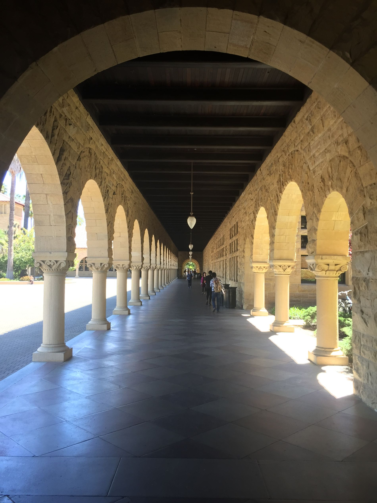

# Поездка на Haxe US Summit 2018

Дата создания: 2018-06-06

Автор: ngrebenshikov

Теги: Клуб,США,Конференции,Haxe

 

 

 

 

 

 

 

 

 

 

 

 

 

 

 

 

 

 

 

 

 

 

 

 

 

 

 

 

 

 

 

 

 Сегодня я хотел бы поделиться своими впечатлениями о поездке на [Haxe US Summit 2018](https://summit.haxe.org/us/2018/).  
  
[Haxe](https://haxe.org/) -это мультипарадигменный язык программирования, главной фишкой которого является инструментарий для кроссплатформенного программирования. Кроме того, что код на хаксе может быть скомпилирован во множество других языков (JavaScript, С++, C#, Java, PHP, Lua), существует набор библиотек ([OpenFL](http://www.openfl.org/), [Kha](http://kha.tech/), [Heaps](https://github.com/HeapsIO/heaps), [Haxe-React](https://github.com/haxe-react)) для сборки для многих платформ (HTML5, Windows, OS X, Linux, iOS, Android, PlayStation, XBox).  
  
Первым проектом на хаксе, где я принимал участие, был [comapping.com](http://comapping.com/).   
Тогда то хакс меня и зацепил своей выразительностью, относительной простотой и возможностью писать всё на одном языке и фронтенд и бэкенд. Сейчас у меня есть собственный проект на хаксе — [Мулинелла](http://www.mulinella.ru/). Это приложение написано с ипользованием библиотеки [Jive](https://github.com/jiveui/jive), в разработке которой, я принмиал непосредственное участие. С докладами о Jive мы дважды были на конференциях:

- [WWX 2015](http://wwx.silexlabs.org/2015/speakers.html#grebenshikov)
- [WWX 2016](http://wwx.silexlabs.org/2016/talks/maxim-bekhterev.html)

  
В этом году я поехал без доклада, чтобы проникнуться атмосферой, почувствовать настроение сообщества, узнать как оно развивается. Кроме того, в этом году саммит проходил в США в Сиэтле. Мне показалось, что это отличная возможность познакомиться со страной и повидаться с друзьями и знакомыми, которые туда переехали. Поэтому путь мой оказался чуть длиннее и дольше, нежели только посещение конференции в штате Вашингтон.  
  

#### Нью-Йорк
  
   
  
Путешествие из Абакана до Сиэтла долгое — около 20 часов только перелетов, плюс еще стыковки. Поэтому хорошо остановиться где-то по пути и сделать передышку. Я сделал такую остановку в городе Нью-Йорке. Кроме отдыха интересно было еще взглянуть на восточное побережье, так как большая часть моей поездки будет проходить на западном.  
  
На ночлег я остановился в небольшой гостинице на острове Манхэттен в районе Челси. По итогу данного визита данный район мне понравился больше всего в Нью-Йорке, а может быть и во всей стране. Невысокие кирпичные здания в красивой архитектурой и интересными деталями. Конечно я посетил и районы с высотками и центральный парк и бруклинский мост. На все это и трансферы из/в аэропорт у меня ушло 22 часа.  
  

#### Конференция
  
   
  
В Сиэтл я прибыл поздно вечером. В гостинице появился к 22 часам. Нужно было выспаться, так как на следующий день начиналось мероприятие.  
  
Конференция проходила в течение 3-х дней. За эти дни было сделано [26 докладов](https://haxe.org/videos/conferences/haxe-summit-us-2018/) (некоторые в форме мастер-классов или диалогов). Мы побывали в офисе [FlowPlay](https://www.flowplay.com) — одного из спонсоров и организаторов конференции. Съиграли в покер на афтерпати.  
  
Хочу остановиться на главных своих впечатлениях:  

- В америке есть люди любящие haxe!
- С помощью haxe создают крутые штуки: [Northgard](http://northgard.net), [Dead Cells](https://dead-cells.com)! Но в основном это игры. Мало было примеров использования haxe для иных приложений.
- Многие рассматривают haxe как альтернативу typescript и уж тем более javascript. Очень красочно об этом рассказал [Jeff Ward](https://twitter.com/Jeff__Ward) в свой докладе [Better stacks with Haxe](https://haxe.org/videos/conferences/haxe-summit-us-2018/better-stacks-with-haxe-jeff-ward.html).
- В этот раз выступал [Joshua Granick](https://twitter.com/singmajesty) (главный по OpenFL). Доклад об изменениях за 3 года: поэтому только по верхам. Из интересного — можно шейдеры к DisplayObject'ам прицеплять. Для меня же самое главное изменение в OpenFL, это то, что поправили механизм рендеринга и приложения **перестали** ненасытно кушать процессор и батарейку!
- Haxe Foundation делает ставку на vscode, но я рад, что милый моему сердцу IntelliJ Idea тоже не забыт. Большое спасибо [Eric Bishton](https://github.com/EricBishton) и другим энтузиастам.
- Haxe Foundation намерен расширять сообщество. Поэтому в его рядах появился Marketing Director — [Phil Chertok](https://twitter.com/fishbulb_ca)
- Сообщество вокруг haxe любит порефлексировать, что не может не радовать. Например, [Robert Konrad](https://twitter.com/robdangerous) в [своем докладе](https://haxe.org/videos/conferences/haxe-summit-us-2018/kha-openfl-robert-konrad.html) пытается найти способ взаимовыгодного взаимодействия внутри сообщества.

  
[Перевод некоторых докладов Haxe US Summit 2018 на haxe.ru](http://haxe.ru/blog/4474).  
  

#### Сиэтл
  
   
  
Между докладами удалось прогуляться по Сиэтлу. Город заметно чище и безлюднее Нью-Йорка. Кроме того он холмист. Приходилось совершать некоторые усилия, чтобы двигаться от залива в отель. Из интересного: небольшой старый город, утреннее кормление бездомных на главной его площади, рынок, первый Starbucks. Ну и конечно встреча со старым другом.  
  
Прощание с Сиэтлом было омрачено поломкой железной дороги ведущей в аэропорт по середине моего пути туда. Зная, что автобусы ходят очень редко, пришлось вызвать Uber.  
  

#### Кремниевая долина
  
   
  
Забравшись так далеко от дома грех не прогуляться несколько дней по окрестностям. Я выбрал кремниевую долину и Сан-Франциско.  
  
Первым досталось Сан-Франциско от меня. Сразу с самолета мы с моим провожатым нагрянули туда. Прогулялись по центру, проехали на трамвайчике до пирса, посмотрели на тюленей, скушали по чаудеру, и постояли возле золотых ворот. Впечатление от Сан-Франциско (санфрана — так его называл мой провожатый) сложилось как о каком-то театральном или даже цирковом павильоне. Дома хоть и пошарпаны, но берут за душу яркими оттенками своих фасадов. А еще это оказалось самым холодным местом, что я посетил. Пронизывающий ветер, даже при температуре 25 тепла заставлял надевать куртку.  
  
Вторым на очереди оказался **Стэнфорд**.   
  
   
  
На мой взгляд этот кампус просто чудо. Ходил отрывши рот и завидовал тем, кому здесь довелось учиться. Провел я там пару часов. Два раза в день служба приема гостей проводит бесплатные экскурсии для всех желающих. Доброжелательная гречанка рассказывала нам о истории и настоящем Стэнфорда. Оказывается они гордятся, что кампус самый большой в США, а в мире второй (первый у МГУ).  
  
От Стэнфорда до Пало-Альто рукой подать. Вот я и прогулялся пешком по улочкам этого городка до гаража, где Хьюллет и Пэккард, будучи студентами, создали генератор аудио сигналов. Считается, что в этом месте зародилась кремниевая долина.  
  
   
  
Также удалось встретиться с моим бывшим руководителем, пообедать в офисе Facebook с хорошим знакомым, бывшим тренером сборной Томского гос. университета по программированию, [Ромой Чадновым](http://t.co/gjVhjUegyI). С обоими вспоминали прошлое и думали о будущем ;). Обсудили перипетии жизни в штатах, чем живет программистский мир.   
  

#### Заключение
  
Впечатлений море — переваривать и переваривать. Некоторые банальные выводы:  
  

- Haxe будет жить!
- В США живут интересные люди.
- 7 авиаперелетов в течение 11 дней и смена часовых поясов на 14 часов изматывают!

