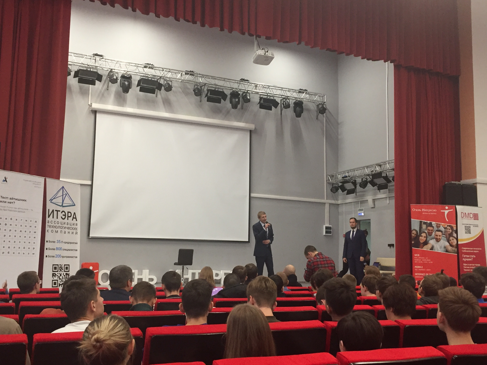

# Выступление команд из Хакасии на 1/4 финала ICPC

Дата создания: 2018-11-14

Автор: ngrebenshikov

Теги: ХГУ,ICPC,Красноярск,Турниры,Команда по программированию

 

 

 

 

 

 

 В этом году три студенческих команды (две из ХГУ и одна из ХТИ) представляли Хакасию в Красноярске. Впечатляющей борьбы от наших команд увидеть в этот раз не удалось. Все три расположились в нижней части таблицы. Лишь команде Khakas SU 3: Light удалось ухватиться за последнюю из 18 путевок в полуфинал.   
  
**Пожелаем ребятам удачи в Барнауле!**    
  
[Таблица результатов](https://contest.yandex.ru/contest/9267/standings)  
[Условия задач](http://ikit.sfu-kras.ru/files/ikit/qf_esib_2018_tasks.pdf)  
[Страница соревнования](http://ikit.sfu-kras.ru/olimp/acm/2018)

> ICPC (Международный командный чемпионат по программированию)от других олимпиад по информатике отличается повышенным количеством задач, на которые отводится сравнительно небольшое время. Учитывая, что в распоряжении каждой команды находится только один компьютер, навыки эффективной и слаженной командной работы выходят на первый план.  
>   
> Сибирский федеральный университет является организатором 1/4 финала ICPC в Восточно-Сибирском подрегионе.

