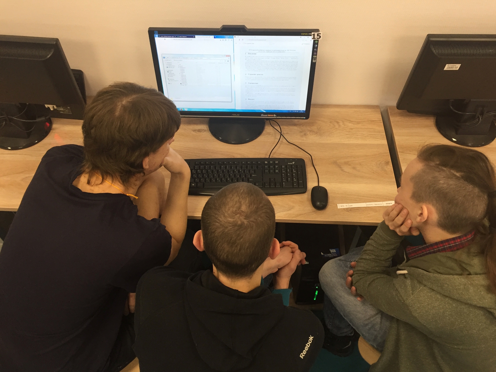
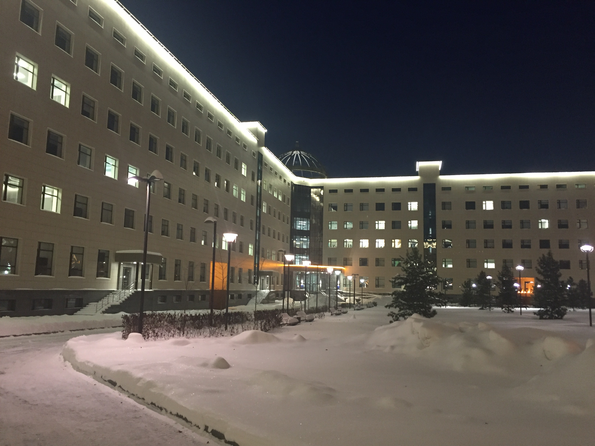
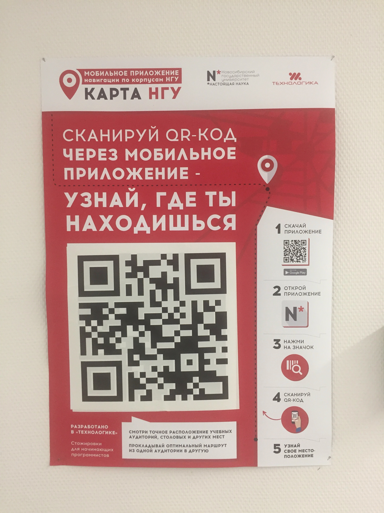
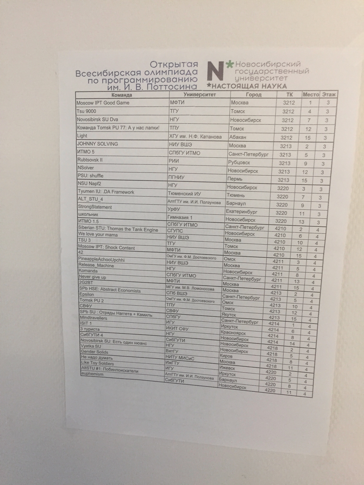
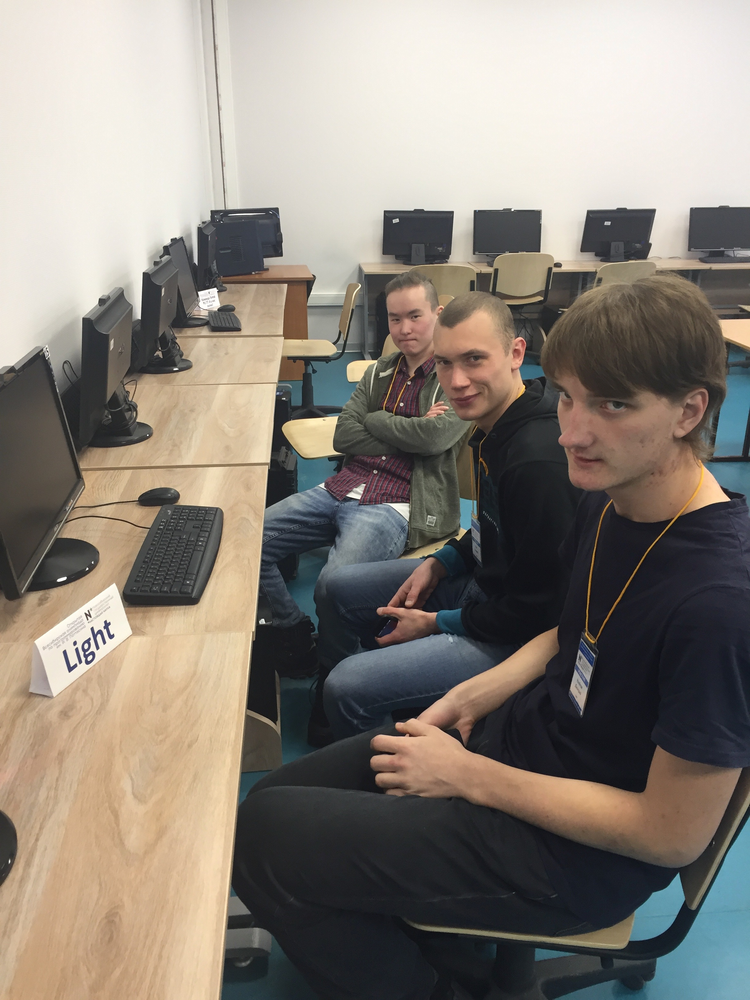
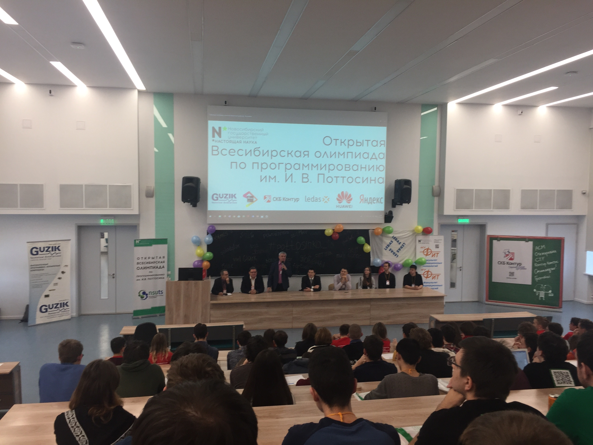
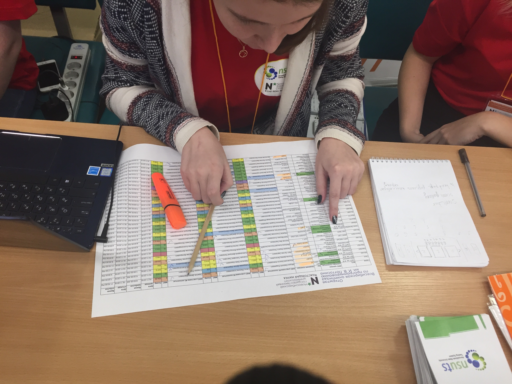
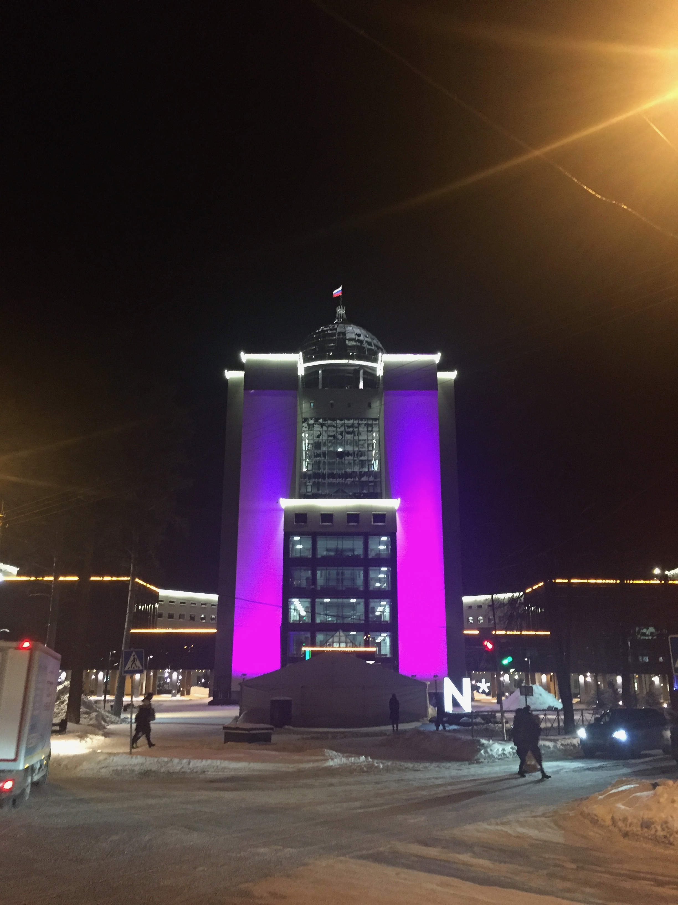
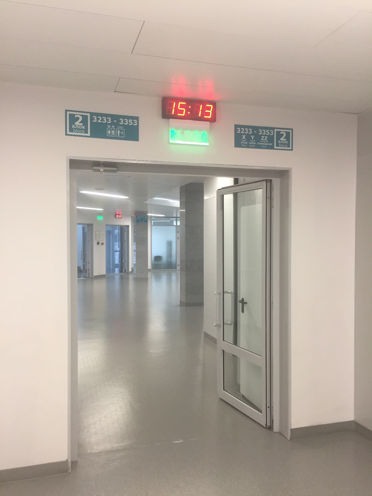

# Участие команды ХГУ в Открытой Всесибирской олимпиаде по программированию имени И.В. Поттосина, 2018

Дата создания: 2018-11-19

Автор: ngrebenshikov

Теги: Всесибирская олимпиада по программированию,ХГУ,Олимпиады,Турниры,Команда по программированию,Спортивное программирование

 

 

 

 

 

 

 

 

 С 16 по 19 ноября в Новосибирском государственном университете проходил очный тур Открытой Всесибирской олимпиады по программированию имени И.В. Поттосина.    
  
Ежегодно к участию в соревнованиях приглашаются команды вузов и школ России, ближнего и дальнего зарубежья. К участию допускаются студенты, аспиранты и школьники. В текущем году в Новосибирск приехали команды из Москвы, Санкт-Петербурга, Кирова, Омска, Ижевска, Томска, Барнаула, Красноярска, Иркутска и других. Список команд серьезный. Хакасский государственный университет прошел с последнего места квоты для сибирских команд по [результатам квалификационного тура](https://olympic.nsu.ru/files/invited_teams_2018.pdf).  
  
Всесибирская олимпиада традиционно проходит в два тура. В первом командам предлагается запрограммирвоать игру или решение оптимизационной задачи. Второй тур проходит по правила ICPC.

- [Задачи 1-го тура](https://olympic.nsu.ru/files/statement_I.pdf)
- [Результаты 1-го тура](https://olympic.nsu.ru/files/results_I.pdf)
- [Задачи 2-го тура](https://olympic.nsu.ru/files/problems_II.pdf)
- [Результаты 2-го тура](https://olympic.nsu.ru/files/results_II.pdf)
- [Итоговые результаты](https://olympic.nsu.ru/files/results_final.pdf)

  
Интересно, что в этот раз можно было понаблюдать за соревнованием команды ХГУ (Light) и НГУ (NSolver, на 2/3 состоящей из школьников из Абакана).