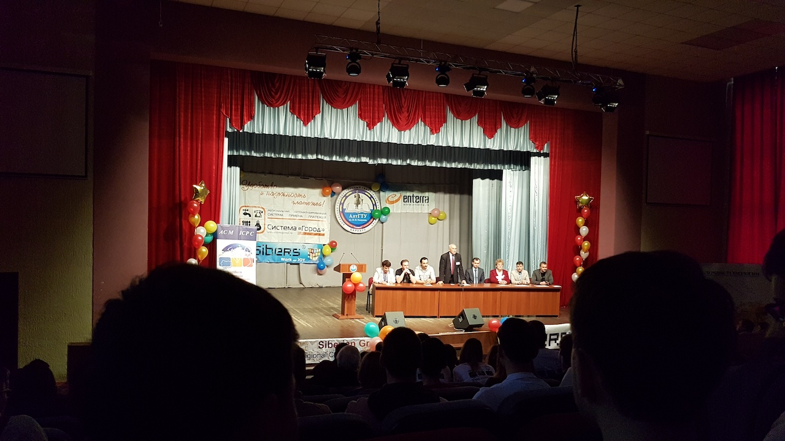
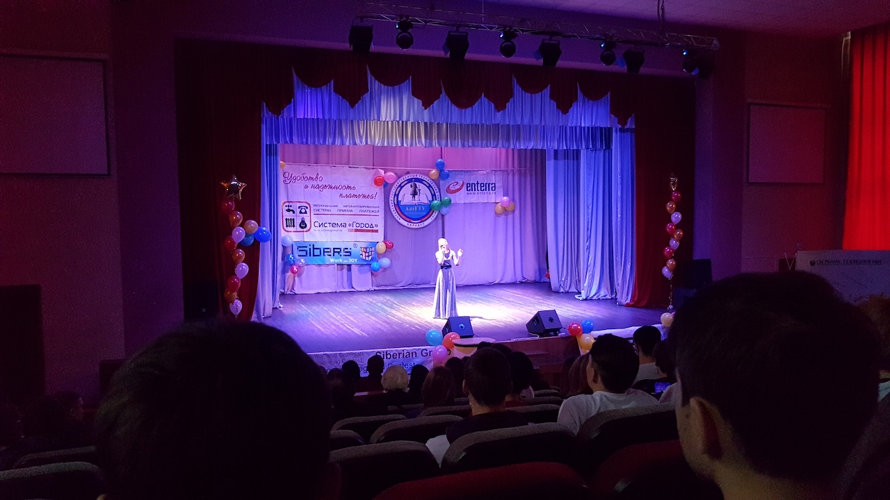
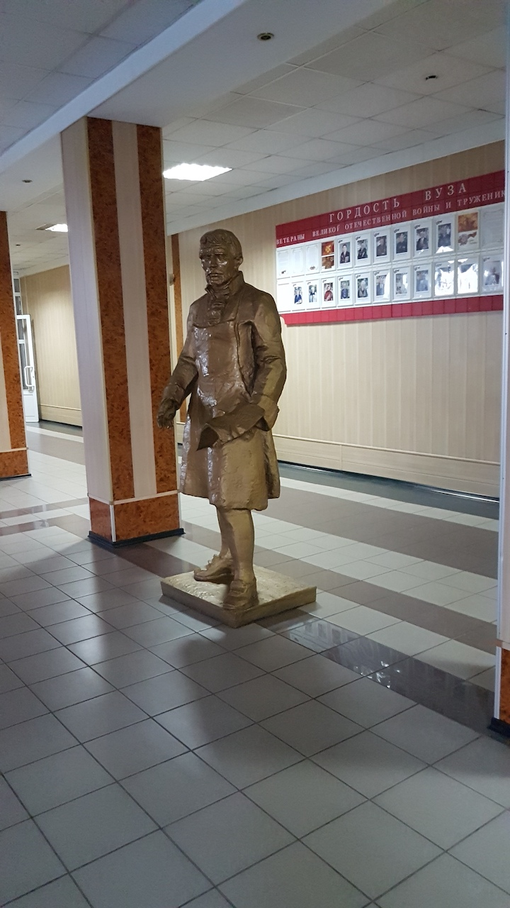
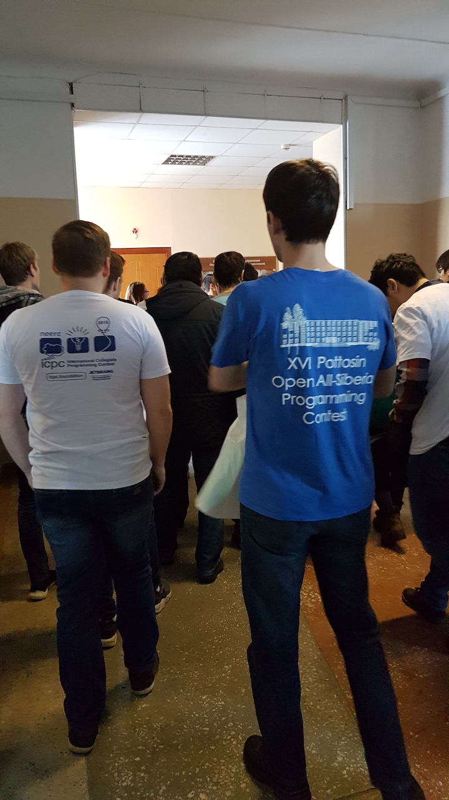
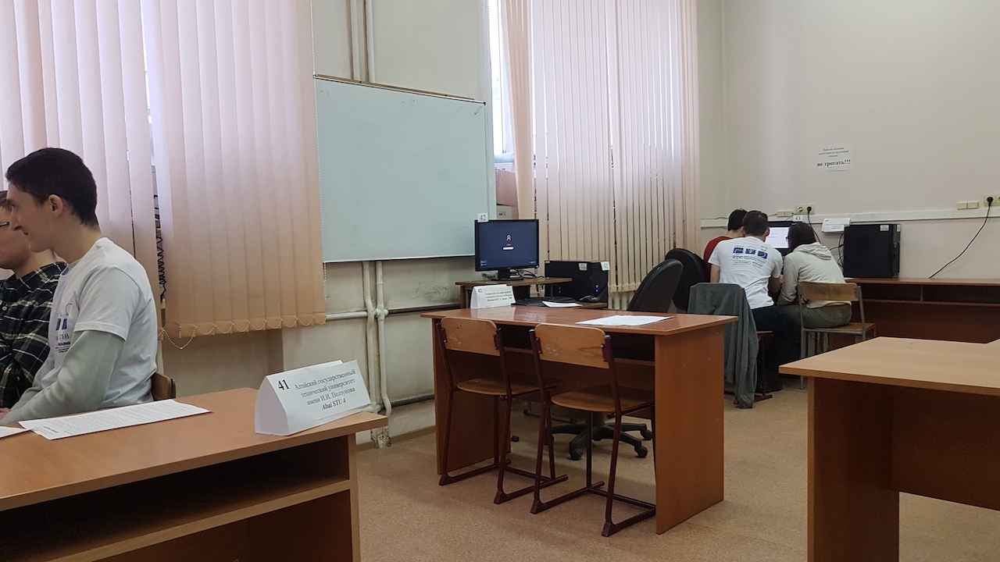

# Выступление абаканских команд в полуфинале ICPC

Дата создания: 2018-12-06

Автор: ngrebenshikov

Теги: Турниры,Команда по программированию,Спортивное программирование,ХГУ,ICPC,Барнаул,Полуфинал

 

 

 

 

 01-02 декабря 2018 в Санкт-Петербурге, Барнауле, Тбилиси и Алматы состоялся полуфинал Международного командного чемпионата мира по программированию среди студентов. Абакан представляли две команды: ХГУ и ХТИ.  
  
Команда ХГУ решила 3 задачи из 13, команда ХТИ одну. Они заняли 220-е и 259-е места. Победителем стала команда Московского государственного университета решившая 11 задач.  
  
[Итоговые результаты](https://neerc.ifmo.ru/archive/2018/standings.html)  
[Условия задач](https://neerc.ifmo.ru/archive/2018/neerc-2018-statement.pdf)  
[Другие материалы соревнования](https://neerc.ifmo.ru/archive/2018.html)  
  
[Порешать задачи с соревнования можно на Codeforces](http://codeforces.com/contest/1089).

