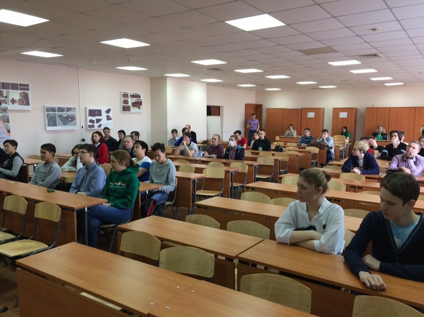

# Фотоотчет и результаты 12-го открытого турнира по программированию в Абакане, 30.03.2019

Дата создания: 2019-04-01

Автор: ngrebenshikov

Теги: Программирование,Открытый турнир по программированию,Турниры,Команда по программированию,ХГУ,Студенты,Школьники

 

 

 

 

 

 

 

 

 

 

 

 

 30 марта 2019 года состоялся 12-й открытый турнир по программированию в г. Абакане.

#### [Результаты](http://contest.lambda-calculus.ru/ejudge/000027/standings.html)

#### [Страница турнира с условиями задач (открыто дорешивание)](http://lambda-calculus.ru/blog/events/165.html)
