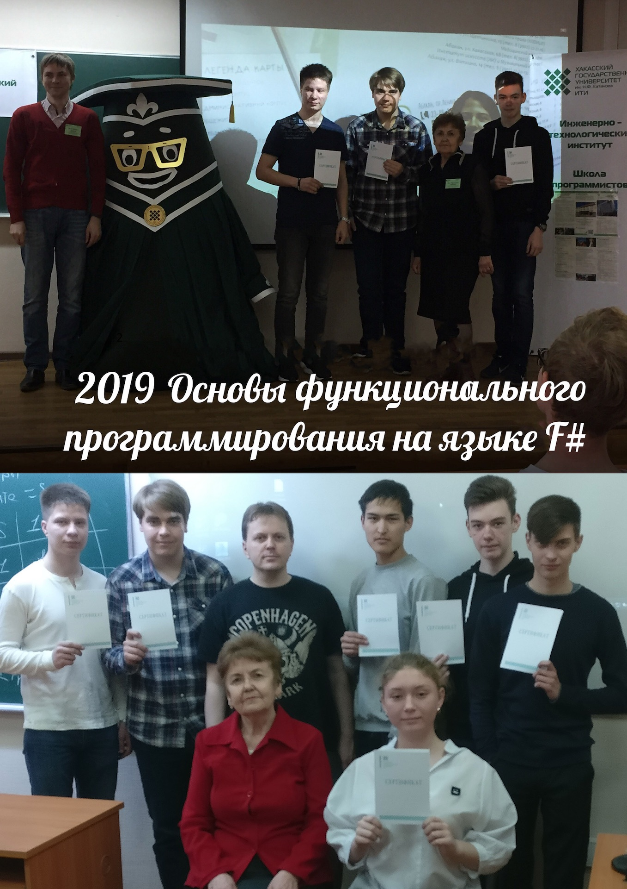
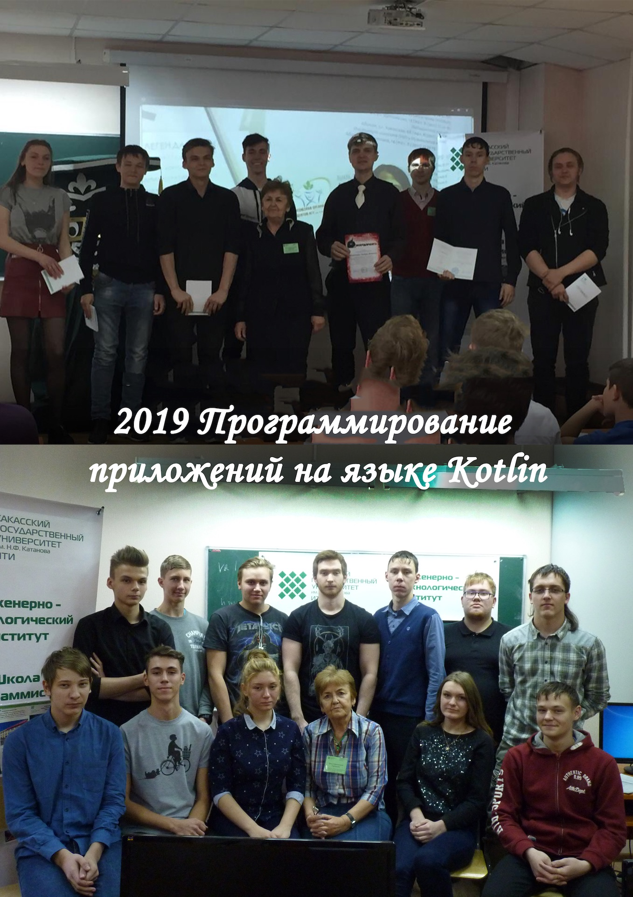
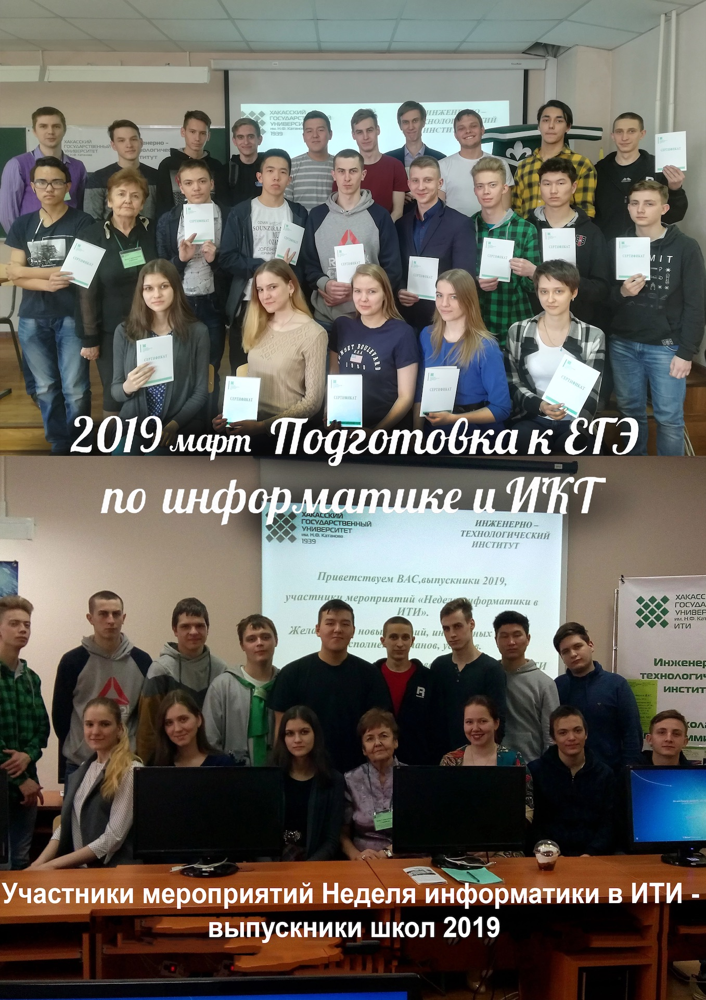
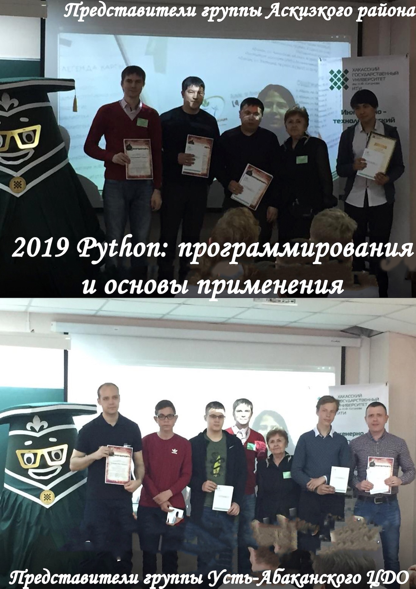
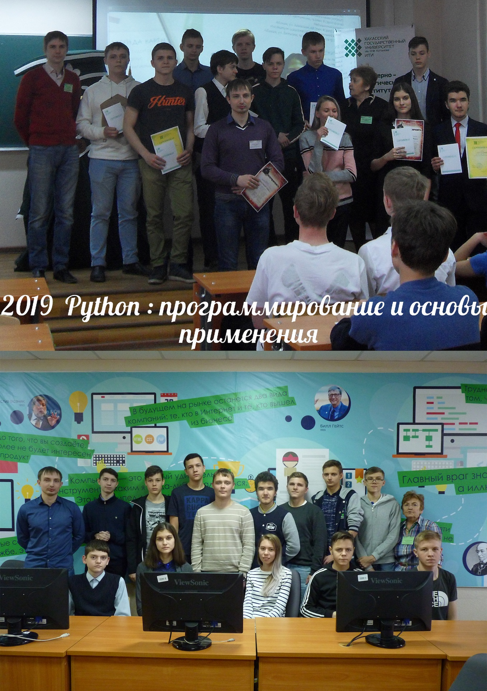
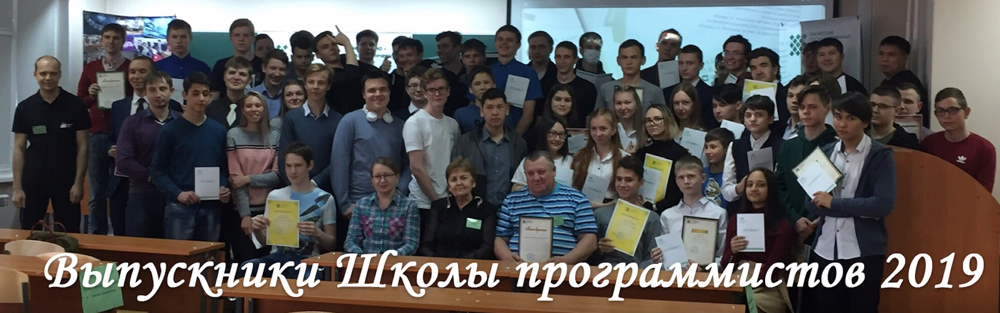
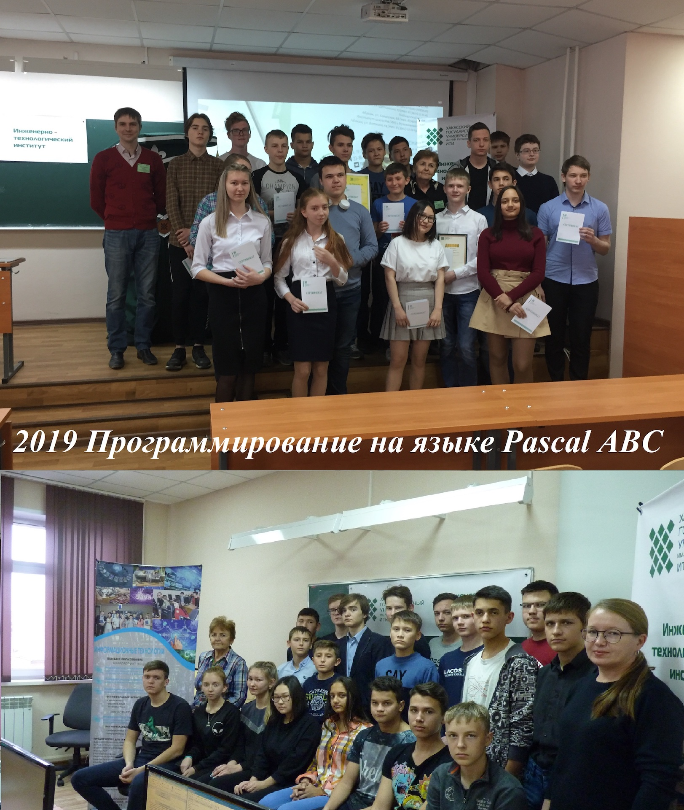
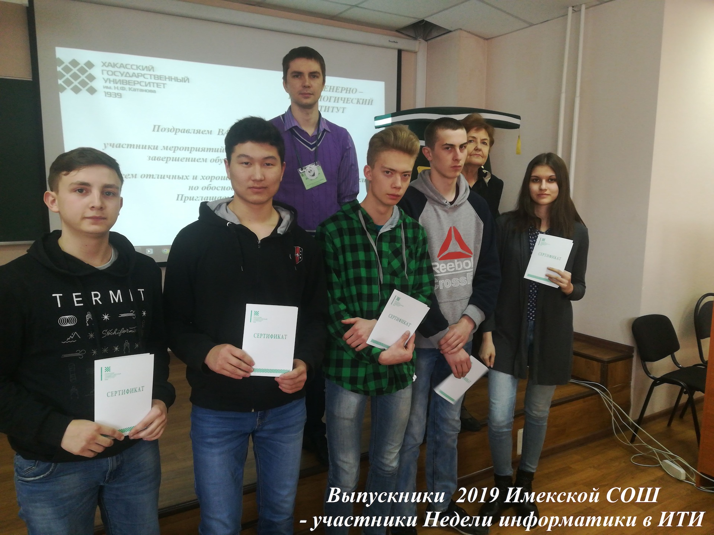
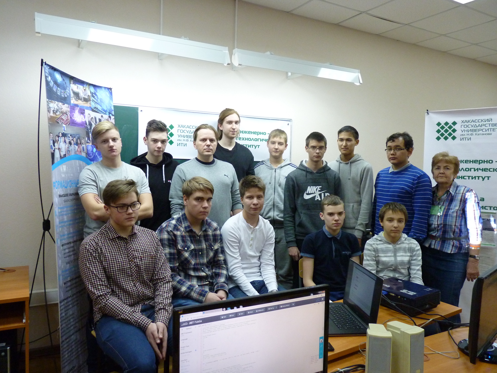

# Завершился учебный год в школе программистов ХГУ

Дата создания: 2019-05-17

Автор: ngrebenshikov

Теги: ХГУ,Программирование,Школа Программистов,Школьники

 

 

 

 

 

 

 

 

 11 мая состоялся восьмой выпуск слушателей в Школе программистов университета на базе инженерно — технологического института. 138 школьников, студентов колледжей и техникумов, учителей информатики из городов и районов Хакасии, Минусинска, Минусинского, Ермаковского и Идринского районов, подтвердившие освоение выбранной ими программы дополнительного образования, получили в 2019 году соответствующие сертификаты установленного университетом образца. На выбор слушателям в сентябре было предложено 6 программ ДО разной степени сложности. 3 слушателя выбрали и освоили в 2018-19 учебном году по 2 программы. 12 выпускников 2019 года освоили по 2-3 программы, обучаясь в Школе программистов уже не первый год.  
  
Среди выпускников Школы программистов 2019года, получивших сертификаты, 42 учащихся 11 класса, выбравших ЕГЭ по информатике и ИКТ. 24 из них обучались по дополнительной общеразвивающей программе «Подготовка к ЕГЭ по информатике и ИКТ» в мартовские каникулы.  
Почти все школьники, слушатели Школы программистов — участники Открытой региональной олимпиады школьников, студентов колледжей и техникумов по программированию ( тренировочного и основного туров Олимпиады). 60 школьников выступали в основном туре. 6 школьников, заняв 1, 2, 3 место в номинации «Школьники, награждены дипломами, 22 участника получили сертификаты.  
  
В Турнире по программированию 15 школьников решали те же задачи, что и студенты СПО и ВУЗов. Школьники Хвостов Даниил и Герасимов Константин (10 класс)в Турнире заняли 3 место и награждены дипломами.  
Завершился очередной учебный год в Школе программистов. С октября по май больше 200 слушателей и гостей Школы программистов от учащихся 7 класса до студентов ВУЗов и школьные учителя изучали интересные программы дополнительного образования, участвовали в турнире по программированию, в олимпиадах по программированию, информатике и ИКТ, выполняли задания квестов, были активными участниками мастер-классов преподавателей информационных дисциплин и ведущих специалистов, руководителей информационных компаний. Каждое из этих мероприятий, практически, одновременно становилось и встречей с выпускниками и студентами информационных специальностей и направлений подготовки института, которые являются достойным примером для юных программистов. С первого дня занятий слушатели Школы программистов чувствуют себя полноправными членами Абаканского клуба программистов, ощущают внимание и заботу старших товарищей студентов-информатов, преподавателей и специалистов информационных компаний. Понимают, что их целеустремленных и талантливых программистов ждут в IT-компаниях и службах информационной поддержки предприятий Хакасии, а прежде всего, в дружном и очень активном и инициативном студенческом коллективе инженерно- технологического института.  
  
Успешного окончания учебного года в школах, колледжах и техникумах, выпускники Школы программистов 2019.Отличного, интересного и активного отдыха летом. Выпускникам школ 2019года желаем исполнения планов при поступлении в Вузы, колледжи и техникумы. Приглашаем вас поступать в инженерно-технологический институт ХГУ им. Н.Ф.Катанова, где вас ждут, знают преподаватели и студенты, где есть все условия и возможности для развития ваших разносторонних интересов, склонностей и способностей. В этом вы уже имели возможность убедиться.  
  
Автор: Горбачева Эрна Герасимовна.

