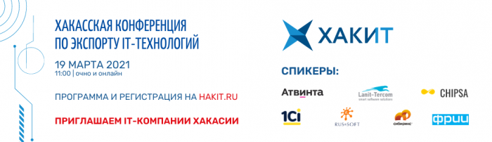

# Хакасская конференция по экспорту IT-технологий «ХАКИТ»

Дата создания: 2021-03-16

Автор: ngrebenshikov

Теги: Конференции,Хакит,Экспорт,Хакасия.ру,Ланит-Терком

   
  
**19 марта 2021 года** в г. Абакан впервые состоится Хакасская конференция по экспорту IT-технологий «ХАКИТ». К участию приглашаются представители компаний, работающие или планирующие развиваться в сфере информационных технологий, разработчики, руководители digital-проектов. Участие бесплатное.  
   
На конференции эксперты расскажут о перспективах развития экспорта IT-услуг, получении государственной поддержки, привлечении инвестиций, а также поделятся реальным опытом развития и работы на экспорт.  
Большинство спикеров приезжает очно, так что можно дополнительно пообщаться в кулуарах конференции, познакомиться и задать интересующие вас вопросы.  
  
Также же коммуникации внутри IT-сообщества региона будут полезны всем!  
  
Приглашенные спикеры:  

- Литошенко Владимир, руководитель комитета по экспорту **РУССОФТ** , старший вице- президент **First Line Software (г. Москва)**
- Жариков Егор, менеджер по развитию бизнеса в Азиатско-Тихоокеанском регионе **1Ci (г. Москва)**
- Бычков Илья, директор по поддержке экспорта информационных технологий, **Российский экспортный центр (г. Москва)**
- Зрюмов Евгений, Министр цифрового развития и связи Алтайского края **(г. Барнаул)**
- Алиев Гаджимурад, Директор по развитию, руководитель акселерационных программ Фонда развития интернет-инициатив **(ФРИИ) (г. Москва)**
- Каштымов Максим, руководитель студии дизайна **«Чипса» (г. Красноярск)**
- Завертайлов Владимир, основатель и руководитель студии интернет-решений **«Сибирикс» (г. Барнаул)**
- Горбаров Илья, руководитель Digital-агентства **«Атвинта» (г. Кемерово)**
- Гребенщиков Николай, предприниматель, партнер компании **«Ланит-Терком» (г. Абакан)**

  
**Организаторы мероприятия:** Центр поддержки экспорта Фонда развития Хакасии, компания «Хакасия.ру».  
**Место проведения:** г. Абакан, пр. Ленина, 59 (Конференц-зал отеля «Абакан»).  
**Дата и время:** 19 марта 2021 г., 11:00 – 18:00 часов  
**Форма участия:** очная и онлайн (просмотр трансляции)  
  
**Подробная программа и регистрация по ссылке:**  
[http://hakit.ru/](http://hakit.ru/)   
  
**Для получения информации и комментариев по проведению конференции обращаться:**  
Служба маркетинга «Хакасия.ру»   
+7 (3902) 30-60-19 доб. 109  
[e.barkovskaya@khakasia.ru](mailto:e.barkovskaya@khakasia.ru)