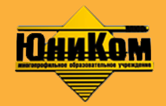

# Учебный центр "Юником"

Дата создания: 2013-12-18

Автор: ngrebenshikov

Теги: Учебные центры,Образование,Школьники

«ЮниКом плюс» — негосударственное образовательное учреждение дополнительного образования. Проводит курсовое обучение в сфере информационных технологий с 1998 года.  
  
   
 Для взрослых это курсы операторов, теория бухучёта и бухучёт на основе 1С. Ещё имеется практика, когда какая-либо организация заказывает разовый тематический курс, а «ЮниКом Плюс» находит для него преподавателя и организует учебный процесс.Проводятся также и индивидуальные курсы (если по востребованной клиентом тематике не набирается группа).  
  
Для детей имеется несколько направлений:

1. Ознакомительный курс для малышей.
2. Компьютерная графика (Corel Draw, Photoshop)
3. 3d studio max
4. Видеодизайн
5. Архитектура ПК
6. Пользователь
7. Продвинутый пользователь
8. Программирование (иногда кроме школьников посещают студенты начальных курсов ВУЗ'ов и ССУЗ'ов):  
  

  - Pascal (PABC): Начальный курс программирования. Закладывает основы алгоритмического мышления.
  - ООП в среде Delphi (7 версия).
  - С++ (или C#, см. кто берётся преподавать).

   
В течение любого из курсов программирования по каждой изучаемой теме проводится контрольная работа. В сертификате указаны темы, количество часов и уровень усвоения. Заканчивается каждый курс проектом (примерно на 15-20 а/ч). Исходя из специфики аудитории, чаще всего это аркадные игры или небольшие стратежки. Изредка создаются и прикладные программы «по просьбе родителей», иногда обучающие.  
  
9. Курсы подготовки к ЕГЭ по информатике

  
Кроме информационных направлений ведутся (и в последнее время расширяются) курсы по другим профилям:  

1. Английский язык (от начинающих до подготовки к ВУЗ'ам)
2. Основы мастерства фотографа
3. Forex

  
Местоположение: ЮниКом плюс, т.: 22-66-32, Абакан, ул. Пушкина 65, второй этаж  
Сайт: [unicom.su](http://unicom.su/)