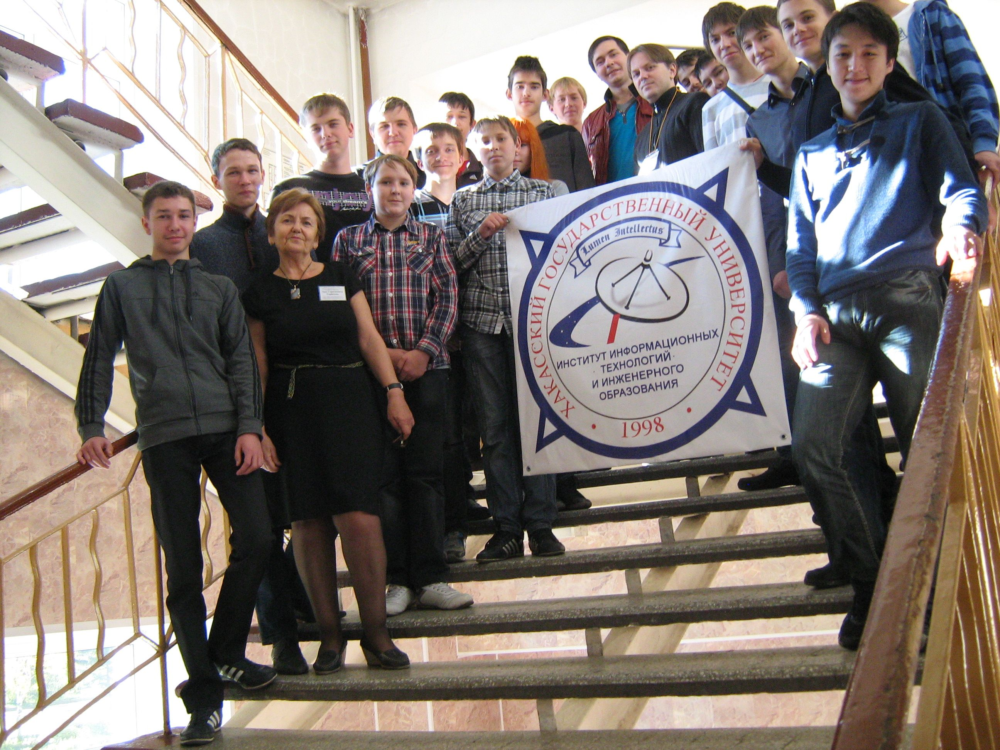
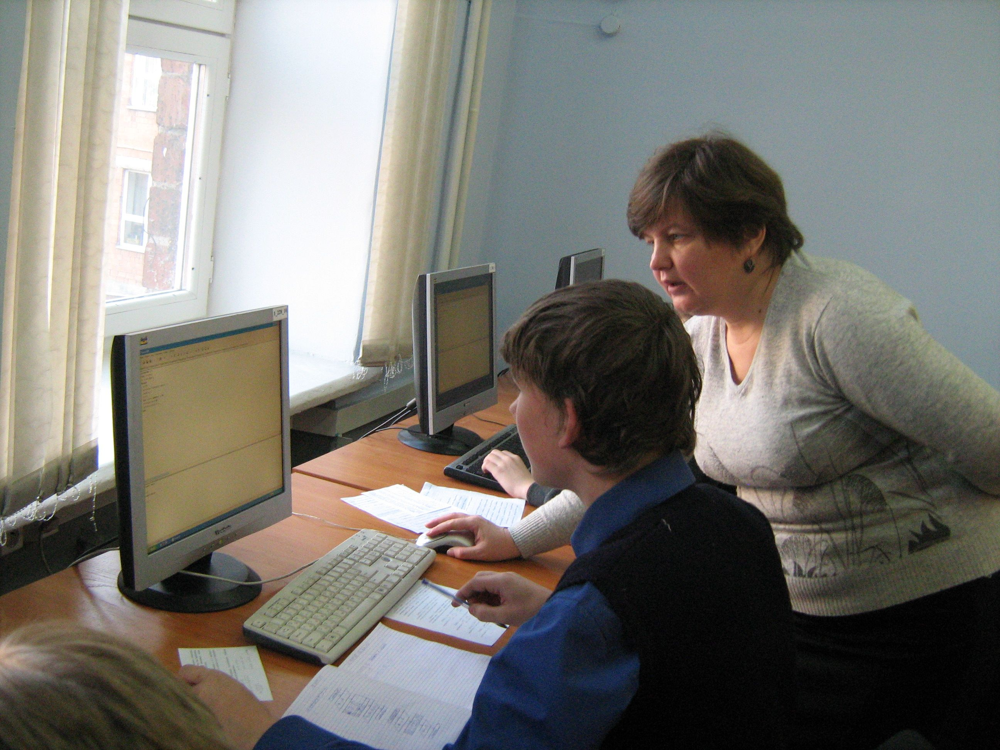

# Школа программистов ХГУ

Дата создания: 2014-02-10

Автор: ngrebenshikov

Теги: ШП,Школа Программистов,ХГУ

 

 

 

 

 

 

 

 

 

 

 

 

 

 

 

 

 

 Программирование — это искусство, которому нужно серьезно учиться  
  
Школьники обучаются ему в Школе программистов Хакасского государственного университета им. Н. Ф. Катанова, в ИИТИО.  
   
Сайт школы: [khsu.ru/main/structure/institutes/iit/postup-iitio/school.html](http://khsu.ru/main/structure/institutes/iit/postup-iitio/school.html)

#### Напутствие
  
Чем раньше начинается обучение сложному и очень восстребованному искусству программирования, тем больше вероятности исключить случайный выбор абитуриентами информационных направлений подготовки.  
  
Как и во всех видах искусства, для серьезных, значительных результатов программисту мало иметь даже достаточный объем соответствующих знаний, умений и навыков. Хотя необходимые специальные знания и умения – основа основ в процессе квалифицированного, профессионального решения производственных задач в любой отрасли экономики.  
  
Школьникам, выбирающим будущую профессию в сфере информационных технологий, мечтающим стать программистами, следует учитывать и жесткие требования этой профессиональной деятельности к деловым и личностным качествам программиста. Программисты высокой квалификации решают задачи, о которых другие люди задумаются только через десятки лет. Поэтому они не могут обходиться базовыми знаниями, которые очень быстро устаревают, а особенно в сфере IT- технологий. Каждый программист вынужден абсолютно самостоятельно искать обоснование своих новых решений. Самостоятельность и самоорганизация, стремление к поиску новых решений, к решению более сложных задач — необходимые для программиста качества.  
  
От качества разработанных программ зависят результаты работы большого количества различных специалистов, а нередко и жизнь людей. Без ответственности за результаты своего труда программист не программист.  
  
Это только некоторые причины, по которым по доброй традиции в Хакасском государственном университете им. Н.Ф. Катанова с самого начала подготовки специалистов по информационным специальностям и направлениям подготовки очень ответственно относятся к поиску, поддержке и подготовке школьников, проявляющих интерес и склонности к программированию.  
  
С первых дней создания Института информатики и телематики, а после реорганизации института уже в Институте информационных технологий и инженерного образования работает Школа программистов. Растет потребность в кадрах IT- специалистов, в университете увеличивается набор по соответствующим приоритетным направлениям. Соответственно увеличивается и количество учащихся в Школе программистов.  
  
В историю Школы, возможно, войдет октябрь 2011 года, когда более 200 школьников из разных городов, районов, поселков и сел Хакасии и Красноярского края начали очередной учебный год в аудиториях ИИТ ХГУ по воскресным дням…  
  

#### История школы
  
Цель организации школы: стимулирование интереса к углубленному изучению информатики, допрофессиональная подготовка и формирование профессиональной направленности школьников на информационные специальности и направления подготовки, поиск и поддержка одаренных детей. Одна из важных задач, которая целенаправленно решается в Школе — формирование у обучающихся профессионально-важных для программистов качеств: самоорганизация, ответственность за порученное дело, за принятое решение, за результаты своей работы и за работу своих товарищей.  
  
Школьники посещают занятия бесплатно.  
  
В 2012 и 2013 году окончили Школу программистов и получили сертификаты 31 выпускник общеобразовательной школы. 21 из них стали студентами нашего университета. Только одна из них поступила в Медико-социально- психологический институт университета, 20 обучаются на информационных направлениях подготовки, из них 18 студенты 1 и 2 курса Института информационных технологий и инженерного образования, 2 студента учится в коллеже педагогического образования, информатики и права.   
  

#### Самоорганизация. Выпускники школы — активные студенты
  
Пример самоорганизации, самоуправления студентов в ИИТ с первых дней был безоговорочно принят школьниками.  
  
По сложившейся традиции, информация о наборе в Школу программистов распространяется школьникам, учителям и родителям через учащихся Школы, студентов и магистрантов. Организация учащихся ШП в первые дни занятий очередного учебного года, все мероприятия вне занятий организуют студенты — выпускники Школы программистов и учащиеся Школы 2 года обучения. Учащиеся ШП, кураторы по городам и районам, способны организовать свой коллектив на любое дело.  
  
Все без исключения студенты-выпускники Школы программистов университета очень активно включились в студенческую жизнь ИИТИО. Среди них старосты групп, профсоюзные лидеры, организаторы и активные участники всех студенческих мероприятий.  
  
Это тоже результат социальной адаптации учащихся Школы программистов к студенческой жизни. Независимо от возраста, с первых дней обучения в Школе школьники полноправные члены дружного студенческого коллектива ИИТИО. Они участники ежегодной олимпиады по программированию, в которой пробуют свои силы по решению олимпиадных задач все. 10 участников, набравших максимальное количество баллов, получают почетное право выступать в весеннем Турнире по программированию, который с 2013 года проводится на базе нашего университета. Участие в Турнире вместе со студентами, магистрантами, аспирантами и IT-специалистами очень ответственно и почетно.Это серьезная проверка не только уровня подготовки, но и характера, силы воли.  
  
Школьники с удовольствием участвуют вместе со студентами в традиционно организуемом в университете чемпионате «Собери компьютер», выступают с докладами на научно практической конференции на секции «Современные языки программирования.»  
  

#### Программа школы
  
Учащиеся Школы осваивают на занятиях и используют при решении задач, в том числе и олимпиадных, разные языки программирования.  
  
В 2013-2014 учебном году учащиеся Школы программистов обучаются по нескольким программам общего дополнительного образования:  

- для учащихся 1 года обучения — программа общего дополнительного образования «Программирование в системе Pascal ABC»,
- для учащихся 2 года обучения — программа общего дополнительного образования «Программирование в системе C#».

  
В группы 1 года обучения зачисляются без предварительного собеседования учащиеся 9-11 класса, проявляющие   
интерес и склонности к программированию.   
  
Учащиеся 7-8 класса могут быть зачислены в Школу программистов после подтверждения в процессе собеседования склонности к программированию.  
  
В группы 2 года обучения зачисляются без предварительного собеседования учащиеся школы программистов ХГУ, имеющие сертификат об освоении программы «Программирование в системе Pascal ABC, и другие школьники, подтвердившие освоение этой программы. Некоторые ребята уже осваивают 3ью программу, уже имея 2 сертификата.  
  
В этом году впервые школьники учатся работать с микроконтроллерами, программировать Arduino устройств и роботов. [khsu.ru/main/structure/institutes/iit/events/arduino.html](http://khsu.ru/main/structure/institutes/iit/events/arduino.html)  
  

#### География учащихся. Дистанционное обучение
  
В этом году впервые школьники из отдаленных от Абакана районов получили возможность обучаться дистанционно с выездом на занятия в университет по определенному графику, для участия в олимпиадах, Турнирах и Чемпионатах. Успешно занимаются ребята из Абазы, Аскиза и поселка Ильичево Шушенского района. Наверняка на следующий год увеличится количество обучающихся дистанционно как по количеству школьников, так и по количеству районов. Жаль, что такую возможность еще не оценили в Орджоникидзевском, Ширинском, Бейском и других районах нашего региона.  
  

#### Отношение к учебе
  
Вызывает восхищение стремление к освоению программирования тех школьников, которые серьезно занимаясь в своей школе 6 дней в неделю, каждое воскресенье спешат в Школу программистов, где занятия проводят опытные преподаватели университета, ведущие IT- специалисты.  
  
Сложно перечислить всех учащихся и выпускников ШП, кого хочется отметить по результатам достаточно серьёзной аттестации по освоению учебных программ. Это показатель ответственного отношения и к занятиям, и к выполнению самостоятельной работы.  
  
Все слушатели школы, учителя и родители с благодарностью, высоко оценивают представленную университетом, Институтом информационных технологий и инженерного образования возможность школьникам освоить основы программирования без оплаты.  
  
Программисты убедительно доказали, что умеют и трудиться, и отдыхать.  
  
Впереди серьёзная работа, напряжённые занятия и теоретические, и практические, участи в очередных олимпиадах и Турнирах, аттестация по результатам освоения программ дополнительной подготовки. Все это необходимо, чтобы обеспечить в будущем широкий диапазон профессиональных возможностей сегодняшним школьникам.   
  

#### Поддержка со стороны сообщества
  
Из года в год множится число руководителей фирм, компаний, отделов из числа выпускников университета информационных специальностей и направлений подготовки, поддерживающих талантливых юных программистов. Они являются спонсорами призов и подарков победителям олимпиад и Турниров. Ведущие специалисты этих предприятий частые гости на мероприятиях в Школе программистов. Их рассказы и советы бесценны для юных программистов.   
  
Хакасский государственный университет им. Н.Ф. Катанова, как ведущий центр образования и науки в регионе, и, прежде всего, ИИТ, ИИТИО взяли на себя миссию решать проблему не только подготовки специалистов по информационным специальностям и направлениям подготовки, но и обеспечивать как можно более раннюю ориентацию школьников на эти направления.  
  
Успехов Вам, будущие программисты! Вы нужны Хакасии!  
Доцент кафедры ПОВТиАС, руководитель Школы программистов Эрна Горбачева