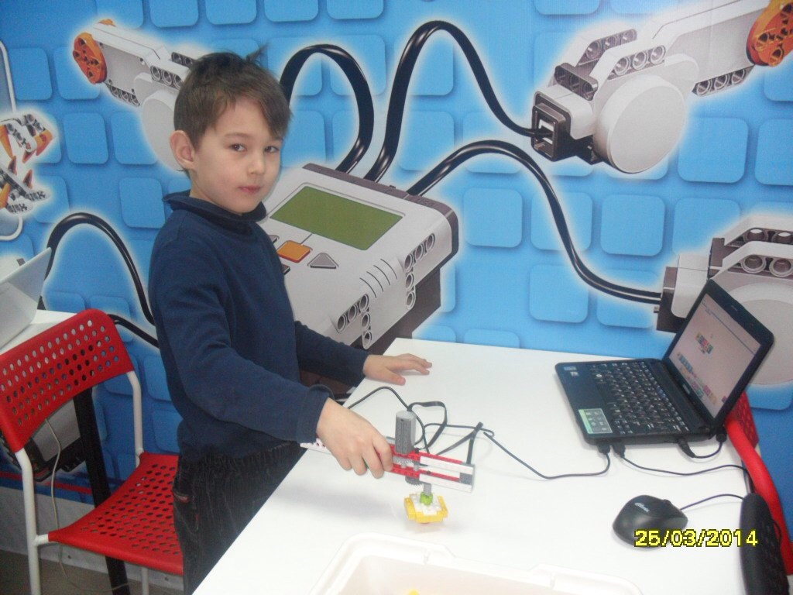

# Музей и клуб робототехники "ЭкспериментУм"

Дата создания: 2014-04-08

Автор: ngrebenshikov

Теги: ЭкспериметУм,Школьники,Дошкольники,Роботы

 

 

 

 

 

 

 

 

 

 

 

 

 

 

 

 

 #### Музей
  
Музей занимательных наук «ЭкспериментУм» находится по адресу Абакан, ул. Вяткина, 63 сот. тел. 89233936322. Основан в сентябре 2012 года Смолкиным Денисом Ивановичем.  
  
Музей представляет из себя интерактивную площадку, на которой собрано 62 эксперимента по физике. Все экспонаты можно трогать руками и принимать непосредственное участие в эксперименте, что является самой интересной частью изучения физики.   
  
Так же в музее запущено новое направления по экспериментальной химии. Съемки рубрики«Теория большего Бума» с участием Профессора Протона и молекулы Даши, для программы «Ми-ми-минечки» ТНТ-Абакан, проходят в музее.   
  
Дополнительную информацию о работе музея, фото, видео репортажи можно найти на нашем блоге и на страничке вконтакте:  

- [experiment-um.blogspot.ru](http://experiment-um.blogspot.ru)
- [vk.com/experimentum](http://vk.com/experimentum)

  

#### Клуб робототехники
  
В сентябре 2012 года на базе музея занимательных наук «ЭкспериментУм» организован клуб робототехники.   
  
Конструирование проходит с использованием конструкторов Lego Mindstorms NXT 2.0, программирование в на платформе NXT-G. В данный момент в клубе этим направление занимается около 20 ребят в возрасте от 9 до 14 лет. В процессе занятий по кибер искусству, проходят внутренние состязания в направлениях: РОБОТЫ СУМО, ПРОХОЖДЕНИЕ ТРАССЫ ПО ЛИНИИ, КЕГЕЛЬРИНГ, РОБОФУТБОЛ, ТВОРЧЕСКИЕ НАПРАВЛЕНИЯ.   
  
Преподаватель направления Lego Mindstorms NXT 2.0 Курбатов Илья Игоревич  
  
С сентября 2014 года планируется разделение этого направления. Первый, для новеньких и тех кто ходит на занятия не так давно, повторный курс. Второе, для ребят занимающихся уже год, переход на более сложные платформы программирования, такие как RobotC.  
  
Информация для коллег, в клубе есть отличный тестовые стол, поля для состязаний и огромное футбольное поле и самое главное площади для проведения небольших соревнований. Если есть желание устроить состязание, рассмотрим все предложения.  
  
[Репортаж о клубе в программе МиМиМишечки ТНТ-Абакан.](http://rutube.ru/video/embed/6815236)  
  

#### Направление ПЕРВОРОБОТ
  
С марта 2014 года в клубе робототехники на базе музея занимательных наук «ЭкспериментУм» открыто новое направление «ПЕРВОРОБОТ».  
  
Этим направление занимаются ребята с 6 до 9 лет. ( есть даже пара 5и летних)  
  
Конструкторы Lego Education WeDo, представляет собой набор деталей лего, при помощи которых дети могут собрать простейшие механизмы и с использованием двигателей, датчика наклона, датчика расстояния и специального коммутатора, подключить к компьютеру, запрограммировать и оживить свой механизм. В процессе занятий ребенок знакомится с азами механики. Например различными передачами, такими как зубчатая (понижающая, паразитная, повышающая), коронная, ременная, червячная, кулачковая, рычаг и т.д.  
  
Все происходит в игровой форме, причем после сборки модели проводится лабораторная работа, в процессе которой происходит анализ конструкции.  
Все механизмы разбиты на группы и после сборки каждой серии, устраиваются показательные выступления в виде макетной сценки.  
  
Роботы LEGO WeDo полезны для обучения школьников, так как способствуют:  

- развитию словарного запаса и навыков общения при объяснении работы модели,
- установлению причинно-следственных связей,
- анализу результатов и поиску новых решений,
- коллективной выработке идей,
- проведению систематических наблюдений и измерений,
- умению ориентироваться в схемах.

  
Преподаватели направления «ПЕРВОРОБОТ»:  

- Павлова Елена Владимировна;
- Бердникова Ольга Александровна.

