# Вести из школ о ходе мероприятий Недели Информатики в Образовании,  мероприятий Всемирной акции  «Час Кода»

Дата создания: 2014-12-11

Автор: ngrebenshikov

Теги: Час кода,Школьники,Школа Программистов

 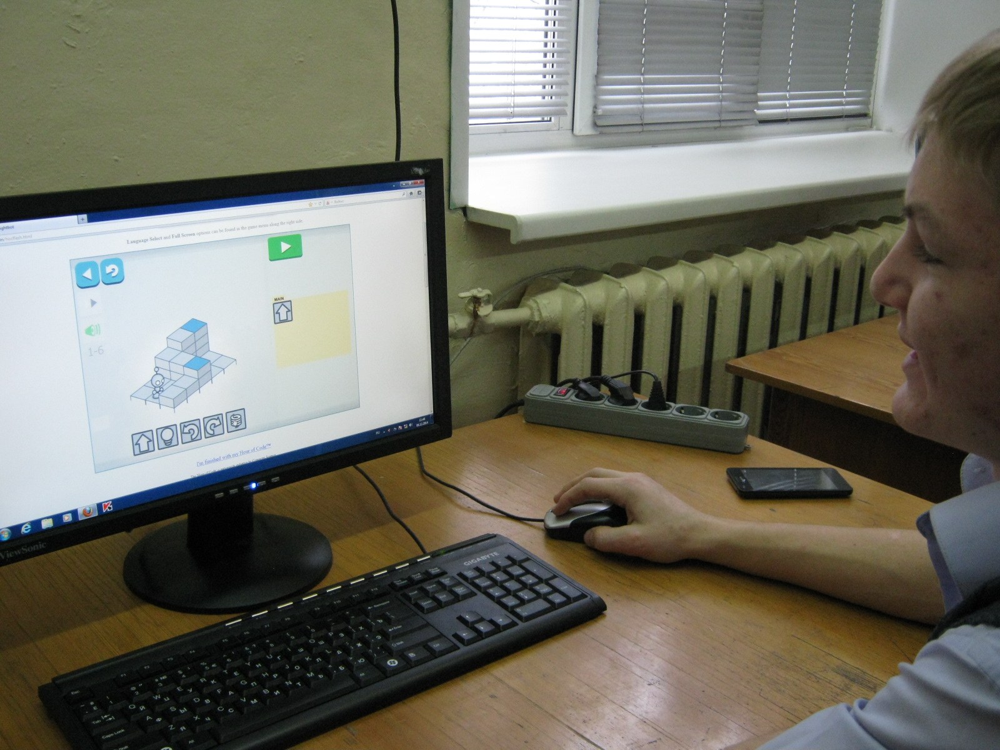

 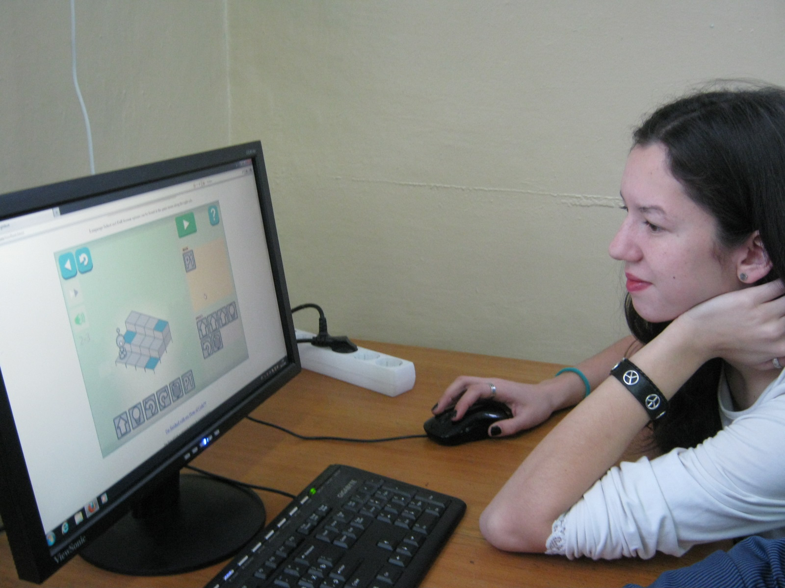

 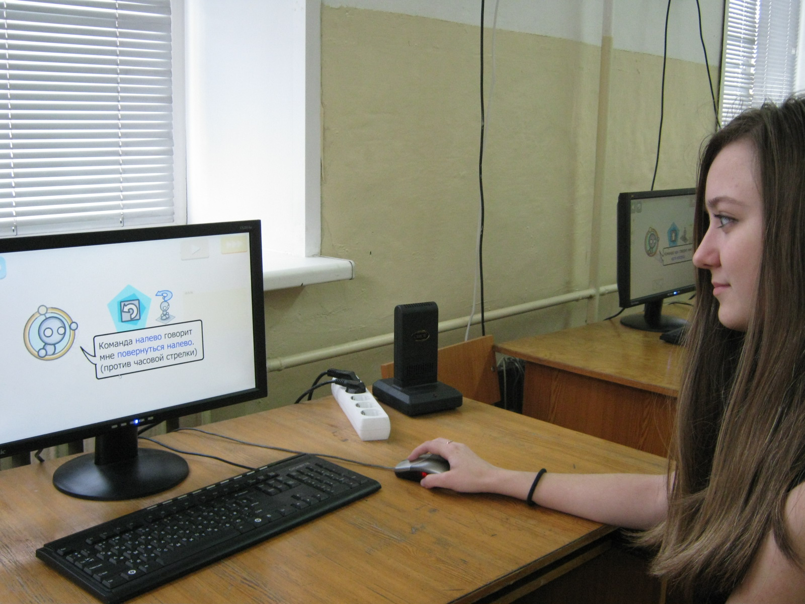

 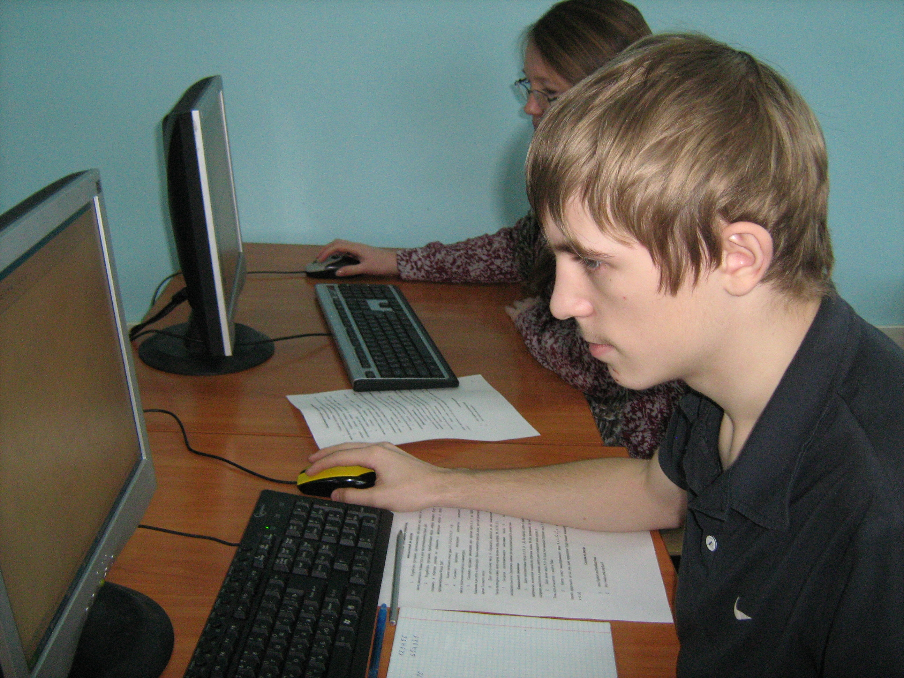

 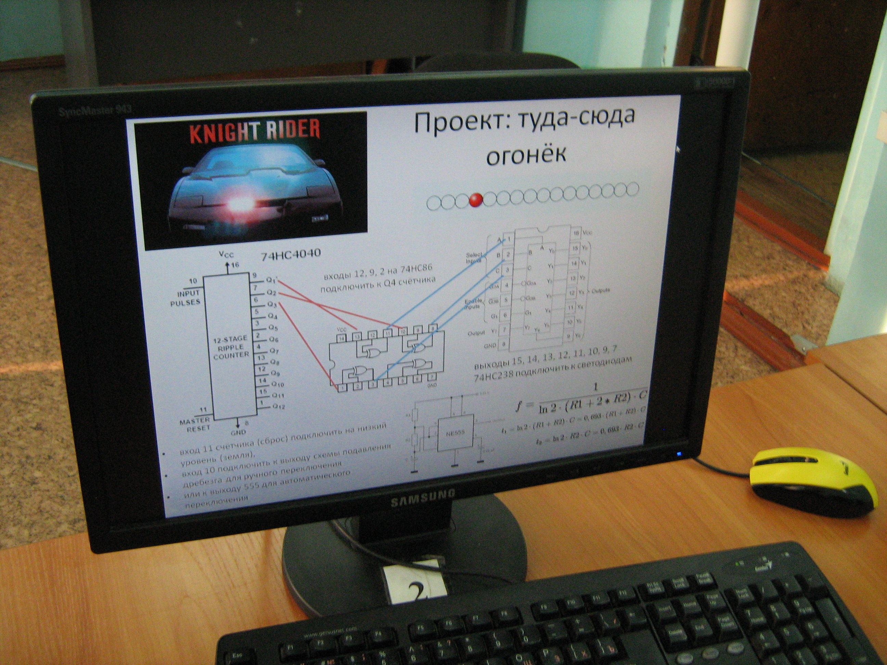

 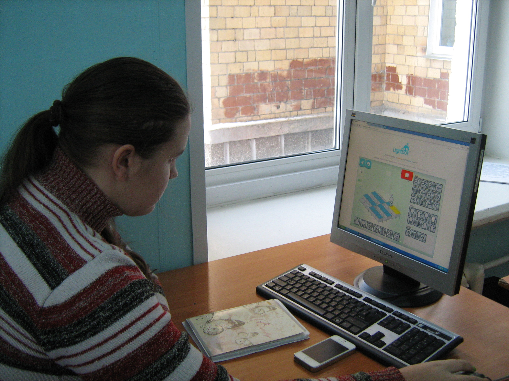

 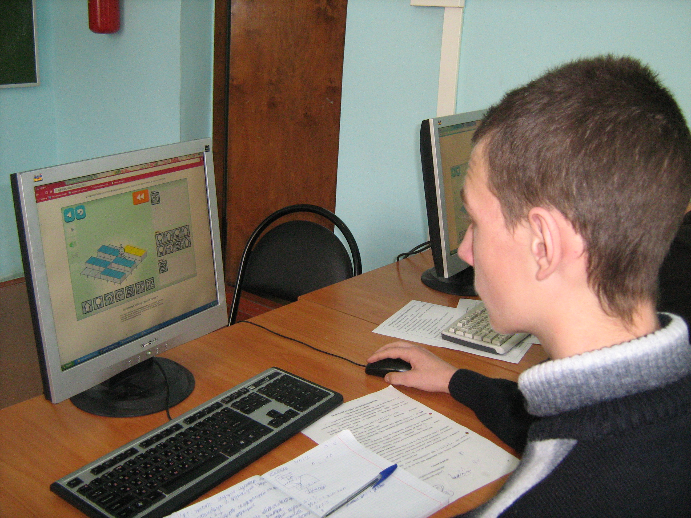

 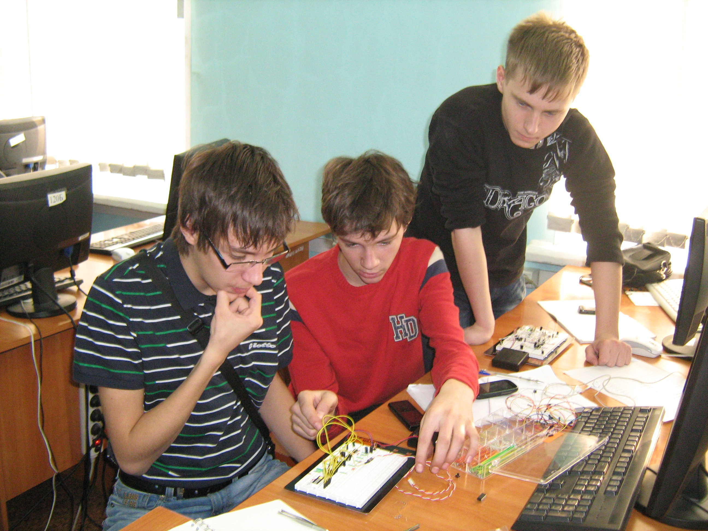

 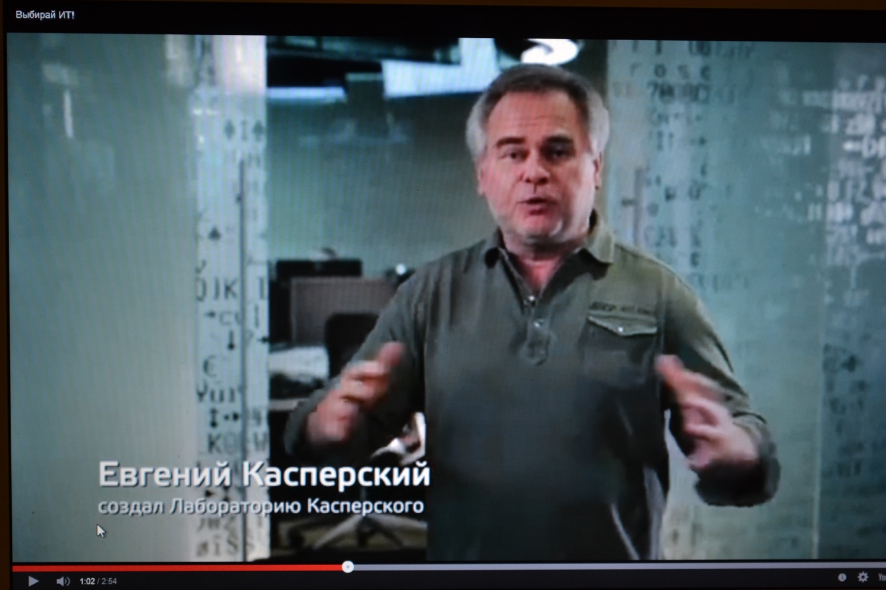

 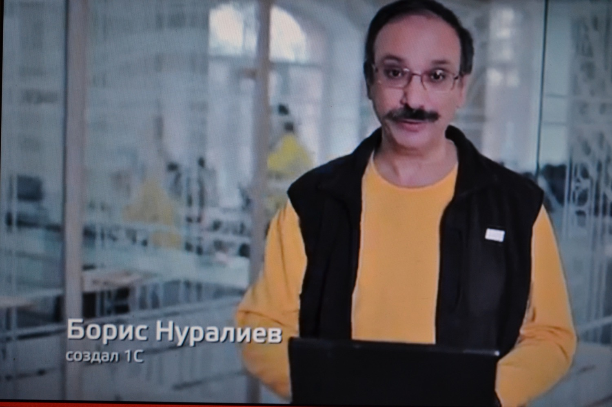

 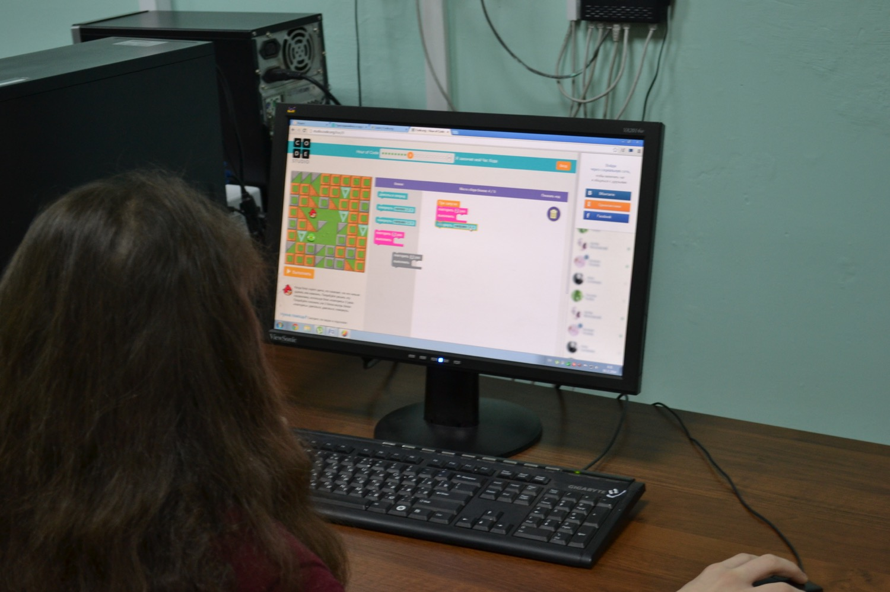

 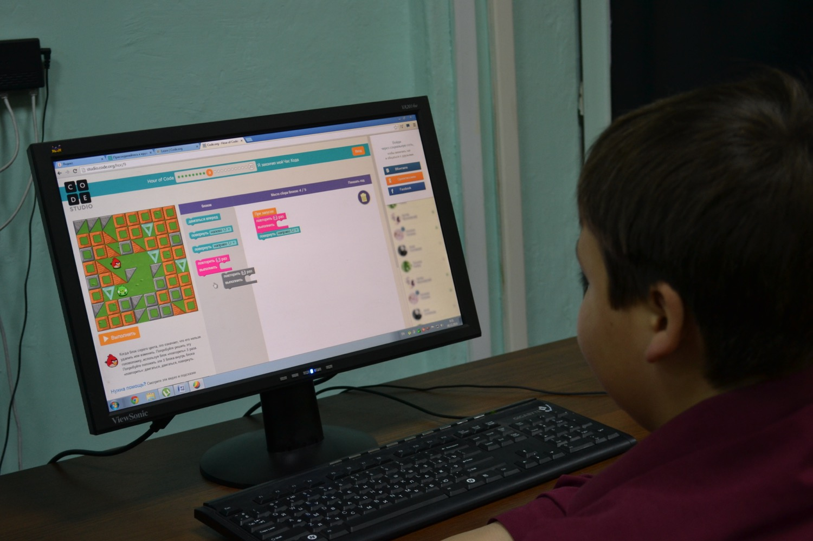

 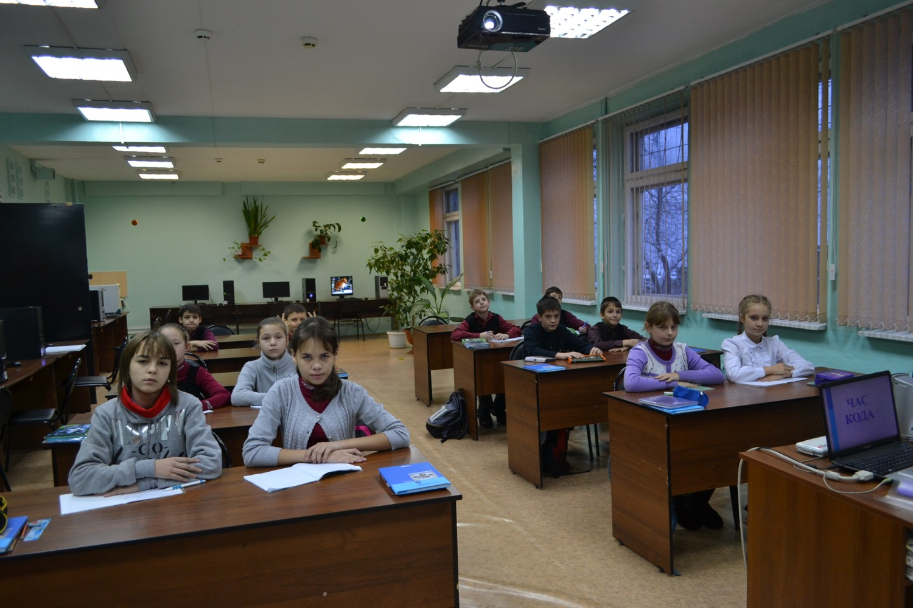

 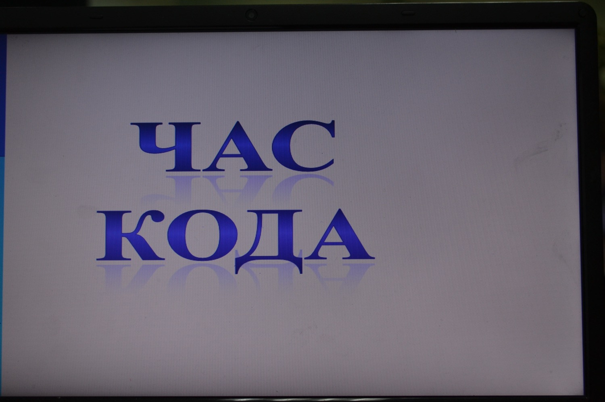#### МБОУ «МОУ Лицей г. Абакана»
**3 декабря** прошли первые занятия в рамках акции «Час Кода» с учащимися 9 классов,  
**5 декабря** — с учащимися 7 классов под руководством инструкторов- учителей Лопатиной Т.А., Максименко Л.Н.   
**До 12 декабря** участниками занятий в рамках акции станут и другие учащиеся Лицея с 1 по 11 классы.  
_Информация Лопатиной Татьяны Александровны_  
  

#### МБОУ «Гимназия г. Черногорска»
Организатор мероприятий в рамках акции «Час Кода» Любовь Степановна Девятова Педагоги и школьники  
МБОУ " Гимназия г. Черногорска" приглашают всех желающих присоединиться к их интересному мероприятию. Есть предложение делиться опытом проведения подобных мероприятий на наших сайтах. Пусть будет больше ребят, увлеченных информатикой, программированием и больше педагогов — энтузиастов. Успехов всем!  
  
http://www.youtube.com/embed/BZM8El5FDKc  
  

#### МБОУ «СОШ №1»г. Абакана
  
Неделя Образования в Информатике в МБОУ «СОШ №1»Абакана стартовала **7 декабря** в 9.00 с проведения Часов Кода. Интересные занятия со школьниками организовали инструкторы -учителя школы: Зворыгина Г.Н., Захарова О.Н., Виноградов Р.А., Адаменко М.В в кабинетах 21, 22, 25а с 09.00 Информация Захаровой Олеси Николаевны  
Школа программистов ХГУ им. Н.Ф.Катанова  
  
**7 декабря** прошли практические занятия во всех группах Школы в соответствии с расписанием занятий. Обучение программированию, воспитание у учащихся ответственности за выполнение заданий, развитие интереса к профессиональной деятельности IT-специалистов- задача Школы программистов в рамках Недели Образования в Информатике, в рамках акции «Час Кода», как и всегда.   
  
Преподаватели Школы-ведущие специалисты в сфере IT-технологий, ведущие преподаватели информационных дисциплин в университете. Именно в этот день мы попросили преподавателей рассказать учащимся о роли информатики, программирования в их жизни и профессиональной деятельности.   
  
У каждого школьника была возможность, выполнив задание по теме занятия раньше, приступить к выполнению занимательных заданий, предложенных в интернете в рамках акции «Час Кода». Но все желающие ребята занимались этим вне учебного времени, получив адреса размещения соответствующих материалов, в том числе и заданий заочной олимпиады по программированию.  
  
Интересно отметить, что учащихся Школы программистов стали источником информации для многих своих одноклассников о проведении акции и многих интересных мероприятиях. Пусть мероприятия в рамках акции «Час Кода» станут для школьников началом серьезного увлечения программированием, началом осознания необходимости информационного образования для современных специалистов.  
 — Пусть не заканчивается, а только расширяется и крепнет сотрудничество школ, профессиональных учебных заведений ВПО и СПО, IT- компаний во благо молодежи и перспективной сферы IT- технологий. Интересных мероприятий и отличных результатов организаторам и участникам международной акции «Час Кода»  
  

#### МБОУ «СОШ №10» г. Абакана
  
**8 декабря** по программе " Часе Кода" работал 41 ученик под руководством инструктора-учителя информатики Александры Гавриловны Тинниковой.  
**9 декабря** 49 учащихся 9-11 классов увлеченно работали на интересных занятиях «Час Кода». (см. фото внизу)  
  

#### МБОУ «СОШ № 20 г. Черногорска»
С большим интересом занимались на Тематических Уроках в рамках акции «Час Кода» Хадзиевой Нелли Гериковны учащиеся 5х классов. Пусть будет интересным и результативным каждое занятие следующе за этим мероприятием занятие. (см. фото внизу)  
  

> Активно проводятся мероприятия в рамках акции «Час Кода » в школах Аскиза: Калининской СОШ Аскиза, СОШ п. Аскиз, Аскизском лицее-интернате.

  

#### МБОШИ «Аскизский лицей-интернат» имени М.И.Чебодаева,
Начало мероприятий акции получилось 1 декабря. Соревновались 2 пары: 2 сильных ученика и 2 учителя. Результат отличный, Задания повышенной сложности за 15 минут… 4 декабря приняли участниками интересных мероприятий стали 97 учеников 5х и 10 х классов. До сертификата дошли примерно половина участников.  
  
**5 декабря** на необычных занятиях увлеченно занимались 86 учащихся 11-х классов и 22 из 7 классов, 6 декабря -40 учащихся 9-х классов.  
  
**До 9 декабря** включатся около 200 учащихся 5-6 классов. Все ребята хотели бы начать выполнять такие интересные задания как можно раньше, но регулятор системы такой работы- количество имеющихся компьютеров.  
  
Ребятам очень нравятся такие занятия. Многие школьники записывают адреса расположения заданий, чтобы побольше позаниматься дома.   
Дети учителей-дошкольники, увидев увлеченных ребят, принялись за освоения курса 4-9 класса.  
_Информация Чебодаевой Карины Савельевны._