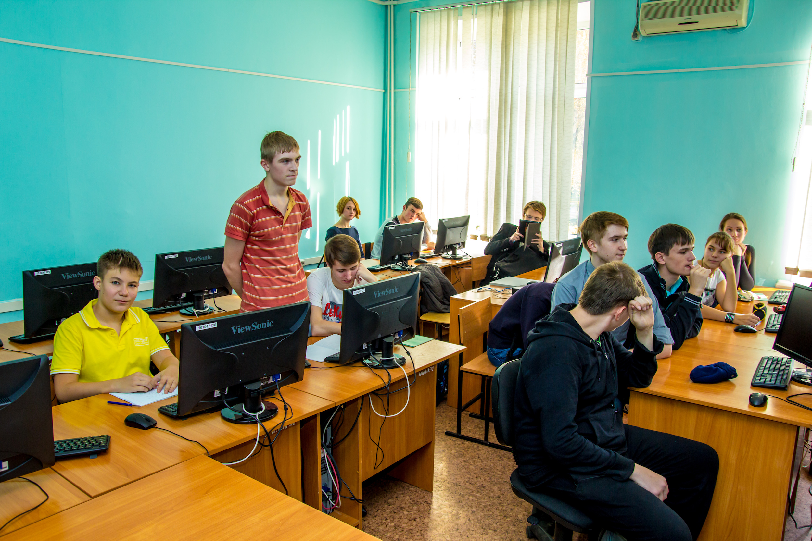

# Открытие очередного учебного года в Школе программистов ХГУ

Дата создания: 2015-10-13

Автор: ngrebenshikov

Теги: Школа Программистов,ХГУ,Программирование

 

 

 

 

 

 

 

 

 

 10 октября в Школе программистов ХГУ им. Н.Ф.Катанова начался очередной учебный год.  
  
Более 140 школьников из Абакана, Черногорска, Саяногорска, Белого Яра, Усть-Абаканского и Боградского районов в этот субботний день стали участниками открытых лекций и мастер-классов преподавателей информационных дисциплин. Ребята получили возможность убедиться, что программирование — это искусство, которому нужно серьезно учиться.  
  
Школьникам предложены дополнительные образовательные программы: «Программирование на языке Pascal ABC» и «Конструирование электронных устройств и программирование микроконтроллеров».  
  
По установившейся с 2011 года традиции, теплую встречу слушателям Школы программистов полностью подготовили выпускники Школы 2012-2015 годов, студенты ИИТИО.   
  
День начала занятий — первый день открытых дверей в ИИТИО.   
  
Доброй традицией стало фотографирование всех желающих освоить искусство программирования с преподавателями, выпускниками Школы программистов, присутствующими родителями и школьными учителями в первый день занятий. В день выпуска, в конце апреля фотографируются все, кто подтвердил свой интерес к программированию, освоение дополнительной образовательной программы и по результатам аттестации получис сертификат.

> Пусть и этот учебный год будет интересным и результативным для учащихся и педагогов. Пусть исполнятся ваши самые смелые планы и мечты. Пусть по сложившейся традиции, из года в год увеличивается количество студентов нашего университета, Института информационных технологий и инженерного образования, выпускников Школы программистов.

  
Эрна Герасимовна Горбачёва