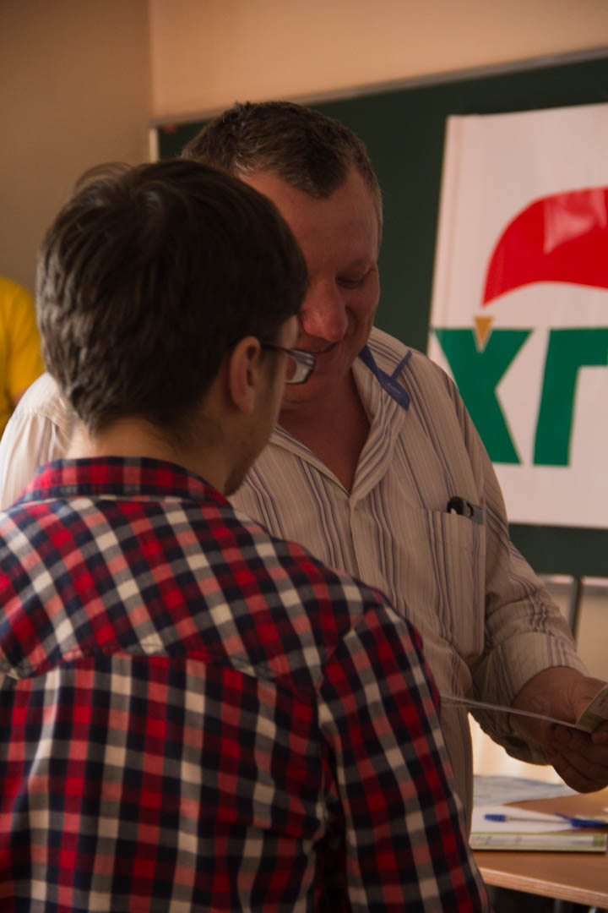
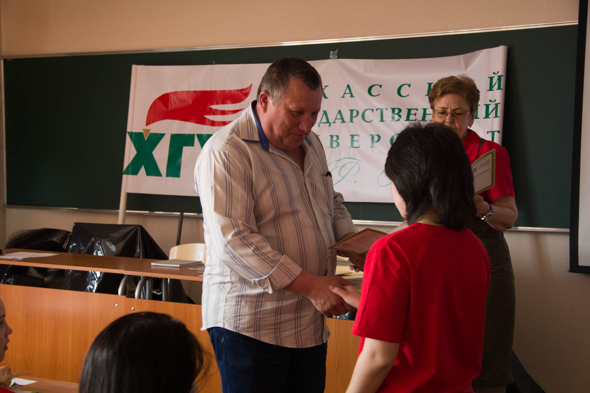
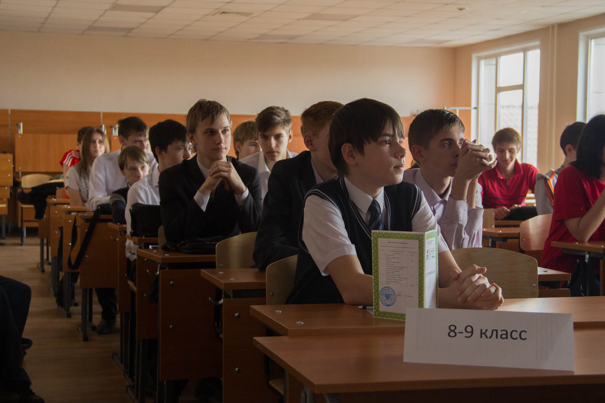
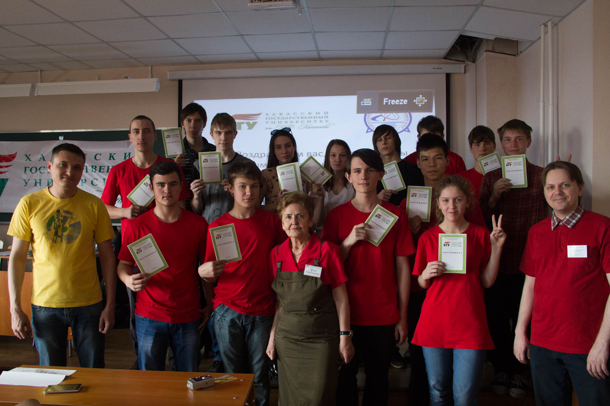
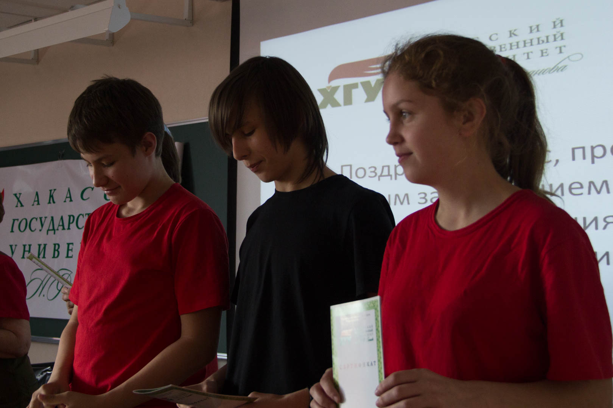

# В Школе программистов ХГУ им. Н.Ф. Катанова 30 апреля завершился очередной учебный год

Дата создания: 2016-05-04

Автор: ngrebenshikov

Теги: Школа Программистов,ХГУ,Программирование,Школьники

 

 

 

 

 

 

 

 

 

 

 

 

 

 

 

 

 

 

 

 

 

 

 

 

 

 

 

 

 

 

 

 

 

 

 

 

 

 

 

 

 

 

 

 

 

 

 

 

 

 

 

 

 

 

 

 Субботний день 30 апреля-особый для учащихся Школы программистов ХГУ им. Н.Ф. Катанова. Последние занятия по программам дополнительного образования вместе с товарищами своей группы из разных школ, разных городов и районов Хакасии. Ребята очень волновались, так как в этот день все выпускники, подтвердившие освоение выбранной программы дополнительного образования, получили очень весомые сертификаты установленного образца. 56 учащихся Школы программистов получили сертификат с учетом результатов нескольких контрольных работ, результатов работы каждого выпускника на Олимпиаде школьников по программированию в рамках 9-го Открытого турнира по программированию, представления слушателями программы ДО «Конструирование электронных устройств и программирование микроконтроллеров» выпускных работ на суд жюри 3-го Открытого фестиваля технического творчества конструкторов и программистов «От робота к РОБОТУ».  
  
18 выпускников Школы программистов 11-классников вместе с сертификатом получили и персональное приглашение в институт информационных технологий и инженерного образования (ИИТИО) на информационные направления подготовки. В том, что целеустремленных, увлеченных и ответственных ребят ждут в ХГУ, а после обучения в университете ждут в ведущих компаниях региона в сфере информационных технологий, учащиеся имели возможность убедиться на многочисленных встречах с руководителями и ведущими специалистами IT- компаний: Абаканское отделение ЗАО «Ланит Терком», ООО «Киасофт», Хакасия.ру, Сибтехнострой в Абакане, КБ «Автоматизация инженерных систем».  
  
Наблюдая за успехами ребят, старшие товарищи, отдельные специалисты и целые компании откликаются на просьбы, оказывают посильную помощь и надеются на то, что эти талантливые ребята займут места их, выпускников, в студенческих аудиториях, а через несколько лет здесь же, в родном городе, республике высококвалифицированными специалистами придут в их компании. А школьники следят за успехами компаний со знакомыми названиями, оценивают их роль и место не только в Хакасии, но и за ее пределами. Именно поэтому ведущие IТ-компании активно пропагандируют специальности, потребность в которых на рынке труда растет в геометрической прогрессии.  
  
В волнительный последний день занятий, когда выбор направления подготовки и учебного заведения для получения профессионального образования перед выпускниками 2016 года встал особенно остро, на встречу к учащимся Школы программистов пришел выпускник ИИТ ХГУ 2001г. Иван Пономарев., координатор технических служб высоконагруженных веб-приложений. Под его ответственностью находится несколько десятков единиц активного оборудования, работающего в разных частях мира от Северной Америки, Европы до Средне Азии. Он управляет этим сложным техническим хозяйством, живя в Абакане.  
  
Иван Пономарев дал советы будущим студентам: не откладывая на будущее, ставить перед собой амбициозные цели и целенаправленно решать задачи по их достижению. Это обязательное условие обеспечить студенту «свой счастливый билет в кармане», а не мечтать о счастливом случае в поиске работы после окончания ВУЗа.  
  
Не старайтесь искать легких путей. Выбирайте самые сложные из предлагаемых тем и заданий. Выполнение самого сложного сегодня сделает чуть труднее обучение, но намного облегчит работу в ближайшем будущем.  
Встречи школьников с такими профессионалами убеждают, что целеустремленные, организованные и ответственные студенты ХГУ востребованы в сфере IT- технологий своего региона, в России и далеко за ее пределами.   
Следуя принципу «Где родился, там и пригодился», наши выпускники делают важное дело. Создают новые компании, большое количество новых рабочих мест, открывают филиалы своих компаний в Красноярске, Новосибирске и др, где есть и свои ВУЗы, не меньше нашего родного ХГУ им. Н.Ф. Катанова. Руководители этих компаний с удовольствием работают с нашими школьниками и студентами, наблюдая за их профессиональным развитием, успехами. Приглашают в свои компании.  
  
Эрна Горбачева, руководитель Школы программистов ХГУ им. Н.Ф.Катанова

