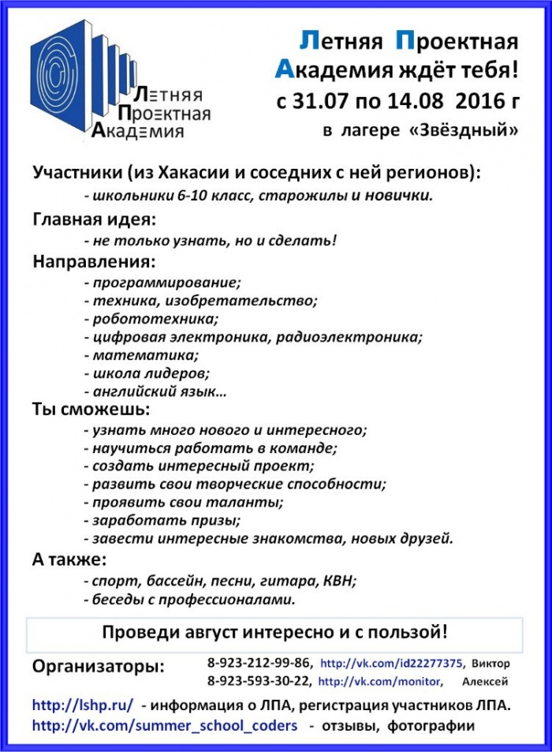

# Приглашаем школьников пройти обучение и отдохнуть в Летней Проектной Академии

Дата создания: 2016-05-08

Автор: ngrebenshikov

Теги: Летняя Проектная Академия,Летняя Школа Программистов,Школьники,Программирование

Академия — это профильная смена в летнем лагере. Она проводится один раз в год, обычно в августе.  
Организует смену МБОУ Лицей города Абакана, а проходит она на базе одного из загородных лагерей в республике Хакасия или соседних регионах.    
  
   
  
[Видео об академии.](https://vimeo.com/49578192)  
  
Мастерские — это небольшие группы (обычно, 5-6 школьников), которые под руководством преподавателя за 15 дней выполняют одну задачу — проект. Конечно, при этом они могут решить много небольших, но интересных задач.  
  
Проект — это практическая задача, её решение даёт не только знания, но и навыки. Составлять программу, проводить эксперимент, планировать, искать ошибки в решении — то, чем ребята занимаются на этих занятиях.  
  
Участники проекта — это одна команда, а в хорошей команде каждый участник имеет свою роль, свою задачу. Здесь учатся высказывать точку зрения, доказывать её, решать задачу совместно, определять средства для достижения цели и время, необходимое на решение.  
  
Проект нужно не только выполнить — его нужно ещё и представить. Смена завершается конференцией, на которой каждая команда демонстрирует результаты своей работы при помощи презентации. Участники рассказывают о том, что нового они узнали за это время, каких успехов добились.  
  
У нас есть несколько традиций, касающихся отдыха участников смены. Ежегодно мы проводим:

- Представление мастерских
- КВН

  
Кроме этого, мы проводим спортивные соревнования, утреннюю зарядку, песни у костра, интеллектуальные игры.