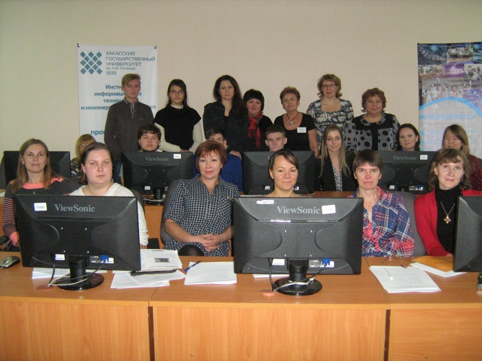

# Веб-дизайну и основам сайтостроения обучают в ХГУ им. Н.Ф. Катанова

Дата создания: 2016-11-07

Автор: veronikaAL

Теги: ХГУ,Образование,Web-дизайн

   
  
Изучать Photoshop, CorelDraw, а также учиться создавать собственный сайт будут 22 слушателя. Среди них школьники, студенты, воспитатели детских садов и учителя школ Хакасии.  
Разработчик курса, преподаватель колледжа педагогического образования, информатики и права Анастасия Заливаха рассказывает:  

> – Данный курс направлен на повышение уровня графической и конструкторской подготовки разработчиков сайтов. Он предназначен для изучения средств компьютерной графики, векторной и растровой, а также конструирования сайтов, HTML. Для преподавателей ХГУ такой курс уже проводился ранее на базе Хакасского института развития образования и повышения квалификации. Также веб-дизайн и сайтостроение мы изучали со студентами КПОиИП. В этом году курс впервые организован для слушателей, не являющихся преподавателями ХГУ.

  
Так же своими впечатлениями поделилась слушатель курса Валерия (студентка):  

> – Первое занятие очень понравилось. Важно, что мы получаем не только теоретические знания, но и применяем их на практике. Вдвойне радостней, что курсы проходят в новом корпусе университета. Здесь не только приятная обстановка, но и хорошие компьютеры. Хочу сказать, что «Веб-дизайн и основы сайтостроения» – очень нужный курс для современного человека. Такие знания обязательно понадобятся в жизни. С их помощью ты сможешь усовершенствовать любимую фотографию или создать собственный сайт.

  
Отметим, что программа рассчитана на 80 часов и продлится до 30 апреля.